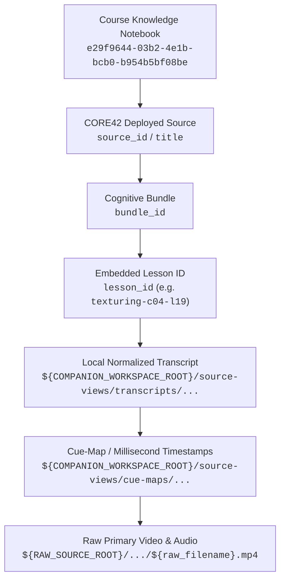

# CORE42 NotebookLM Deployment Registry & Provenance Locator

> **治理定位**：本文件是 CG Cookie CORE V1 (Blender 4.2) 在外部研究环境（Course Knowledge Notebook）中的部署元数据档案与权威定位链路注册表（Project Authority Deployment Registry）。  
> **所属任务**：GitHub Issue #6 (Source Governance) / GitHub Issue #19 (Case Topology Join) / PR #26  
> **状态**：ACTIVE / DEPLOYED — IDE/local source-list verified 2026-10-03 — Browser-reviewed registry  
> **审计时间**：2026-10-03  
> **权威性界定**：外部能力凭据按规范标注为 `Reported with Provenance`，不覆盖项目权威一手文献与仓库审计基准。  

---

## 0. 部署历史与溯源说明 (Deployment History & Provenance Note)

- **前置准备**：Issue #6 Gate E 完成了 5 个本地 Markdown 导出 bundle 的治理与切片准备；
- **历史部署事实**：只读 NotebookLM 来源元数据显示，5 份规范的 CORE42 Markdown sources 的 `created_at` 均为 `2026-09-18`，表明其在历史流程中已被摄入并处于就绪状态；
- **本轮工作性质 (2026-10-03)**：本轮执行并非首次全量上传，而是对已就绪语料的**重新发现（Rediscovery）、真实源身份对账注册（Source Identity Registration）与专项决策支持实证审计（Decision-Support Audit）**；
- **临时测试源处理**：在早期环境探测中，单次命令行路径测试产生了一个临时 `pasted_text` 重复源（`source_id: 646d9ab1-9c7b-474c-b0bd-ccc3d02e98bd`；该源创建与删除事件属于 `Reported local execution evidence`，非浏览器直接核验凭据），该源已在本轮审计中被清理删除；
- **历史显示状态说明**：针对 10 月 2 日早期探测中为何 `source list` 未显式返回该 5 个源的具体原因，当前保持为 **`UNKNOWN`**（在缺乏工具链底层调用日志凭据前，不作主观推断）。

---

## 1. 宿主知识库信息 (Host Notebook Specification)

- **Notebook 名称**：`corso-pbr-materials` (Course Knowledge Notebook)
- **Notebook Locator**：`e29f9644-03b2-4e1b-bcb0-b954b5bf08be`
- **Notebook URL**：`https://notebook.google.com/notebook/e29f9644-03b2-4e1b-bcb0-b954b5bf08be`
- **治理原则**：外部 NotebookLM 是检索、跨源比对与知识综合环境，不属于项目最终事实权威。部署在此的 CORE42 Markdown 文档作为认知源（Cognitive Sources）供 Agent 与课程团队查询。

---

## 2. 已部署 5 大认知源注册表 (Deployed Cognitive Sources Registry)

经对目标 Notebook 实时 API 与源列表验证，5 份 CORE42 标准 Markdown 导出包均已成功部署并建立索引，状态全量处于 `ready`。

| 序号 | 规范文档标题 (`source_title`) | NotebookLM `source_id` | 状态 (`status`) | 类型 (`type`) | 规范 Bundle ID (`bundle_id`) | 认知范畴与教学覆盖 (`scope`) |
| :---: | :--- | :--- | :---: | :---: | :--- | :--- |
| 1 | `CORE42_OVERVIEW.md` | `193f9b7c-7cbf-434e-8fd2-167b6d9f2d5c` | `ready` | `markdown` | `core42-overview` | 路线图、版本对齐原则、课时映射总览与治理规范 |
| 2 | `CORE42_MATERIALS_AND_SHADING.md` | `7c3afaa6-2071-4108-8dc2-e1928d5a9b73` | `ready` | `markdown` | `core42-materials-and-shading` | 材质与着色全课（Ch01–Ch04，共 22 节有效课时，12,516 英文词，1.48 小时） |
| 3 | `CORE42_TEXTURING_FOUNDATIONS.md` | `9d76d4c2-a09a-4c83-b69c-31b7037b0f85` | `ready` | `markdown` | `core42-texturing-foundations` | 纹理基础卷（Ch01–Ch04：坐标系、色彩数学、UV 展开缝合与贴图管理，共 19 节有效课时，14,339 英文词，1.65 小时） |
| 4 | `CORE42_TEXTURING_WORKFLOWS.md` | `4ea9b998-1cff-4b83-8d85-4bf5a50b3259` | `ready` | `markdown` | `core42-texturing-workflows` | 纹理进阶与创作实战卷（Ch05–Ch07：程序化纹理、视口手绘、望远镜实战流程与烘焙导出，共 16 节有效课时，21,139 英文词，2.93 小时） |
| 5 | `CORE42_CASE_INDEX.md` | `55c2f44c-37e6-41db-a0a5-45273d4d9fb6` | `ready` | `markdown` | `core42-case-index` | 案例定位器清单、资产物理存在性判定与实操课时关联 |

---

## 3. 可移植权威定位链路规范 (Portable Logical Locator Chain)

为支持未来智能体（Agents）从外部 NotebookLM 的检索线索精准下钻追溯至本地物理音视频切片，且**绝不向 Git 仓库持久化用户特定绝对路径**，统一采用以下参数化逻辑定位链路：

### 3.1 逻辑变量定义 (Logical Path Placeholders)

- `${RAW_SOURCE_ROOT}`：原厂只读未修改素材根目录（例如 NAS 或离线冷存储中的 `CGCookie - Blender 4.2 Core Essentials - 9 Tutorials`）。
- `${COMPANION_WORKSPACE_ROOT}`：伴随工程工作区根目录（例如存储逐字稿、时间切片与导出包的 `CGCookie CORE Knowledge/cgcookie-core-v1-blender-4.2`）。

### 3.2 下钻解析规则 (Resolution Algorithm)

1. **第一跳：Notebook 检索引用定位**  
   根据 NotebookLM 引用标题匹配本注册表第二节中的 `source_id`，获得对应的 `bundle_id`。
2. **第二跳：课时定位器提取 (`lesson_id`)**  
   在导出源文本的章节标题或课时元数据块中读取标准格式 `lesson_id`（如 `materials-shading-c02-l13` 或 `texturing-c07-l36`）。
3. **第三跳：本地标准化逐字稿定位**  
   解析逻辑路径：  
   - 材质课程：`${COMPANION_WORKSPACE_ROOT}/source-views/transcripts/materials-shading/${lesson_id}.transcript.md`  
   - 纹理课程：`${COMPANION_WORKSPACE_ROOT}/source-views/transcripts/texturing/${lesson_id}.transcript.md`
4. **第四跳：高精时间轴与原厂 Cue 映射**  
   解析逻辑路径：  
   - 材质课程：`${COMPANION_WORKSPACE_ROOT}/source-views/cue-maps/materials-shading/${lesson_id}.cues.jsonl`  
   - 纹理课程：`${COMPANION_WORKSPACE_ROOT}/source-views/cue-maps/texturing/${lesson_id}.cues.jsonl`
5. **第五跳：原厂视频媒体回放定位**  
   根据逐字稿顶层 Frontmatter 中标注的 `raw_media_relative_path`，结合 `${RAW_SOURCE_ROOT}` 定位物理 `.mp4` 文件，并基于 Cue 毫秒时间戳进行精准视频跳转回放。
