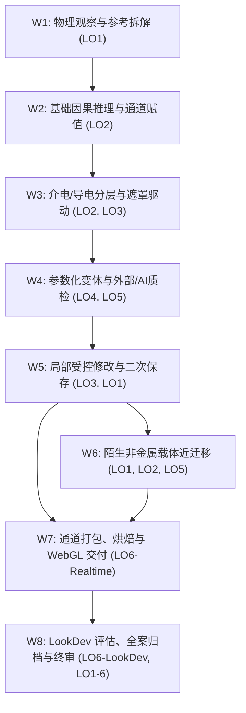
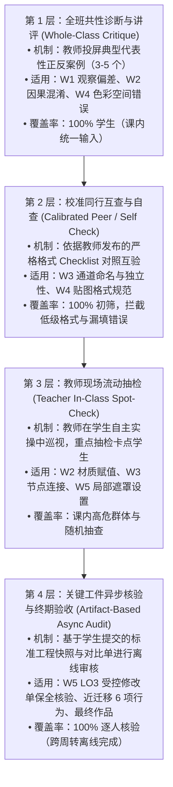

# 8 周 → 9 周课程实施容量有界影响分析 (Course Offering Impact Analysis 2026–2027-1)

> **文档定位**：基于真实教务课表核实事实（9 周 / 36 学时 / 单班 24 实际面授小时 / 35 人班与 17 人班 / 单教师配置），对前期 8 周条件性排课草案（v0.1）开展一次性、有界的容量与教学依赖影响分析。  
> **前沿状态**：`COURSE_OFFERING_CAPACITY_REBASELINE`（**ANALYSIS ONLY / NOT A NEW SCHEDULE**）。  
> **制定日期**：2026-09-19。  
> **核心原则**：严格区分课表核实事实与主观报告假设；不借新增周次扩充知识内容；不预设结论与评分权重；不发明未经验证的反馈抽查样本数；本轮绝对不生成 Week 1–9 v0.2 排课。

---

## 目录
1. [执行影响判定 (Executive Impact Verdict)](#1-执行影响判定-executive-impact-verdict)
2. [已核实授课事实基线 (Verified Offering Facts)](#2-已核实授课事实基线-verified-offering-facts)
3. [不变量定义 (Invariants — What Does Not Change)](#3-不变量定义-invariants--what-does-not-change)
4. [24 项要素全景影响矩阵 (Impact Matrix)](#4-24-项要素全景影响矩阵-impact-matrix)
5. [现行 8 周序列压力测试与依赖图分析 (Current 8-Week Sequence Stress Test)](#5-现行-8-周序列压力测试与依赖图分析-current-8-week-sequence-stress-test)
6. [双班制反馈与教师容量审计 (Two-Section Feedback / Capacity Analysis)](#6-双班制反馈与教师容量审计-two-section-feedback--capacity-analysis)
7. [第 9 周战略杠杆用途深度比较 (Ninth-Week Leverage Analysis)](#7-第-9-周战略杠杆用途深度比较-ninth-week-leverage-analysis)
8. [最终作品质量优先导向的结构性重塑 (Final-Work-Quality Implications)](#8-最终作品质量优先导向的结构性重塑-final-work-quality-implications)
9. [明确退役的历史假设 (Assumptions to Retire)](#9-明确退役的历史假设-assumptions-to-retire)
10. [冻结课表前仍需获取的制度与教学事实 (Facts Still Needed Before Frozen Schedule)](#10-冻结课表前仍需获取的制度与教学事实-facts-still-needed-before-frozen-schedule)
11. [未来编制 Week 1–9 v0.2 的重基准化规则 (Re-baseline Rules for Future Week 1–9 v0.2)](#11-未来编制-week-19-v02-的重基准化规则-re-baseline-rules-for-future-week-19-v02)
12. [推荐的下一步行动 (Recommended Next Move)](#12-推荐的下一步行动-recommended-next-move)

---

## 1. 执行影响判定 (Executive Impact Verdict)

基于最新课表证据核实，本课程并非处于“课时从充裕变得更充裕”的扩张状态，而是首次确立了真实的物理接触边界：
1. **真实面授极其紧凑**：每周 4 节、每节 40 分钟，单周有效面授仅 **160 分钟（2.67 小时）**，9 周总面授仅 **24 实际小时**。相比历史情境中模糊假定的“单周 3 实际小时”，单次课堂时间更短，对课堂节奏的控制要求更高；
2. **单教师面临严峻的跨班总负荷与大班面授约束**：一名教师同时承担 35 人与 17 人两个独立教学班（总计 52 名学生）。在 35 人班中，单次 160 分钟课堂无法支持多轮逐人深度面对面讲评；若要求在课内进行 3 次逐人同步验收，单师课堂体系必然崩溃；
3. **第 9 周的本质是“解耦与精修杠杆”，绝非“新增知识容器”**：新增的第 9 周绝不能用于引入复杂的新软件、程序化高深数学或额外渲染流程，而必须作为战略杠杆，用于拆解原 8 周草案中 W7–W8 严重堆叠的烘焙、实时交付、LookDev 离线评估与全案归档，并为主项目与迁移任务的最终打磨提供必要的修改周转空间；
4. **结论**：本课程必须进行深度的**重基准化 (Re-baseline)**。教学重心应从“单线高压灌输”转向“精炼核心概念、分层反馈漏斗、工件异步核验、终期质量精修”。

---

## 2. 已核实授课事实基线 (Verified Offering Facts)

本项审计严格区分三类不同确定性的事实，坚决杜绝将主观推测或口头预期混同为教务硬约束：

### 2.1 课表权威核实事实 (Timetable-Verified Facts)
来源：教务课表截图（打印日期：2026-08-30，课程代码：GR2102，学期：2026-2027-1，校区：广州校区，考核方式：考查）。
- **排定教学周**：第 10–18 周，整整 **9 个排课周**；
- **排定总学时**：36 学时（每学时标准时长 **40 分钟**）；
- **每周排定课时**：每周 4 节连排，单次面授接触时间为 **160 分钟**（合 2 小时 40 分钟 / 2.67 实际小时）；
- **单班总面授接触时间**：$36 \times 40\text{ min} = 1440\text{ min} = 24.0\text{ 实际小时}$；
- **双独立教学班**：
  - **GR2102-1 班**：2025 级动画（数字文娱创新班）1 班，选课人数 **35 人**，教室 G111，排在第 7–10 节（14:00–16:50）；
  - **GR2102-3 班**：2025 级动画（数字文娱创新班）3 班，选课人数 **17 人**，教室 SII-306，排在第 13–16 节（19:00–21:50）。

### 2.2 课程负责人报告与前期规划假设 (Owner-Reported / Planning Inputs)
来源：课程负责人于 2026-09-19 沟通报告。
- **师资配置**：主要由 **1 位任课教师** 现场独立承担两个班的教学；
- **学生基线**：假定学生具有一定的前置三维建模基础；但基本缺乏系统的 PBR 材质物理与理论基础；
- **灯光认知**：学生前置灯光知识不确定，需在材质课内提供仅满足材质观察判断所需的极简支持，不单设灯光专章；
- **软件配置**：校方机房软件可提前提请批量统一安装配置；
- **成绩与产出偏好**：Owner 明确偏向**最终作品质量优先**，不希望过于繁复的过程性考核压过最终成效。

### 2.3 严禁主观臆造的制度未知项 (Explicit Unknowns)
在教务或院系提供正式文件前，以下项目保持为严格未知，不作为排课前置依据：
- `[UNKNOWN A]` 两个班排课的具体星期分布，以及第 10–18 周内是否存在法定节假日冲销；
- `[UNKNOWN B]` 官方课程学分与法定课外作业期望工时；
- `[UNKNOWN C]` 校方对考查课官方成绩构成的硬性比例要求（如平时 vs 期末比例规定）；
- `[UNKNOWN D]` 机房真实硬件环境（GPU 架构、显存大小、驱动版本、多平台一致性）；
- `[UNKNOWN E]` 新生在 Blender 5.2 原生界面下完成复杂贴图绘制与节点排错的真实分钟耗时。

---

## 3. 不变量定义 (Invariants — What Does Not Change)

无论课程周期是 8 周还是 9 周，以下核心架构与学术准则严格保持不变：

1. **核心定位不扩张 (Core Boundaries)**：聚焦于材质与纹理创作（Material / Texture Authoring）。三维拓扑、高低模对齐、复杂展开由教师预置干净资产提供支撑，不扩张为从零制作课程；
2. **六大成效家族不变 (LO1–LO6 Stability)**：
   - LO1: 观察与意图解构 (Observation & Intent Deconstruction)
   - LO2: 光学因果推理与排错 (Optical Causality & Troubleshooting)
   - LO3: 空间受控修改与数据保全 (Spatially Bounded Revision & Non-target Preservation)
   - LO4: 参数化变体控制与解释 (Parametric Relationship & Variant Generation)
   - LO5: 外部素材与 AI 批判性决策 (External / AI Sourcing Critical Judgment)
   - LO6: 目标交付约束与离线归因 (Downstream Delivery & LookDev Attribution)
3. **最低独立达成标准不降水 (Attainment Discipline)**：维持 v0.1 第 7 节所定义的最低独立证据标准，不因课时调整而妥协或缩水；
4. **制作环境决策纪律 (Blender-First / Conditional Painter)**：维持以 Blender 5.2 为主制作环境的原则，不无端重开全面软件比选；仅当 LO3 空间局部实操探针证明 Blender GUI 存在不可接受的教学摩擦时，才在保留任务上启动与 Substance 3D Painter 的狭窄成本对比；
5. **近迁移必要性不变 (Near-Transfer Requirement)**：陌生非金属载体的独立近迁移任务依然是课程结课的必要证据，绝不因强调主资产质量而将迁移任务裁剪；
6. **极简双出口骨架不变 (Minimal Two-Exit Architecture)**：保持 WebGL/glTF 实时轻量核验与 Cycles 离线 LookDev 一致性归因的双出口结构，不引入大型游戏引擎全案开发或复杂影视渲染网络。

---

## 4. 24 项要素全景影响矩阵 (Impact Matrix)

对 24 项要素进行独立审查，测试课表核实事实与单师双班情境对各项假设的具体影响：

| 序号 | 审查要素 (Audit Element) | 分类结论 (Verdict) | 因果分析与影响机制阐述 (Rationale & Impact Mechanism) |
| :---: | :--- | :---: | :--- |
| **1** | **LO1–LO6 outcome families** | `UNCHANGED` | 六大成效家族定义完整且具备学术正交性，9 周周期完全能够承载该能力闭环，无需增删任何成效家族。 |
| **2** | **minimum attainment evidence** | `UNCHANGED` | 最低独立达成证据是课程质量底线，不因周期变为 9 周而降低标准，亦不可借机堆砌超出本科初学范围的过重证据。 |
| **3** | **主工业项目范围 (Main Industrial Project Scope)** | `REBASELINE REQUIRED` | 课表揭示单班仅 24 小时面授。必须坚决遏制主项目资产复杂化的冲动，资产必须维持为轻量级“小型工业复合外壳/结构件”，严禁复活大型装配体。 |
| **4** | **陌生载体近迁移 (Unfamiliar-Carrier Transfer)** | `NEW OPPORTUNITY` | 原 8 周模型下迁移任务挤在 W6，与主资产受控修改及烘焙产生冲突；9 周框架为迁移任务赢得了更从容的分析与局部纠错空间，降低样本偏差。 |
| **5** | **LO3 空间局部性检查点** | `UNCHANGED` | 无论 8 周还是 9 周，该检查点（GUI 局部重绘—非目标保全—保存工程重启—二次修改）依然是排课正式冻结前**不可绕过的刚性门禁**。 |
| **6** | **PBR 基础与早期因果教学** | `REBASELINE REQUIRED` | 原 W1/W2 假设学生能快速提炼物理参数。面对“学生无系统 PBR 基础”的核实事实，需重新设计早期由浅入深的单变量对比阶梯，防止初学者认知过载。 |
| **7** | **灯光支撑层 (Lighting Support Layer)** | `REBASELINE REQUIRED` | 针对“学生灯光基础不确定”，确立**极简辅助层**规范：由教师预置标准化摄影棚 HDRI 与基础旋转光源，仅用于材质高光与粗糙度校验，不单设灯光创作模块。 |
| **8** | **程序化 / 参数化深度** | `UNCHANGED` | 严格限制在“能够解释并修改输入驱动变体的最小节点链”，不因课时增加而扩展为复杂程序化纹理生成或自制大型节点资产库。 |
| **9** | **AI / 外部贴图批判性判断** | `REBASELINE REQUIRED` | 必须纠正“外部/AI 贴图接入排错成本极低”的盲目乐观假设。初学者在色彩空间（sRGB vs Non-Color）与光影污染剔除上耗时显著，需重新评估该环节的教学节奏。 |
| **10** | **实时交付证据 (Realtime Delivery)** | `UNCHANGED` | 维持基于 WebGL/glTF（`.glb`）的外部跨进程打开核验动作，检验通道映射、法线朝向与基础光照响应，不增加新交付平台。 |
| **11** | **动画 / LookDev 评估证据** | `NEW OPPORTUNITY` | 在 9 周框架下，LookDev 多光照环境评测与差异归因不再需要与实时烘焙交付挤在同一周，可获得独立的观察与质量比对时间。 |
| **12** | **承重型反馈架构 (Feedback Architecture)** | `REBASELINE REQUIRED` | 必须针对单教师面对 35 人班与 17 人班的现实进行重构。原草案中依赖多次逐人当面讲评的设计不可行，必须转向“分层过滤＋重点抽查＋工件异步审查”。 |
| **13** | **35 人班 vs 17 人班实施差异** | `NEW RISK` / `REBASELINE REQUIRED` | **双班容量悬殊带来教学实施分化风险**。必须设计“同一达标标准、两种课堂组织节奏”的反馈机制，防止大班失控或小班超纲。 |
| **14** | **单教师反馈容量 (Teacher Capacity)** | `REBASELINE REQUIRED` | 教师跨两班面对 52 名学生。单周若产生 52 份复杂工程全量批改，教师必将超载。必须合并阶段性检查工件，采用结构化 Checklist 提升批阅周转率。 |
| **15** | **最终作品精修时间 (Final-Work Refinement)** | `NEW OPPORTUNITY` | **与 Owner 偏好高度契合**。多出的一周使学生在获得关键反馈后，拥有专门的时间窗口对主资产与迁移资产进行质感精修，直接提升产出水准。 |
| **16** | **评分与成绩架构 (Grading Architecture)** | `OWNER / INSTITUTION FACT NEEDED` | 明确需要校方制度输入。在未掌握考查课官方过程/期末比例前，仅设计兼容性评估框架，不擅自冻结百分比数值。 |
| **17** | **CORE42 教学参考引用方式** | `UNCHANGED` | 继续作为成熟的操作片段参考基准，教师需继续过滤其 AO 混入 Base Color 等非规范手法，不将其作为大纲权威。 |
| **18** | **Blender 4.2 → 5.2 差量核验** | `UNCHANGED` | Principled BSDF V2 界面变动与烘焙流程差异的核验要求保持不变，需在备课阶段完成技术确认。 |
| **19** | **Blender-first / 条件性 Painter 规则** | `UNCHANGED` | 继续保持规则稳定性。除非 LO3 实操探针触发失败，否则不启动 Painter 方案，严禁借课表调整重新发起软件路线争论。 |
| **20** | **课外作业依赖 (Homework Dependence)** | `REBASELINE REQUIRED` | 在 24 小时面授限制下，不能将无法在课内消化的教学内容随意甩给课外；必须明确课外仅作为巩固与资产打包，核心因果与受控修改必须在课内闭环。 |
| **21** | **保护核心与超载首裁项** | `UNCHANGED` | v0.1 确立的 6 项保护核心与 5 级裁剪顺序依然有效，在面临突发学时缩减或学生进度滞后时作为刚性执行准则。 |
| **22** | **结课成果展示与全案归档** | `NEW OPPORTUNITY` | 终期交付与归档不再与复杂烘焙排错撞车，学生能够完整整理源文件、贴图资产、WebGL 导出包与 LookDev 记录文档，达成专业归档。 |
| **23** | **高校机房软件预装申请** | `REBASELINE REQUIRED` | 必须尽早向学校提出明确的软件清单：Blender 5.2 LTS 正式版、现代 WebGL 浏览器（Chrome/Edge）、统一的图像查看器，防范机房环境不一致。 |
| **24** | **旧 8 周假设退役清单** | `REBASELINE REQUIRED` | 必须在文档中正式宣布退役 8 周固定周期、单周 3 小时面授等陈旧假设，彻底清理过时认知。 |

---

## 5. 现行 8 周序列压力测试与依赖图分析 (Current 8-Week Sequence Stress Test)

将前期 Week 1–8 草案（v0.1）视作**有向无环依赖图 (DAG)** 进行严格的逻辑穿透与压力测试：

### 5.1 各活动簇依赖关系与潜在瓶颈穿透

#### 1. W1 簇：物理观察与参考拆解
- **真正前置依赖**：学生的基础视口操作与日常物理世界观察能力（具备建模经验但无 PBR 概念）；
- **潜在风险检视**：原表现指标要求“能够从参考图中**准确提炼**出固有色、金属度与粗糙度参数”。**此要求过强且违背物理规律**。即使资深专家也无法从单张照片中“准确逆向”微观 Roughness 数值；新手极易因此产生挫败感，或倒向胡乱猜测。
- **重基准化方向**：**降级为“物理属性辨识与概念剥离”**——能够区分材质类别（金属/介电质）、指出高光来自光源反射而非固有表面、识别脏污属于独立覆盖层，区分客观观察事实与主观推测。

#### 2. W2 簇：光学因果推理与通道语义
- **真正前置依赖**：W1 的概念剥离意识；
- **潜在风险检视**：学生在此阶段需要调节单变量观察高光与漫反射演变，这**隐式依赖于正确的灯光环境**。若机房默认环境无有效光源或环境光过曝，学生无法正确建立 Roughness/Metallic 的视觉因果联系。
- **重基准化方向**：必须由教师提供**极简支撑环境**（预置固定 HDRI 旋转测试场景），确保因果观察不受光照干扰。该活动簇应保持在早期。

#### 3. W3–W4 簇：分层解耦、参数化与外部/AI 贴图
- **真正前置依赖**：W2 的通道语义认知；
- **潜在风险检视**：W4 原计划同时摄入程序噪波、参数化驱动、外部贴图与 AI 生成素材。对于初学群体，**色彩空间（Color vs. Non-Color）的理解摩擦极大**，学生常因贴图通道搞错或 Gamma 纠缠导致排错陷入泥潭。原草案将其标注为 `HIGH` 风险，极为准确。
- **重基准化方向**：不应在单周内高密度堆叠。程序化噪波仅保留最基本的遮罩边缘调制；外部/AI 贴图仅提供 2–3 个具典型缺陷（如烘死光影、法线反转）的标准样本进行批判性取舍，不展开复杂清洗。

#### 4. W5 簇：LO3 空间局部受控修改
- **真正前置依赖**：W3 的材质分层结构；
- **潜在风险检视**：原指标中“非目标区域数据零污染”表述**过于绝对且概念混淆**。若要求“最终渲染图像的每个像素完全不变”，在存在全局照明（GI）和微表面漫反射反弹的场景下是不可能的（修改局部颜色必然引起微弱的环境光反弹变化）。
- **重基准化方向**：**严密校正定义**——零污染指的是**底层纹理贴图数据（Texture Data）与遮罩通道（Mask Channel）在指定区域之外严格保全**，而非全局渲染像素绝对不变。必须经由独立进程重启重验。

#### 5. W6 簇：陌生非金属载体近迁移实践
- **真正前置依赖**：W1（物理观察）、W2（介电质物理）、W5（修改与排错思维）；
- **潜在风险检视**：在 8 周计划中，W6 既要开启新资产的独立迁移，又要兼顾主资产的修改推进，学生面临严重的“双线作战”时间争夺。
- **重基准化方向**：迁移任务必须维持“轻量级近迁移”定位（教师提供已展 UV 资产，仅做局部因果推理与纠错验证），绝不可扩大为第二个全流程主项目。

#### 6. W7–W8 簇：交付、烘焙、LookDev 与归档
- **真正前置依赖**：主资产与迁移资产的制作就绪；
- **潜在风险检视**：**原 8 周模型最高危的溃缩点**。W7 集中了多通道烘焙（Bake）、glTF 导出、WebGL 打开核验；W8 集中了 Cycles LookDev 多光照评测、两端渲染差异归因、源文件整理归档与总复盘。原草案将 W8 标注为 `LOW` 风险**严重脱离实际**——机房 GPU 算力不确定、烘焙参数易报错、Cycles 离线多视角渲染耗时极易超载，导致最终作品根本没有时间进行调整精修。
- **重基准化方向**：**强烈需要解耦拆分**。必须将技术性的“烘焙与跨平台交付”与艺术性的“LookDev 评估及最终品质精修”在时间轴上错开，为最终作品质量释放空间。

---

## 6. 双班制反馈与教师容量审计 (Two-Section Feedback / Capacity Analysis)

本课程由单教师承担 35 人与 17 人两个班。必须严格遵守：**两个班的达成标准完全相同，但课堂组织与反馈通道必须因地制宜**。

### 6.1 课堂面授时间极限的数学现实
单次面授仅 **160 分钟**。除去教师集中串讲示范（约 30–40 分钟）与课堂总结答疑（约 15–20 分钟），实际用于课堂实操辅导的有效时间约为 **100–110 分钟**。
- **GR2102-1 班 (35 人)**：每名学生平均分得的现场面对面个别指导时间上限仅为 **2.8 至 3.1 分钟**。任何试图在课内完成全班 35 人逐一深度 critique 的设想，在物理上绝不可能成立；
- **GR2102-3 班 (17 人)**：每名学生平均分得的现场指导时间约为 **5.8 至 6.5 分钟**，教师具有稍高一点的巡视频率，但依然无法支持冗长的单人答辩。

### 6.2 分层反馈机制设计 (Layered Feedback Funnel)
为确保单教师在总计 52 名学生的体量下不发生反馈熔断，必须建立四级分层反馈漏斗：

### 6.3 消除“课内三次逐人同步验收”的不可行设想
前期思路曾隐式暗示教师在课内分别对“LO3 受控修改”、“近迁移表现”和“最终作品交付”进行三次逐人面对面闭环核定。对于 35 人大班，这会导致课堂长时间处于“排队等待叫号”的停滞状态。
- **正确实施路径**：
  1. **LO3 局部修改验证**：学生提交 `修改前.blend` 与 `修改后.blend` 两个版本文件以及一张视口对比截图。教师通过简易检查清单在课外异步完成批阅（检查非目标节点是否被动动、贴图区域是否保全），课内仅作抽查与共性纠偏；
  2. **近迁移表现验证**：通过学生提交的《6 项迁移决策表》进行结构化打分，属于异步工件核查；
  3. **最终交付核定**：合并为主项目完整交付包（工程 + glTF 导出包 + LookDev 评估对比单），集中统一终审。

### 6.4 跨班标准等价性保障
- **相同之处 (Standards)**：两班使用完全相同的任务简报（Brief）、相同的验收 Checklist、相同的提交格式规范与相同的终期评分 Rubric；
- **差异之处 (Mechanics)**：17 人班教师在课内巡视抽检的频次更高，能够当堂捕捉到更多个别操作卡点；而 35 人班更依赖投屏共性错题剖析与同行互查前置过滤。两班学生最终必须达成相同的最低独立证据，不存在“大班降低标准”或“小班加码要求”。

---

## 7. 第 9 周战略杠杆用途深度比较 (Ninth-Week Leverage Analysis)

面对新增的第 9 周，必须系统对比 5 类候选方案，探寻边际效益最高、最能保护终期作品质量的方案：

| 候选方案 (Candidate Use) | 实施逻辑 (Mechanism) | 预期收益 (Pros) | 潜在风险与代价值 (Cons) | 边际杠杆评价 (Marginal Value) |
| :--- | :--- | :--- | :--- | :---: |
| **方案 A：前期基础展开** (W1–W2 拆为三周) | 将物理观察、因果推理与通道概念拉长，详细讲解光学理论与基础着色。 | 降低新手早期入门门槛，概念吸收更扎实。 | 导致中后期制作与交付严重后移，期末依然面临剧烈的时间拥塞，无法支撑作品精修。 | `MEDIUM` (改善初期体验，但未解决期末硬核死锁) |
| **方案 B：受控修改展开** (W4–W5 拆为三周) | 为分层解耦、局部遮罩与修改单执行留出多轮迭代时间。 | 强化 LO3 受控修改的工程习惯，使非目标保全更稳健。 | 占用过多精力在局部错误排查上，挤压下游交付与综合展现空间。 | `MEDIUM-HIGH` (强化了核心成效，但下游风险依旧) |
| **方案 C：迁移任务独立** (W6 近迁移单列成周) | 将陌生载体近迁移完全独立出来，学生有一整周专注处理非金属载体。 | 彻底打破工业做旧金属的思维定势，近迁移证据更扎实。 | 容易诱发学生将迁移载体当成第二个复杂大资产制作，导致工时再次失控膨胀。 | `MEDIUM` (违背“轻量级近迁移”的原则定位) |
| **方案 D：交付与评测解耦** (W7 实时 / W8 离线分离) | 将贴图烘焙与 glTF 实时导出单列为一周；将 LookDev 离线评估单列为一周。 | 彻底解除技术性烘焙排错与艺术性光影质检的撞车冲突，管线高度清晰。 | 若仅做机械拆分，学生在交付后无时间针对暴露的缺陷进行深度修改。 | `HIGH` (极大地降低了技术断崖风险) |
| **方案 E：终期解耦与精修整合** (**推荐方案**) | **将第 9 周用于下游管线分离（实时交付 vs LookDev 评测）并为主资产与迁移资产留出专属的“反馈修改与终期精修周期”**。 | 1. 消除 W7–W8 交付溃缩； 2. 形成“初评 $\to$ 教师反馈 $\to$ 终期精修 $\to$ 归档”的闭环； 3. 完全契合 Owner“最终作品质量优先”的战略偏好。 | 需要严格控制精修范围，防范学生在最后阶段推倒重来。 | **`HIGHEST`** (兼顾技术风险对冲与产出质量飞跃) |

### 7.1 杠杆使用推荐结论
**强烈推荐采用方案 E 的思路**：
将第 9 周作为“下游管线解耦与终期作品精修”的战略杠杆。
- **前期节奏**：W1–W5 保持紧凑有界的节奏推进主资产分层与受控修改；
- **中期节奏**：W6 完成轻量级陌生载体近迁移验证；
- **后期解耦**：原本挤在一起的“烘焙导出—实时核验—LookDev 离线对比—作品精修—全案归档”，在 9 周框架下平稳展开为两到三个阶段，使学生在第 8 周完成初版交付后，能依据反馈在第 9 周进行精准的质感打磨，使最终作品达到课程设定的高质量水准。

---

## 8. 最终作品质量优先导向的结构性重塑 (Final-Work-Quality Implications)

Owner 明确偏向：**最终作品质量优先，过程考核不应主导成绩**。这一导向必须深刻重构各项教学活动的结构性配比：

### 8.1 课程质量目标的精准界定
坚决避免使用“达到商业级影视/游戏生产标准”等脱离本科 24 小时面授现实的浮夸表述。本课程所追求的“最终作品质量”严格定义为：
- **物理因果自洽**：高光强度与粗糙度匹配物理规律，非金属无非法金属度污染，分层磨损逻辑符合受力与环境因果；
- **视觉呈现连贯**：资产在预置的离线演播室环境与实时 WebGL 视口中均表现出干净、可信的质感层次；
- **工程资产规整**：贴图命名符合语义规范，色彩空间设置无误，交付包（`.blend` 源文件、glTF 导出物、贴图集）结构清晰，具备可追溯与可维护性。

### 8.2 过程性活动与终期成果的结构关系重构
- **技术迷你实验 (Mini-exercises) 与入门诊断**：定位于“课堂热身与概念探针”，不占用正式考核精力，仅作为教师摸排底数的辅助手段；
- **阶段性 Checklist 与同行互查**：定位于“**通关门禁 (Gateways)**”，其逻辑是“达标即合格（Go/No-Go）”，用于防止学生带着低级错误进入下一阶段，不作为拉开学生成绩差距的重头；
- **修改与精修 (Revision & Refinement)**：成为整个课程的“**质量放大器**”。学生最终呈现的作品不是一次性成型的产物，而是“初稿 $\to$ 暴露问题 $\to$ 依据反馈精准修正 $\to$ 最终精修”的成熟成果；
- **成绩架构导向（原则性建议）**：在学校正式比例公布前，教学设计应向“以最终提交的工业资产综合表现、迁移任务分析决策以及规范交付工件包为主体”的方向靠拢，过程性记录作为前置必要条件。

---

## 9. 明确退役的历史假设 (Assumptions to Retire)

以下在前期调研与 8 周推演中形成的陈旧假设，已与当前核实事实或容量审计相冲突，在此正式宣布**彻底废止**：

1. **废止“8 周固定学期周期”假设**：课程基准调整为**第 10–18 周共 9 个教学周**；
2. **废止“单周 3 实际小时面授”假设**：实际面授时长精确修正为**每周 4 节 $\times$ 40 分钟 = 160 分钟（2.67 实际小时）**，总学时精确为 **24 实际小时**；
3. **废止“固化 56–72 实际人时总负荷”假设**：该数值为历史情境估算，由于学校官方课外学时未决，不得将其作为排课容量证明；
4. **废止“单教师可在课内完成全员多次逐人深度 critique”的假设**：在 35 人大班中已被证明不可行，必须转向分层反馈漏斗；
5. **废止“W8 属于 LOW 风险阶段”的假设**：W8 集中 LookDev 离线渲染与归档交付，受机房硬件与初学者排错制约，实际属于中高风险区；
6. **废止“外部/AI 贴图导入排错成本极低”的假设**：初学者在色彩空间与脏污光影清洗上的认知耗时远超预期；
7. **废止“35 人班与 17 人班采用完全相同现场教学节奏”的假设**：大班与小班必须采取不同的现场互动与抽查组织模式；
8. **废止“非目标区域渲染像素必须绝对不变”的绝对化表述**：修正为“指定区域外的纹理数据通道与遮罩严格保全”。

---

## 10. 冻结课表前仍需获取的制度与教学事实 (Facts Still Needed Before Frozen Schedule)

在正式启动 Week 1–9 v0.2 排课并最终冻结课表前，必须明确以下关键边界：

1. `[FACT 1]` **星期排定与节假日排冲**：确认 1 班与 3 班的具体上课星期，核实第 10–18 周内是否有法定节假日（如校运会、调休等）占用课时；
2. `[FACT 2]` **官方考查成绩比例规范**：校方教务系统是否对“考查”课程的平时成绩（过程性）与期末成绩（成果性）设定了强制性比例区间（如 4:6 或 5:5）；
3. `[FACT 3]` **机房硬件环境配置**：G111 与 SII-306 两个机房的实际 PC 硬件参数（尤其是 GPU 型号、显存是否大于 4GB、操作系统是 Win10/11 还是其它），以确定 Cycles 离线预览与烘焙的可行速率；
4. `[FACT 4]` **学校软件预装提请时限与机制**：确认最晚需于何时提交软件部署单，并核验机房管理员能否稳定部署 Blender 5.2 LTS 与标准化 Chrome 环境；
5. `[FACT 5]` **LO3 空间局部性实操探针结果**：在真实 Blender GUI 交互下，初学者局部绘制保存并重启后数据保全的实测结论（这是课表冻结的**绝对阻塞性门禁**）。

---

## 11. 未来编制 Week 1–9 v0.2 的重基准化规则 (Re-baseline Rules for Future Week 1–9 v0.2)

当上述必要事实补全、准备编制 Week 1–9 v0.2 排课草案时，必须严格遵守以下 6 项重基准化铁律：

- **规则 1：零知识扩张铁律 (Zero-Content Inflation Rule)**：
  严禁因周期增加为 9 周而引入任何未在 Gate 3A/3B 批准的新软件工具（如 Designer、Unreal 引擎全量工作流）或高级程序化几何知识。
- **规则 2：24 小时面授紧凑性铁律 (24-Hour Contact Reality Rule)**：
  所有课堂核心活动必须按单周 160 分钟严格设计，确保教师示范不超过 35 分钟，学生课堂核心实操与关键纠偏不少于 90 分钟。
- **规则 3：分层反馈与异步核验铁律 (Layered Feedback & Async Audit Rule)**：
  课内全面推行“共性案例讲评 ＋ Checklist 互查 ＋ 重点抽检”，所有全员逐人核验均通过标准提交工件在课外异步完成，禁止在课内造成排队阻塞。
- **规则 4：双班等标不同道铁律 (Equivalent Standards, Adaptive Mechanics Rule)**：
  两班使用完全相同的 Rubric 与验收证据标准，允许大班和小班在现场巡视频次与互动形式上自适应调整，绝不制造两套教学标准。
- **规则 5：下游交付与精修解耦铁律 (Decoupled Delivery & Polish Rule)**：
  必须将“贴图烘焙与实时 WebGL 交付”同“LookDev 评估及最终品质精修”在周次上错开，确保学生有专门的时间针对反馈进行作品打磨。
- **规则 6：保护核心优先裁剪铁律 (Protected Core Priority Rule)**：
  若遇不可抗力课时被压缩，坚决按照 v0.1 确定的 5 级裁剪顺序依次剔除装饰性细节与次要示范，绝对誓死保卫 6 项核心达成证据与反馈循环。

---

## 12. 推荐的下一步行动 (Recommended Next Move)

1. **提交本影响分析报告**：将本分析报告提交至代码仓库，确立 9 周实施环境的全新认知基线；
2. **执行 LO3 空间局部性实操探针测试**：在真实 Blender 5.2 GUI 环境中完成局部绘制—保存—重启—二次修订的原型测试，填补最后的工具链实证缺口；
3. **核实学校教务管理细节**：向课程负责人同步本报告结论，收集节假日分布、机房 GPU 规格与官方考查课成绩比例要求；
4. **启动 Week 1–9 v0.2 条件性排课编制**：在上述事实输入齐备后，基于本报告推荐的“方案 E（下游解耦与终期精修整合）”正式编制 9 周排课蓝图。

---

> **终端状态声明**：  
> `COURSE_OFFERING_CAPACITY_REBASELINE_READY_FOR_BROWSER_REVIEW`
