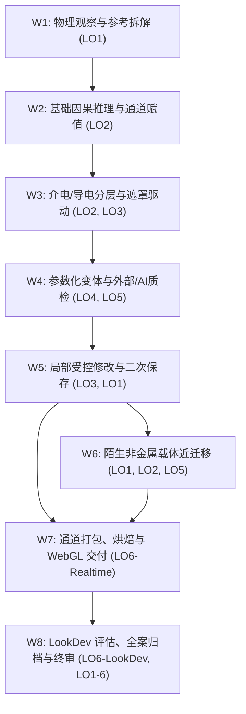
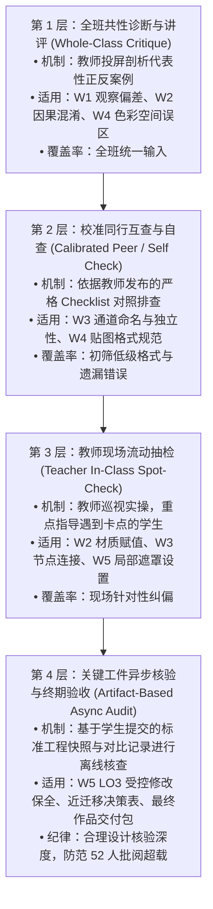
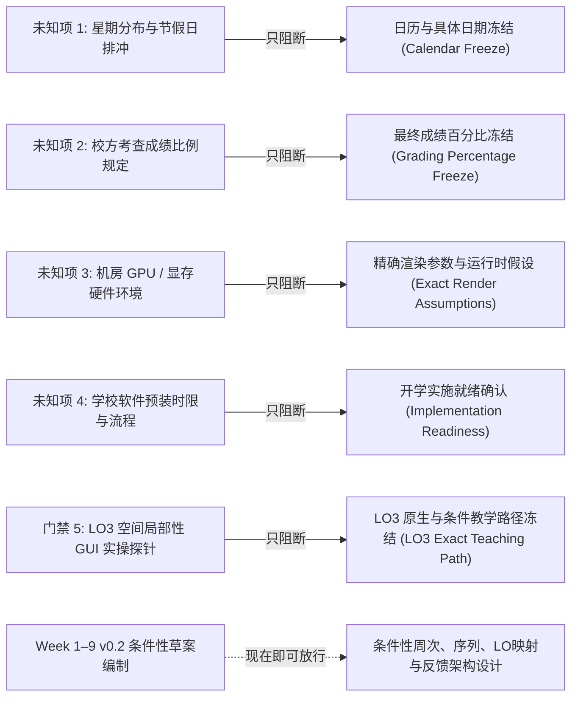

# 8 周 → 9 周课程实施容量有界影响分析 (Course Offering Impact Analysis 2026–2027-1)

> **文档定位**：基于真实教务课表核实事实（9 周 / 36 学时 / 单班 24 实际面授小时 / 35 人班与 17 人班 / 单教师配置），对前期 8 周条件性排课草案（v0.1）开展一次性、有界的容量与教学依赖影响分析。  
> **前沿状态**：`COURSE_OFFERING_CAPACITY_REBASELINE`（**HARDENED / INPUT FOR WEEK 1–9 v0.2**）。  
> **制定日期**：2026-09-19。  
> **核心原则**：严格区分课表核实事实与主观报告假设；将第 9 周视为对此前 8 周错误假设的纠正与恢复，不视为新增课时红利；不借新增周次扩充知识内容；不预设结论与评分权重；不发明未经验证的分钟数与抽查样本配额；明确未知项的具体阻断边界，不阻断条件草案编制。

---

## 目录
1. [执行影响判定 (Executive Impact Verdict)](#1-执行影响判定-executive-impact-verdict)
2. [已核实授课事实基线 (Verified Offering Facts)](#2-已核实授课事实基线-verified-offering-facts)
3. [不变量定义 (Invariants — What Does Not Change)](#3-不变量定义-invariants--what-does-not-change)
4. [24 项要素全景影响矩阵 (Impact Matrix)](#4-24-项要素全景影响矩阵-impact-matrix)
5. [现行 8 周序列压力测试与依赖图分析 (Current 8-Week Sequence Stress Test)](#5-现行-8-周序列压力测试与依赖图分析-current-8-week-sequence-stress-test)
6. [双班制反馈与教师容量审计 (Two-Section Feedback / Capacity Analysis)](#6-双班制反馈与教师容量审计-two-section-feedback--capacity-analysis)
7. [第 9 周战略杠杆用途深度比较 (Ninth-Week Leverage Analysis)](#7-第-9-周战略杠杆用途深度比较-ninth-week-leverage-analysis)
8. [最终作品质量优先导向的结构性重塑 (Final-Work-Quality Implications)](#8-最终作品质量优先导向的结构性重塑-final-work-quality-implications)
9. [明确退役的历史假设 (Assumptions to Retire)](#9-明确退役的历史假设-assumptions-to-retire)
10. [未知项阻断边界与条件草案放行关系 (Blocker Separation & Gating Architecture)](#10-未知项阻断边界与条件草案放行关系-blocker-separation--gating-architecture)
11. [未来编制 Week 1–9 v0.2 的重基准化规则 (Re-baseline Rules for Future Week 1–9 v0.2)](#11-未来编制-week-19-v02-的重基准化规则-re-baseline-rules-for-future-week-19-v02)
12. [推荐的下一步行动 (Recommended Next Move)](#12-推荐的下一步行动-recommended-next-move)

---

## 1. 执行影响判定 (Executive Impact Verdict)

基于最新课表证据核实，本课程并非处于“课时从充裕变得更充裕”的扩张状态，而是确立了物理意义上的真实接触边界：
1. **真实面授极其紧凑**：每周 4 节、每节 40 分钟，单周每班有效面授仅 **160 分钟（2.67 小时）**，9 周总面授共 **24 实际小时**。单次课堂时间紧凑，对课堂教学密度的控制要求极高；
2. **单教师面临严峻的跨班总负荷与大班面授约束**：一名教师同时承担 35 人与 17 人两个独立教学班（总计 52 名学生）。在 35 人班中，单次 160 分钟课堂无法支持逐人深度面对面讲评；若要求在课内进行多次逐人同步验收，单师课堂必将发生排队阻塞；
3. **核实后的 9 周排课事实是“解耦与精修杠杆”，绝非“新增知识容器”**：纠正此前错误的 8 周假设并恢复为真实的 9 周排课事实，并不意味着可以引入复杂的新软件、程序化高深数学或额外渲染流程，而应作为战略杠杆，用于拆解原 8 周草案中 W7–W8 严重堆叠的烘焙、实时交付、LookDev 离线评估与全案归档，并为达到课程设定的终期作品质量目标提供必需的修改迭代空间；
4. **结论**：本课程必须进行深度的**重基准化 (Re-baseline)**。教学设计应从“单线高压灌输”转向“精炼核心概念、分层反馈漏斗、工件异步审阅、终期质量打磨”。

---

## 2. 已核实授课事实基线 (Verified Offering Facts)

本项审计严格区分三类不同确定性的事实，坚决杜绝将主观推测或口头预期混同为教务硬约束：

### 2.1 课表权威核实事实 (Timetable-Verified Facts)
来源：教务课表截图（打印日期：2026-08-30，课程代码：GR2102，学期：2026-2027-1，校区：广州校区，考核方式：考查）。
- **排定教学周**：第 10–18 周，整整 **9 个排课周**；
- **排定总学时**：36 学时（每学时标准时长 **40 分钟**）；
- **每周排定课时**：每周 4 节连排，单次面授接触时间为 **160 分钟**（合 2 小时 40 分钟 / 2.67 实际小时）；
- **单班总面授接触时间**：$36 \times 40\text{ min} = 1440\text{ min} = 24.0\text{ 实际小时}$；
- **双独立教学班**：
  - **GR2102-1 班**：2025 级动画（数字文娱创新班）1 班，选课人数 **35 人**，教室 G111，排在第 7–10 节（14:00–16:50）；
  - **GR2102-3 班**：2025 级动画（数字文娱创新班）3 班，选课人数 **17 人**，教室 SII-306，排在第 13–16 节（19:00–21:50）。

### 2.2 课程负责人报告与前期规划假设 (Owner-Reported / Planning Inputs)
来源：课程负责人于 2026-09-19 沟通报告，属于教学规划输入而非制度硬性事实：
- **师资配置**：主要由 **1 位任课教师** 现场独立承担两个班的教学；
- **学生基线**：假定学生具有一定的前置三维建模基础；但基本缺乏系统的 PBR 材质物理与理论基础；
- **灯光认知**：学生前置灯光知识不确定，需在材质课内提供仅满足材质观察判断所需的极简支持，不单设灯光专章；
- **软件配置**：校方机房软件可提前提请批量统一安装配置；
- **产出偏好**：Owner 明确偏向**最终作品质量优先**，过程考核不应压过最终成效。

### 2.3 严禁主观臆造的制度未知项 (Explicit Unknowns)
在教务或院系提供正式文件前，以下项目保持为严格未知，不作为排课既定事实：
- `[UNKNOWN A]` 两个班排课的具体星期分布，以及第 10–18 周内是否存在法定节假日冲销；
- `[UNKNOWN B]` 官方课程学分与法定课外作业期望工时；
- `[UNKNOWN C]` 校方对考查课官方成绩构成的硬性比例要求（如平时 vs 期末比例规定）；
- `[UNKNOWN D]` 机房真实硬件环境（GPU 架构、显存大小、驱动版本、多平台一致性）；
- `[UNKNOWN E]` 新生在 Blender 5.2 原生界面下完成复杂贴图绘制与节点排错的真实分钟耗时。

---

## 3. 不变量定义 (Invariants — What Does Not Change)

无论课程周期是 8 周还是 9 周，以下核心架构与学术准则严格保持不变：

1. **核心定位不扩张 (Core Boundaries)**：聚焦于材质与纹理创作（Material / Texture Authoring）。三维拓扑、高低模对齐、复杂展开由教师预置干净资产提供支撑，不扩张为从零制作课程；
2. **六大成效家族不变 (LO1–LO6 Stability)**：
   - LO1: 观察与意图解构 (Observation & Intent Deconstruction)
   - LO2: 光学因果推理与排错 (Optical Causality & Troubleshooting)
   - LO3: 空间受控修改与数据保全 (Spatially Bounded Revision & Non-target Preservation)
   - LO4: 参数化变体控制与解释 (Parametric Relationship & Variant Generation)
   - LO5: 外部素材与 AI 批判性决策 (External / AI Sourcing Critical Judgment)
   - LO6: 目标交付约束与离线归因 (Downstream Delivery & LookDev Attribution)
3. **最低独立达成标准的形式审慎性 (Attainment Evidence Form)**：LO 家族与能力内核刚性保护；但具体达成证据的记录形式在 24 小时紧凑容量下保留审慎精简与形式优化空间，不预先宣布不可调整；
4. **制作环境决策纪律 (Blender-First / Conditional Painter)**：维持以 Blender 5.2 为主制作环境的原则，不无端重开全面软件比选；仅当 LO3 空间局部实操探针证明 Blender GUI 存在不可接受的教学摩擦时，才在保留任务上启动与 Substance 3D Painter 的狭窄成本对比；
5. **近迁移必要性不变 (Near-Transfer Requirement)**：陌生非金属载体的独立近迁移任务依然是课程结课的必要证据，绝不因强调主资产质量而将迁移任务裁剪；
6. **极简双出口骨架不变 (Minimal Two-Exit Architecture)**：保持 WebGL/glTF 实时轻量核验与 Cycles 离线 LookDev 一致性归因的双出口结构，不引入大型游戏引擎全案开发或复杂影视渲染网络。

---

## 4. 24 项要素全景影响矩阵 (Impact Matrix)

对 24 项要素进行独立审查，测试课表核实事实与单师双班情境对各项假设的具体影响：

| 序号 | 审查要素 (Audit Element) | 分类结论 (Verdict) | 因果分析与影响机制阐述 (Rationale & Impact Mechanism) |
| :---: | :--- | :---: | :--- |
| **1** | **LO1–LO6 outcome families** | `UNCHANGED` | 六大成效家族定义完整且具备学术正交性，9 周周期能够完整承载该能力闭环，无需增删任何成效家族。 |
| **2** | **minimum attainment evidence** | `UNCHANGED` | 最低独立达成证据的内核是课程底线，不因周期变为 9 周而降水，具体证据形式可在 24 小时容量中适度优化。 |
| **3** | **主工业项目范围 (Main Industrial Project Scope)** | `REBASELINE REQUIRED` | 课表揭示单班仅 24 小时面授。必须坚决遏制主项目资产复杂化的冲动，资产必须维持为轻量级“小型工业复合外壳/结构件”，严禁复活大型装配体。 |
| **4** | **陌生载体近迁移 (Unfamiliar-Carrier Transfer)** | `NEW OPPORTUNITY` | 原 8 周模型下迁移任务挤在 W6，与主资产制作产生时间竞争；9 周框架为迁移任务赢得了更从容的分析与纠错空间。 |
| **5** | **LO3 空间局部性检查点** | `UNCHANGED` | 无论 8 周还是 9 周，该检查点（GUI 局部重绘—非目标保全—保存工程重启—二次修改）依然是排课正式冻结前的必验门禁。 |
| **6** | **PBR 基础与早期因果教学** | `REBASELINE REQUIRED` | 面对“学生无系统 PBR 基础”的核实事实，需重新设计早期由浅入深的单变量对比阶梯，防止初学者认知过载。 |
| **7** | **灯光支撑层 (Lighting Support Layer)** | `REBASELINE REQUIRED` | 针对“学生灯光基础不确定”，确立**首选极简支持设计方案**：由教师预置标准化摄影棚 HDRI 与基础旋转光源，仅用于材质校验，不单设灯光创作模块。 |
| **8** | **程序化 / 参数化深度** | `UNCHANGED` | 严格限制在“能够解释并修改输入驱动变体的最小节点链”，不因课时纠正而扩展为复杂程序化纹理生成或大型节点资产库。 |
| **9** | **AI / 外部贴图批判性判断** | `REBASELINE REQUIRED` | 设定为**设计风险假设**：初学者在色彩空间（sRGB vs Non-Color）与光影污染剔除上耗时显著，需审慎规划排错教学节奏。 |
| **10** | **实时交付证据 (Realtime Delivery)** | `UNCHANGED` | 维持基于 WebGL/glTF（`.glb`）的外部跨进程打开核验动作，检验通道映射、法线朝向与基础光照响应。 |
| **11** | **动画 / LookDev 评估证据** | `NEW OPPORTUNITY` | 在 9 周框架下，LookDev 多光照环境评测与差异归因不再需要与实时烘焙交付挤在同一周，可获得独立的观察与比对时间。 |
| **12** | **承重型反馈架构 (Feedback Architecture)** | `REBASELINE REQUIRED` | 针对单教师面对 52 人的现实进行重构，原草案依赖多次逐人当面讲评不可行，必须转向分层反馈漏斗。 |
| **13** | **35 人班 vs 17 人班实施差异** | `NEW RISK` / `REBASELINE REQUIRED` | **双班容量悬殊带来教学实施分化风险**。必须设计“同一达标标准、两种课堂组织节奏”的反馈机制。 |
| **14** | **单教师反馈容量 (Teacher Capacity)** | `REBASELINE REQUIRED` | 教师跨两班面对 52 名学生。异步工件审阅同样消耗精力，不能假定工件批改零成本，需采用结构化 Checklist 提升周转率。 |
| **15** | **最终作品精修时间 (Final-Work Refinement)** | `NEW OPPORTUNITY` | **与 Owner 偏好高度契合**。恢复规划周次使学生在获得关键反馈后，拥有专门的时间窗口对主资产与迁移资产进行质感打磨。 |
| **16** | **评分与成绩架构 (Grading Architecture)** | `OWNER / INSTITUTION FACT NEEDED` | 明确需要校方制度输入。在未掌握考查课官方过程/期末比例前，仅设计兼容性评估框架，不擅自冻结百分比数值。 |
| **17** | **CORE42 教学参考引用方式** | `UNCHANGED` | 继续作为成熟的操作片段参考基准，教师需继续过滤其非规范手法，不将其作为大纲权威。 |
| **18** | **Blender 4.2 → 5.2 差量核验** | `UNCHANGED` | Principled BSDF V2 界面变动与烘焙流程差异的核验要求保持不变，需在备课阶段完成技术确认。 |
| **19** | **Blender-first / 条件性 Painter 规则** | `UNCHANGED` | 继续保持规则稳定性。除非 LO3 实操探针触发失败，否则不启动 Painter 方案，严禁重新发起软件路线争论。 |
| **20** | **课外作业依赖 (Homework Dependence)** | `REBASELINE REQUIRED` | 在 24 小时面授限制下，不能将无法在课内消化的教学内容随意甩给课外；课外仅作为巩固与资产打包，核心因果在课内闭环。 |
| **21** | **保护核心与超载首裁项** | `UNCHANGED` | v0.1 确立的 6 项保护核心与 5 级裁剪顺序依然有效，在面临突发学时缩减或学生进度滞后时作为刚性执行准则。 |
| **22** | **结课成果展示与全案归档** | `NEW OPPORTUNITY` | 终期交付与归档不再与复杂烘焙排错撞车，学生能够完整整理源文件、贴图资产、WebGL 导出包与 LookDev 记录文档。 |
| **23** | **高校机房软件预装申请** | `REBASELINE REQUIRED` | 必须尽早向学校提出明确的软件清单：Blender 5.2 LTS 正式版、现代 WebGL 浏览器、统一图像查看器。 |
| **24** | **旧 8 周假设退役清单** | `REBASELINE REQUIRED` | 必须在文档中正式宣布退役 8 周固定周期、单周 3 小时面授等陈旧假设，彻底清理过时认知。 |

---

## 5. 现行 8 周序列压力测试与依赖图分析 (Current 8-Week Sequence Stress Test)

将前期 Week 1–8 草案（v0.1）视作**有向无环依赖图 (DAG)** 进行逻辑穿透与压力测试：

### 5.1 各活动簇依赖关系与潜在瓶颈穿透

#### 1. W1 簇：物理观察与参考拆解
- **真正前置依赖**：学生的基础视口操作与日常物理世界观察能力；
- **潜在风险检视**：原指标要求“从参考图中准确提炼固有色、金属度与粗糙度参数”，该要求过强且不符合逆向物理事实；
- **重基准化方向**：**降级为“物理属性辨识与概念剥离”**——区分金属与介电质、区分高光反射与固有色、区分表面附着污物，区分客观观察与推测。

#### 2. W2 簇：光学因果推理与通道语义
- **真正前置依赖**：W1 的概念剥离意识；
- **潜在风险检视**：调节单变量观察演变隐式依赖于正确的环境照明，默认无光环境易造成因果归因混乱；
- **重基准化方向**：作为首选极简支持方案，由教师预置标准化测试环境（HDRI 旋转观察场景），支撑材质判断。

#### 3. W3–W4 簇：分层解耦、参数化与外部/AI 贴图
- **真正前置依赖**：W2 的通道语义认知；
- **潜在风险检视（设计风险假设）**：初学者在色彩空间（sRGB vs Non-Color）与贴图格式上的理解和排错极易成为教学摩擦点；
- **重基准化方向**：程序化噪波仅保留最基本的遮罩调制；外部/AI 贴图仅提供少量典型样例进行批判性取舍，不展开复杂清洗。

#### 4. W5 簇：LO3 空间局部受控修改
- **真正前置依赖**：W3 的材质分层结构；
- **潜在风险检视**：“非目标区域零污染”若理解为“全图渲染像素绝对不变”则违背全局光照反弹规律；
- **重基准化方向**：**严密校正定义**——零污染指的是**底层纹理贴图数据与遮罩通道在指定区域之外严格保全**，需经独立进程重启验证。

#### 5. W6 簇：陌生非金属载体近迁移实践
- **真正前置依赖**：W1（物理观察）、W2（介电质物理）、W5（修改与排错思维）；
- **潜在风险检视**：在 8 周模型下，W6 既要开启新资产迁移，又要推进主资产制作，学生面临时间争夺；
- **重基准化方向**：维持轻量级近迁移定位（教师提供已展 UV 资产，仅做局部决策与纠错），不扩大为全流程大资产。

#### 6. W7–W8 簇：交付、烘焙、LookDev 与归档
- **真正前置依赖**：主资产与迁移资产的制作就绪；
- **潜在风险检视**：原 8 周模型中最严重的堆叠瓶颈。W7 集中烘焙与 WebGL 导出，W8 集中 LookDev 离线渲染与归档，原标为 LOW 风险缺乏机房硬件依据；
- **重基准化方向**：**强烈需要解耦拆分**。将技术性烘焙交付与艺术性 LookDev 评估错开，为最终作品打磨释放空间。

---

## 6. 双班制反馈与教师容量审计 (Two-Section Feedback / Capacity Analysis)

本课程由单教师承担 35 人与 17 人两个班。必须严格遵守：**两个班的达成标准完全相同，但课堂组织与反馈通道必须因地制宜**。

### 6.1 课堂面授时间极限
单班每周排定面授严格受限于 **160 分钟**。
- **GR2102-1 班 (35 人)**：学生人数多，单次课堂无法支撑全班逐人深度当面讲评，必须依赖高效的集体纠偏与格式互查；
- **GR2102-3 班 (17 人)**：人数较少，教师现场巡视抽查频次相对更高，但依然无法支持冗长的单人答辩。

### 6.2 分层反馈机制设计 (Layered Feedback Funnel)
为确保单教师面对 52 名学生不发生反馈熔断，建立四级分层反馈漏斗：

### 6.3 消除“课内多次逐人同步验收”的不可行设想
在 35 人大班中，课内进行多轮逐人排队验收会导致严重阻塞。
- **实施路径**：
  1. **LO3 局部修改验证**：学生提交 `修改前.blend` 与 `修改后.blend` 及对比截图，教师在课外结合 Checklist 异步核验非目标区域数据保全，课内仅作共性讲评与重点抽查；
  2. **近迁移表现验证**：通过学生提交的《6 项迁移决策表》进行结构化打分；
  3. **最终交付核定**：合并为主项目完整交付包（工程 + glTF 导出包 + LookDev 评估对比单），统一终审。

### 6.4 跨班标准等价性保障
- **相同之处 (Standards)**：两班使用完全相同的任务简报、相同的验收 Checklist 与终期 Rubric；
- **差异之处 (Mechanics)**：17 人班教师现场流动指导频次更高；35 人班更倚重投屏共性错题剖析与自查/互查初筛。两班学生最终达成相同的最低独立证据。

---

## 7. 第 9 周战略杠杆用途深度比较 (Ninth-Week Leverage Analysis)

面对恢复规划周次的 9 周框架，系统对比 5 类候选方案的论据与权衡：

| 候选方案 (Candidate Use) | 实施逻辑 (Mechanism) | 预期设计收益 (Design Benefits) | 潜在风险与代价值 (Design Trade-offs) |
| :--- | :--- | :--- | :--- |
| **方案 A：前期基础展开** (W1–W2 拆为三周) | 详细讲解光学理论与基础着色，放慢入门节奏。 | 降低新手入门压力，概念吸收相对更稳。 | 导致中后期管线严重后移，期末依然面临剧烈的时间拥塞，挤压精修时间。 |
| **方案 B：受控修改展开** (W4–W5 拆为三周) | 为材质分层、局部遮罩与修改单执行留出多轮迭代时间。 | 强化 LO3 受控修改习惯，非目标保全更扎实。 | 过多精力耗费在中间状态，下游交付与综合展现窗口依旧受压。 |
| **方案 C：迁移任务独立** (W6 近迁移单列成周) | 将陌生载体近迁移完全独立设周，学生专注非金属分析。 | 突出打破做旧思维定势的教学意图。 | 极易诱发学生将迁移载体做成第二个大项目，违背轻量近迁移初衷。 |
| **方案 D：交付与评测解耦** (W7 实时 / W8 离线分离) | 贴图烘焙与 glTF 导出单列一周；LookDev 离线评估单列一周。 | 解除烘焙技术排错与光影质检的直接冲突，管线清晰。 | 交付后若无专门修改窗口，暴露的质感缺陷无法在作品中获得修复。 |
| **方案 E：终期解耦与精修整合** (**推荐方案**) | **将恢复的周次用于下游管线解耦（实时交付 vs LookDev 评测），并为主资产与迁移资产留出专属的反馈精修空间**。 | 1. 消除 W7–W8 交付溃缩； 2. 形成“初评 $\to$ 反馈 $\to$ 精修 $\to$ 归档”的闭环； 3. 充分契合 Owner“最终作品质量优先”偏好。 | 需严格界定精修边界，防止学生在最后阶段推倒重做。 |

### 7.1 杠杆使用推荐结论
**推荐采用方案 E 的设计思路**（此为基于当前教学依赖分析的 Browser 建议）：
将恢复的周次作为“下游管线解耦与终期作品精修”的战略杠杆：
- **前期与中期**：紧凑推进主资产分层、受控修改与轻量近迁移；
- **后期展开**：将烘焙导出、实时核验、LookDev 评测与最终质感打磨有序错开，使学生在初版交付后能依据反馈进行针对性精修，切实保障最终作品完成度。

---

## 8. 最终作品质量优先导向的结构性重塑 (Final-Work-Quality Implications)

Owner 明确偏向：**最终作品质量优先，过程考核不应压过最终成效**。

### 8.1 课程质量目标的精准界定
坚决避免脱离本科 24 小时面授现实的夸大表述。本课程的“高质量目标”定义为：
- **物理因果自洽**：高光强度与粗糙度匹配物理规律，不存在与目标材料语义不符、且无依据的 metallic 响应或通道错误，分层磨损符合逻辑；
- **视觉呈现连贯**：资产在预置的离线演播室环境与实时 WebGL 视口中均表现出清晰可信的质感层次；
- **工程资产规整**：贴图命名符合规范，色彩空间设置无误，交付包结构清晰可追溯。

### 8.2 过程性活动与终期成果的关系重构
- **技术迷你实验与诊断**：定位于课堂热身与底数摸排，不占用正式考核大头；
- **阶段性 Checklist 与互查**：定位于“通关门禁（Gateways）”，达标即通过，拦截低级错误；
- **修改与精修**：作为“质量放大器”，保证最终提交成果经过了反馈迭代；
- **成绩架构兼容性**：保留考核结构设计弹性，等待校方具体规则确认后再正式划分比例。

---

## 9. 明确退役的历史假设 (Assumptions to Retire)

以下前期假设已与核实事实或容量审计相冲突，在此正式宣布**彻底废止**：

1. **废止“8 周固定学期周期”假设**：课程基准修正为**第 10–18 周共 9 个教学周**；
2. **废止“单周 3 实际小时面授”假设**：精确修正为**每周 4 节 $\times$ 40 分钟 = 160 分钟（2.67 实际小时）**，总学时精确为 **24 实际小时**；
3. **废止“固化 56–72 实际人时总负荷”假设**：该数值为历史情境估算，不作为排课可行性证明；
4. **废止“单教师可在课内完成全员多次深度当面 critique”的假设**：在 35 人大班不可行，转向分层反馈漏斗；
5. **废止“W8 属于 LOW 风险阶段”的假设**：受机房算力与初学者排错制约，实际属于中高风险区；
6. **废止“外部/AI 贴图导入排错成本极低”的假设**：初学者色彩空间与脏污清洗存在显著认知耗时；
7. **废止“35 人班与 17 人班采用完全相同现场教学节奏”的假设**：大班与小班需采取自适应现场组织形式；
8. **废止“非目标区域渲染像素必须绝对不变”的绝对化表述**：修正为“指定区域外的底层纹理贴图数据与遮罩通道严格保全”。

---

## 10. 未知项阻断边界与条件草案放行关系 (Blocker Separation & Gating Architecture)

明确以下原则：**当前尚未掌握的 5 项未知项，绝不阻断 Week 1–9 v0.2 条件性排课草案的编制**。各项未知项仅分别阻断其直接对应的具体决策节点：

---

## 11. 未来编制 Week 1–9 v0.2 的重基准化规则 (Re-baseline Rules for Future Week 1–9 v0.2)

编制 Week 1–9 v0.2 条件性排课草案时，必须严格遵守以下 6 项铁律：

- **规则 1：零知识扩张铁律 (Zero-Content Inflation Rule)**：
  严禁因 9 周周期而引入任何未在 Gate 3A/3B 批准的新软件工具或高级程序化几何知识。
- **规则 2：160 分钟单周物理边界铁律 (160-Minute Physical Boundary Rule)**：
  所有课堂活动严格在单周 160 分钟面授接触时间内平衡示范、指导与实操纠偏，不设定未经验证的固定分钟数配额。
- **规则 3：分层反馈与异步核验铁律 (Layered Feedback & Async Audit Rule)**：
  课内全面推行“共性案例讲评 ＋ Checklist 互查 ＋ 重点抽检”，全员逐人证据核验通过提交工件在课外异步完成，但必须精简工件形态以匹配 52 名学生的教师真实批阅容量。
- **规则 4：双班等标不同道铁律 (Equivalent Standards, Adaptive Mechanics Rule)**：
  两班使用完全相同的 Rubric 与验收标准，仅允许在现场巡视频次与互动组织上灵活适应。
- **规则 5：下游交付与精修解耦铁律 (Decoupled Delivery & Polish Rule)**：
  将贴图烘焙、实时 WebGL 交付、LookDev 评估与最终品质精修在周次上平稳错开，确保反馈修改落到实处。
- **规则 6：保护核心优先裁剪铁律 (Protected Core Priority Rule)**：
  若遇不可抗力课时被压缩，坚决按照 5 级裁剪顺序剔除装饰性细节与次要示范，誓死保卫 6 项核心达成证据与反馈循环。

---

## 12. 推荐的下一步行动 (Recommended Next Move)

1. **确立本硬化分析为基准**：本分析报告已完成有界硬化，作为后续排课的输入规范；
2. **立即启动 Week 1–9 v0.2 条件性排课草案编制**：进入 `WEEK_1_9_CONDITIONAL_PLANNING_DRAFT_V0_2`，按 9 周 / 36 学时 / 24 小时面授 / 双班反馈架构正式排课；
3. **保持未决项挂载**：在草案中将 5 项未决项明确标注为局部条件性门禁，不影响排课拓扑。

---

> **阶段状态确认**：  
> `COURSE_OFFERING_CAPACITY_REBASELINE_HARDENED`
