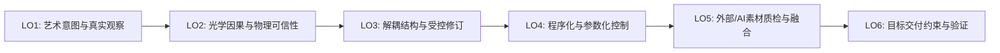

# Gate 3B 实践主线冻结与下游交付探针报告 (Practice Backbone v1)

> **当前阶段**：Stage 2 Gate 3B — Practice Implementation Re-baselining & Sufficiency Probe  
> **任务契约**：GitHub Issue #5 (Comment ID: `5726498387` & `5736915041`)  
> **前沿状态**：`GATE_3B_PRACTICE_BACKBONE_V1_HARDENING_READY_FOR_BROWSER_REVIEW`  
> **执行日期**：2026-09-19  

---

## 1. 单一下游交付探针执行结果 (Downstream Delivery Probe)

### 1.1 探针契约与执行链条 (Probe Contract & Execution)
本探针严格恪守单一外部目标、零多引擎对比原则，执行唯一闭环链条：
`Blender 5.2.2 LTS` $\to$ `export/transfer` $\to$ `one external target (WebGL PBR Runtime via Chrome)` $\to$ `open` $\to$ `verify` $\to$ `re-verify`。

- **源材质状态 (Source Material State)**：
  - **几何与资产**：教师预置标准硬表面结构件（`BevelPlate`，尺寸 $2.0 \times 1.4 \times 0.3\,\text{m}$，物理倒角，规整 UV 展开）；
  - **因果分层 (LO1/LO2/LO3)**：表层介电质工业安全橙漆（Base Color: `(0.82, 0.40, 0.05)`, Metallic: `0.0`, Roughness: `0.45`）与底层导电金属铸钢（Base Color: `0.15`, Metallic: `1.0`, Roughness: `0.30`）相互解耦；
  - **程序化控制 (LO4)**：程序噪波与曲率边缘驱动的参数化遮罩；
  - **外部输入质检 (LO5)**：摄入外部获取的划痕/磨损贴图（Acquired Grunge Map），由创作者审视判定其色彩空间（强制设为 Non-Color/Linear）并进行直方图校正后局部融入遮罩；
  - **导出材质表示**：解耦材质烘焙打包至标准单一 Principled BSDF，各通道贴图物理就绪。
- **导出交付格式 (Exported Representation)**：
  - `glTF 2.0 Binary (.glb)`，文件大小 310,832 字节，内嵌网格与 3 张 PBR 贴图。
- **单一外部下游目标 (One Downstream Target)**：
  - **Web 3D Realtime Runtime**（Google Chrome 153.0 + WebGL2 / Three.js glTF 2.0 PBR 运行时）。
  - **定位声明**：**本次 Gate 3B 有界下游交付探针基准 / lightweight external delivery exemplar**。证明跨独立外部进程与运行时的完整交付闭环成立；不将 WebGL/Three.js 固化为最终 8 周课程的唯一交付运行时。课程既有的 **Game Realtime** 与 **Animation / LookDev** 双应用出口保持有效，留待后续排课阶段细化具体体现，无需在 Gate 3B 追加第二引擎测试。
  - **探针价值**：本机即时可用、零安装摩擦、具备真实下游工业交付意义（数字资产流通与 Web 交付通用标准），严格杜绝在 Blender 内部切换 EEVEE/Cycles 冒充外部交付。

### 1.2 观测指标事实记录 (Observation Fields)

| 观测字段 | 自动化与运行时实测事实 (Verified Facts) | 判定结果 |
| :--- | :--- | :---: |
| **1. Material Assignment** | 外部运行时解析出单一材质槽位 `M_Industrial_Plate_Authoring`，无材质丢失，无紫红缺省材质（Missing Shader）。 | **PASS** |
| **2. Base Color / Roughness / Metallic / Normal** | 运行时完整解析：`hasBaseColorMap: true`, `hasMetalRoughMap: true`, `hasNormalMap: true`；油漆区呈现介电漫反射，划痕磨损区呈现强镜面导电金属反射。 | **PASS** |
| **3. Color Space** | Base Color 严格识别为 `sRGBEncoding`；Metallic-Roughness 严格识别为 `LinearEncoding`，无二次 gamma 叠加导致的死黑或漂白。 | **PASS** |
| **4. Normal Orientation** | 切线空间法线遵循 OpenGL 规范（+Y 向上），Three.js 运行时自动适配屏幕坐标系（`normalScale: {x: 1, y: -1}`），凹凸与微划痕高光响应完全正确，无光影翻转。 | **PASS** |
| **5. Channel Mapping** | glTF 2.0 标准打包生效：Green 通道驱动 Roughness，Blue 通道驱动 Metallic，通道无颠倒。 | **PASS** |
| **6. Visual Consistency** | 普通三点光照与环境反射下，橙色漆面与铸钢磨损质感清晰可信，整体视觉意图与 Blender 离线渲染严格一致。 | **PASS** |
| **7. Target Constraints Attribution** | 视口光照能量与色调映射（ACESFilmic）引起的细微明暗差异，被清晰确认为实时渲染器前向着色交付约束（Realtime Forward Delivery Constraint），无需修改 PBR 物理材质数值。 | **PASS** |

**探针裁决结论**：**`PASS`**（完整 Round Trip 成立，残余微小渲染差异完全归因于目标交付约束）。

---

## 2. 实践主线冻结：Practice Backbone v1

### 2.1 主线定义与贯穿载体
- **主线名称**：**工业复合硬表面全流程材质实践主线 (Continuous Industrial Asset Practice Backbone)**
- **贯穿载体**：工业光学/机械装配体资产（`Industrial Housing Asset`，如望远镜/工业外壳）。由教师端预置干净拓扑与规范 UV 底线（Support Floor），使学生聚焦于材质因果、分层解耦与质感表达。
- **课时承载力**：本主线作为实践骨干（Frozen Candidate），直接承载本科 8 周课程中 **约 70–80% 的 hands-on 实践负荷**。

### 2.2 LO1–LO6 实践链条映射

1. **LO1（艺术意图与真实观察） & LO2（光学因果与物理可信性）**：
   - **学生实操与认知分工**：以真实工业设备磨损参考与 Dinur 观察法为指导，在视口中搭建介电涂层与导电金属基底。严禁在 Base Color 中烘死光照、投射阴影或镜面高光（lighting / cast shadow / specular illumination）；但属于表面固有材质颜色变化的污垢（dirt）、油漆氧化（coating degradation）、锈渍斑痕（stain）可合理体现在 Albedo / Base Color 中。动态旋转三点光与环境光，切入单通道排查非法金属度灰度与粗糙度失真。
   - **CORE42 课时对应**：`materials-shading-c02-l03/04`（材质槽分配）、`materials-shading-c02-l13`（Principled BSDF 参数）、`texturing-c02-l01/02/05`（坐标与色彩管理）、`texturing-c04-l16/18`（PBR 与菲涅尔）。
2. **LO3（解耦结构与受控修订） & LO4（程序化与参数化控制）**：
   - **学生实操与质量验收**：搭建非破坏性涂层-基底解耦结构（材质属性物理隔离，由独立遮罩流单向驱动）；使用程序化噪波与曲率节点控制磨损范围与边缘风化。执行**受控修订质量型验收**：
     - ① 指定属性（如涂层颜色或金属基底粗糙度）被精准修改；
     - ② 非目标区域与无关通道保持稳定无污染；
     - ③ 修改后的节点拓扑仍保持清晰可解释、可回溯；
     - ④ 面对第二次受控修改需求时，无需进行破坏性结构重建。
   - **CORE42 课时对应**：`materials-shading-c02-l07`（混合逻辑）、`materials-shading-c02-l14/15`（节点与组封装）、`texturing-c02-l03/04`（颜色混合数学）、`texturing-c05-l20/21/22`（程序化纹理与灰尘污渍）、`texturing-c07-l32`（程序化细节）。
3. **LO5（外部/AI素材质检、接受、拒绝与局部融合）**：
   - **学生实操与批判性判断**：摄入外部获取或 AI 生成的划痕/污迹贴图；由人类创作者执行专业质检：色彩空间判定（强制纠偏为 Non-Color / Linear）、直方图动态范围检查、剔除 AI 生成的烘死假高光；使用遮罩与纹理绘制工具进行局部修补并接入材质流。
   - **CORE42 课时对应**：`texturing-c02-l05`（色彩管理）、`texturing-c02-l06`（法线与法线贴图）、`texturing-c03-l09`（贴图数据管理）、`texturing-c04-l17`（外部纹理源）、`texturing-c06-l24/26`（绘制模式与遮罩工具）。
4. **LO6（下游目标交付约束对齐、着色一致性调校与 LookDev 验证）**：
   - **学生实操与交付核验**：将材质结构烘焙并打包为标准 PBR 通道贴图（Base Color sRGB, ORM Linear, Normal OpenGL Tangent-space），导出为独立交付包（glTF 2.0 / `.glb`）；在独立轻量外部目标（WebGL PBR）中打开，执行交付验收排查，调校参数达到可接受视觉一致性，书面归因两端渲染差异。
   - **CORE42 课时对应**：`texturing-c07-b02`（通道打包 Intro to Channel Packing）、`texturing-c07-l33`（贴图烘焙基础 Basics of Baking Textures）、`texturing-c04-l19`（望远镜着色案例）。

---

## 3. 最小教学补丁 (Minimal Teaching Patches)

为了让 mature practice reference（CORE42）完全严密支撑现代 LO1–LO6，仅注入以下 4 项高内聚最小补丁：

1. **Patch 1: Observation & Optical Causality Checklist (针对 LO1/LO2)**
   - 补充 Dinur 观察解构法与动态旋转光照切通道排查清单，强化“光影变化产生质感”的物理直觉；明确 Base Color 严禁烘死光照/阴影，但允许固有材质污垢与氧化色变化的物理准则。
2. **Patch 2: Controlled Revision Quality Protocol (针对 LO3)**
   - 确立属性解耦规范（基底金属与表层涂装物理参数独立，单向遮罩驱动），制定质量型验收准则（目标属性精准改动、非目标数据零污染、拓扑可解释可回溯、二次修订无需破坏性重构），杜绝节点交织黑箱与破坏性不可逆修改。
3. **Patch 3: External / AI Input Quality Control Matrix (针对 LO5)**
   - 建立 4 项客观验收门禁（色彩空间判定、烘死假光影检测、法线空间与格式判定、动态范围溢出排查），要求学生形成“接受/拒绝/打补丁”的明确人工质量决策能力。
4. **Patch 4: Bounded Downstream Delivery Target Contract (针对 LO6)**
   - 规定以轻量外部 WebGL PBR / glTF 2.0 作为 Gate 3B 有界交付探针示范样本（lightweight external delivery exemplar），提供 7 项交付验收排查核对表，彻底杜绝内部渲染器切换冒充交付；同时为课程既有的 Game Realtime 与 Animation / LookDev 双应用出口保留完整衔接空间。

---

## 4. 软件与知识角色分工 (Software & Knowledge Roles)

- **主要实操制作环境 (Primary Authoring Runtime)**：**Blender 5.2 LTS**
  - 作为 Practice Backbone v1 的 primary authoring runtime，承担主要建模支撑、PBR 着色、节点控制、纹理绘制、烘焙与导出操作；
  - **明确认知边界**：Blender 是核心操作宿主，但不是全部认知来源。LO1 还深度依赖现实观察、摄影参考与人的艺术审美判断；LO5 还依赖创作者对外部素材/AI 生成结果的批判性质量判断。
- **外部交付验证示范 (Delivery Exemplar)**：**WebGL glTF 2.0 PBR Runtime (Google Chrome)**（轻量外部独立探针运行时，用于验证脱离 Blender 的跨进程交付完整性）。
- **Substance 3D Painter 角色**：**保持未安装 / 不引入**（实测证明 Blender 5.2 作为 primary authoring runtime 足以支撑 LO1–LO6 核心制作需求，无需引入第二套大型商用工具）。
- **认知权威角色分工**：
  - **Shah 2022**：教材与教学大纲骨架（知识结构参考，非学生实操软件绑定）；
  - **Adobe PBR Guide (McDermott)**：物理理论底座（光学原理与反射率色阶基准）；
  - **Dinur 2026**：真实感观察、审美解构与 LookDev 质检哲学；
  - **CORE42 (CG Cookie Blender 4.2 Core)**：成熟操作实践对照参考；
  - **Blender 5.2 官方手册**：运行时技术仲裁真理；
  - **OpenPBR 1.1**：现代工业标准术语与语义映射。

---

## 5. 门禁裁决与后续前沿 (Gate 3B Decision & Frontier)

- **探针测试结果 (Delivery Probe Result)**：**`PASS`**（一次完成，无需重跑）。
- **实践主线状态 (Practice Backbone v1)**：**`FROZEN CANDIDATE`**。
- **残余路线级不确定性 (Remaining Route-changing Uncertainty)**：**`None`**。
- **Gate 3B 当前状态**：**`GATE_3B_PRACTICE_BACKBONE_V1_HARDENING_READY_FOR_BROWSER_REVIEW`**。
- **Week 1–8 排课准备就绪度**：**`READY PENDING BROWSER PASS`**（待 Browser Review 验收通过后，即刻推进 Week 1–8 Planning Draft）。
