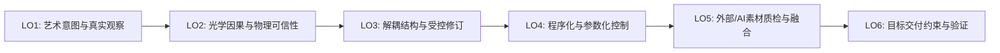

# Gate 3B 实践主线冻结与下游交付探针报告 (Practice Backbone v1)

> **当前阶段**：Stage 2 Gate 3B — Practice Implementation Re-baselining & Sufficiency Probe  
> **任务契约**：GitHub Issue #5 (Comment ID: `5726498387`, `5736915041`, `5737300653`)  
> **门禁历史裁决**：**`Gate 3B = PASS`**（Browser Review 正式验收通过）  
> **当前规划前沿**：**`WEEK_1_8_CONDITIONAL_PLANNING_DRAFT`**（进入条件性排课阶段，非冻结状态）  
> **更新日期**：2026-09-19  

---

## 1. 单一下游交付探针执行结果 (Downstream Delivery Probe)

### 1.1 探针契约与执行链条 (Probe Contract & Execution)
本探针严格恪守单一外部目标、零多引擎对比原则，执行唯一闭环链条：
`Blender 5.2.2 LTS` $\to$ `export/transfer` $\to$ `one external target (WebGL PBR Runtime via Chrome)` $\to$ `open` $\to$ `verify` $\to$ `re-verify`。

- **源材质状态 (Source Material State)**：
  - **几何与资产**：教师预置标准硬表面结构件（`BevelPlate`，尺寸 $2.0 \times 1.4 \times 0.3\,\text{m}$，物理倒角，规整 UV 展开）；
  - **因果分层 (LO1/LO2/LO3)**：表层介电质工业安全橙漆（Base Color: `(0.82, 0.40, 0.05)`, Metallic: `0.0`, Roughness: `0.45`）与底层导电金属铸钢（Base Color: `0.15`, Metallic: `1.0`, Roughness: `0.30`）相互解耦；
  - **程序化控制 (LO4)**：程序噪波与曲率边缘驱动的参数化遮罩；
  - **外部输入质检 (LO5)**：摄入外部获取的划痕/磨损贴图（Acquired Grunge Map），由创作者审视判定其通道语义（作为遮罩/粗糙度数据贴图明确设为 Non-Color / Linear；若为色彩信息则保持 sRGB）并进行直方图校正后局部融入遮罩；
  - **导出材质表示**：解耦材质烘焙打包至标准单一 Principled BSDF，各通道贴图物理就绪。
- **导出交付格式 (Exported Representation)**：
  - `glTF 2.0 Binary (.glb)`，文件大小 310,832 字节，内嵌网格与 3 张 PBR 贴图。
- **单一外部下游目标 (One Downstream Target)**：
  - **Web 3D Realtime Runtime**（Google Chrome 153.0 + WebGL2 / Three.js glTF 2.0 PBR 运行时）。
  - **定位声明**：**本次 Gate 3B 有界下游交付探针基准 / lightweight external delivery exemplar**。证明跨独立外部进程与运行时的完整交付闭环成立；不将 WebGL/Three.js 固化为最终 8 周课程的唯一交付运行时。课程既有的 **Game Realtime** 与 **Animation / LookDev** 双应用出口保持有效，留待后续排课阶段细化具体体现，无需在 Gate 3B 追加第二引擎测试。
  - **探针价值**：本机即时可用、零安装摩擦、具备真实下游工业交付意义（数字资产流通与 Web 交付通用标准），严格杜绝在 Blender 内部切换 EEVEE/Cycles 冒充外部交付。

### 1.2 观测指标事实记录 (Observation Fields)

| 观测字段 | 自动化与运行时实测事实 (Verified Facts) | 判定结果 |
| :--- | :--- | :---: |
| **1. Material Assignment** | 外部运行时解析出单一材质槽位 `M_Industrial_Plate_Authoring`，无材质丢失，无紫红缺省材质（Missing Shader）。 | **PASS** |
| **2. Base Color / Roughness / Metallic / Normal** | 运行时完整解析：`hasBaseColorMap: true`, `hasMetalRoughMap: true`, `hasNormalMap: true`；油漆区呈现介电漫反射，划痕磨损区呈现强镜面导电金属反射。 | **PASS** |
| **3. Color Space** | Base Color 识别为 `sRGBEncoding`；Metallic-Roughness 数据识别为 `LinearEncoding`，无二次 gamma 叠加导致的死黑或漂白。 | **PASS** |
| **4. Normal Orientation** | 切线空间法线遵循 OpenGL 规范（+Y 向上）；在本次特定 Three.js 探针运行时中适配屏幕坐标系与着色约定（`normalScale: {x: 1, y: -1}`，此为本探针运行环境观测值，非通用定律），凹凸与微划痕高光响应正确，无光影翻转。 | **PASS** |
| **5. Channel Mapping** | glTF 2.0 标准打包生效：Green 通道驱动 Roughness，Blue 通道驱动 Metallic，通道无颠倒。 | **PASS** |
| **6. Visual Consistency** | 普通三点光照与环境反射下，橙色漆面与铸钢磨损质感清晰可信，整体视觉意图与 Blender 离线渲染呈现受控的观测一致性 (Bounded Observed Consistency)。 | **PASS** |
| **7. Target Constraints Attribution** | 视口光照能量与色调映射（ACESFilmic）引起的细微明暗差异，在本次探针观测条件下可归因于实时渲染器前向着色交付约束（Realtime Forward Delivery Constraint），无需修改 PBR 物理材质数值。 | **PASS** |

**探针裁决结论**：**`PASS`**（单一外部目标交付闭环成立，残余微小渲染差异在观测条件下可归因于目标约束）。

---

## 2. 实践主线定义：Practice Backbone v1 (历史规划基准)

### 2.1 主线定义与贯穿载体
- **主线名称**：**工业复合硬表面全流程材质实践主线 (Continuous Industrial Asset Practice Backbone)**
- **贯穿载体**：工业光学/机械装配体资产（`Industrial Housing Asset`，如望远镜/工业外壳）。由教师端预置干净拓扑与规范 UV 底线（Support Floor），使学生聚焦于材质因果、分层解耦与质感表达。
- **课时承载力历史假设**：初设作为实践骨干（Frozen Candidate），设想承载 8 周课程中约 70–80% 的 hands-on 实践负荷（*注：该固定比例已在后置 Astra 审查与 Browser 纠偏中撤回，见第 6 节*）。

### 2.2 LO1–LO6 实践链条映射

1. **LO1（艺术意图与真实观察） & LO2（光学因果与物理可信性）**：
   - **学生实操与认知分工**：以真实工业设备磨损参考与 Dinur 观察法为指导，在视口中搭建介电涂层与导电金属基底。严禁在 Base Color 中烘死光照、投射阴影或镜面高光；但属于表面固有材质颜色变化的污垢（dirt）、油漆氧化（coating degradation）、锈渍斑痕（stain）可合理体现在 Albedo / Base Color 中。动态旋转光照，切入单通道排查金属度异常灰度（结合半导体、微观混合、污垢覆盖与抗锯齿过渡的情境化因果诊断，而非教条式全称否定）与粗糙度失真。
2. **LO3（解耦结构与受控修订） & LO4（程序化与参数化控制）**：
   - **学生实操与质量验收**：搭建非破坏性涂层-基底解耦结构（材质属性物理隔离，由独立遮罩流单向驱动）；使用程序化噪波与曲率节点控制磨损范围与边缘风化。执行**受控修订质量型验收**：
     - ① 指定属性（如涂层颜色或金属基底粗糙度）被精准修改；
     - ② 非目标区域与无关通道保持稳定无污染；
     - ③ 修改后的节点拓扑仍保持清晰可解释、可回溯；
     - ④ 面对第二次受控修改需求时，无需进行破坏性结构重建。
3. **LO5（外部/AI素材质检、接受、拒绝与局部融合）**：
   - **学生实操与批判性判断**：摄入外部获取或 AI 生成的贴图；由创作者执行专业质检：色彩空间按通道语义判定（数据通道强制纠偏为 Non-Color / Linear，色彩信息保持 sRGB）、直方图动态范围检查、剔除 AI 生成的烘死假光影；使用遮罩与纹理绘制工具进行局部修补并接入材质流。
4. **LO6（下游目标交付约束对齐、着色一致性调校与 LookDev 验证）**：
   - **学生实操与交付核验**：将材质结构烘焙并打包为标准 PBR 通道贴图（Base Color sRGB, ORM Linear, Normal OpenGL Tangent-space），导出为独立交付包（glTF 2.0 / `.glb`）；在独立轻量外部目标（WebGL PBR）中打开，执行交付验收排查，调校参数达到可接受视觉一致性，书面归因两端渲染差异。

---

## 3. 最小教学补丁 (Minimal Teaching Patches — 历史规划记录)

为了让 mature practice reference（CORE42）支撑现代 LO1–LO6，注入以下 4 项高内聚最小补丁：

1. **Patch 1: Observation & Optical Causality Checklist (针对 LO1/LO2)**
   - 补充 Dinur 观察解构法与动态旋转光照切通道排查清单；明确 Base Color 严禁烘死光照/阴影，但允许固有材质污垢与氧化色变化。
2. **Patch 2: Controlled Revision Quality Protocol (针对 LO3)**
   - 确立属性解耦规范，制定质量型验收准则（目标属性精准改动、非目标数据零污染、拓扑可解释可回溯、二次修订无需破坏性重构）。
3. **Patch 3: External / AI Input Quality Control Matrix (针对 LO5)**
   - 建立 4 项客观验收门禁（按语义判定色彩空间、烘死假光影检测、法线空间与格式判定、动态范围溢出排查），要求学生形成“接受/拒绝/打补丁”的明确人工决策能力。
4. **Patch 4: Bounded Downstream Delivery Target Contract (针对 LO6)**
   - 规定以轻量外部 WebGL PBR / glTF 2.0 作为 Gate 3B 有界交付探针示范样本，提供交付核对表，彻底杜绝内部渲染器切换冒充交付；同时为 Game Realtime 与 Animation / LookDev 双应用出口保留衔接空间。

---

## 4. 软件与知识角色分工 (Software & Knowledge Roles)

- **主要实操制作环境 (Primary Authoring Runtime)**：**Blender 5.2 LTS**
  - 作为主要实操制作环境，承担基础建模支撑、PBR 着色、节点控制、纹理绘制、烘焙与导出操作；
  - **明确认知与实证边界**：Blender 脚本化探针已验证参数/数据流隔离，但**学生 GUI 教学充分性尚未经实证**。Owner 暂免人工门禁系管理决策，不等于教学摩擦已自然消除；
- **外部交付验证示范 (Delivery Exemplar)**：**WebGL glTF 2.0 PBR Runtime (Google Chrome)**（轻量外部独立探针运行时，用于验证跨进程交付完整性）。
- **Substance 3D Painter 角色**：**保持未引入 / 条件性备选**。当前不作为必修；仅在后续 LO3 空间局部修改实操暴露确凿的教学无法承受的摩擦时，才针对该特定任务开展窄带对比。
- **认知权威角色分工**：
  - **Shah 2022**：教材与教学大纲骨架（知识结构参考，非学生实操软件绑定）；
  - **Adobe PBR Guide (McDermott)**：物理理论底座（光学原理与反射率色阶基准）；
  - **Dinur 2026**：真实感观察、审美解构与 LookDev 质检哲学；
  - **CORE42 (CG Cookie Blender 4.2 Core)**：成熟操作实践对照参考；
  - **Blender 5.2 官方手册**：运行时技术仲裁真理；
  - **OpenPBR 1.1**：现代工业标准术语与语义映射。

---

## 5. 门禁历史裁决与前沿 (Accepted Gate 3B Decision & Frontier)

- **探针测试结果 (Delivery Probe Result)**：**`PASS`**（跨进程有界交付闭环成功跑通）。
- **Gate 3B 验收结论**：**`Gate 3B = PASS`**（Browser Review 正式验收通过，同意进入排课阶段）。
- **推进意义**：Gate 3B 证明了单一外部交付闭环的技术可行性，具备进入排课草案的前提；但技术探针 PASS **不证明**教学充分性、学生工时可行性或 GUI 易用性。
- **后续规划前沿**：**`WEEK_1_8_CONDITIONAL_PLANNING_DRAFT`**。

---

## 6. Post-Astra 教学路线纠偏与排课前沿 (Post-Astra Pedagogical Route Correction — 2026-09-19)

依据 2026-09-19 Astra 独立架构审查及 GitHub Issue #5 官方纠偏指令（Comment ID: `5737300653`），对后续排课边界确立如下法定纠偏约束：

### 6.1 实践承载力与工时假设解绑
- **撤回 70–80% 固化承诺**：主项目不再预设占 70–80% 实践负荷；缩减资产与组件体量，仅保留支撑因果推理与受控修订的必要复杂度；
- **56–72h 降级为历史情境**：56–72 小时仅作为历史规划情境记录，严禁驱动每周排课，严禁伪造分钟精度。

### 6.2 恢复陌生载体近迁移要求
- **定位**：`Post-Astra Planning Requirement — Near-transfer Evidence`（**非原 Patch 5，属于后置规划层要求**）；
- **要求**：在课程后期设置 1 项由教师预置的陌生非金属载体（如木质板件），无逐步教程，学生独立完成尺度识别、方向性判断、粗糙度因果评估、素材取舍、局部修改并阐明工业做旧假设的失效点。

### 6.3 设立 LO3 空间局部性教学风险检查点
- **证据边界澄清**：此前脚本探针已验证“参数与节点数据隔离”，**尚未验证“指定物理空间区域编辑下的非目标表面保全”**；
- **检查点状态**：`PENDING BEFORE FROZEN EXECUTABLE SCHEDULE`；
- **必验闭环**：`指定空间区域 → 局部修改 → 非目标保全 → 保存工程与图像 → 真实重开 → 二次修改`。仅当此任务在 Blender 中暴露出极高教学/支架摩擦时，才触发狭窄的 Blender vs. Painter 对比。

### 6.4 承重型反馈架构
- 将反馈事件（入门诊断、早期因果检查、结构阶段讲评、修订复核、独立迁移检查）确立为课程进度推进的必要前提，杜绝无反馈的孤立练习。

### 6.5 严谨技术话语纠偏
- 确立色彩空间由**通道语义**决定（数据通道为 Linear/Non-Color，颜色信息为 sRGB），而非“外部/AI 来源一律为 Non-Color”；
- 确立金属度中间值属于情境化排错对象（半导体、微观混合、过渡与抗锯齿），非教条全称否定；
- 澄清 `normalScale.y=-1` 属于本探针运行环境观测值，非通用定律；
- 纠正视觉表现为“受控观测一致性”，杜绝“绝对一致/完全归因”等无法闭环证明的用语。
