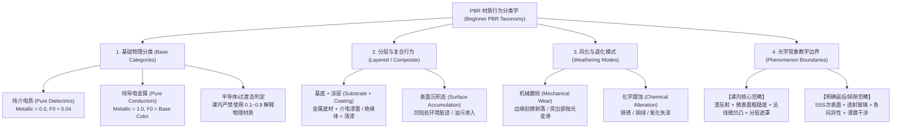
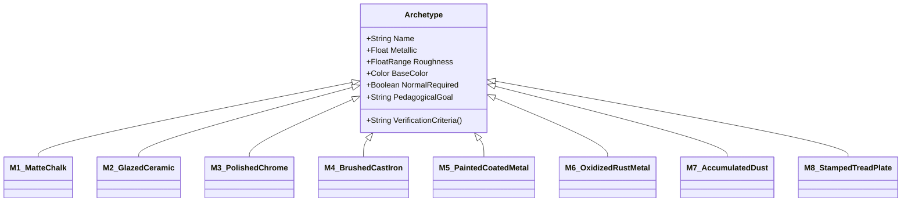

# 循证材质行为图谱与代表性材质原型集 (Evidence-Based Material Behavior Map & Representative Material Set)

> **文档定位**：本研究报告响应 GitHub Issue #20 契约，基于权威一手文献（Adobe PBR Guide 3rd ed., OpenPBR 1.1 Specification, Eran Dinur 2026）及仓库既有决策规范，构建面向本科初学者的循证材质行为分类学（Material Behavior Taxonomy）与有界代表性材质原型集（Representative Material Set）。  
> **前沿状态**：`MATERIAL_BEHAVIOR_MAP_V1_0`（**AUTHORITATIVE RESEARCH ARTIFACT**）。  
> **关联工单**：直接输入并约束 Issue #19（教学案例与拓扑证据审计）与 Issue #22（期末综合大作业设计），最终沉淀于 Issue #13（v0.4 条件性排课）。  
> **非目标声明**：不编写着色器代码或节点网络，不创建 `.blend` 文件或材质库资产，不超范围扩展次表面散射/各向异性等高级物理模型。

---

## 1. 核心理论底座与一手文献来源 (Primary Technical Sources)

构建本图谱所依据的核心文献与规范如下：

1. **Adobe (2018), *The PBR Guide: A handbook for physically based rendering*, Part 1 (Light & Physics) & Part 2 (Practical guidelines for PBR texturing), 3rd ed. by Sébastien Deguy & Christophe Soum-Fontez**：
   - 确立了能量守恒原则（Conservation of Energy）、微表面散射理论（Microfacet Theory / GGX）、菲涅尔反射（Fresnel / Schlick 近似）；
   - 严格规范了金属度工作流（Metallic/Roughness Workflow）的通道语义：金属无漫反射（Diffuse = Black，反射率 $F_0$ 编码在 Base Color 中且在 70%–100% 线性反射率之间），绝缘体/介电质的 $F_0$ 固定在 4% 左右（折射率 $\text{IOR} \approx 1.5$），Base Color 仅承载漫反射反照率（Albedo）；
   - 界定金属度取值二元律：在纯净宏观像素尺度上，材质非金属即非导电（0.0 或 1.0），中间过渡值仅代表过渡边缘抗锯齿或灰尘锈蚀等亚像素混合。
2. **Academy Software Foundation (ASWF, 2024), *OpenPBR Surface Specification v1.1***：
   - 现代影视与工业级开放材质标准，融合 Autodesk Standard Surface 与 MaterialX Lama；
   - 规范了分层模型层级（Base Substrate $\to$ Specular Coating $\to$ Fuzz/Grime），严格定义了能量在基底（Substrate）与清漆层（Clearcoat）之间的物理衰减；
   - 明确将次表面散射（Subsurface）、透射折射（Transmission）、各向异性（Anisotropy）和薄膜干涉（Thin Film）定义为高阶独立参数模块，为初学者阶段划定了清晰的“受控边界（Bounding Boundaries）”。
3. **Dinur, Eran (2026), *The Art and Science of Texture Mapping and Look Development for Visual Effects*, Routledge**：
   - 质感观察与外观开发（LookDev）权威方法论；
   - 强调材质因果逻辑（Material Causality）：材质不是抽象的颜色数值，而是物体生产工艺、历史服役、空间受力与风化降解的物理凝结；
   - 提出了“微表面粗糙度变异（Roughness Variation）是真实感第一生命线”的实证观察准则。
4. **仓库既有技术权威**：
   - `CONTEXT.md` 与 `docs/research/course-design-ledger.md`：锁定 Blender 5.2.2 LTS Principled BSDF v2 为基础实操容器。

---

## 2. 初学者材质行为分类学 (Material Behavior Taxonomy)

针对 9 周（36 学时 / 24 实际接触小时）的本科初学者教学容量，分类学必须在“物理完备性”与“认知负荷”之间建立精确的收敛边界：

### 2.1 基础物理分类 (Base Material Categories)

1. **纯介电质 (Pure Dielectrics / Insulators)**：
   - **光学行为**：入射光线分为两部分：表面高光反射（波长无选择性，颜色恒等于光源颜色，强度受菲涅尔效应支配，垂直入射 $F_0 \approx 0.04$ / 2%–5%）；折射入内部的光线经多次散射后以漫反射（Diffuse）重新出射，漫反射色彩由材料吸收光谱决定（Albedo）。
   - **PBR 参数映射**：`Metallic = 0.0`，`Base Color` 代表漫反射反照率（sRGB 范围通常在 30–240 之间，严禁纯白 255 或纯黑 0），`Roughness` 决定高光散射散布范围。
   - **子形态**：
     - *强吸收哑光型 (Matte)*：石膏、干土、未打磨木材（高 Roughness 0.7–0.95，高光极弥散）；
     - *光滑硬质型 (Glossy)*：塑料、抛光石材、陶瓷釉面（低 Roughness 0.05–0.25，高光紧凑锐利）。
2. **纯导电金属 (Pure Conductors / Metals)**：
   - **光学行为**：无自由折射漫反射光出射（自由电子迅速吸收透射光），所有可见反射均发生在微表面界面。垂直入射反射率 $F_0$ 极高（70%–100%），且反射率在不同可见光波长存在选择性吸收，从而呈现“有色高光”。
   - **PBR 参数映射**：`Metallic = 1.0`，`Base Color` 直接作为 $F_0$ 镜面高光颜色（例如纯铜 RGB $\approx (0.95, 0.64, 0.54)$，黄金 RGB $\approx (1.00, 0.71, 0.29)$，铁/铝 RGB $\approx (0.75, 0.75, 0.75)$）。
   - **子形态**：
     - *镜面抛光型 (Polished)*：镀铬、新车床钢件（Roughness 0.02–0.15）；
     - *漫磨拉丝型 (Brushed / Rough)*：铸铁、喷砂铝、拉丝不锈钢（Roughness 0.35–0.60）。
3. **半导体与复合过渡态警示 (Semiconductors & Hybrid Boundaries)**：
   - 自然界中半导体（如硅、黄铁矿）介于两者之间，但在游戏与工业影视实时标准中，**初学者必须遵循二元金属律（0 或 1 准则）**。
   - 教学中必须严正禁止“为了调暗高光而把 Metallic 设为 0.5”的错误直觉。任何 $0 < \text{Metallic} < 1$ 的像素值，在物理上只代表贴图分辨率限制下的“亚像素过渡”（如漆面剥落边缘混合了金属与底漆）、或是微米级尘埃未完全覆盖金属表面的宏观平均响应。

### 2.2 分层与复合行为 (Layered & Composite Behaviors)

真实世界的工业和日用人造物极少是单材质均匀块体，90% 的外观质感来源于物理分层（Layering）：

1. **基底 + 涂层结构 (Substrate + Coating)**：
   - *金属基底 + 介电质色漆*：现代工业装备（手电筒外壳、车辆、机械）的标准范式。底材为导电金属（Metallic = 1.0），面层为不透明树脂/磁漆（Metallic = 0.0）。当漆面完好时，宏观表现为纯介电质；当漆面磨损时，底材金属裸露。
   - *介电质基底 + 透明清漆 (Clearcoat)*：陶瓷（粗糙泥胚基底 + 高光光滑玻璃态釉面）、烤漆木器。底层提供固有色与粗糙度，外层叠加菲涅尔高光层。
2. **表面沉积态 (Surface Accumulation / Grime & Dust)**：
   - 悬浮灰尘（介电质微粒）、人体油脂（指纹微油膜）、缝隙污垢。沉积物作为极薄半透明或斑驳遮罩覆盖于物体表面，局部大幅提升 Roughness、抑制金属强反光，并在基底凹陷处积聚。

### 2.3 风化与退化模式 (Weathering & Degradation Modes)

根据 Dinur (2026) 材质因果律，风化退化不是噪波贴图的盲目叠加，而是特定外力与环境的作用痕迹：

1. **机械接触损伤 (Mechanical Wear & Abrasion)**：
   - *边缘撞击与漆面剥离 (Edge Chipping)*：凸起外缘受撞击剪切力，面漆脱落，露出金属底材或防锈底漆。在遮罩上表现为高曲率外缘的硬边缘斑驳。
   - *高频摩擦打磨 (Handling Polish)*：频繁受手部把持抚摸的区域（如开关旋钮、手柄中部），微表面被摩擦磨平，Roughness 显著下降（变光滑发亮）。
   - *定向划痕 (Directional Scratches)*：工具插拔、跌落产生的各向局部深沟，伴随微表面法线扭曲。
2. **化学腐蚀变异 (Chemical Alteration)**：
   - *铁系氧化锈蚀 (Iron Rust)*：导电纯铁在水氧作用下转化为水合氧化铁（Fe2O3·nH2O）。**物理本质发生跃迁**：从导电体（Metallic = 1.0, 灰色高光）退化为多孔疏松的介电质（Metallic = 0.0, 红棕色漫反射，高 Roughness，微凹凸法线）。
   - *有色金属钝化失泽 (Patina & Tarnish)*：黄铜/青铜氧化生成碳酸铜（铜绿），银器硫化变黑。表面光泽由强转暗，金属度在重度氧化处衰减为零。
3. **环境污染累积 (Contamination)**：
   - *重力与雨水痕迹 (Gravity & Rain Dripping)*：立面水痕向下条状扩散；
   - *死角环境积尘 (Ambient Occlusion Crevice Dust)*：气流停滞的内凹死角积聚尘埃，色彩趋同于灰黄/土灰，Roughness 趋向 0.8–0.9。

### 2.4 光学现象教学边界 (Phenomenon Boundaries: In-Scope vs. Out-of-Scope)

为保障 160 分钟单班单课时与单教师容量，全课设置严格的理论防御边界：

| 现象分类 | 具体光学现象 | 课程边界判定 | 判定依据与教学成本分析 |
| :--- | :--- | :---: | :--- |
| **基础光照与反射** | 郎伯漫反射 (Lambertian Diffuse) 微表面镜面高光 (Cook-Torrance / GGX) 菲涅尔效应 (Schlick Approximation) | **IN-SCOPE (核心主干)** | PBR 的立论根基。直观可解释，计算稳定，支撑 Week 1–3 全部基础实验。 |
| **微表面起伏** | 切线空间法线贴图 (Tangent Normal) 高度微位移 (Bump/Height 映射) | **IN-SCOPE (微实验受控)** | 工业资产必备能力。限定于“微表面着色法线扰动”，严禁引入高成本的实时曲面细分位移（Displacement）。 |
| **多层复合遮罩** | 金属/绝缘体二元遮罩 (Mix Shader / Mask) 局部脏迹与漆面分层 | **IN-SCOPE (核心进阶)** | 支撑工业品老旧质感的核心手段。使用数学节点与图像遮罩即可实现，技术透明。 |
| **半透与折射** | 透光玻璃、水体、透镜折射 (Transmission) 次表面散射 (Subsurface Scattering / 玉石皮肤) | **DEFERRED (明确排除)** | 计算昂贵，依赖厚度与复杂光线追踪；容易引发学生对阴影与折射焦散的困惑，分散材质物理核心。 |
| **高阶波动光学** | 各向异性拉丝 (Anisotropy / 锅底CD纹) 薄膜干涉彩虹色 (Thin-Film / 肥皂泡油膜) 透明涂层吸收着色 (Clearcoat Absorption) | **DEFERRED (明确排除)** | 参数空间复杂，切线方向依赖高；在实时 WebGL 中兼容性极差，属于高年级或专业研修内容。 |

---

## 3. 初学者代表性材质原型集 (Representative Material Set)

根据上述分类学，提炼出 **8 个互不重叠、层层递进的代表性材质原型（Archetypes）**。每个原型均具备精确的物理参数基准、教学目的、常见学生误区与客观检验标准：

### 原型 1：纯净哑光介电质 (Matte Dielectric — 粉笔/石膏/干白墙)
- **目标物理属性**：
  - `Metallic`: 0.0 (严格恒定)
  - `Roughness`: 0.75 – 0.95 (极高漫散射)
  - `Base Color`: 漫反射反照率 sRGB (180, 180, 180) ~ (220, 220, 220)，明度严格禁止超过 240；
  - `Normal`: 微起伏或平整，无强镜面高光；
  - `IOR / Specular`: 0.5 (对应 $F_0 \approx 0.04$)。
- **教学目的**：在开局建立“光影剥离”与反照率概念，破除“白色就是 (255, 255, 255)”的素描调子误区。
- **初学者高频误区**：直接输入纯白或纯黑；将阴影烘焙在 Base Color 内；试图拉高高光来表现白度。
- **验证与审查指标**：在强烈逆光或多光源旋转下，高光光斑极度柔和分散，无刺眼亮点，暗部不发死黑。

### 原型 2：光滑施釉介电质 (Glossy Glazed Dielectric — 陶瓷釉面/光滑硬塑料)
- **目标物理属性**：
  - `Metallic`: 0.0 (严格恒定)
  - `Roughness`: 0.05 – 0.18 (极低，高光锐利)
  - `Base Color`: 吸收固有色（如青瓷浅青灰、纯色塑料）；
  - `Normal`: 平滑连续曲面，突出光滑高光连续性；
  - `Specular`: 0.5。
- **教学目的**：建立纯镜面反射菲涅尔直觉（视线垂直时反射弱，视线掠射时反射趋近 100%）。
- **初学者高频误区**：误以为“反光强烈就是金属”，错误地将 Metallic 设为 0.5 或 1.0；将高光颜色调为带颜色。
- **验证与审查指标**：高光点颜色完全跟随环境光源颜色（非自身物体颜色）；掠射角出现极明亮的菲涅尔反光轮廓。

### 原型 3：抛光纯净金属 (Polished Pure Metal — 镀铬/新车床亮钢/镜面铜)
- **目标物理属性**：
  - `Metallic`: 1.0 (严格恒定)
  - `Roughness`: 0.05 – 0.15 (镜面/亚镜面)
  - `Base Color`: 对应金属的真实反射率 $F_0$（钢/铬: `(0.76, 0.76, 0.78)`；铜: `(0.95, 0.64, 0.54)`）；
  - `Normal`: 极平整微表面。
- **教学目的**：掌握金属度工作流的核心规则——金属无漫反射，Base Color 直接决定高光强度与色相。
- **初学者高频误区**：Base Color 填纯黑；保留绝缘体漫反射理解；在没有 HDR 环境光的黑背景下调试金属导致画面全黑。
- **验证与审查指标**：在反射演播室环境中呈现完整清晰的反射倒影；高光斑完全带有 Base Color 的色调（对铜而言）。

### 原型 4：粗糙/工业金属 (Rough / Cast Metal — 铸铁/阳极氧化铝)
- **目标物理属性**：
  - `Metallic`: 1.0 (严格恒定)
  - `Roughness`: 0.40 – 0.65 (中高微表面粗糙)
  - `Base Color`: 铸铁 `(0.45, 0.45, 0.45)`；铝 `(0.85, 0.85, 0.85)`；
  - `Normal`: 铸造砂眼或拉丝微纹理。
- **教学目的**：理解微表面粗糙度对导电体金属高光的打散效应（金属不仅有镜子般的镀铬，更多的是粗糙金属）。
- **初学者高频误区**：认为金属不亮就是 Metallic 不够高；用降低 Metallic 的方法使金属变暗淡。
- **验证与审查指标**：虽然 Roughness 较高导致倒影模糊，但在各角度下依然保持金属独有的宽厚光泽感，不存在介电质白雾状高光。

### 原型 5：复合带磨损漆面金属 (Coated Metal with Edge Wear — 军绿老手电筒/涂漆机械)
- **目标物理属性**：
  - `Substrate (基底)`：原型 4（粗糙金属 / 铝钢，Metallic = 1.0, Roughness 0.35）；
  - `Coating (面漆)`：原型 1/2（军绿聚氨酯漆，Metallic = 0.0, Roughness 0.40, Base Color 军绿）；
  - `Mask (剥落遮罩)`：高对比度黑白通道，边缘锐利，受凸外缘曲率分布驱动。
- **教学目的**：掌握 PBR 最核心的“双层解耦因果结构”，学会使用遮罩控制绝缘体与金属的物理跨界。
- **初学者高频误区**：在一个节点里试图用单一滑块混合出漆面和金属；漆面剥落过渡区域呈现模糊的灰度半金属半塑料“幽灵材质”。
- **验证与审查指标**：绿色漆面部分 Metallic 严格为 0；露出的金属划痕部分 Metallic 严格为 1；两者界限分明，微表面粗糙度在分界处形成顿挫差。

### 原型 6：化学腐蚀氧化铁锈 (Oxidized Weathered Metal — 锈蚀铸铁)
- **目标物理属性**：
  - `Base (未锈蚀金属)`：铸铁 (Metallic = 1.0, Roughness 0.45)；
  - `Oxide (铁锈层)`：多孔三氧化二铁介电质 (Metallic = 0.0, Roughness 0.85–0.95, Base Color 焦赭/黄褐)；
  - `Normal`: 铁锈膨胀起伏导致强烈的多孔粗糙微凹凸。
- **教学目的**：理解化学风化造成的“物理属性彻底转变”（金属转变为介电矿物），实现材质深度的质感跃迁。
- **初学者高频误区**：只改颜色不改金属度（得到一团反光的红铜色铁锈）；忽略铁锈的多孔超高 Roughness 特性。
- **验证与审查指标**：锈斑区域完全丧失金属光泽，在强光照射下不产生集中亮点，表面法线起伏与红褐色无光泽漫反射完全锁死对应。

### 原型 7：空间沉积脏迹灰尘 (Spatial Contamination / Crevice Dust)
- **目标物理属性**：
  - 覆盖层：粉尘介电微粒 (Metallic = 0.0, Roughness 0.85–0.95, Base Color 暖土灰)；
  - 空间分布：由环境光遮蔽（AO）与几何内凹槽驱动，非凸起受磨损区。
- **教学目的**：掌握真实物体脏迹积聚的空间物理因果，建立环境与物体的交互关系。
- **初学者高频误区**：灰尘全表面均匀糊一层，使整个模型变成半透明灰雾；在经常抚摸的凸起手柄上绘制大量灰尘。
- **验证与审查指标**：灰尘主要出现在凹槽、接缝与螺栓死角处；凸起边缘保持干净或磨损；积灰处高光完全被抑制。

### 原型 8：纹理微浮雕结构 (Textured Micro-Relief — 防滑滚花/冲压网纹/粗铸纹)
- **目标物理属性**：
  - 核心属性：切线空间法线贴图驱动（Normal Map），RGB 贴图切线空间扰动微表面法线；
  - 几何基础：低模几何面数保持平整，微表面法线在光照倾斜时产生真实明暗对比；
  - `Silhouette (剪影)`：模型轮廓线依然保持平直多边形。
- **教学目的**：建立法线贴图“光学表征欺骗而非改变宏观几何”的精确心智模型。
- **初学者高频误区**：误以为法线贴图能拯救粗糙的低模多边形轮廓；法线色彩空间未设为 Non-Color 导致计算全崩。
- **验证与审查指标**：灯光旋转时凹凸光影正确流动，正面看立体感强；视线旋转至切线剪影轮廓时，边缘依然呈现低模原始剪影。

---

## 4. 候选教学资产覆盖度交叉矩阵 (Candidate Asset Coverage Matrix)

将现有候选教学资产对照上述 8 种材质原型进行交叉映射，评估其在教学全周期中的承载能力与盲区：

| 代表性材质原型 | 手电筒主资产 (Vintage Flashlight) | 陶瓷花瓶近迁移载体 (Antique Ceramic Vase) | 古典石膏胸像微实验 (Classical Bust Bundle 1) | 历史 SPP 案例工程 (Legacy SPP Decks) | 矩阵诊断与教学启示 |
| :--- | :---: | :---: | :---: | :---: | :--- |
| **M1: 哑光介电质** | ⚪ 弱 (仅镜片反光圈橡胶衬垫) | ⚪ 弱 (仅底部未上釉泥胎圈) | **🟢 极强 (全模型纯石膏)** | 🟡 中 (部分旧案例有墙体) | 石膏胸像是建立 M1 概念的最佳微载体；手电筒缺乏大面积 M1。 |
| **M2: 光滑施釉介电质** | ⚪ 缺乏 (无大面积釉面塑胶) | **🟢 极强 (全器皿纯釉面)** | ❌ 无 (石膏全无釉) | ⚪ 弱 | 陶瓷花瓶是 M2 的绝对核心载体，为非金属光滑反射提供独立判定证据。 |
| **M3: 抛光纯净金属** | **🟢 极强 (反光杯/电镀铜扣)** | ❌ 无 | ❌ 无 | 🟡 中 (有机械零件) | 手电反光杯提供完美的镜面反射与金属有色高光对照。 |
| **M4: 粗糙工业金属** | **🟢 极强 (筒身铝合金底材)** | ❌ 无 | ❌ 无 | 🟡 中 | 手电筒身车削露底处提供工业拉丝金属最佳案例。 |
| **M5: 复合带磨损漆面金属** | **🟢 极强 (外壳喷漆/边缘磕碰)** | ❌ 无 | ❌ 无 | **🟢 极强 (SPP传统强项)** | 手电筒是 M5 最天然的物理承载，底漆-面漆因果极其清晰直观。 |
| **M6: 氧化铁锈金属** | 🟡 中 (老旧电池槽或生锈螺栓) | ❌ 无 | ❌ 无 | 🟡 中 (有锈蚀旧案例) | 手电筒可承载局部点状轻度锈蚀，但难以支撑大面积重度锈蚀。 |
| **M7: 空间沉积脏迹灰尘** | **🟢 极强 (螺纹凹槽/按键缝隙)** | 🟡 中 (瓶底积垢/瓶口灰尘) | 🟡 中 (石膏缝隙脏污) | 🟡 中 | 手电筒的丰富机械接缝为 M7 提供了极具说服力的环境光遮蔽积灰位。 |
| **M8: 纹理微浮雕结构** | **🟢 极强 (手柄防滑滚花网纹)** | ⚪ 弱 (仅瓶身微开片纹) | **🟢 极强 (扫描高模转法线)** | 🟡 中 | 石膏胸像微实验解释法线原理，手电防滑滚花完成工业级法线应用。 |

### 矩阵诊断结论 (Matrix Findings)
1. **老式手电筒作为贯穿主轴的合理性与边界**：
   - 手电筒资产完美覆盖了 **M3 (抛光金属), M4 (粗糙金属), M5 (漆面复合磨损), M7 (缝隙积灰), M8 (滚花法线)**，在工业复合材质上具备极高代表性；
   - 但手电筒**完全缺乏纯粹的 M1 (大面积漫反射哑光) 与 M2 (纯净光滑施釉介电质)**。
2. **辅助载体的必要性证明**：
   - **Week 1–3 借力石膏胸像**：能够以极低认知负荷快速突破 M1 与 M8，避免过早陷入手电筒复杂机械结构的干扰；
   - **Week 6 引入陶瓷花瓶**：不是“可有可无的花架子”，而是本课覆盖 **M2 (光滑施釉介电质)** 并检验学生脱离金属干扰、独立建立菲涅尔反射判断的**唯一关键互补资产**。

---

## 5. 客观量规锚点 (Objective Rubric Anchors)

基于物理真实性与微表面行为，为初学者作业与考核建立无歧义、可客观度量的评分量规（Rubric Anchors），严禁以“感觉好不好看”作为判分依据：

| 评估维度 | 达标基线 (Baseline / Pass) | 进阶优秀标准 (Excellence / Portfolio Standard) | 致命物理违规 (Hard Physics Violation / Fail) |
| :--- | :--- | :--- | :--- |
| **导电/绝缘二元性 (Metallic Fidelity)** | • 绝缘体漆面与塑料区域 Metallic 严格标定为 0.0； • 裸露金属区域 Metallic 严格标定为 1.0； • 过渡区仅存在于抗锯齿像素级别。 | • 金属与非金属分界边缘呈现真实物理厚度落差（有微法线高度差）； • 金属露底处自然反映氧化钝化微变化。 | ❌ 绝缘体使用带颜色的高光； ❌ 大面积区域使用 0.2~0.8 的“半金属过渡态”作为固有材质； ❌ 金属 Base Color 设为纯黑或纯白。 |
| **反照率明度安全 (Albedo Safety)** | • 所有介电质 Base Color 的 sRGB 明度严格保持在 30–240 之间； • 纹理中完全剥离了投射阴影与烘焙高光。 | • 根据真实参考精准还原吸收光谱色彩倾向； • 复合材质底漆与面漆之间色相反差符合工业工艺逻辑。 | ❌ Base Color 出现纯黑 (0,0,0) 或纯白 (255,255,255)； ❌ 贴图表面包含明显的硬边烘焙投影或灯光反射光斑。 |
| **微表面粗糙度变异 (Roughness Variation)** | • 粗糙度数值范围符合材料常理（如陶瓷 < 0.2，石膏 > 0.7）； • 金属区与漆面区具有清晰的粗糙度差异。 | • 表面展现丰富的微表面变化（指纹、轻微擦痕、局部受抚摸抛光变亮、积灰处变粗糙）； • 粗糙度图与遮罩分布完全自洽。 | ❌ 全模型使用单一常量 Roughness（纯塑料感塑料反光）； ❌ 积尘与生锈区域反而呈现镜面高光； ❌ 经常手摸的按键部位比死角还粗糙。 |
| **法线微表面表征 (Normal-Mapped Relief)** | • 切线空间法线贴图格式正确，色彩空间严格设置为 `Non-Color`； • 凹凸明暗随光源旋转正确移动。 | • 法线贴图微细节与粗糙度微划痕严密配合； • 滚花纹理无拉伸、无接缝断裂，强度适度真实。 | ❌ 法线贴图使用 sRGB 色彩空间导致着色黑斑； ❌ 法线通道方向反转（凸起被渲染为凹陷）； ❌ 试图用法线贴图掩盖低模严重穿插或破面。 |
| **分层与风化因果 (Layering & Weathering)** | • 磨损主要集中于凸起棱角与外缘； • 脏迹积聚于内凹缝隙； • 保护范围内零污染。 | • 磨损呈现“面漆脱落 $\to$ 边缘露底 $\to$ 金属轻度变暗”的多级因果过渡； • 积灰与材质反射率抑制严密联动。 | ❌ 磨损完全随机噪波撒布，平整背光面严重掉漆而凸起棱角完好无损； ❌ 脏迹浮空漂浮于光洁镜面之上。 |

---

## 6. 上游依赖输入与对下游工单的约束 (Interface & Next Moves)

1. **对 Issue #19 (教学案例与拓扑审计) 的直接输入**：
   - #19 不得脱离本图谱挑选模型。任何新增或保留的教学案例，必须明确指认其承载的原型代号（M1–M8）；
   - 确证了“单手电主轴”在 M1/M2 上的先天不足，为 #19 评估“多案例/混合拓扑（Hybrid Model）”提供了不可动摇的物理证据。
2. **对 Issue #22 (综合期末项目选项设计) 的直接约束**：
   - 期末大作业考核指标不得偏离上述“客观量规锚点”；
   - 期末代表作必须至少完整覆盖 M3, M4, M5, M7, M8 五大原型，若选择高分挑战，需证明对 M2 或 M6 的复合驾驭能力。
3. **未决决策边界 (Unresolved Decisions for Course Owner)**：
   - M6（重度铁锈腐蚀）是否需要在课内作为必选检查点，还是作为高分进阶的可选分支？（建议：课内作为演示，期末作为进阶）。
