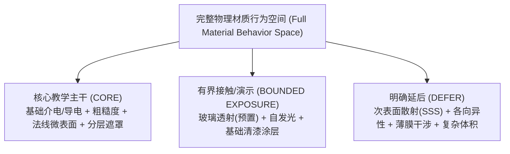
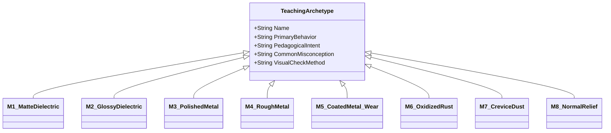

# 循证材质行为图谱与初学者代表性材质集 (Evidence-Based Material Behavior Map & Beginner Teaching Set)

> **文档定位**：本研究报告响应 GitHub Issue #20 契约及最新 Browser Review 边界要求。报告首先呈现一手权威文献（OpenPBR 1.1 Specification, Adobe PBR Guide 3rd ed, Eran Dinur 2026 2nd ed）所界定的完整物理/工业材质行为全空间；在此基础上，根据 9 周本科初学者教学容量、认知阶梯与先修门槛，合成为本项目建议的 M1–M8 初学者代表性材质教学原型集（Teaching Hypothesis / Pedagogical Synthesis），为下游案例审计（#19）与期末项目设计（#22）提供可溯源的物理依据。  
> **前置依赖**：`CONTEXT.md`（Blender 5.2.2 LTS Principled BSDF v2 环境锁定）。  
> **门禁状态**：`RESEARCH CANDIDATE ARTIFACT — PENDING BROWSER REVIEW`（不代替 #19 冻结拓扑，不替 #22 预设期末考核规则）。

---

## 1. 核心理论底座与一手文献来源 (Primary Technical Sources)

本研究严格区分“来源原文声明（Source Explicit）”、“教学综合提炼（Source-Composed Synthesis）”与“项目推论（Project Inference）”。所依赖的核心权威来源与章节点索引如下：

| 文献规范标识 | 出处与版本 | 核心章节点索引 (Locators) | 规范定位与提取要点 (Source-Backed Evidence) |
| :--- | :--- | :--- | :--- |
| **OpenPBR 1.1** | ASWF (2024), *OpenPBR Surface Specification v1.1* | • Sec 2: Base (Substrate) • Sec 3: Specular • Sec 4: Transmission • Sec 5: Subsurface • Sec 6: Coat • Sec 7: Fuzz • Sec 8: Emission • Sec 9: Thin Film • Sec 10: Geometry / Bump | 现代影视与工业开放材质标准。严格定义了物理分层因果（Base $\to$ Specular $\to$ Coat $\to$ Fuzz），并为每种高级光学行为提供了独立的能量平衡与参数接口规范。 |
| **Adobe PBR Guide** | Adobe (2018), *The PBR Guide*, 3rd ed. by S. Deguy & C. Soum-Fontez | • Pt 1, p. 8–17 (Light & Matter, Fresnel) • Pt 1, p. 20–25 (Diffusion & SSS) • Pt 2, p. 12–21 (Metallic/Roughness Workflow) • Pt 2, p. 26–31 (Albedo & Roughness) | 实时与游戏行业事实标准。明确了金属度工作流语义（金属与绝缘体反射率差异）、微表面粗糙度高光散射，以及 Albedo 与菲涅尔效应的物理基础。 |
| **Dinur (2026)** | Dinur, Eran (2026), *The Complete Guide to Photorealism*, 2nd ed., Routledge | • Ch 1–2 (Observation & Physical Optics) • Ch 4 (Natural Surfaces, Wear & Weathering) • Ch 8 (LookDev Methodology & Inspection) | 质感观察与外观开发（LookDev）权威方法论。强调材质因果律（Material Causality）与微表面粗糙度变异（Roughness Variation）作为真实感第一生命线。 |
| **Khronos glTF 2.0** | Khronos Group (2017–2024), *glTF 2.0 Specification* | • Sec 3.6.1 (Metallic-Roughness Material) • Sec 3.6.3 (Normal Texture) | 工业实时交换标准。定义 `metallicFactor` 在 $[0, 1]$ 连续区间的 BRDF 线性插值混合行为，明确 OpenGL (+Y) 切线空间法线约定。 |

---

## 2. 完整材质行为空间与教学边界判定 (Material Behavior Space & Pedagogical Scoping)

依据教师访谈要求，在压缩面向初学者的课程范围前，必须首先检视完整的材质物理与视觉行为空间。本节对各项行为维度的物理机制、教学价值与教学准入状态进行系统分类：

### 2.1 行为维度全景评估与分类裁决

| 物理行为维度 | 物理原理与表现特征 (Physics & Phenomenon) | 来源规范依据 | 教学价值与初学者认知门槛 | 教学准入状态判定 (Pedagogical Status) |
| :--- | :--- | :--- | :--- | :---: |
| **基础介电质反射 (Dielectric Reflectance)** | 光线折射进入内部后产生漫反射，表面存在约 2%–5% 垂直高光（$F_0 \approx 0.04$），高光受菲涅尔效应支配。 | OpenPBR Sec 2.1 Adobe Pt 1 p.14 | 建立“反照率（Albedo）剥离光影”的基石认知，破除初学者颜色常识误区。 | **CORE** (W1–W6 基础贯穿) |
| **导电金属反射 (Conductor Reflectance)** | 自由电子吸收透射光（无漫反射），高光反射率高（70%–100%）且具有波长选择性（有色高光）。 | OpenPBR Sec 2.2 Adobe Pt 2 p.14 | 掌握金属度工作流核心法则，理解金属 Base Color 即为高光颜色的本质。 | **CORE** (W2–W6 重点攻坚) |
| **微表面粗糙度变异 (Roughness Variation)** | 微观几何法线扰动导致镜面反射光线弥散，决定高光斑的锐利/模糊程度。 | OpenPBR Sec 3.1 Dinur Ch 2 & 8 | 观察并表达岁月抚摸、摩擦抛光与灰尘粗糙，质感逼真度第一控制轴。 | **CORE** (W1–W9 核心训练) |
| **法线与微起伏 (Normal / Bump Relief)** | 利用切线空间法线贴图扰动像素着色法线，在平整几何面上产生凹凸光影流动。 | glTF Sec 3.6.3 OpenPBR Sec 10 | 区分“表面轮廓剪影”与“微表面着色欺骗”，理解工业贴图烘焙与纹理表征。 | **CORE** (W3 微实验与 W4–W6) |
| **物理分层与复合遮罩 (Layering & Masks)** | 基底与涂层物理叠加（如金属底材 + 绝缘色漆），遮罩受边缘磨损或凹陷脏迹因果驱动。 | OpenPBR Sec 6 Dinur Ch 4 | 破除单一着色器思维，建立工业人造物“制造工艺 $\to$ 服役损坏”因果逻辑。 | **CORE** (W4–W6 关键进阶) |
| **透射与透明折射 (Transmission / IOR)** | 入射光穿透物体产生屈光折射（Snell 定律），涉及表面粗糙度与内部透明吸收。 | OpenPBR Sec 4 Adobe Pt 1 p.12 | 视觉吸引力高，但透射要求网格封闭且折射易受环境扭曲，初学者难以调试。 | **BOUNDED EXPOSURE** (手电透镜提供预置参数，不自主深调) |
| **表面自发光 (Emission)** | 表面主动向外辐射光能，不依赖外部反射。 | OpenPBR Sec 8 | 技术原理简单直观，但易导致学生滥用破坏场景光影平衡。 | **BOUNDED EXPOSURE** (手电灯珠或指示灯微量接触) |
| **清漆涂层 (Clearcoat Layer)** | 在粗糙介电质或金属基底上叠加一层薄透明反射涂层（带独立 IOR 与粗糙度）。 | OpenPBR Sec 6 | 适用于陶瓷釉面或汽车烤漆，Principled BSDF v2 已内置 Coat 滑块，易于讲解。 | **BOUNDED EXPOSURE** (非金属近迁移中启发认知) |
| **次表面散射 (Subsurface / SSS)** | 光线穿入半透明介质在内部多次散射后出射，产生柔和半透发光（玉石、皮肤、蜡烛）。 | OpenPBR Sec 5 Adobe Pt 1 p.22 | 计算昂贵，依赖模型真实物理尺度与闭合体积，极易混淆漫反射基础理解。 | **DEFER** (明确排除于本 9 周之外) |
| **各向异性 (Anisotropy)** | 微表面存在定向平行细纹（如拉丝金属、唱片），高光沿特定切线方向拉长。 | OpenPBR Sec 3.2 | 依赖复杂的网格切线（Tangents）与极坐标贴图，实时端兼容性差。 | **DEFER** (明确排除于本 9 周之外) |
| **薄膜干涉 (Thin-Film Interference)** | 光波在纳微米级薄膜（如油污膜、肥皂泡、高温回火氧化层）上下界面反射产生波干涉彩虹纹。 | OpenPBR Sec 9 | 涉及高阶波动光学与复数折射率，对大二初学者认知负荷超载。 | **DEFER** (明确排除于本 9 周之外) |
| **体积参与介质 (Volume / Absorption)** | 烟雾、浑浊水体内部的吸收与前向/后向散射系数计算。 | OpenPBR Sec 4.4 | 属于环境与特效范畴，脱离表面着色（Surface Shading）本体。 | **DEFER** (明确排除于本 9 周之外) |

---

## 3. 初学者代表性材质原型教学集 (Beginner Representative Material Set: M1–M8)

基于上述剪裁边界，本项目为初学者提炼出一套**结构化教学原型集（M1–M8 Teaching Archetypes）**。此套原型属于**教学综合提炼与假设（Pedagogical Synthesis / Hypothesis）**，旨在以渐进阶梯降低认知负荷，而非不可更改的物理教条：

### 原型架构与属性参考规范
> **说明**：下述参数取值均为面向初学者的**建议参考范围（Illustrative starting reference / Teaching hypothesis）**，用于课堂指导与自查启发，绝非判断作品合格的绝对物理门槛。

1. **M1 纯净哑光介电质 (Matte Dielectric — 粉笔 / 石膏 / 干土)**：
   - **核心物理行为**：纯漫反射为主，高微表面粗糙度（参考建议：Roughness ~0.75–0.95），无强烈聚焦高光。
   - **参数创作惯例**：纯介电质遵循 `Metallic = 0.0` 约定；Base Color 代表漫反射反照率（参考范围：中间色阶，避免 (0,0,0) 或 (255,255,255) 极端值）。
   - **教学意图与误区**：破除“把素描阴影画进贴图”与“纯白即 255”的经验误区，建立光影剥离意识。
   - **检验启发**：旋转多角度灯光，暗部不发死黑，高光弥散无锐利斑点。
2. **M2 光滑施釉介电质 (Glossy Glazed Dielectric — 陶瓷釉面 / 光滑塑料)**：
   - **核心物理行为**：低微表面粗糙度（参考建议：Roughness ~0.05–0.20），具有清晰锐利的镜面菲涅尔反射。
   - **参数创作惯例**：`Metallic = 0.0`；高光颜色完全由入射光源决定；Base Color 提供底层吸收色。
   - **教学意图与误区**：破除“反光强就是金属”的错误直觉；纠正为了减弱高光而调高金属度的操作。
   - **检验启发**：掠射角呈现明亮的镜面菲涅尔轮廓反光，高光斑无物体自身色彩染色。
3. **M3 抛光纯净金属 (Polished Pure Metal — 镀铬 / 亮钢 / 镜面黄铜)**：
   - **核心物理行为**：几乎无漫反射，垂直入射反射率极高且具色彩倾向，低粗糙度（参考建议：Roughness ~0.05–0.15）。
   - **参数创作惯例**：纯金属遵循 `Metallic = 1.0` 创作约定；Base Color 直接作为镜面高光颜色。
   - **教学意图与误区**：理解金属度工作流语义（Base Color 变为高光色），纠正在无环境反射的黑背景下调试金属的盲目行为。
   - **检验启发**：在 HDR 反射环境中呈现清晰锐利的环境倒影，具有特征性的有色或无色高光。
4. **M4 粗糙/工业金属 (Rough / Cast Metal — 铸铁 / 喷砂铝 / 机械拉丝件)**：
   - **核心物理行为**：导电体微表面起伏较大（参考建议：Roughness ~0.35–0.60），高光被大幅打散成宽厚光晕。
   - **参数创作惯例**：`Metallic = 1.0`；依靠 Base Color 与中高 Roughness 共同表达金属质感。
   - **教学意图与误区**：破除“金属必须像镜子一样反光”的刻板印象，理解粗糙度对导电体的物理散射作用。
   - **检验启发**：虽然倒影模糊，但在倾斜角度下依然保持金属独有的宽厚光泽，无介电质发灰白雾感。
5. **M5 复合带磨损漆面金属 (Coated Metal with Edge Wear — 机械外壳 / 涂漆器具)**：
   - **核心物理行为**：基底（金属 M4/M3）与面层（绝缘色漆 M1/M2）物理分层，受机械刮擦磨损露出底材。
   - **参数创作惯例**：双层通过黑白遮罩（Mask）隔离；漆面处 Metallic 约 0，露底处 Metallic 约 1；过渡边缘受抗锯齿控制。
   - **教学意图与误区**：掌握双层解耦因果结构；纠正在一个着色网络中用单滑块调出半金属半油漆的“幽灵材质”。
   - **检验启发**：漆面与金属裸露区域分界清晰，微表面粗糙度在分界边缘产生物理质感跃迁。
6. **M6 化学风化与锈蚀 (Oxidized Weathered Metal — 铁锈 / 铜绿 / 钝化金属)**：
   - **核心物理行为**：金属氧化生成介电质矿物层（多孔疏松、高粗糙度、红褐/青绿吸光），伴随表面微起伏。
   - **参数创作惯例**：锈斑区域物理性质跃迁（Metallic 衰减至 0，Roughness 升高至 ~0.80+，产生微法线凹凸）。
   - **教学意图与误区**：理解化学风化造成的“物理性质根本跃迁”，纠正“只改铁锈颜色而不改金属度与粗糙度”的错误。
   - **检验启发**：锈斑处完全失去金属反光，呈现多孔无光漫散射质感，与未锈蚀金属基底形成鲜明反差。
7. **M7 空间沉积脏迹灰尘 (Spatial Contamination / Crevice Dust — 内凹积灰 / 缝隙油垢)**：
   - **核心物理行为**：空气粉尘或人体油脂覆盖于表面，大幅提升微表面粗糙度并抑制高光，分布受空间几何因果驱动。
   - **参数创作惯例**：沉积物作为介电微粒（Metallic = 0，Roughness 偏高）；空间分布主要由环境光遮蔽（AO）与内凹槽驱动。
   - **教学意图与误区**：建立物体与服役环境交互的因果意识，纠正全表面均匀抹灰或在频繁抚摸的凸起手柄上绘制厚灰的盲目操作。
   - **检验启发**：脏迹主要驻留于凹陷接缝与螺栓死角，凸起受摩擦区域保持洁净，高光抑制合乎逻辑。
8. **M8 纹理微浮雕结构 (Textured Micro-Relief — 防滑滚花 / 冲压细纹 / 细致凹凸)**：
   - **核心物理行为**：宏观网格面数平整，通过切线空间法线贴图（Normal Map）扰动着色计算，实现凹凸光影流动。
   - **参数创作惯例**：法线贴图采用标准切线空间（OpenGL +Y）；色彩空间严格标定为 `Non-Color`。
   - **教学意图与误区**：建立“着色欺骗并非宏观几何形变”的心智模型，理解切线法线对光照倾斜角的敏感响应。
   - **检验启发**：旋转灯光时凹凸明暗自然流动，正面立体感强烈；视线切至边缘剪影轮廓时，保持原始几何多边形。

---

## 4. 候选教学案例覆盖度评估矩阵 (Candidate Asset Coverage Matrix)

基于仓库已验证的资产事实（Provenance-Verified Facts），对当前候选教学资产对照 M1–M8 教学原型集进行映射分析。评估旨在呈现当前候选组合的覆盖表现，**不武断宣称某一资产具有排他性或唯一性**，为 Issue #19 拓扑审计保留充分的替代评估空间：

### 4.1 候选资产已有仓库事实基准 (Asset Provenance Baseline)
- **Poly Haven `Vintage Flashlight`**（CC0 1.0 Universal，作者：Omar M. El-Safy）：
  - 约 11K 三角面（~11K tris），UV 已展开；
  - 官方材质构成：红色绝缘漆外壳（Red dielectric paint）、裸金属（Bare metal）、黑色橡胶/塑料把手（Black rubber/plastic）、镀铬反光碗（Chrome reflector）与玻璃透镜（Glass lens）；
  - 内部金属基底的具体合金成分（如铝/钢）在模型中未做硬性化学区分，标记为工业金属通用底材。
- **Poly Haven `Antique Ceramic Vase 01`**（CC0 1.0 Universal，作者：James Ray Cock）：
  - 约 9K 三角面（~9K tris），包含完整展开 UV；
  - 官方材质构成：高反光玻璃质光滑釉面、开片微裂纹法线、青花釉下彩，以及底部露胎素烧粗陶底圈。
- **古典石膏胸像套件 (`Classical Bust Bundle`)**：
  - 扫描高模解构微实验载体，纯哑光石膏材质。

### 4.2 案例原型覆盖度映射表

| 代表性材质原型 | 手电筒主资产 (Vintage Flashlight) | 陶瓷花瓶迁移载体 (Antique Ceramic Vase 01) | 古典石膏胸像微实验 (Classical Bust) | 历史参考案例 (Legacy Reference Projects) | 材质原型覆盖度分析与替代性评估 |
| :--- | :---: | :---: | :---: | :---: | :--- |
| **M1: 哑光介电质** | ⚪ 局部弱 (把手橡胶衬垫) | ⚪ 局部弱 (底部未上釉泥胎圈) | **🟢 极强 (全器物纯哑光石膏)** | 🟡 部分具备 (旧课件墙体/泥土) | 手电筒缺乏大面积均质哑光面；石膏胸像或类似纯漫反射模型是快速建立 M1 概念的高效微载体。 |
| **M2: 光滑施釉介电质** | ⚪ 缺乏 (无大面积高光釉面) | **🟢 极强 (全器身玻璃态釉面)** | ❌ 无 (石膏无釉) | ⚪ 偶有涉及 | 手电筒缺乏大面积非金属镜面高光；陶瓷花瓶能极好承载 M2，亦可评估木器清漆或其他光滑塑料器具作为替代。 |
| **M3: 抛光纯净金属** | **🟢 极强 (镀铬反光碗/金属件)** | ❌ 无 | ❌ 无 | 🟡 部分具备 | 手电筒反光碗提供极佳的镜面金属高光对照样本。 |
| **M4: 粗糙工业金属** | **🟢 极强 (磨损裸金属底材)** | ❌ 无 | ❌ 无 | 🟡 部分具备 | 手电外壳磕碰露出的金属底材能很好展现工业金属的中高粗糙度散射。 |
| **M5: 复合带磨损漆面** | **🟢 极强 (外壳红漆与边缘剥落)** | ❌ 无 | ❌ 无 | 🟢 传统强项 | 手电筒为 M5 提供了典型的“底材-面漆-外缘剥落”物理因果支撑。 |
| **M6: 化学风化锈蚀** | 🟡 局部中 (局部螺栓/电池仓轻度氧化) | ❌ 无 | ❌ 无 | 🟡 部分具备 | 手电筒可承载局部轻度锈蚀；若需大面积重度锈斑，需补充局部特写或替代资产。 |
| **M7: 空间沉积积灰** | **🟢 极强 (滚花缝隙/装配螺纹槽)** | 🟡 局部中 (瓶口沿/瓶底积灰) | 🟡 局部中 (石膏雕像凹陷褶皱) | 🟡 部分具备 | 手电筒丰富的机械阶梯结构提供了极佳的环境遮蔽（AO）积灰因果载体。 |
| **M8: 纹理微浮雕法线** | **🟢 极强 (握柄防滑滚花网纹)** | ⚪ 局部弱 (釉面微开片纹) | **🟢 极强 (高模烘焙微细节)** | 🟡 部分具备 | 手电筒滚花与石膏雕刻均能有效承载切线空间法线贴图的教学。 |

---

## 5. 初学者材质物理诊断参考指标 (Candidate Diagnostic Reference Checks)

为辅助教学过程中的课堂检查与作业诊断，提炼出 5 项基于微表面物理行为的诊断观察指标。此处为**参考诊断启发与教师自查依据（Diagnostic Checks）**，非正式考核评分细则（正式评分规则留待 Issue #22 配合教务大纲确定）：

1. **导电/绝缘二元性启发 (Metallic Authoring Heuristic)**：
   - *启发原则*：对于纯净宏观均质材质，建议初学者遵守“非 0 即 1”的创作惯例（绝缘体取 0，导电金属取 1）；
   - *诊断要点*：若发现大面积平整区域填写 0.3~0.7 的中间浮点数，教师应提示其确认是否误用了半金属值，还是存在多层微观亚像素混合。
2. **反照率明度安全范围 (Albedo Value Range Heuristic)**：
   - *启发原则*：自然界中绝大部分绝缘体漫反射反照率 sRGB 明度分布在中间区间（参考经验区间约 30–240）；
   - *诊断要点*：若贴图中出现纯黑 (0,0,0) 或纯白 (255,255,255)，应提示学生检查是否混入了环境阴影或过曝高光。
3. **微表面粗糙度变异性 (Roughness Variation)**：
   - *启发原则*：真实材质表面极少具有绝对均一的粗糙度，通常受接触磨损、人体抚摸与灰尘沉积影响呈现动态分布；
   - *诊断要点*：检查模型是否全表面赋予恒定 Roughness（导致缺乏真实细节）；手常抚摸处粗糙度是否适度降低，积灰处是否适度升高。
4. **法线贴图切线空间与色彩空间 (Normal Map Color Space & Orientation)**：
   - *启发原则*：切线空间法线贴图记录的是矢量数据而非颜色，必须使用 `Non-Color` 色彩空间；
   - *诊断要点*：若渲染视口出现大面积黑斑或异常反光，优先自查贴图节点是否误设为 `sRGB`；旋转光源观察凹凸朝向是否符合光影逻辑。
5. **分层因果逻辑自洽性 (Layering Causality)**：
   - *启发原则*：磨损通常发生于易受物理碰撞的外凸棱角；脏迹通常滞留于避风避光的内凹缝隙；
   - *诊断要点*：检查遮罩贴图是否具有空间因果指向，避免无规则的纯数学噪波均匀覆盖全模型。

---

## 6. 与上下游研究工单的接口关系 (Interfaces & Open Questions)

1. **对 Issue #19 (教学案例与拓扑证据审计) 的接口**：
   - 本图谱提供了 M1–M8 材质行为原型与全景物理空间。#19 应基于此行为空间，审计候选案例的教学覆盖度与拓扑结构，评估“单一资产贯穿”、“分阶段替换案例”或“主案例+有界微案例”的可行性与时间成本；
   - 证明了单一手电筒资产在 M1（大面积漫反射）与 M2（高光玻璃态釉面）上存在天然局限，但花瓶仅为 M2 候选之一，保留其他非金属替代案例的评估可能性。
2. **对 Issue #22 (综合期末大作业设计) 的接口**：
   - 本文提出的“5 项诊断参考指标”可作为期末作品质检的技术参考维度，但不提前冻结具体评分占比或硬性通过/挂科标准；
   - 期末项目的设计应兼顾多材质行为维度的综合表现力。
3. **未决问题（交由 Course Owner 仲裁）**：
   - M6（氧化锈蚀）在课内是作为全员基础演练，还是作为进阶选做内容？
   - M2（光滑施釉介电质）最终采用陶瓷花瓶还是其他轻量日常器皿作为载体？
