# 循证教学案例与实践审计报告 (Phase A: Practice Evidence Audit)

> **文档定位**：本报告响应 GitHub Issue #19 契约及最新 Browser Review 边界要求。在 Phase A 阶段，严格基于“证据优先 (Evidence-First)”原则，对候选教学案例（Vintage Flashlight、Antique Ceramic Vase 01、Classical Bust、历史参考资产）的物理特征与既往实践动作展开客观审计，梳理 4 种拓扑候选假说与关键课堂动作的证据基础。  
> **门禁状态**：`PHASE A EVIDENCE AUDIT COMPLETE / TOPOLOGY PENDING #20 REVIEWED JOIN`。  
> **核心边界**：本报告在 Phase A **不冻结任何拓扑结论**，不推荐任何单一主干或期末方案；最终 Case Topology 的对比与推荐，必须在 Issue #20（材质行为图谱）经 Browser Review 确认后，通过独立的 Join 步骤完成并提交 Course Owner 裁定。

---

## 1. 审计背景与核心问题 (Context & Problem Formulation)

在《Week 1–9 条件性排课草案 v0.3》的初期推演中，存在若干未经实证充分检验的直觉假设：
1. **单一资产跨周期的材质覆盖盲区**：原设计直觉假设“Vintage Flashlight”可作为横跨全课的核心资产，未严格审计其几何与材质构成对完整 PBR 行为空间的覆盖度；
2. **课堂上下文切换的实操风险**：W6 原计划在 160 分钟单次面授中同时容纳“独立近迁移实操”与“主资产深化”，存在双资产环境切换与时间超支的教学风险；
3. **Stage 4（W7–W9）角色重构**：Course Owner 明确指示，W7–W9 应开启全新的综合期末大作业（由 Issue #22 独立设计），彻底解耦“前六周教学练习资产”与“期末考核项目”；
4. **实践动作的证据基础缺失**：烘焙（Bake）、程序化噪波（Noise）、AI 输入决策与实时导出等重负荷动作，此前缺少系统的可行性与课时适配度审计。

---

## 2. 候选教学案例资产事实与五维证据审计 (Five-Dimension Case Audit)

基于仓库已验证的资产权威事实（Asset Provenance Baseline），对候选教学资产按五大维度进行审计：

### 2.1 候选资产已有仓库事实基准 (Asset Provenance Baseline)
- **Poly Haven `Vintage Flashlight`**（CC0 1.0 Universal，作者：Omar M. El-Safy）：
  - 约 11K 三角面（~11K tris），UV 已展开；
  - 材质构成：红色绝缘漆外壳（Red dielectric paint）、裸金属（Bare metal）、黑色橡胶/塑料把手（Black rubber/plastic）、镀铬反光碗（Chrome reflector）与玻璃透镜（Glass lens）；金属基底成分标记为通用工业金属。
- **Poly Haven `Antique Ceramic Vase 01`**（CC0 1.0 Universal，作者：James Ray Cock）：
  - 约 9K 三角面（~9K tris），包含完整展开 UV；
  - 材质构成：高反光玻璃质光滑釉面、开片微裂纹法线、青花釉下彩，以及底部粗陶露胎圈。
- **古典石膏胸像套件 (`Classical Bust Bundle`)**：
  - 扫描高模解构微实验载体，纯哑光石膏材质。
- **历史教学素材库 (`Legacy Assets & SPP Decks`)**：
  - 历史课程积累的 Substance Painter 工程与模型碎片，多包含重度风化与特定绑定。

### 2.2 五维证据审计表

| 候选资产对象 | 材质行为原型覆盖 (Material Diversity) | 几何拓扑与 UV 质量 (Geometry & UV) | 实体认知负荷 (Cognitive Fit) | 160m 课时契合度 (Contact-Hour Fit) | 初学者现场高频失效点 (Beginner Failure Modes) | 审计处置分类建议 (Audit Disposition) |
| :--- | :--- | :--- | :--- | :--- | :--- | :--- |
| **老式手电筒 (Vintage Flashlight)** | 覆盖抛光金属(反光碗)、粗糙金属(磨损露底)、复合漆面与缝隙积灰；**缺乏纯哑光漫反射与大面积光滑施釉表面**。 | 约 11K 面，流形几何无破损；UV 展开工整，但螺纹等微小结构接缝较多。 | 极佳。学生对工业手电筒物理构成（外壳、开关、反光碗）具有天然生活直觉。 | 模块化结构适合分步解耦演练；但 8–10 个部件若一次性操作易产生干扰。 | 误将多部件指定为同一材质槽；保存退出时外置纹理未打包导致重开丢失。 | **`ADAPT_CANDIDATE`** (具备良好复合工业材质属性，适合教学基础与进阶练习) |
| **古董陶瓷花瓶 (Antique Ceramic Vase 01)** | 极强覆盖光滑施釉介电质（全器皿）与底部粗陶；**完全无导电金属特征**。 | 约 9K 面，单一连续回转体，UV 连贯整齐，接缝隐藏良好。 | 极低。单一器皿形态，无机械机关，学生能 100% 聚焦于釉面反射与泥胎特征。 | 极高。结构简单，适合在有界时间（如 30–40m）内完成纯介电质独立闭环。 | 误将光滑高光当做金属反光打开 Metallic；沉溺于手绘复杂花纹脱离材质本质。 | **`REUSE_CANDIDATE`** (适合作为检验非金属理解的独立近迁移或对比载体) |
| **古典石膏胸像 (Classical Bust Bundle)** | 极强覆盖纯哑光介电质漫反射与切线法线微浮雕；**无金属与光滑高光**。 | 低模（~1.3K 面）与高模烘焙对齐；低模剪影呈明显多边形棱角。 | 极佳。美术生对素描石膏像具备深厚反照率认知，利于破除阴影烘焙误区。 | 极高（仅限微实验）。若用于学生独立烘焙全流程则严重超载；仅作观察对比则极轻量。 | 误以为法线贴图能抚平低模掠射角剪影棱角，产生混淆（教学纠偏良机）。 | **`ADAPT_MICRO_ONLY`** (仅适合作为法线原理与观察演示的轻量微实验教具) |
| **历史参考工程 (Legacy SPP Decks)** | 局部覆盖复杂磨损与旧机械；多为强风格化与噪波堆叠。 | 面数与拓扑参差不齐，部分资产存在重叠 UV 与非流形面，未做全量扫描。 | 极高。缺乏分层因果逻辑，初学者易退化为盲目套用智能材质预设。 | 极差。在 Blender 环境下重新整理着色槽成本极高，单节课无法收敛。 | 软件卡顿死锁、着色网络混乱、图层过多迷失物理因果。 | **`REFERENCE_ONLY` / `UNREVIEWED_OUT_OF_SCOPE`** (不作为课堂必做；未细审文件保持库内归档) |

---

## 3. 关键实践动作可行性与课时适配审计 (Practice Action Feasibility Audit)

针对既往推演中涉及的核心实践动作，逐项审计其证据来源、知识契合度、课时适配性与课堂可行性，确立当前的实证状态：

| 实践动作项 (Practice Action) | 证据来源 (Evidence Source) | 知识目标契合度 (Knowledge Fit) | 课时预算适配度 (Time Fit) | 课堂落地可行性 (Classroom Feasibility) | 当前实证状态 (Status) |
| :--- | :--- | :--- | :--- | :--- | :---: |
| **法线贴图认知与烘焙 (Normal Map & Bake)** | 工业资产交换标准与微表面理论。 | 核心：区分宏观几何剪影与微表面着色扰动。 | 传统全流程烘焙耗时 60–90m（易超载）；演示+对比仅需 20–25m。 | 52 人机房全员烘焙极易遭遇 Cage 穿插与显卡报错；微实验观察稳定性高。 | **BOUNDED MICRO-LAB (严控在 20–25m 认知对比)** |
| **程序化噪波扰动 (Procedural Noise)** | 着色器数学节点与微表面变异理论。 | 核心：理解数学分形参数对微表面与遮罩边缘的影响。 | 极轻量（15–20m）；单节点连线调整即时可见。 | 极高。Blender 实时计算无外部依赖，但必须限制为“单一可解释噪波”，防过度嵌套。 | **VERIFIED PRACTICE (单节点参数化控制)** |
| **外部 / AI 贴图审查 (External/AI Input Review)** | 现代 AI 辅助资产生成与贴图质检。 | 关键：建立物理通道语义辨识力，学会“接受/拒绝/替换”决策。 | 适中（20–30m）；以结构化审查清单驱动。 | 极高。无需在机房安装复杂 AI 工具，使用预置测试样本进行人眼质检把关。 | **VIABLE HYPOTHESIS (作为受控决策练习)** |
| **独立近迁移练习 (Near-Transfer Exercise)** | 教学法近迁移理论与能力迁移评估。 | 核心：脱离教学示例引导，独立在陌生模型上应用 PBR 原理。 | 若包含复杂调试需 60m+；若限制为参数辨识与分层决策需 30–40m。 | 若与主资产放在同一节课自由穿插，存在严重认知切换与时间挤占风险。 | **HYPOTHESIS REQUIRES ISOLATION (必须具备硬性流程隔离)** |
| **Realtime 外部导出核验 (glTF / WebGL Export)** | 工业跨平台资产交付规范。 | 核心：掌握通道打包语义与色彩空间，辨析离线与实时渲染差异。 | 规范化导出与打开核验约需 30–45m（含排错）。 | 依赖受控查看器环境；若需排查复杂系统网络/权限则存在不确定性。 | **FEASIBLE PENDING RUNTIME PROBE (待轻量查看器验证)** |
| **跨工具迁移候选 (Same-Asset Painter Transfer)** | 历史教学沿革与行业多工具现状。 | 探索：验证相同模型在不同工具间的概念迁移。 | 需兼顾两款软件的安装、启动、烘焙与图层操作，课时开销大。 | 涉及机房软件授权与双工具环境切换，风险显著。 | **UNVERIFIED HYPOTHESIS (待独立 dry-run 验证)** |

---

## 4. 案例排课拓扑选项集全景比对 (Topology Options for Join Evaluation)

为支撑后续与 Issue #20 的汇合决策，梳理 4 种具备完整理论逻辑的拓扑结构供评估。本阶段**不做定案选择，仅罗列特征与约束**：

```mermaid
flowchart TD
  subgraph T1 ["选项 1：单一主资产连续模型 (Single-Main-Asset Continuity)"]
    T1_A["W1-W6: 手电筒主资产贯穿"] --> T1_B["W7-W9: 手电筒继续深化交付"]
  end

  subgraph T2 ["选项 2：阶段性递进模型 (Staged / Segmented Cases)"]
    T2_A["阶段 1 (W1-W3): 案例 A 基础"] --> T2_B["阶段 2 (W4-W6): 案例 B 复合"]
    T2_B --> T2_C["阶段 3 (W7-W9): 案例 C 交付"]
  end

  subgraph T3 ["选项 3：有限主案例 + 有界代表性微案例 (Bounded Hybrid Hypothesis)"]
    T3_A["W1-W5: 手电筒主轴 + 石膏微实验"] --> T3_B["W6: 陶瓷花瓶独立近迁移"]
    T3_B --> T3_C["W7-W9: 综合深化"]
  end

  subgraph T4 ["选项 4：W1–W6 教学案例与 W7–W9 期末大作业解耦模型 (Decoupled Stage 4)"]
    T4_A["W1-W6: 教学练习资产 (手电筒/花瓶/石膏)"] --> T4_B["W7-W9: 全新综合期末项目 (待 #22 设计)"]
  end
```

### 4.1 四大拓扑候选特征对比表

| 拓扑结构选项 | 核心组织逻辑 | 材质覆盖能力潜力 | 认知负荷与启动磨损 | 教学评价与防作弊能力 | 待解决的关键疑问 (Open Questions for Join) |
| :--- | :--- | :--- | :--- | :--- | :--- |
| **选项 1：单一主资产连续模型 (Single-Main-Asset)** | 全程 9 周使用同一款工业模型深化打磨。 | 局限于该资产固有材质，存在 M1/M2 盲区。 | 启动成本最低；但中后期容易产生审美疲劳与路径依赖。 | 难以验证学生脱离该资产后的独立判断能力。 | 如何在单模型内补齐基础漫反射与纯介电质认知？ |
| **选项 2：阶段性递进模型 (Staged / Segmented)** | 按教学阶段（如每 2–3 周）更换不同物理类型的案例。 | 原型覆盖最均衡，各案例专精特定行为。 | 每次更换资产均需重新熟悉几何拓扑与 UV，时间损耗大。 | 每次阶段均有独立作品产出，评价维度清晰。 | 在 24 实际学时内，频繁更换资产是否会导致学生产出皆为半成品？ |
| **选项 3：有限主案例 + 有界微案例 (Bounded Hybrid)** | 以一个复合工业资产为主，穿插轻量微实验与短迁移。 | 兼顾工业分层与纯介电质互补。 | 主线熟练度高，微案例认知冲击适度；但 W6 面临课堂上下文切换风险。 | 具备独立近迁移检验样本。 | W6 单课时内能否安全实现“前段迁移 + 后段主干”的流程隔离？ |
| **选项 4：教学与期末项目解耦模型 (Decoupled Stage 4)** | **W1–W6 完成教学基础演练；W7–W9 独立展开全新综合期末项目**。 | 前期覆盖核心原型，后期由期末项目综合检验。 | 前期专注吸收，后期自主发挥；期末面临全新资产的审题与启动成本。 | **极高**。彻底检验学生知识迁移与综合创作能力。 | 期末项目的资产形式、难度范围与评分接口如何界定（由 #22 解决）？ |

---

## 5. Phase A 审计小结与 Join Gate 状态说明

1. **资产事实与处置建议**：
   - `Vintage Flashlight` 具备极好的工业复合分层属性，但存在天然材质盲区，不可作为全课唯一材质依托；
   - `Antique Ceramic Vase 01` 与 `Classical Bust` 在纯介电质与微表面法线认知上具备良好互补潜力；
   - 历史未审 SPP 资产保持 `REFERENCE_ONLY` 或 `UNREVIEWED_OUT_OF_SCOPE`，不作全盘丢弃，但严禁盲目引入课堂实操。
2. **拓扑决策保留**：
   - 拓扑模型选择尚未冻结。选项 4（W1–W6 教学演练与 W7–W9 期末大作业解耦）符合 Course Owner 关于 Stage 4 边界的最新决策，将作为 Join 时的重点考量基础。
3. **停靠门禁（Stop Gate）**：
   - **本工单在 Phase A 结束并就地停靠**。在 Issue #20 经 Browser Review 确认后，再行开展两者的正式 Join 分析，向 Course Owner 提交拓扑推荐案。
