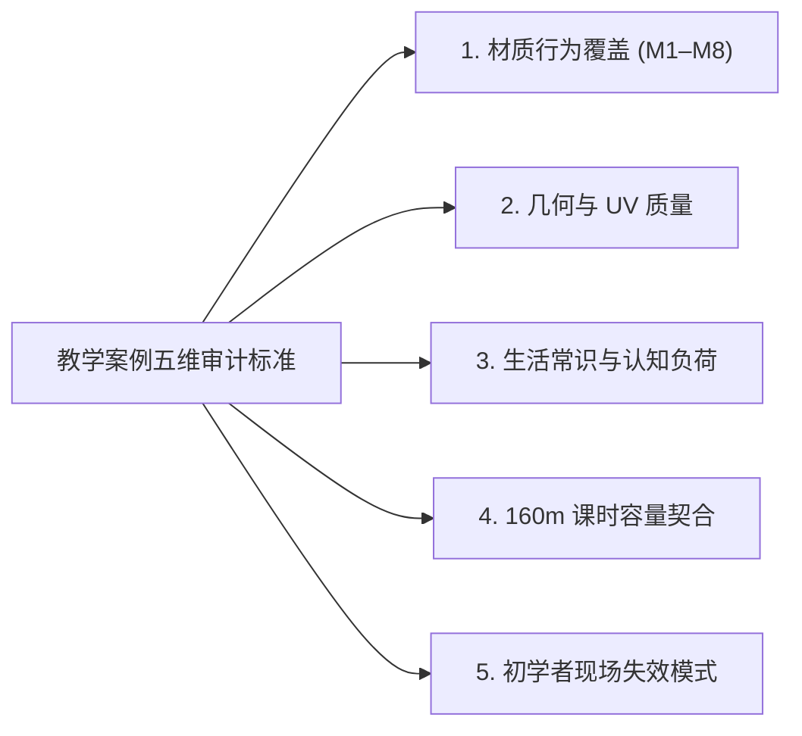
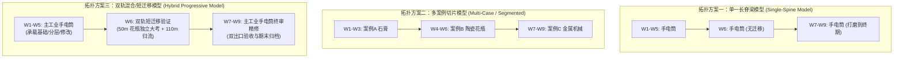

# 循证教学案例与案例拓扑审计报告 (Phase A: Practice Evidence Audit & Case Topology Evaluation)

> **文档定位**：本报告响应 GitHub Issue #19 契约，基于“证据优先 (Evidence-First)”原则，对前期条件性草案（v0.3）中未经严格实证检验的候选案例（老式手电筒、古董陶瓷花瓶、古典石膏胸像、历史 SPP 案例）及排课拓扑展开系统化审查。  
> **前沿状态**：`PRACTICE_EVIDENCE_AUDIT_PHASE_A`（**PHASE A COMPLETE / STOPPED AT JOIN GATE**）。  
> **关联工单**：消费 Issue #20（循证材质行为图谱与 M1–M8 原型集），为 Issue #22（期末大作业设计）与 Issue #13（v0.4 条件性排课更新）提供案例准入与拓扑评估依据。  
> **门禁约束声明**：本轮**仅完成 Phase A 证据审计与拓扑推演**；最终案例拓扑的选择与冻结必须等待 Course Owner 审阅并与 Issue #20 正式 Join。本报告绝不擅自越权冻结整门课程大纲。

---

## 1. 审计背景与问题定义 (Context & Problem Formulation)

在《Week 1–9 条件性排课草案 v0.3》的制定过程中，虽然成功确立了多项关键架构认知（如法线烘焙降级为 25 分钟微实验、近迁移压缩为短独立任务、160 分钟五桶预算），但课程的核心案例配置很大程度上仍沿袭了直觉假设：

1. **单脊梁假设的材质局限**：原设计将“老式手电筒 (Vintage Flashlight)”默认为贯穿 9 周的唯一主要载体（W1–W5 及 W7–W9），未审计其是否具备足够的多样性来支撑 9 周递进的物理材质认知；
2. **Week 6 课堂上下文切换的摩擦成本**：W6 设定为“前 50m 陶瓷花瓶近迁移 $\to$ 后 110m 切回手电筒深化”，未评估在 160 分钟单次面授内让学生在两套完全不同的模型与材质系统之间来回切换的认知负荷与现场教学事故率；
3. **交付与考核单一载体风险**：W7–W9 将手电筒同时作为实时 WebGL 导出与离线 Cycles 质检的目标，未评估单一模型能否提供足够区分度的考核证据；
4. **Week 9 仅打磨的工时冗余隐患**：若主资产在第 8 周已基本成熟，第 9 周全周安排 70 分钟现场精修可能造成最后宝贵面授课时的低效利用。

本报告通过五维标准审计候选案例，并评估三大拓扑模型，给出客观的准入与处置建议。

---

## 2. 候选教学案例五维证据审计 (Five-Dimension Case Audit)

依据 Issue #19 契约，对当前库内的 4 大类关键案例资产，按照五大硬性指标逐项审计：
- **维度 1：材质多样性与原型覆盖 (Material Diversity)**：对照 Issue #20 确立的 M1–M8 材质行为原型集（M1 哑光介电质、M2 施釉介电质、M3 抛光金属、M4 粗糙金属、M5 漆面复合磨损、M6 氧化铁锈、M7 空间积灰、M8 纹理微浮雕）；
- **维度 2：几何与 UV 拓扑质量 (Geometry & UV Quality)**：流形网格、非重叠 UV、合理纹素密度（Texel Density）、初学者友好尺度；
- **维度 3：实物认知负荷 (Cognitive Load)**：结构直观性、真实世界物理逻辑是否符合生活常识；
- **维度 4：课时预算契合度 (Contact-Hour Fitness)**：能否在单次 160 分钟（去除讲评与缓冲后的 40–60 分钟动手块）内完成闭环；
- **维度 5：初学者高频失效模式 (Beginner Failure Modes)**：容易在何处崩溃或产生不可逆破坏。

### 2.1 案例 A：老式手电筒 (Vintage Flashlight, Poly Haven CC0)
- **材质多样性覆盖**：
  - *强覆盖*：M3 抛光金属（铜扣、反光碗）、M4 粗糙金属（车削铝壳底材）、M5 复合漆面磨损（外壳喷漆与边缘露底）、M7 缝隙积灰（螺纹与旋钮缝隙）、M8 纹理微浮雕（手柄滚花网纹）；
  - *盲区与不足*：**完全缺乏 M1 纯哑光漫反射与 M2 光滑施釉介电质**；缺乏大面积化学腐蚀 M6。
- **几何与 UV 质量**：
  - 面数适中（约 8k 面），流形几何无破面；
  - UV 展开工整，各部件纹素密度均匀，但在螺纹细小结构处 UV 岛较碎，初学者在 Blender 视口手动绘制时容易误涂到相邻部件。
- **认知负荷**：
  - 极佳。学生对工业手电筒的物理构成（金属桶身、喷漆外皮、开关、反光碗、螺纹盖）具有天然的生活直觉，容易理解“为什么外壳会掉漆、为什么手柄有防滑纹”。
- **课时契合度**：
  - 模块化部件清晰，非常适合拆解为分步实操（如第 2 周做底材，第 3 周做分层，第 5 周做受控磨损）；但部件总数达到 8–10 个，一次性全选编辑对初学者稍显杂乱。
- **初学者典型失效模式**：
  - 误将多个部件赋予同一个材质槽导致“一改全改”；
  - 误在未分 UV 的反光罩上绘制涂鸦，导致材质变形拉伸；
  - 保存时未将外置烘焙贴图打包导致重开紫屏（丢失纹理）。
- **审计评级**：`ADAPT / RETAIN AS PRIMARY INDUSTRIAL SPINE`（保留作为工业复合主资产，但不可盲目独占全课全部周次）。

### 2.2 案例 B：古董陶瓷花瓶 (Antique Ceramic Vase, Poly Haven CC0)
- **材质多样性覆盖**：
  - *强覆盖*：**M2 光滑施釉介电质（全器皿核心）、M7 空间沉积脏迹（瓶底与瓶口内部灰尘）**；
  - *弱覆盖*：M1 哑光未施釉泥胎（底部圈足）；
  - *盲区*：完全无导电金属（M3/M4/M5/M6 全无）。
- **几何与 UV 质量**：
  - 单一连续回转体网格（约 3.5k 面），UV 极其整齐连贯，接缝隐藏在背部，无复杂折叠。
- **认知负荷**：
  - 极低。单一形态，无任何机械机关，学生能 100% 聚焦于釉面反射与泥胚质感的纯粹介电质规律。
- **课时契合度**：
  - 极高。没有多部件层级干扰，学生能在 25–35 分钟内快速完成“金属度归零、基色吸色、粗糙度微调与开片/脏迹叠加”的全部闭环。
- **初学者典型失效模式**：
  - 错误认为“高光反光很亮就是金属”，误开 Metallic；
  - 难以抵御诱惑去手工雕刻复杂瓶身花纹，导致偏离材质核心。
- **审计评级**：`REUSE AS BOUNDED NEAR-TRANSFER BENCHMARK`（极佳的近迁移验证载体，用于提供手电筒所欠缺的 M2 纯介电质独立判定证据）。

### 2.3 案例 C：古典石膏胸像高低模对 (Classical Plaster Bust Bundle 1, 教师自研历史资产)
- **材质多样性覆盖**：
  - *强覆盖*：**M1 纯净哑光介电质（石膏本体）、M8 切线空间法线微浮雕（扫描高模细节转法线贴图）**；
  - *盲区*：无任何金属或高光反射特性。
- **几何与 UV 质量**：
  - 低模（约 1.3k 面）与高模（约 80k 面）经过良好烘焙对齐；但低模面数较低，剪影呈现明显多边形棱角。
- **认知负荷**：
  - 极佳。美术生对于素描石膏像具备绝对深刻的漫反射调子记忆，是解释“PBR 基础反照率中绝不包含人工画上去的黑白明暗”的最强直观教具。
- **课时契合度**：
  - 极高（仅限微实验）。若让学生独立进行包裹盒（Cage）计算与烘焙参数排错，全班必崩；但若作为教师演示 + 预置贴图让学生对比着色与剪影（25 分钟），契合度完美。
- **初学者典型失效模式**：
  - 学生误以为法线贴图能抚平低模在掠射角下的多边形棱角，产生“为什么侧面看还是方的”认知困惑（恰好是绝佳的教学纠偏点）。
- **审计评级**：`ADAPT AS REPRESENTATION MICRO-LAB ONLY`（限定为 25 分钟法线表征微实验教具，坚决禁止升级为 45 分钟烘焙实操）。

### 2.4 案例 D：历史 Substance Painter `.spp` 案例工程库 (Legacy SPP Decks)
- **材质多样性覆盖**：
  - 覆盖面广（旧科幻武器、机械臂、破旧箱子），但多为强风格化、重度生锈与划痕过载（Noise Overkill）。
- **几何与 UV 质量**：
  - 参差不齐。部分资产面数过大（50k+），部分模型存在重叠 UV 与非流形拓扑，严重依赖 Painter 的自动曲率与 AO 烘焙修饰。
- **认知负荷**：
  - 极高。模型过于复杂，学生难以理清每一层材质遮罩的因果关系，容易沦为“乱点智能材质预设”。
- **课时契合度**：
  - 极差。在 Blender-first 环境下，导入此类大资产需要花费大量时间处理材质槽分拆与节点重建，单节课无法收敛。
- **初学者典型失效模式**：
  - 软件卡顿假死、着色器编译失败、图层栈过多导致迷失。
- **审计评级**：`DROP FROM CORE PRACTICE / REFERENCE_ONLY FOR HYPOTHESIS`（从核心实操库彻底剔除，仅保留少量图层因果作为对比参考）。

---

## 3. 案例拓扑结构评估 (Case Topology Evaluation)

针对整门课程 9 周的宏观设计，深入对比三种潜在的教学组织拓扑模型：

### 3.1 方案对比矩阵 (Topology Evaluation Matrix)

| 评价维度 | 拓扑一：单一长脊梁模型 (Single-Spine: 纯手电筒) | 拓扑二：多案例完全切片模型 (Multi-Case: 3 周换一个资产) | 拓扑三：双轨混合/短迁移模型 (Hybrid: 主手电 + 短迁移闭环) |
| :--- | :--- | :--- | :--- |
| **材质原型覆盖 (M1–M8)** | ❌ **严重不足**：完全缺失 M1 纯哑光与 M2 纯施釉介电质，学生只懂“金属喷漆”，不懂其他材质。 | **🟢 极强**：各案例专门对应不同物理类型，M1–M8 覆盖全面。 | **🟢 良好且互补**：手电负责 M3-M8（复合工业），石膏与花瓶分别定向补齐 M1 与 M2。 |
| **单教师 52 人批阅周转** | **🟢 极高**：全班做同一个资产，教师扫一眼即可发现谁的层级搞错，异步批阅负担极低。 | ❌ **极沉重**：学生在不同周期提交不同资产，教师需频繁切换心智模型，52 人周转必然延误。 | **🟢 良好受控**：花瓶仅作为 1 次性短闭环任务（当堂即归档评定），期末主线依然高度聚焦单一资产。 |
| **学生认知惯性与磨损** | 🟡 **产生审美疲劳**：面对同一个绿色手电筒长达 9 周，学生中后期极易厌倦，缺乏成就感。 | ❌ **启动磨损过高**：每换一次资产，学生都要重新理解一次拓扑、UV 与结构，大量时间损耗在非材质操作上。 | **🟢 兼顾聚焦与心智刷新**：手电筒作为主资产维持工程熟练度，W6 花瓶作为“闯关考试”适时刷新挑战欲。 |
| **迁移能力检验有效性** | ❌ **完全无法检验**：学生一直在教师提供的现成手电筒上修改，无法证明其真正理解物理规律还是死记硬背。 | **🟢 极强**：每次更换资产都强制独立面对新问题。 | **🟢 独立检验明确**：通过 50 分钟的花瓶三分类判断，提供了脱离主资产依赖的坚实证据。 |
| **课堂上下文切换风险** | **🟢 无风险**：零切换。 | 🟡 **中等**：周次交替时切换。 | ⚠️ **需严格门禁**：W6 课堂内部存在“花瓶 $\to$ 手电”的上下文切换，必须通过明确的时序序列隔离。 |

### 3.2 拓扑审计结论与推荐倾向 (Topology Recommendation)
- **坚决否决方案二（多案例切片模型）**：在 24 实际小时与单教师 52 人规模下，每 3 周更换新模型的认知启动成本会彻底压垮教学进度，导致每一套资产都沦为半成品；
- **修正并有条件支持方案三（双轨混合短迁移模型）**：
  - 手电筒必须作为主干资产保留，以保证工艺复杂度和分层深入；
  - 但**必须解决 W6 上下文切换的现场事故风险**：严禁在课堂内让学生在两套资产间自由跳跃，必须严格执行“前 50m 独立完成花瓶并提交归档 $\to$ 教师宣告花瓶任务彻底终结 $\to$ 统一清空视口，重新载入手电主工程”的硬性流程切割。

---

## 4. 全周期每周实践动作—证据映射审计 (Action-to-Evidence Mapping)

针对 Week 1–9 的每一次课内实践，逐一审计其动作有效性、实物证据产出与学习成效（LO1–LO6）对应关系：

| 周次 | 课堂物理实践动作 (Student Actions) | 产生的客观物化成果 (Physical Artifacts) | 对应学习成效 (LO Mapping) | 客观验证与审查指标 (Verification Criteria) |
| :---: | :--- | :--- | :--- | :--- |
| **W1** | • 观察实物反光与固有色； • 在预置链路中调节军绿 Base Color； • 保存退出 Blender 并重新打开。 | 1. 观察解构填空记录单； 2. 第一次着色视口截图； 3. 保存重开完好的 `.blend` 源工程。 | **LO1 (观察解构)** **LO2 雏形** **数据持久化** | • Base Color 无阴影烘焙； • 形成“决策 $\to$ 反馈 $\to$ 修订”三字段记录； • 重开工程无丢失、无粉红贴图。 |
| **W2** | • 从零新建节点（`Shift+A`）； • 连线连接数据流； • 独立为部件设置 Metallic (0/1) 与 Roughness。 | 1. 单变量物理参数对比记录表； 2. 纯介电与纯金属材质视口渲染对比图； 3. 包含自主连线节点的源工程。 | **Node Basics** **LO2 (因果预测)** | • Metallic 取值严格为 0.0 或 1.0； • Roughness 正确反映微表面粗糙，高光形状正确散布。 |
| **W3** | • 搭建 Mix Shader 双层着色网络； • 观看石膏高低模法线对比并记录； • 将资产置入演播室环境旋转视角。 | 1. 底漆-面漆双层解耦节点图截图； 2. 法线微实验着色与剪影问答单； 3. 演播室初次 LookDev 观察记录单。 | **LO3 (分层解耦)** **法线认知** **早期 LookDev** | • 遮罩黑白分明，底层底漆与面漆互不污染； • 明确回答法线贴图仅改变着色法线、不恢复剪影多边形。 |
| **W4** | • 引入单一 Noise 节点扰动遮罩； • 调节尺度参数生成 2 款变体； • 审查外部/AI 贴图并做取舍决策。 | 1. 参数化变体对比图两张； 2. 《外部/AI 贴图审查决策单》（包含“接受/拒绝/替换”及理由说明）。 | **LO4 (参数化)** **LO5 (AI/外部决策)** | • 能够用一句话指出哪个节点控制了边缘粗糙度； • 决策单指出外部贴图的物理通道语义错误并完成替换。 |
| **W5** | • 在筒身指定区域执行局部编号涂装； • 保护非目标区域完全不受污染； • 贴图保存退出并重开执行二次修改。 | 1. 修改前后对比图（红圈标出保护区）； 2. 二次修改后无损的源工程文件。 | **LO3 (空间受控修改)** **数据持久化闭环** | • 保护区域像素差异绝对为零（零污染）； • 退出重开后图层或贴图数据完好无损，二次修改成功。 |
| **W6** | • **前 35m**：独立分析陶瓷花瓶； • **后 110m**：回到手电主资产全案打磨。 | 1. 花瓶三分类判断单 ＋ 渲染图； 2. 手电筒主体材质基本成型阶段大样。 | **NEAR-TRANSFER** **主资产深度贯通** | • 花瓶 Metallic 严格为 0，正确还原 M2 施釉反光； • 手电各部件完成统一组装，消除低级参数冲突。 |
| **W7** | • 使用标准预设打包 ORM 贴图； • 导出标准 glTF (`.glb`) 文件； • 在独立网页浏览器中打开并旋转光源。 | 1. 外部 WebGL 查看器运行全屏截图； 2. 跨应用效果差异技术对照单； 3. 独立的 `.glb` 交付包。 | **LO6 (实时出口)** | • 外部视口成功加载，无材质全黑或法线凹凸反转； • 能够指出实时管线中高光截断或环境光映射差异。 |
| **W8** | • 在 Cycles 演播室下渲染多视角图像； • 对比实时与离线差异原因； • 提交期末大作业初版完整大样包。 | 1. Cycles 演播室渲染图集（3 视角）； 2. 渲染差异归因简报； 3. 期末初版工程打包文件。 | **LO6 (离线出口)** **综合质检评审** | • 渲染图展现完整的 M3/M4/M5/M7 质感特征； • 教师与同行评定给出针对性修改清单（W9 精修凭证）。 |
| **W9** | • 依据 W8 评审清单针对性精修微表面； • 整理源文件、导出件与作品集展板； • 全班进行结课复盘交流。 | 1. 《手电筒材质全案期末终审包》； 2. 标准工程源文件与资产归档包； 3. 贯穿 9 周的个人决策记录全案。 | **LO1–LO6 全成效整合** **(期末代表作交付)** | • 达到代表性原型 M3-M8 的进阶优秀标准； • 归档目录结构规范，具备工程可交付性。 |

---

## 5. 案例与拓扑处置决策建议登记表 (Decision Register)

| 案例/拓扑候选对象 | 推荐处置动作 | 核心决策依据与执行边界 |
| :--- | :---: | :--- |
| **老式手电筒 (Vintage Flashlight)** | **`ADAPT`** | **作为贯穿全课的核心工业主资产保留**。但必须明确其无法覆盖 M1/M2，不能作为全课唯一的素材神话，需由辅助载体完成能力闭环。 |
| **古董陶瓷花瓶 (Antique Ceramic Vase)** | **`REUSE`** | **作为 Week 6 短独立近迁移的基准载体保留**。专门提供 M2 纯施釉介电质的独立评定证据，结课即归档，不进入期末再次精修。 |
| **古典石膏胸像高低模对 (Bundle 1)** | **`ADAPT`** | **限定降级为 Week 3 25 分钟微实验与课堂演示素材**。专门提供 M1 与 M8 的原理认知，严禁扩充为 45 分钟烘焙大实操。 |
| **历史 SPP 案例工程与大文件杂项** | **`DROP`** | **彻底移出课堂实操必选范围**。避免模型拓扑缺陷与风格化贴图误导学生，保持在 `REFERENCE_ONLY` 或本地归档。 |
| **同资产 Painter 迁移实验假说** | **`EXPERIMENT`** | **保持为待干跑验证候选假说**。在独立工单完成 Teacher/IDE Dry-run 并证明教学收益高于认知切换成本之前，不得排入课表。 |
| **拓扑模型选择** | **`RECOMMEND HYBRID (PROGRESSIVE)`** | **推荐以手电筒为主脊梁、结合石膏微实验与花瓶短近迁移的双轨混合模型**。坚决否决全盘频繁换资产的多案例模型。 |

---

## 6. 汇合门禁声明 (Join Gate Standing)

> [!IMPORTANT]
> **JOIN GATE BLOCKED ON ISSUE #20 TAXONOMY & COURSE OWNER DECISION**  
> 
> 本报告的 Phase A 审计已完成对现有候选案例的物理属性、拓扑质量与教学动作映射。然而：
> 1. **最终教学案例选定与拓扑结构冻结，必须正式与 Issue #20 的《循证材质行为图谱与原型集》完成 Join**；
> 2. 必须由 **Course Owner（人类决策权威）** 显式裁定：是否认可“手电筒作为主轴 + 石膏微实验 + 花瓶独立近迁移”的双轨混合拓扑作为 v0.4 条件性排课的基础。
> 
> **在 Join Gate 解锁前，本工单绝不擅自越权修改课程课表、绝不冻结期末项目大纲。**
