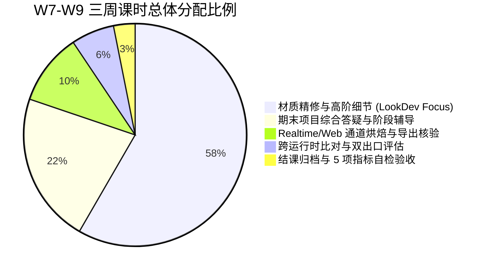

# Research — Realtime / Web Material Learning Path for Weeks 7–9

> **状态**：ACTIVE RESEARCH COMPLETE / BOUNDED RECOMMENDATION  
> **关联 Issue**：[Issue #21](https://github.com/carllx/corso-pbr-materials/issues/21)  
> **前置依赖**：[Issue #20 (Material Behavior Map)](https://github.com/carllx/corso-pbr-materials/issues/20), [Issue #19 (Practice Evidence Audit)](https://github.com/carllx/corso-pbr-materials/issues/19)  
> **下游接口**：[Issue #22 (Final Assignment Architecture)](https://github.com/carllx/corso-pbr-materials/issues/22)  
> **最终处置建议**：`BOUNDED SUPPORT`（有界辅助验证出口）

---

## 1. 核心问题与独立学习价值

### 1.1 独立教学价值：跨运行时表征能力（Interoperability）
在本科材质教学中，引入 Realtime / Web 交互验证并非为了培养前端工程师或游戏引擎关卡设计师，而是为了建立学生的**物理材质资产工业交换认知（Material Interchange Standard）**：
- **节点连线 $\neq$ 物理资产**：Blender 内部着色器编辑器中的节点网络（如噪波连线、色彩渐变）属于 DCC 专有过程逻辑；离开该宿主环境后，必须转译为符合工业标准的物理贴图与参数。
- **通道语义显性化**：离线渲染器能自动解析灵活的单通道输入，而实时管线必须严格遵循通道打包（Channel Packing）规范。学生只有亲手处理过通道映射，才能真正理解 GPU 纹理采样器限制与微表面数据的底层物理存储格式。
- **渲染近似差异归因**：理解离线路径追踪（Cycles：全局反弹、精确阴影、面积光精确积分）与实时着色（WebGL / EEVEE：Split-Sum 预过滤环境贴图、屏幕空间近似）之间的物理权衡，树立客观的跨平台 LookDev 评估意识，而非盲目推诿于“软件导出坏了”。

### 1.2 材质专业能力 vs 游戏/Web 编程的防御边界
为防止课程重心异化，本教学路径划定严格的认知与操作防火墙：

| 教学维度 | 必须守护的材质核心能力（IN-SCOPE） | 严禁引入的无关工程负担（OUT-OF-SCOPE） |
| :--- | :--- | :--- |
| **通道与数据** | 通道打包（ORM: AO, Roughness, Metallic）、色彩空间定义（sRGB vs Non-Color） | 游戏引擎蓝图编写、C# 脚本、Shader 代码编程（GLSL/HLSL） |
| **几何与法线** | 切线空间法线（Tangent Space Normal）、OpenGL (+Y) 朝向规范与翻转排错 | 复杂多级 LOD 生成、碰撞体（Collider）设置、光照贴图 UV2 展开 |
| **性能与尺寸** | 纹理贴图 2 的幂次方（POT）规范、贴图分辨率对显存与传输的物理影响 | 网页 DOM 布局、CSS/JavaScript 前端工程、WebXR 复杂交互开发 |
| **光照与观察** | 标准 HDR 环境旋转核验、色调映射（Tone Mapping）对材质对比度的影响 | 引擎关卡灯光烘焙（Lightmass）、复杂后处理体积（Post-Process Volume） |

---

## 2. 初学者最低达标要求（Minimal Learning Outcomes）

学生在 Week 7–9 无需掌握完整的游戏引擎或网页开发管线，仅需在材质维度达成以下 5 项最低核心能力：

1. **通道打包规范（Channel Packing Compliance）**：
   - 能正确将 Ambient Occlusion、Roughness、Metallic 烘焙或打包进单一 RGB 贴图（R=AO, G=Roughness, B=Metallic），并理解单贴图节约 2 个纹理采样槽（Texture Sampler Slots）的硬件意义。
2. **色彩空间防御（Color Space Rigor）**：
   - 彻底建立“颜色用 sRGB，物理数据用 Non-Color/Linear”的肌肉记忆，能通过视觉现象（如高光泛白平淡）反查并修正贴图输入色彩空间。
3. **法线切线空间校验（Normal Orientation & Tangent Space）**：
   - 掌握 OpenGL (+Y) 格式要求，能在实时视口中通过旋转受控光源识别法线“凹凸颠倒”现象并执行快速修复。
4. **双运行时差异归因（Cross-Runtime Attribution）**：
   - 能对照 Cycles 离线渲染图与 WebGL 实时效果，客观陈述至少 3 项由算法近似引起的合理视觉差异（如接触阴影模糊度、掠射角反射保真度、间接光漫反射反弹）。
5. **五项闭环自检（Five-Point Delivery Checklist）**：
   - 在独立外部查看器中完成自主验收：① 材质正确赋予；② 金属/非金属反差正常；③ 粗糙度渐变可信；④ 法线凹凸方向正确；⑤ 旋转光照无破损暗斑。

---

## 3. 候选载体、格式与受控运行时

### 3.1 载体选型：glTF 2.0 (`.glb`) 的不可替代性
- **权威依据**：Khronos Group glTF 2.0 规范与 Blender 官方 I/O 手册。
- **选型结论**：**统一采用 glTF 2.0 单文件二进制格式 (`.glb`)**。
- **排他性论证**：
  - **对比 FBX**：FBX 属于 Autodesk 私有陈旧格式，PBR 材质绑定标准模糊，常导致外部查看器丢贴图（Pink texture）；
  - **对比 USD/usdz**：USD 体系庞大复杂，主要面向影视多部门资产组装，在轻量 Web 端与机房基础环境中生态碎片化严重，初学者学习曲线陡峭；
  - **glTF 优势**：行业公认的“3D 版 JPEG”，直接基于 Principled BSDF 的核心 PBR 模型；`.glb` 格式将网格、材质描述符与纹理二进制流封装为单文件，学生复制提交极难发生丢贴图事故。

### 3.2 运行载体：零编程受控查看器（Controlled Zero-Code Viewer）
学生严禁编写任何 HTML/JS 代码。机房与学生个人环境采用**双层防御验证载体**：
1. **首选验证端**：
   - **离线 HTML5 拖拽式查看器**（基于成熟开源 `<model-viewer>` 或 Three.js 封装的单个离线 `viewer.html` 文件）。
   - **零服务器依赖**：利用 HTML5 File API，学生将本地导出的 `.glb` 直接拖入浏览器窗口即可加载解析，彻底规避机房内网环境下的本地跨域安全报错（CORS Errors）。
2. **保底应急端（机房断网或浏览器崩溃）**：
   - **Blender 内置 EEVEE Next 实时视口**。将着色模式切换为 Viewport Shading (Rendered)，载入同款测试 HDRI 环境，作为免外部软件的实时对照基准。

---

## 4. 机房基础设施约束与故障恢复路径

### 4.1 典型环境约束
- **硬件配置**：高校公用机房通常为入门级独显（GTX 1650 / RTX 3050）或 CPU 核心显卡，显存有限（2GB–4GB）。
- **网络环境**：教务网络存在内外网隔离，严禁依赖在线 CDN 或需联网注册的云端 3D 平台（如 Sketchfab）。
- **权限限制**：学生机通常无管理员权限，无法临时安装大型外部引擎（如 Unreal Engine 5 需 100GB+ 磁盘空间且初次启动着色器编译极耗时）。

### 4.2 常见故障与标准恢复路径（Recovery Matrix）

| 故障现象 | 根本技术诱因 | 标准恢复动作（≤ 3 分钟） |
| :--- | :--- | :--- |
| **浏览器打开空白 / 报错 CORS** | 学生尝试通过 `file:///` 双击普通 HTML 触发了浏览器同源安全策略拦截。 | **动作**：改用提供的拖拽式专用离线查看器，直接将 `.glb` 拖拽进页面，或在终端单行启动 `python -m http.server 8000`。 |
| **材质高光一片惨白 / 泛灰** | 粗糙度贴图（Roughness）在连接或导出时被误设为 sRGB 色彩空间，导致伽马校正抬高了中灰值。 | **动作**：检查贴图节点属性，将 Color Space 从 `sRGB` 强制切换为 `Non-Color`，重新导出覆盖。 |
| **金属部分呈现塑料感 / 变黑** | 金属度贴图未正确打包至 Blue 通道，或使用了浮点中间过渡值。 | **动作**：核验 ORM 打包通道，确保导出设置中 Metallic 映射至 B 通道；检查贴图是否为纯黑白分明判定。 |
| **表面凹凸反向（光照照射面出现阴影）** | 导出了 DirectX (-Y) 法线，而 WebGL/glTF 强制要求 OpenGL (+Y) 切线空间。 | **动作**：在烘焙/导出设置中勾选“Flip Normal Y”或在着色节点中插入 Invert 节点反转 G 通道。 |
| **浏览器崩溃 / 显存溢出卡死** | 初学者盲目连接了 4K/8K 未压缩贴图，单模型显存占用突破浏览器 WebGL 上限。 | **动作**：启动降级保护，使用 Blender 导出缩放预设将贴图上限钳制在 2048×2048（2K），恢复流畅运行。 |

---

## 5. W7–W9 三周真实课时容量核算（Capacity Budget）

后三周（W7–W9）总教学容量为 480 分钟（3 × 160m）。为防止实时技术反客为主、挤占材质质感打磨核心，本路径将 Realtime 轴严格控制在辅助验证范围内：

### 5.1 逐周课时切片清单
- **Week 7（通道打包与标准导出闭环）**：
  - **总课时**：160m。
  - **Realtime 占用**：**50m**（15m 教师示范通道原理与导出预设 + 25m 学生独立导出 `.glb` 并在本地查看器打开 + 10m 5项自检互查与排错）。
  - **保护核心**：剩余 110m 完全专注于主资产分层混合、细节微调与材质质感升华。
- **Week 8（双运行时外观比对与技术归因）**：
  - **总课时**：160m。
  - **Realtime 占用**：**30m**（10m 教师解析 Cycles 光追 vs WebGL 实时微表面积分差异 + 15m 学生双视口比对并填写归因自查卡 + 5m 总结）。
  - **保护核心**：剩余 130m 留给期末综合大作业的方案深化与教师巡回指导。
- **Week 9（作品呈现、最终归档与自检）**：
  - **总课时**：160m。
  - **Realtime 占用**：**15m**（学生将最终通过 5 项自检的 `.glb` 文件随 LookDev 渲染图一并归档提交）。
  - **保护核心**：剩余 145m 用于全班作品展示互评、大作业讲评与课程总结。
- **累计容量成本**：三周内 Realtime 纯技术操作总计占用 **95 分钟**，约占后三周总时间的 **19.8%**（严格防御在 ≤ 25% 安全红线内）。

---

## 6. 与综合期末项目（#22）的接口建议与定位裁决

### 6.1 四种处置状态对比评估

| 状态候选 | 核心特征描述 | 评估结论与理由 |
| :--- | :--- | :--- |
| **`CORE CANDIDATE`** | 将 Web/实时可交互资产定为期末唯一核心必须项，以运行帧率、减面拓扑、Draw Call 为核心评分权重。 | **坚决否决**。将逼迫学生把 70% 精力浪费在拓扑减面与引擎调试上，导致材质审美与因果分层大幅缩水，背离材质课本质。 |
| **`BOUNDED SUPPORT`** *(推荐)* | **将 Realtime 作为有界辅助验证出口（Bounded Secondary Deliverable）**。主考核仍是 LookDev 质感，实时端仅考核 5 项自检是否合规。 | **推荐采纳**。既赋予学生工业标准导出与跨平台认知能力，又牢牢守住材质艺术品质与因果层次的教学重心。 |
| **`DEMO ONLY`** | 仅由教师在投影仪上演示 glTF 导出与 Web 查看，学生无需亲手操作或提交资产。 | **否决**。学生无法亲身体会通道打包与色彩空间错误带来的灾难，极易产生操作脱节，失去基本工业交付能力。 |
| **`DEFER`** | 完全从 9 周课表中剔除，推迟至后续综合设计或毕业设计课程。 | **否决**。现代 PBR 工作流中离线与实时交融是基本行业事实，完全剥离将导致学生对贴图物理意义理解不全。 |

### 6.2 对 Issue #22（期末大作业）的明确接口规范
1. **主次关系界定**：
   - **主交付成果（Primary Deliverable，权重 70%–80%）**：离线高质量 LookDev 成果包（标准多角度渲染图、分层细节特写、包含因果逻辑的材质拆解分析）。
   - **辅助交付成果（Secondary Deliverable，权重 20%–30%）**：标准化单文件 `.glb` 实时模型包。
2. **考核评价原则**：
   - 实时端考核执行**“非致命扣分制与合规性检查（Pass/Fail Checklist）”**，仅核验 5 项技术指标（是否缺贴图、色彩空间是否合规、法线是否翻转、通道映射是否错位、光照响应是否可信）。严禁考核网页交互炫酷度或引擎优化帧率。

---

## 7. 结论与执行门禁记录

- **最终建议处置**：`BOUNDED SUPPORT`
- **执行边界约束**：
  - 严禁开发任何 Web 前端页面或引入大型游戏引擎；
  - 严禁单方面修改或冻结 Issue #22 期末作业细节；
  - 严禁修改 PR #18 现有分支与提交内容；
  - 严禁启动 Week 2 可执行教案开发。
- **状态**：本研究完成，等待与 Issue #19、Issue #20 汇总并由 Course Owner 审查。
