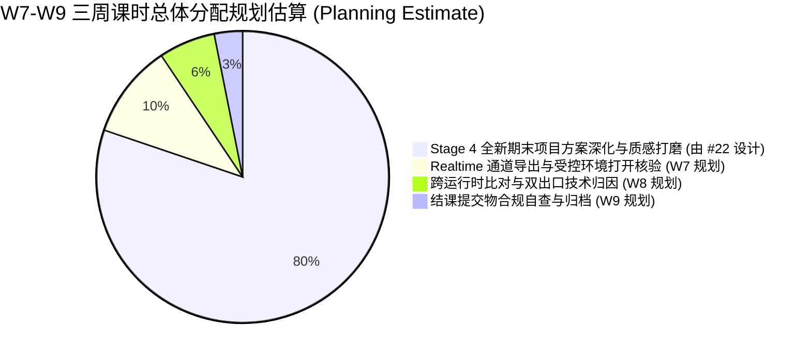

# Research — Realtime / Web Material Learning Path for Weeks 7–9

> **文档定位**：本研究报告响应 GitHub Issue #21 契约及最新 Browser Review 边界要求。报告旨在回答本科材质课中引入 Realtime / Web 交互验证的教学价值、核心材质能力边界、技术格式与受控运行时选型、课时规划估算，以及对 Stage 4 全新期末项目（#22）的接口建议。  
> **并行协作关系**：与 Issue #19（案例审计）及 Issue #20（材质行为图谱）互为并行汇合输入（Sibling Join Inputs），共同支撑后续整体课表与期末项目的决策。  
> **门禁状态**：`BOUNDED RECOMMENDATION ARTIFACT — PENDING BROWSER REVIEW`（不开发 Web App，不单方面冻结期末项目，不修改 PR #18）。

---

## 1. 核心问题与独立学习价值 (Core Questions & Pedagogical Value)

### 1.1 独立教学价值：跨运行时表征能力（Cross-Runtime Interoperability）
在本科材质教学中，引入 Realtime / Web 交付验证的独立教学价值在于建立学生的**工业资产交换认知（Interchange Standards）**，而非培养 Web 前端开发或游戏引擎关卡设计：
- **宿主节点逻辑 $\neq$ 物理资产交换格式**：Blender 内部着色器编辑器中的节点网络（如分形噪波、色阶计算）属于 DCC 专有过程逻辑；导出至外部实时环境时，必须被烘焙转译为遵循工业规范的物理贴图与参数。
- **通道语义显性化**：离线渲染器能自动解析灵活的单通道输入，而实时管线通常采用贴图通道打包以提升渲染效率。学生亲手核验通道映射，能真正理解底层数据存储格式与色彩空间规则。
- **渲染近似差异客观归因**：理解离线路径追踪（Cycles：多重光线反弹、精确微表面积分）与实时栅格化/环境贴图着色（WebGL / EEVEE：Split-Sum 预过滤近似、屏幕空间近似）之间的物理权衡，树立客观的跨平台 LookDev 评估意识，而非盲目归咎于“导出模型损坏”。

### 1.2 材质专业能力 vs 游戏/Web 编程的防御边界
为防止课程重心异化，本路径划定严格的认知与操作防火墙：

| 教学维度 | 必须守护的材质核心能力（IN-SCOPE） | 严禁引入的无关工程负担（OUT-OF-SCOPE） |
| :--- | :--- | :--- |
| **通道与数据** | 通道打包约定（ORM: AO, Roughness, Metallic）、色彩空间定义（sRGB vs Non-Color） | 游戏引擎蓝图编写、C# 脚本、GLSL/HLSL Shader 代码编程 |
| **几何与法线** | 切线空间法线（Tangent Space Normal）、OpenGL (+Y) 朝向规范与翻转排错 | 复杂多级 LOD 生成、物理碰撞体（Collider）设置、光照贴图 UV2 展开 |
| **性能与尺寸** | 纹理贴图 2 的幂次方（POT）兼容性惯例、分辨率对显存与传输的直观影响 | 网页 DOM 布局、CSS/JavaScript 前端工程、Web 框架开发 |
| **光照与观察** | 受控 HDR 环境旋转核验、色调映射（Tone Mapping）对材质对比度的影响 | 引擎关卡灯光烘焙、复杂后处理体积（Post-Process Volume）配置 |

---

## 2. 初学者最低达标要求（Minimal Learning Outcomes）

在 W7–W9 涉及实时交付时，初学者仅需在材质维度达成以下 5 项最低核心能力：

1. **通道打包惯例理解 (Packing Conventions)**：
   - 理解并应用常见的 ORM 通道打包约定（R=AO, G=Roughness, B=Metallic 作为广泛采用的工业交付惯例），理解贴图通道复用对纹理采样与资源管理的设计意图（具体采样器节省效果视硬件与引擎实现而定）。
2. **色彩空间防御 (Color Space Rigor)**：
   - 掌握“颜色贴图使用 sRGB，物理数据贴图（粗糙度、金属度、法线）必须标定为 Non-Color / Linear”的规则，能识别因色彩空间错误引起的高光发灰或法线黑斑。
3. **切线法线坐标系校验 (Tangent Normal Orientation)**：
   - 掌握切线空间法线坐标规范（glTF 2.0 规范明确为 +X 向右，+Y 向上，+Z 朝向观察者），能在实时视口中通过旋转受控光源识别凹凸朝向颠倒并执行翻转排错。
4. **跨运行时外观差异归因 (Cross-Runtime Attribution)**：
   - 能对照 Cycles 离线渲染图与实时视口效果，客观陈述由算法近似引起的合理视觉差异（如接触阴影柔化、环境反射遮蔽、间接光漫反射反弹）。
5. **五项闭环自检 (Five-Point Delivery Checklist)**：
   - 在受控查看器中完成交付合规自查：① 材质槽赋予完好；② 金属/非金属高光特征分明；③ 粗糙度渐变合理；④ 法线凹凸方向正确；⑤ 旋转光照无异常破损暗斑。

---

## 3. 候选交付载体、格式与受控运行时

### 3.1 载体选型：glTF 2.0 (`.glb`) 作为推荐有界载体
- **文献依据**：Khronos Group (2017–2024), *glTF 2.0 Specification* (Sec 3.6.1 Metallic-Roughness, Sec 3.6.3 Normal Texture, Sec 3.8.4 Sampler)；Blender 5.2 Manual (*glTF 2.0 Export*)。
- **推荐结论**：**建议选用 glTF 2.0 单文件二进制格式 (`.glb`) 作为受控交付载体**。
- **选型考量对比**：
  - **对比多文件格式（OBJ/FBX）**：传统格式 PBR 材质标准不一，贴图以松散外部文件存放，初学者极易因相对路径失效出现材质丢失；
  - **对比 USD 体系**：USD 适合大型影视生产多层级装配，但在教学初学者单资产交付与轻量跨平台查看上工具链过重；
  - **glTF 优势**：行业开放标准，原生支持 Metallic-Roughness 工作流；`.glb` 将几何拓扑、材质参数与纹理流自包含封装于单文件，教学提交与跨环境流转故障率低。
  - **关于纹理尺寸说明**：glTF 规范允许非 2 的幂次方（NPOT）贴图，但为保障多端 GPU 硬件兼容性与 Mipmap 效率，建议遵守 2 的幂次方（POT，如 1024 / 2048）作为兼容性惯例。

### 3.2 运行载体：零编程受控验证环境
学生**严禁编写任何 Web 代码**。验证环境采用双层候选策略：
1. **候选方案 A：离线零服务拖拽式查看器（Runtime Candidate Pending Probe）**：
   - 基于 HTML5 File API 开发的极简单页查看器（或成熟封装的离线查看器模板）；
   - *技术原理*：通过监听浏览器拖拽事件直接读取本地 `.glb` 文件二进制流（`URL.createObjectURL(file)` 或 `readAsArrayBuffer`），绕过本地 `file:///` 协议下发起 `fetch()` 导致的浏览器同源跨域拦截（CORS Error）；
   - *状态*：标记为**待机房实测候选（Pending Runtime Probe）**，在正式采用前需在受限机房环境下进行小规模验证。
2. **候选方案 B（保底基准）：Blender 内置 EEVEE Next 实时视口**：
   - 无需任何外部浏览器或网络环境，在 Blender 内部直接开启 Viewport Shading (Rendered) 并载入标准测试 HDRI，作为 100% 零依赖的实时对照基准。

---

## 4. 机房基础设施风险示例与故障恢复 (Infrastructure Risks & Recovery)

> **门禁提示**：当前学期机房的具体显卡型号、驱动版本、内外网隔离规则与管理员权限均处于 `HARDWARE/SOFTWARE UNKNOWN` 状态。下表仅列出高校公用机房常见的典型技术风险示例与标准恢复路径：

| 常见故障现象 | 潜在技术诱因 | 标准恢复动作（建议 3 分钟内自查解决） |
| :--- | :--- | :--- |
| **浏览器打开空白 / 报 CORS 错误** | 双击普通 HTML 页面试图异步请求本地模型，被浏览器同源策略拦截。 | **动作**：改用支持 File API 拖拽读取的专用离线查看器，或启动保底方案（Blender EEVEE 实时视口）。 |
| **材质高光一片泛白平淡** | 粗糙度（Roughness）贴图在连接或导出时被误设为 sRGB 色彩空间。 | **动作**：核查材质节点，将非颜色贴图的 Color Space 切换为 `Non-Color`，重新导出。 |
| **金属部分呈现塑料感 / 变黑** | 金属度贴图未正确映射至 Blue 通道，或使用了不合逻辑的浮点中间值。 | **动作**：核验通道打包映射，确认 Metallic 严格对应 B 通道与纯材质二元取值。 |
| **表面凹凸反向（光照面出现背阴）** | 导出了 DirectX (-Y) 法线贴图，与 glTF 要求的 OpenGL (+Y) 冲突。 | **动作**：在导出设置或节点中反转法线绿色通道（Flip Normal Y / Invert G）。 |
| **浏览器显存溢出 / 视口卡死** | 初学者盲目连接了 4K/8K 巨幅未压缩贴图，超出显卡显存承载。 | **动作**：在 Blender 导出设置中限制贴图上限至 2048×2048（2K），恢复流畅运行。 |

---

## 5. W7–W9 课时容量规划估算 (Capacity Planning Estimate)

后三周（W7–W9）总教学容量为 480 分钟（3 × 160m）。为防止实时格式排错挤占核心材质质感打磨，本估算将 Realtime 轴限定为辅助性验证出口：

### 5.1 逐周课时规划切片清单（估算值）
- **Week 7（通道导出与标准核验闭环）**：
  - **总课时**：160m。
  - **Realtime 规划估算**：**约 50m**（15m 教师示范导出约定与排错预设 + 25m 学生独立导出并在受控环境中打开 + 10m 5项自检互查）。
  - **剩余时间（约 110m）**：**完全交付给 Stage 4 全新综合期末项目（由 Issue #22 独立设计），不写回旧手电筒**。
- **Week 8（双运行时外观比对与技术归因）**：
  - **总课时**：160m。
  - **Realtime 规划估算**：**约 30m**（10m 教师解析 Cycles 离线光追与实时着色差异 + 15m 学生双视口比对并记录可解释差异 + 5m 讲评）。
  - **剩余时间（约 130m）**：留给期末项目的深入制作与教师个别辅导。
- **Week 9（作品呈现与最终归档）**：
  - **总课时**：160m。
  - **Realtime 规划估算**：**约 15m**（学生将合规的 `.glb` 交付件随期末 LookDev 套件一并打包归档）。
  - **剩余时间（约 145m）**：全班作品讲评、期末项目成果展示与结课复盘。
- **累计规划成本**：三周内 Realtime 纯技术操作累计估算占用 **约 95 分钟**（占后三周总时间的约 19.8%）。该数值为教学规划估算值，尚需后续教学实测校准。

---

## 6. 与综合期末项目（#22）的接口建议与定位裁决 (Interfaces to #22)

### 6.1 处置状态裁决：`BOUNDED SUPPORT`（推荐）
在 `CORE CANDIDATE`、`BOUNDED SUPPORT`、`DEMO ONLY` 与 `DEFER` 四种候选状态中，**推荐裁决为 `BOUNDED SUPPORT`（有界辅助验证出口）**：
- **不选 `CORE CANDIDATE` 的理由**：本科材质课的评价本体在于“材质物理逻辑、真实感与艺术质感表现力”，若将实时技术列为核心必须项，易诱导学生将精力耗费于拓扑减面与引擎调试，背离课程初衷；
- **不选 `DEMO ONLY` 或 `DEFER` 的理由**：跨平台工业交付是现代 3D 资产流水线的基本素养，学生亲手完成一次闭环导出与排错，能极大强化对通道语义与物理参数的理解。

### 6.2 对 Issue #22（期末大作业）的定性接口规范
1. **成果物主次关系**：
   - **离线 LookDev 渲染成果包作为主要评价载体**（多角度高质量渲染图、微表面细节特写、材质因果逻辑拆解）；
   - **单文件 `.glb` 实时模型作为次要辅助交付物**。
2. **考核边界约定**：
   - 实时交付物仅作为**合规性核验项（Compliance Deliverable）**，核查通道打包是否规范、贴图是否破损、法线是否颠倒等基本规范；
   - 严禁对网页交互复杂度或游戏引擎实时帧率设定硬性评分权重，具体评分量规由 Issue #22 配合教务要求制定。

---

## 7. 结论与执行门禁记录 (Conclusion & Gate Standing)

- **最终处置建议**：`BOUNDED SUPPORT`
- **执行边界约束**：
  - 严禁开发任何 Web 前端应用或引入大型游戏引擎全流程；
  - 严禁单方面预设或冻结 Issue #22 期末大作业的具体分值与要求；
  - 严禁修改 PR #18 现有分支；
  - 严禁启动 Week 2 可执行教案开发。
- **状态**：本研究完成修正，等待 Browser Review 确认。
