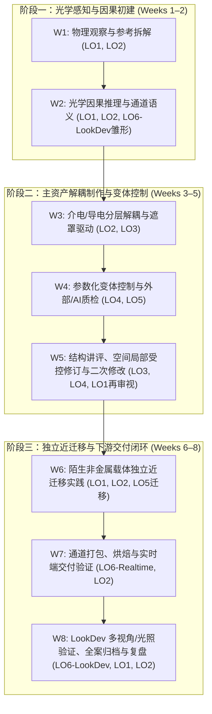

# Week 1–8 条件性排课草案 v0.1 (Week 1–8 Conditional Planning Draft v0.1)

> **文档定位**：建立最短可辩护的本科 8 周课程架构，显式暴露容量假设、反馈依赖与教学风险检查点。  
> **前沿状态**：`WEEK_1_8_CONDITIONAL_PLANNING_DRAFT`（**CONDITIONAL / NOT FROZEN**）。  
> **制定日期**：2026-09-19。  
> **核心原则**：不冻结最终课时数值，不伪造分钟精度，不承诺全部能力已实证达成，不开展新的宽泛软件与资料研究。

---

## 目录
1. [容量与达成契约 (Capacity & Attainment Contract)](#1-容量与达成契约-capacity--attainment-contract)
2. [三轨容量账本与证据状态规范 (Three Parallel Capacity Ledgers)](#2-三轨容量账本与证据状态规范-three-parallel-capacity-ledgers)
3. [修正版实践主线：小型工业复合资产 (Modified Practice Backbone)](#3-修正版实践主线小型工业复合资产-modified-practice-backbone)
4. [陌生载体近迁移任务规范 (Unfamiliar-Carrier Transfer Task)](#4-陌生载体近迁移任务规范-unfamiliar-carrier-transfer-task)
5. [承重型反馈架构规范 (Load-Bearing Feedback Architecture)](#5-承重型反馈架构规范-load-bearing-feedback-architecture)
6. [螺旋式学习成效架构 (Spiral LO Structure)](#6-螺旋式学习成效架构-spiral-lo-structure)
7. [最低独立达成证据定义 (Minimum Independent Attainment Evidence)](#7-最低独立达成证据定义-minimum-independent-attainment-evidence)
8. [LO3 空间局部性教学风险检查点 (LO3 Spatial-Locality Checkpoint)](#8-lo3-空间局部性教学风险检查点-lo3-spatial-locality-checkpoint)
9. [极简双应用出口实现规范 (Two Application Exits Specification)](#9-极简双应用出口实现规范-two-application-exits-specification)
10. [保护核心与超载裁剪层级 (Protected Core vs. First Cuts)](#10-保护核心与超载裁剪层级-protected-core-vs-first-cuts)
11. [Week 1–8 条件性排课总表 (Week 1–8 Planning Table)](#11-week-18-条件性排课总表-week-18-planning-table)

---

## 1. 容量与达成契约 (Capacity & Attainment Contract)

在进入任何具体周程设计前，必须以契约形式明确当前已知事实、历史情境假设与未决未知项，防止将推测误认为事实。

### 1.1 已核实事实 (VERIFIED)
* **课程周期**：基准周期固定为 **8 周**；
* **课程重心**：课程核心聚焦于 **材质与纹理创作 (Material / Texture Authoring)**；
* **支撑边界**：建模（Modeling）、拓扑（Topology）、高低模与 UV 展开属于**前置支撑知识**，由教师预置干净资产，不作为课程考核主体；
* **成效框架**：LO1–LO6 保持为六大核心学习成效家族（Outcome Families）；
* **主要制作环境**：**Blender 5.2 LTS** 为当前暂定主要制作环境（Provisional Primary Authoring Runtime）；
* **实践参考基准**：CORE42（CG Cookie Blender 4.2）为成熟操作实践参考库，非课程大纲权威；
* **双应用出口**：实时游戏（Game Realtime）与动画/视觉开发（Animation / LookDev）保持为两个应用出口。

### 1.2 规划情境假设 (PLANNING ASSUMPTIONS)
* **历史规划情境**：单周 4 面授课时（合 3 实际小时）+ 课外自主练习 4–6 小时，8 周总负荷约 **56–72 实际人时**。
* **严格限制**：**该情境仅作为历史推演的情境参考记录，绝不能驱动具体的每周课时分配，亦不能作为容量可行的证明**。

### 1.3 显式保留的未知项 (UNKNOWN)
以下高校制度性事实目前尚未得到教务核实，严禁主观臆造数值：
* `[UNKNOWN 01]` **校方每周真实面授接触分钟数** (Real Contact Minutes per Week)；
* `[UNKNOWN 02]` **校方官方课外作业预算学时** (Official Homework Expectation)；
* `[UNKNOWN 03]` **课程学分与总工作量法定要求** (Credit / Workload Requirement)；
* `[UNKNOWN 04]` **入学学生 Blender / 3D / UV / 贴图真实技能基线** (Incoming Student Baseline)；
* `[UNKNOWN 05]` **班级规模与选课人数** (Class Size)；
* `[UNKNOWN 06]` **教师与助教配比** (Teacher / Student Ratio)；
* `[UNKNOWN 07]` **教师每周可投入的讲评与指导容量** (Teacher Critique Capacity)；
* `[UNKNOWN 08]` **作业批改、反馈与复核的真实周转周期** (Turnaround Capacity)。

---

## 2. 三轨容量账本与证据状态规范 (Three Parallel Capacity Ledgers)

排课过程中的每一项活动，必须在三轨独立账本中分别记账，杜绝将学生与教师负荷混为一谈。同时拒绝虚假分钟精度，使用严格的**证据状态 (Capacity Evidence Status)** 与 **相对风险 (Capacity Risk)** 双重标注。

### 2.1 三轨账本定义
1. **学生课内活动 (Student In-Class)**：
   - 活动类型：教师示范、快速诊断练习、受控制作、个别/小组讲评、修订重试、作品展示与汇报。
2. **学生课外活动 (Student Out-of-Class)**：
   - 活动类型：文献与参考图审视、独立制作推进、故障排查与恢复、修改单执行、文件打包与导出。
3. **教师资源投入 (Teacher Resource)**：
   - 活动类型：资产/工程准备与验证、个别当面讲评、全班共性错误讲评、作业评分、修改单复核。

### 2.2 证据状态分级 (Capacity Evidence Status)
每项活动必须标明其容量耗时的证据来源，禁止以推测冒充事实：
* **`UNKNOWN`**：完全缺乏实测或先验估计基准；
* **`ESTIMATE`**：基于经验估计，必须附带简要依据说明（例如：教师教学判断、已知视频/教程结构、教师个人 dry-run 干跑，明确标注尚未经初学者实测）；
* **`MEASURED`**：在具代表性的初学群体中通过实操测得的真实数据（含失败重试与导出等待）。

### 2.3 相对容量风险 (Capacity Risk)
作为教学实施的警示指标，划分为 `LOW`、`MEDIUM`、`HIGH`，用于指导超载时的裁剪优先级，但**绝不能替代证据状态**。

---

## 3. 修正版实践主线：小型工业复合资产 (Modified Practice Backbone)

对前期提出的连续实践主线（Practice Backbone v1）进行有界修正，保留其教学价值，剥离过度承诺：

### 3.1 核心修正原则
1. **彻底撤回“固化占 70–80% 实践负荷”的断言**：主项目不再按固定百分比垄断课时，其实际负荷由具体任务和学生基线动态决定；
2. **大幅缩减资产与组件范围**：由复杂的工业装配体（如全套望远镜）收缩为**小型工业复合外壳/结构件 (Industrial Housing Component)**，包含规整倒角、底漆介电层、面漆层与局部铸钢/磨损区域即可；
3. **保留核心教学价值**：保留该资产用于因果分层（LO2）、受控空间修订（LO3）、参数变体（LO4）与最终交付（LO6）的连续性与累积修订价值；
4. **杜绝“做旧即一切”的认知偏差**：明确工业磨损金属仅是连接介电/导电、多通道遮罩的一个典型物理样本，严禁让学生误以为所有数字资产都必须经历掉漆、泥污与噪波风化。

---

## 4. 陌生载体近迁移任务规范 (Unfamiliar-Carrier Transfer Task)

为打破单一主项目的样本偏差，在课程中后期强制设立一项轻量级迁移任务：

### 4.1 任务基本属性
* **考核性质**：`NEAR-TRANSFER EVIDENCE — REQUIRED BEFORE COURSE COMPLETION`；
* **载体设定**：教师预先准备好的**陌生非金属载体**（如已展好规整 UV 的木质板件、工业硬质塑料构件或涂层陶瓷件）；
* **无脚手架规则**：不提供逐步跟做视频（No Step-by-step Tutorial），仅提供设计意图 Brief 与技术约束规范；
* **非大项目原则**：严禁演变为第二个大型资产制作，仅为一次有界的独立分析与局部制作验证。

### 4.2 学生必须独立完成的 6 项行为
1. **识别物理尺度 (Identify Scale)**：判断纹理宏观与微观尺寸是否与资产真实体量匹配；
2. **识别方向性特征 (Identify Directional Behavior)**：判断纹理（如木纹、刷痕）是否存在明确的方向排布与接缝连续性要求；
3. **评估粗糙度与因果规律 (Assess Roughness / Appearance Causality)**：依据非金属表面特性，分析高光反射与微观粗糙度分布（非金属 Fresnel 特性，绝不可套用金属度通道）；
4. **外部输入筛选与取舍 (Choose or Reject Input Source)**：从给定的候选纹理或 AI 生成参考中，根据通道语义与光影污染做出接受/拒绝决策；
5. **执行一次有界局部修正 (Perform One Bounded Local Correction)**：在指定区域独立完成一次质感属性或划痕参数调整；
6. **阐述不可迁移假设 (Explain Non-transferable Assumptions)**：书面说明工业做旧金属的哪些预设（如 Metallic=1 逻辑、边缘曲率脱漆、特定磨损噪波）在此载体上**完全失效**。

*考核重点*：聚焦于**物理因果推理与纠错决策**，而非艺术终极精修。

---

## 5. 承重型反馈架构规范 (Load-Bearing Feedback Architecture)

教学反馈不是课后附加打分，而是驱动学生能力达成的承重构件。课程内嵌 5 项核心反馈事件：

| 反馈事件 (Event) | 触发节点 | 实施主体 (Owner) | 交互模式 (Mode) | 前置依赖关系 (Dependency) | 教师负荷状态 (Teacher Load) |
| :--- | :--- | :--- | :--- | :--- | :--- |
| **1. 入门基线诊断 (Entry Diagnostic)** | Week 1 课中 | 教师主持 / 学生自查 | 视口操作核对表 + 常见概念快问 | **非阻塞**；用于摸排班级基线并动态调整前置支架 | `ESTIMATE` (低负荷，快速抽查，基准：历史课堂经验) / `LOW` |
| **2. 早期因果检查 (Early Causality Check)** | Week 2 课中 | 学生自查 + 教师共性讲评 | 预测—改变单变量—验证对比表 | **强依赖**；未通过者必须当堂纠正，才能进入分层制作 | `ESTIMATE` (中等负荷，课堂巡视，基准：典型实验课经验) / `MEDIUM` |
| **3. 结构阶段讲评 (Structure Critique)** | Week 4/5 课中 | 校准同行互评 + 教师抽查 | 基于标准 Checklist 的节点结构与通道审视 | **强依赖**；节点混乱或通道混淆者必须在外观精修前重构结构 | `ESTIMATE` (高负荷，需提供校准范例，基准：大纲估计) / `HIGH` |
| **4. 受控修订与复核 (Revision + Re-check)** | Week 5/6 课内外 | 教师亲自复核 | 依据修改任务单 (Change Request) 的原/新对比复核 | **强依赖**；必须在保存重开后验证非目标区保全，作为 LO3 达标依据 | `UNKNOWN` (受班级人数直接制约，需制度确认) / `HIGH` |
| **5. 独立迁移检查 (Independent Transfer Check)** | 迁移任务后 | 教师结构化评分 | 6 项迁移行为对照量表 (Rubric) | **阶段结课依赖**；用于评估独立决策与近迁移能力 | `UNKNOWN` (取决于批改周转容量) / `MEDIUM` |

> [!IMPORTANT]
> **同行互评的严肃定位**：校准同行互评（Calibrated Peer Critique）必须在教师给出明确正反范例和操作 Checklist 下进行，仅用于初筛格式与低级错误，**绝不能作为教师个体专业讲评与达标复核的零成本替代品**。

---

## 6. 螺旋式学习成效架构 (Spiral LO Structure)

坚决杜绝“Week 1=LO1, Week 2=LO2 ... Week 6=LO6”的机械线性切分。六大成效在八周中呈螺旋式上升、相互依存：

* **LO1 (观察意图)**：在 Week 1 建立，在 Week 5 讲评时作为修改审美品味再次激活，在 Week 8 交付质检中作为终审标准；
* **LO2 (因果推理)**：贯穿全周期，从 Week 2 的基础参数预测，到 Week 3 的分层因果，再到 Week 6 的非金属迁移与 Week 7 的烘焙排错；
* **LO3 (受控修订)**：在 Week 3 建立解耦心智，在 Week 5 经历“修改单下达—局部编辑—非目标保全—真实重开”的严密考验；
* **LO5 (外部/AI判断)**：在 Week 4 首次进行贴图质检，在 Week 6 陌生迁移中由学生独立做出来源取舍；
* **LO6 (交付约束)**：在 Week 2 引入实时/离线概念约束，在 Week 7–8 实施轻量外部实时交付与离线 LookDev 一致性归因。

---

## 7. 最低独立达成证据定义 (Minimum Independent Attainment Evidence)

为防止考核膨胀与隐形门槛，为 LO1–LO6 确立**唯一且必须**的最低独立表现标准：

* **LO1**：**证据型观察与意图解构**。学生能结合现实参考照片提取至少 2 处微表面材质特征，清晰区分客观观察（Observation）、主观因果推断（Inference）与无法确认的不确定性（Uncertainty），不编造虚假物理故事。
* **LO2**：**光学因果预测与排错**。给定一个未示范的材质渲染错误（如 Base Color 烘死强烈高光、非金属误开金属度），学生能按“预测 $\to$ 改变单一变量测试 $\to$ 因果诊断 $\to$ 正确修复”闭环排错。
* **LO3**：**空间局部受控修改与数据保全**。接收明确的局部修改需求（如仅修改右上角磨损区域或单一标牌颜色），执行修改后，**非目标区域与无关通道数据严格保全**，并在工程**真实保存且重新打开后**成功实施第二次追加修改。
* **LO4**：**参数关系解释与变体生成**。能够清晰解释一段最小节点链条（输入驱动参数 $\to$ 混合数学 $\to$ 输出）的因果关系，独立改动一个核心参数并正确预测生成的材质变体。
* **LO5**：**多源素材/AI 输出的专业批判决策**。面对给定的设计需求与若干外部/AI 生成贴图，逐通道审查色彩空间、光影污染与动态范围，对输入源做出清晰的“接受、拒绝或局部采纳”决策并阐述物理理由。
* **LO6**：**单一外部目标交付与渲染差异客观归因**。独立将材质打包导出至指定外部交付环境（WebGL/glTF）并打开核验；另在预置离线高质量观察环境（Cycles）下比对质感，能客观列举可归因的技术差异，不以“引擎完全不同”推诿。

---

## 8. LO3 空间局部性教学风险检查点 (LO3 Spatial-Locality Checkpoint)

> **检查点性质**：`PENDING BEFORE FROZEN EXECUTABLE SCHEDULE`（**排课正式冻结前的必验门禁**）。

### 8.1 风险背景与证据缺口
前期通过 Python 脚本完成的受控修订探针，验证的是**全局参数隔离**（噪声全局阈值变化与底层粗糙度调整，检查涂层参数未变）。这在技术上证明了数据流隔离，但**尚未在真实 GUI 交互中验证初学者对“指定物理空间区域”进行局部绘制/修改时能否稳定保全非目标表面数据**。

### 8.2 必须验证的教学实操闭环
在课表最终冻结前，必须安排教师/代表性学生完成以下最小原型的 GUI 实走测试：
$$\text{指定空间区域} \longrightarrow \text{局部绘制/修改} \longrightarrow \text{非目标区域/通道严格保全} \longrightarrow \text{保存贴图与工程} \longrightarrow \text{真实关闭重启软件} \longrightarrow \text{重开工程并实施二次修订}$$

### 8.3 门禁触发后果与决策规则
* **通过条件**：在 Blender 5.2 原生工具链（Texture Paint / 图像保存 / 遮罩混合）下，初学者无需记忆极其繁琐的反直觉操作，无需依赖高度复杂的教师黑箱插件/节点组，即可稳定完成上述闭环。
* **触发条件**：若实测证明 Blender 原生流程在图像管理、图层保存与局部重绘上存在严重教学摩擦（如极易丢失绘制数据、必须依赖难以解释的复杂模板），则**仅就此一项保留任务**，授权开展狭窄、有界的 **Blender vs. Substance 3D Painter** 教学成本定向对比。
* **禁项**：严禁借此重新发起宽泛的 Painter 全面评估。

---

## 9. 极简双应用出口实现规范 (Two Application Exits Specification)

坚决避免为两套出口分别开设完整的生产管线，采用**非对称、复用源资产**的极简架构：

### 9.1 实时游戏出口 (Game Realtime Exit)
* **教学动作**：单一外部交付、打开与核验行为（One Bounded External Delivery / Open / Verify Behavior）；
* **运行载体**：继续以轻量级 **WebGL PBR Runtime (Google Chrome / Three.js glTF Viewer)** 作为示范样本；
* **学生证据**：完成贴图烘焙与 glTF 2.0 (`.glb`) 导出，在独立外部浏览器中打开，对照核验 5 项指标（材质赋予、通道对应、法线方向、色彩空间、实时光照响应）；
* **边界**：不要求学习 Unity / Unreal Engine 的复杂工程配置与场景构建。

### 9.2 动画/视觉开发出口 (Animation / LookDev Exit)
* **教学动作**：单一预置离线高质量观察环境下的质感评测与归因（One Preconfigured High-Quality Viewing Condition）；
* **运行载体**：复用 Blender 内部预置的 **Cycles 离线高质量渲染场景模板**（教师提供预调好的经典三点布光与演播室 HDR 环境）；
* **学生证据**：将同一资产置于该环境中，切换多视角与极端光照（如背光强高光、大范围散射光），观察并书面记录材质在复杂光影下的物理可信度；解释实时环境与离线环境的视觉差异（如微表面多次反射、环境光遮蔽精细度）；
* **边界**：保留可编辑源工程（Editable Source），不要求学习复杂的离线材质网络重构或影视灯光渲染全流程。

---

## 10. 保护核心与超载裁剪层级 (Protected Core vs. First Cuts)

在面对未决容量制约（如课时被压缩、学生基础极度薄弱）时，课程设计必须遵循严格的裁剪优先级规则：

### 10.1 坚决保护的核心 (Protected Core — 严禁裁减)
以下内容属于学习成效的基石，**宁可降低资产精修度，绝不可裁减**：
1. **反馈 $\to$ 修订 $\to$ 复核的完整循环**（没有反馈修订的练习无效）；
2. **LO2 未示范问题的独立因果诊断**；
3. **LO3 受控局部修改与非目标保全**；
4. **陌生非金属载体的近迁移独立证据 (Near-Transfer)**；
5. **LO5 对外部/AI 资产的最低专业取舍判断**；
6. **LO6 在外部目标上的最低交付与核验动作**。

### 10.2 优先裁剪项 (First Cuts — 出现超载时依次剔除)
当课时或学生容量超载时，按下列顺序由先到后进行裁剪：
1. **首裁项 1**：资产部件数量与复杂几何体范围（进一步缩小硬表面资产尺寸）；
2. **首裁项 2**：纯视觉装饰性的细节精修（如多次迭代的划痕微噪波、泥泞飞溅等锦上添花层）；
3. **首裁项 3**：复杂的程序化数学公式与自建高级节点（直接使用教师预置的简单基础节点）；
4. **首裁项 4**：多余的手动配置步骤（如通道打包与导出模板改由教师提供一键脚本或现成 Blend 模板）；
5. **首裁项 5**：教师次要示范与扩展案例演示。

---

## 11. Week 1–8 条件性排课总表 (Week 1–8 Planning Table)

*注：下表不包含任何虚假的“精确分钟数”，容量负荷由【证据状态】与【风险等级】共同界定。*

| 周次 (Week) | 预期可观察表现 (Observable Performance) | 核心实践活动 (Activity) | 反馈与修订事件 (Feedback / Revision) | 达成证据与成效映射 (Evidence / LO) | 权威来源与差量标记 (Source & Delta) | 容量证据状态 (Capacity Evidence) | 容量风险 (Capacity Risk) | 保护核心 / 超载首裁项 (Protected / First Cut) |
| :---: | :--- | :--- | :--- | :--- | :--- | :--- | :---: | :--- |
| **W1** | 能够从参考图中准确提炼出固有色、金属度与粗糙度的初步推断，辨认出光影陷阱。 | **迷你实验**：视口导航与材质槽快速赋予。 **主线起步**：工业外壳资产检视，导入 Dinur 情绪板参考并建立观察清单。 | **【反馈事件 1：入门基线诊断】** • 主体：教师主持 / 学生自查 • 模式：视口操作与通道辨识 Checklist • 依赖：非阻塞 | **LO1 证据**：完成 1 份结构化参考解构，区分观察事实与因果猜测。 **LO2 雏形**：辨识出 Base Color 不应包含假高光。 | • Adobe PBR Guide Pt 1 (光学理论) • Dinur 2026 Ch 1–2 (观察解构) • CORE42 `materials-shading-c02-l03/04` | `ESTIMATE` (依据常规视口与基础教学经验，未实测初学者) | `LOW` | **保护核心**：观察清单与光影剥离概念。 **首裁项**：扩展参考图收集数量，由教师直接提供标准图。 |
| **W2** | 能预测单变量调节带来的外观演变；能按物理规范建立标准的介电与金属基础材质。 | **主线推进**：在小型工业外壳上分别建立干净介电质（工业涂装漆面）与导电金属（铸钢结构）基础着色。 | **【反馈事件 2：早期因果检查】** • 主体：学生自查 + 教师共性讲评 • 模式：预测—修改—验证三列表 • 依赖：**强依赖**（未通过当堂纠偏） | **LO2 最低证据**：给定 1 个未示范错误（如金属度设为中间灰度且无物理依据），预测现象并修正。 | • Adobe PBR Guide Pt 2 (金属/非金属) • Blender 5.2 Manual (Principled BSDF) • CORE42 `materials-shading-c02-l13` *(需核对 4.2→5.2 Principled V2 差异)* | `ESTIMATE` (基于单着色器参数调节经验，未测试学生排错耗时) | `MEDIUM` | **保护核心**：介电/金属因果逻辑与单变量预测。 **首裁项**：次要材质参数（各向异性/清漆层等演示）。 |
| **W3** | 能够搭建底漆-面漆非破坏性解耦材质结构，使用简单遮罩实现多通道同步切换。 | **主线推进**：搭建工业外壳的分层材质系统（基底金属层 + 涂装层），使用黑白遮罩（手工简单绘制或简单几何遮罩）实现分层露出。 | **同伴互查**：依照教师 Checklist 互相排查通道是否独立、参数是否误污染。 • 依赖：指导下一步制作 | **LO3 阶段证据**：介电与导电两套属性在独立遮罩驱动下单向混合，无参数缠绕。 **LO1 渗透**：磨损逻辑与结构边缘吻合。 | • Shah 2022 Ch 5 (分层解构思想) • CORE42 `materials-shading-c02-l07` (混合逻辑) • CORE42 `texturing-c02-l03/04` (混合数学) | `ESTIMATE` (基于常规节点混合教学，节点排布耗时浮动大) | `MEDIUM` | **保护核心**：底漆/面漆解耦结构与遮罩概念。 **首裁项**：复杂曲率节点与手绘遮罩精细度。 |
| **W4** | 能解释一段参数化节点因果并生成变体；能对外部/AI 贴图进行通道语义与质量判定。 | **主线推进**：引入程序噪波微调遮罩边缘；摄入外部获取/AI 生成的划痕或污垢贴图，完成质检与局部接入。 | **教师抽查**：质检报告快速过关（色彩空间是否按语义设置、有无光影污染）。 • 依赖：弱依赖 | **LO4 最低证据**：改动 1 个核心程序参数并预测变体。 **LO5 最低证据**：对 1 组外部/AI 贴图阐述接受/拒绝/局部采纳理由。 | • Adobe PBR Guide Pt 2 (色彩空间规范) • Blender 5.2 Manual (Noise/ColorRamp) • CORE42 `texturing-c04-l17` (外部源) • CORE42 `texturing-c05-l20` (程序噪波) | `ESTIMATE` (AI/外部贴图导入排错时间已知，但学生理解色彩空间耗时未知) | `HIGH` | **保护核心**：色彩空间语义规则与 AI 贴图批判性决策。 **首裁项**：高级自建程序化节点组，改用内置基础节点。 |
| **W5** | 能响应修改任务单，精准执行指定区域修改，严格保全非目标表面，重开后实施二次修改。 | **主线受控修订**：下发明确修改单（如仅修改外壳右上角掉漆范围与局部颜色）；执行编辑、保存、关闭软件并真实重开，追加第二次修改。 | **【反馈事件 3：结构阶段讲评】** **【反馈事件 4：修订与复核】** • 主体：教师亲自复核 • 模式：原/新工程对比 + 遮罩范围审视 • 依赖：**核心强依赖** | **LO3 终极最低证据**：指定区域修改成功，非目标区域数据零污染；真实重开后成功实施二次修改。 **LO1 复现**：修改符合审美意图。 | • *Pending Teaching Prototype Checkpoint* (见第 8 节) • Blender 5.2 Manual (Texture Paint / Image Save) • Shah 2022 Ch 6 (工业迭代流程) | `UNKNOWN` (**高风险未决区**：Blender GUI 局部保存与重载摩擦尚未实测) | `HIGH` | **保护核心**：指定区域修改、非目标保全与二次修改闭环（**绝对不可裁剪**）。 **首裁项**：如果局部绘制受阻，优先裁剪手绘精度要求。 |
| **W6** | 能摆脱工业磨损预设，在陌生非金属载体上独立分析尺度、方向与粗糙度并纠错。 | **近迁移实操**：教师分发陌生非金属载体（如预置 UV 木质板件/塑料件）；学生无教程独立制作，完成 6 项行为并书面阐述不可套用点。 | **【反馈事件 5：独立近迁移检查】** • 主体：教师结构化量表评分 • 模式：6 项指标对照检查 • 依赖：阶段达标依赖 | **NEAR-TRANSFER EVIDENCE (LO1/2/5 综合迁移)**：独立完成 6 项迁移行为，指出哪些工业金属做旧逻辑不可套用。 | • Dinur 2026 Ch 4 (自然表面与有机质感) • Adobe PBR Guide (非金属反射率范围) • OpenPBR 1.1 Specification (介电表面) | `ESTIMATE` (基于单次独立考核估算，学生独立解题时间未实测) | `MEDIUM` | **保护核心**：6 项独立分析与纠错行为（**绝对不可裁剪**）。 **首裁项**：陌生资产的最终视觉完成度，只考核判断过程与局部修正。 |
| **W7** | 能够将材质规范烘焙打包为标准通道贴图，在轻量外部实时环境中打开并完成技术排错。 | **下游实时交付**：将主线资产材质烘焙打包（ORM 通道打包、OpenGL 法线），导出为 glTF 2.0 (`.glb`)；在外部浏览器 WebGL 中打开核验。 | **自动化/辅助核验**：对照 WebGL 交付 Checklist 进行 5 项指标自查与教师抽查。 • 依赖：交付闭环依赖 | **LO6 实时出口证据**：独立完成外部跨进程交付，核验通道映射与光照响应，定位渲染微小差异原因。 | • Khronos glTF 2.0 Specification • CORE42 `texturing-c07-b02` (通道打包) *(需核对 5.2 烘焙差异)* • CORE42 `texturing-c07-l33` (贴图烘焙) | `ESTIMATE` (基于已跑通探针经验，初学者手动烘焙耗时易超载) | `HIGH` | **保护核心**：通道打包原理与外部 WebGL 打开核验闭环。 **首裁项**：复杂烘焙参数调试，提供标准化烘焙设置预设。 |
| **W8** | 能够置于高质量离线光照环境下进行外观评测，清晰归因渲染差异，完成全案归档。 | **LookDev 质检与收口**：将主线资产与迁移资产置于预置 Cycles 高质量场景中；切换环境与光照视角，归因离线与实时渲染表现差异；整理交付包。 | **终审评估与复盘**：教师对 LO1–LO6 全套最小达成证据进行终审核验与全班总复盘。 • 依赖：课程归档 | **LO6 LookDev 出口证据**：在高质量光照下评测质感，客观解释渲染差异，保留可编辑源。 **LO1–LO6 整合闭环**。 | • Dinur 2026 Ch 8 (LookDev 质检哲学) • Blender 5.2 Manual (Cycles Lighting / Color Management) | `ESTIMATE` (主要为观察、比对与归档，计算时间取决于机房 GPU) | `LOW` | **保护核心**：两端渲染差异的物理归因与源工程归档。 **首裁项**：多灯光复杂布光设置（使用教师固定场景模板）。 |

---

## 12. 结论与当前决策前沿

1. **草案性质**：本 Week 1–8 草案是一份**严谨受控的条件性规划蓝图**，确立了以“小型工业外壳主资产（修正版）＋ 陌生非金属载体（近迁移）”为骨架的双循环体系；
2. **容量诚实性**：坚决不向高校教务假报虚假的精确小时，明确列出 8 项制度性未知，以证据状态（`UNKNOWN / ESTIMATE / MEASURED`）与风险等级进行严格风控；
3. **关键行动项**：后续唯一阻塞正式课表冻结的教学实验，是执行第 8 节定义的 **LO3 空间局部性教学实操检查点**。
