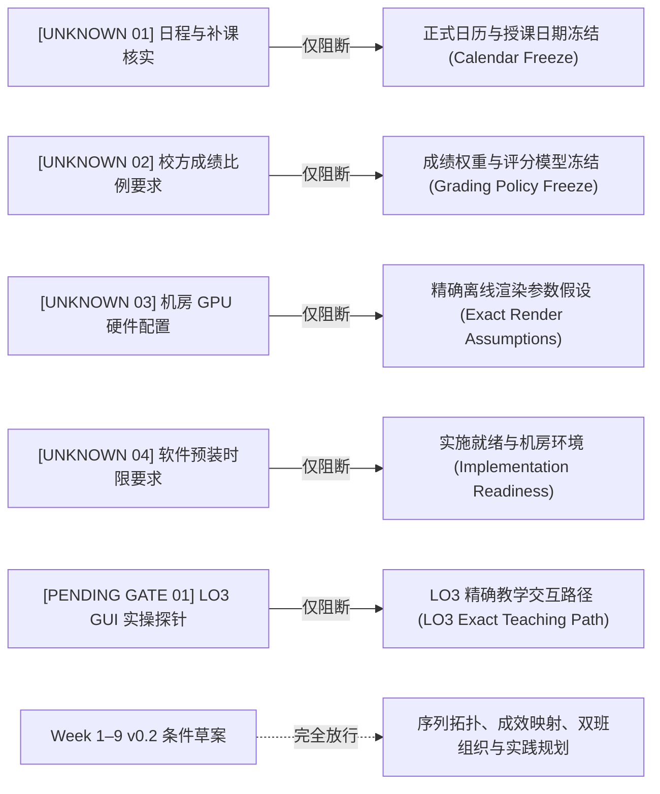
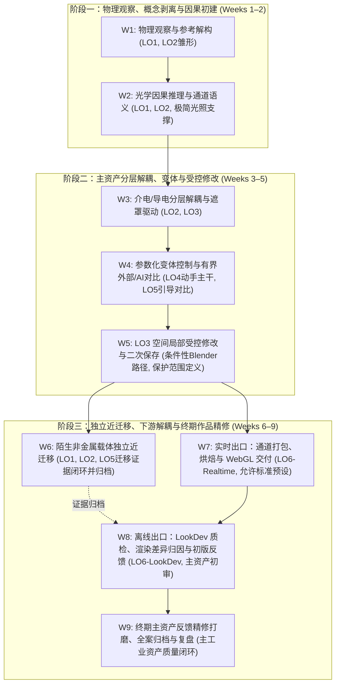

# Week 1–9 条件性排课草案 v0.2 (Week 1–9 Conditional Planning Draft v0.2)

> **文档定位**：基于真实教务课表核实事实（9 周 / 36 学时 / 40 分钟/学时 / 单班单周 160 分钟排定面授 / 单班 24 实际面授小时 / 35 人班与 17 人班 / 单教师配置），对前期 8 周条件草案（v0.1）进行重基准化，建立可辩护的 9 周本科课程实施蓝图。  
> **前沿状态**：`WEEK_1_9_CONDITIONAL_PLANNING_DRAFT_V0_2_BROWSER_ACCEPTED_AFTER_HARDENING`（**CONDITIONAL / NOT FROZEN**）。  
> **制定日期**：2026-09-19。  
> **核心纪律**：  
> 1. 将第 9 周视为对前期 8 周错误假设的纠正与恢复，不视为“新增课时红利”，绝不扩张新知识领域；  
> 2. 严格区分 `VERIFIED / OWNER-REPORTED / PLANNING DECISION / UNKNOWN / PENDING GATE` 五类状态；  
> 3. 不预设最终成绩百分比，不预设 Go/No-Go 评分架构；过程检查定位于形成性质量控制检查点，其最终计分角色维持 `UNKNOWN`；  
> 4. 双班保持完全相同的学习与考核标准，仅自适应调整现场反馈组织机制；  
> 5. 明确近迁移载体仅作为“近迁移能力证据包”完成与归档，绝不演变为第二个期末精修作品；第 9 周精修精力专用于主工业复合资产；  
> 6. 保持 W5 中 Blender 原生实施路径的条件性，其具体路径受 LO3 GUI 实操探针门禁约束。

---

## 目录
1. [事实分层与状态标签契约 (Status Label Contract)](#1-事实分层与状态标签契约-status-label-contract)
2. [未决项阻断边界规范 (Blocker Separation Specification)](#2-未决项阻断边界规范-blocker-separation-specification)
3. [实践双主线规范：小型工业外壳与陌生非金属迁移](#3-实践双主线规范小型工业外壳与陌生非金属迁移)
4. [双班制分层反馈与容量架构 (Two-Section Feedback Architecture)](#4-双班制分层反馈与容量架构-two-section-feedback-architecture)
5. [最终作品质量导向与形成性检查定位 (Final-Work Quality & Formative Checks)](#5-最终作品质量导向与形成性检查定位-final-work-quality--formative-checks)
6. [螺旋式学习成效架构 (Spiral LO Structure in 9 Weeks)](#6-螺旋式学习成效架构-spiral-lo-structure-in-9-weeks)
7. [最低独立达成证据形式规范 (Attainment Evidence Form)](#7-最低独立达成证据形式规范-attainment-evidence-form)
8. [极简双应用出口规范 (Two Application Exits Specification)](#8-极简双应用出口规范-two-application-exits-specification)
9. [保护核心与超载首裁层级 (Protected Core vs. First Cuts)](#9-保护核心与超载首裁层级-protected-core-vs-first-cuts)
10. [Week 1–9 条件性排课总表 (Week 1–9 Planning Table)](#10-week-19-条件性排课总表-week-19-planning-table)
11. [课表冻结前置门禁清单 (Pre-Freezing Checklist)](#11-课表冻结前置门禁清单-pre-freezing-checklist)

---

## 1. 事实分层与状态标签契约 (Status Label Contract)

为防止将推测误认为事实，本草案所有条款严格打上五类确定性标签：

### 1.1 `VERIFIED`（课表权威核实事实）
- **教学周次**：第 10–18 周，共 **9 个排课周**；
- **排定总学时**：**36 学时**，每学时标准时长为 **40 分钟**；
- **每周排定课时**：每周 4 节连排，单班每周排定面授接触时间为 **160 分钟**（合 2.67 实际小时）；
- **单班总面授接触时间**：$36 \times 40\text{ min} = 1440\text{ min} = \mathbf{24.0\text{ 实际小时}}$；
- **双独立教学班**：
  - **GR2102-1 班**：35 人，教室 G111，排在第 7–10 节（14:00–16:50）；
  - **GR2102-3 班**：17 人，教室 SII-306，排在第 13–16 节（19:00–21:50）；
- **考核方式**：考查。

### 1.2 `OWNER-REPORTED`（课程负责人教学输入）
- **师资配置**：主要由 1 位教师独立承担两个班的教学；
- **学生前置基线**：具有前置建模基础，但普遍缺乏系统的 PBR 材质物理与理论理解；
- **灯光认知状态**：前置灯光基础不确定，需在材质课内提供极简辅助，不设独立灯光专章；
- **软件预装**：校方机房软件环境可提前统一申请部署；
- **成果偏好**：Owner 明确偏向**最终作品质量优先**（注：此偏好指导后续教学精力分配，但**不代表现在可以冻结评分权重或过程分值架构**）。

### 1.3 `PLANNING DECISION`（课程设计论据驱动的决策）
- **零知识扩张原则**：9 周周期用于解耦瓶颈与精修作品，绝不增开新软件或高级程序化几何内容；
- **主要制作环境**：暂定以 **Blender 5.2 LTS** 为主制作环境；
- **双载体实践骨架**：小型工业复合外壳（贯穿主资产）＋ 预置 UV 陌生非金属载体（轻量近迁移证据）；
- **极简双出口**：WebGL/glTF 外部实时打开核验 ＋ Cycles 预置离线 LookDev 一致性归因；
- **分层反馈机制**：全班共性讲评 ＋ 校准同行/自查 ＋ 现场流动抽查 ＋ 提交工件异步核验。

### 1.4 `UNKNOWN`（制度性与物理环境未知项）
- `[UNKNOWN 01]` 星期排定、真实授课日程安排与法定节假日/补课事实；
- `[UNKNOWN 02]` 校方对考查课平时与期末成绩构成的硬性比例规范；
- `[UNKNOWN 03]` 机房 PC 硬件参数（GPU 型号、显存容量、驱动版本）；
- `[UNKNOWN 04]` 学校软件预装提请截止日与机房实际部署周期；
- `[UNKNOWN 05]` 新生在 Blender 5.2 原生界面的真实操作排错耗时与教师跨 52 人的真实批阅容量。

### 1.5 `PENDING GATE`（关键前置实操门禁）
- `[PENDING GATE 01]` **LO3 空间局部性实操探针**：在 Blender 5.2 原生 GUI 下验证指定区域局部绘制、贴图保存、进程重启重开与二次修改的数据保全可行性。其结果决定 LO3 是采用 Blender 原生路径，还是有界触发与 Painter 的局部成本对比。

---

## 2. 未决项阻断边界规范 (Blocker Separation Specification)

上述 `UNKNOWN` 与 `PENDING GATE` 项绝不阻塞本 v0.2 条件性草案的拓扑推演，仅分别挂载并阻断其对应的最终冻结决策：

---

## 3. 实践双主线规范：小型工业外壳与陌生非金属迁移

坚决遏制资产过度膨胀，明确主资产与迁移载体的本质定位差异：

### 3.1 主实践资产：小型工业复合外壳 (Industrial Housing Component)
- **定位**：贯穿 Weeks 1–5、7–9 的**核心作品资产**，承载因果分层、受控修改、参数变体、实时烘焙与期末质量精修；
- **资产形态**：由教师预置干净拓扑与规整 UV 的紧凑工业结构件，具备规整倒角、螺栓孔、底漆介电层与面漆涂装；
- **教学边界**：严禁扩充为复杂的大型装配体，学生精力牢牢锁定在材质节点、分层因果与微表面质感上。

### 3.2 独立迁移载体：陌生非金属载体 (Unfamiliar-Carrier Transfer)
- **定位**：Week 6 独立近迁移任务的专用载体，**仅用于提供近迁移能力证据包，绝不演变为第二个期末精修作品**；
- **资产形态**：教师预置干净 UV 的非金属构件（如木质板件、工业硬质塑料构件或涂层陶瓷件）；
- **6 项独立行为（三分类因果判断）**：
  1. 识别物理尺度 (Identify Scale)；
  2. 识别方向性特征 (Identify Directional Behavior)；
  3. 评估粗糙度与因果规律（严格杜绝与目标材料语义不符、且无依据的 metallic 响应）；
  4. 外部/AI 素材批判性取舍；
  5. 执行一次有界局部修正；
  6. **三分类迁移判断分析**：书面区分工业做旧金属的预设中：
     - (a) 哪些可直接迁移（如微表面反射原理、能量守恒）；
     - (b) 哪些经参数调整后可迁移（如漫反射取值、特定粗糙度范围与局部磨损分布）；
     - (c) 哪些完全不适用或存在误导（如 Metallic=1 逻辑、边缘曲率脱漆露出金属底漆）。
- **结课归档**：该载体在 Week 6 完成决策与制作闭环后直接归档；后续周次仅作为已归档证据保存，**在 Week 8–9 不承担额外的质感精修义务**（除非其证据本身在评估中未达标需做针对性纠错）。

---

## 4. 双班制分层反馈与容量架构 (Two-Section Feedback Architecture)

两个教学班必须维持完全相同的学习成效与达标标准，但现场反馈组织自适应调整：

### 4.1 四级分层反馈机制 (Layered Funnel)
1. **第 1 层：全班共性诊断与讲评 (Whole-Class Critique)**  
   - 教师面向全班投屏剖析典型正反案例，集中纠偏高频共性概念误区；
2. **第 2 层：校准同行互查与自查 (Calibrated Peer / Self Check)**  
   - 学生依据教师发布的结构化格式 Checklist 进行自查或互验，前置过滤命名混淆、通道错连与格式漏填等低级错误；
3. **第 3 层：教师现场流动抽检 (Teacher In-Class Spot-Check)**  
   - 教师在实操环节穿插巡视，重点抽查实操卡点与高风险节点，进行现场个别点拨；
4. **第 4 层：提交工件异步核验与终审 (Artifact-Based Async Audit)**  
   - 学生按里程碑提交规范工程快照、对比图表与说明单。教师在课外异步核查，结合结构化 Rubric 审阅。**必须合理控制工件形态，防范单师面对 52 人的批阅超载**。

### 4.2 消除课内排队验收堵塞
在单师面对 52 名学生（大班 35 人，小班 17 人）的情境下，坚决禁止在 160 分钟课内组织全员逐人同步排队验收。
- **LO3 受控修改核验**：通过提交 `修改前.blend`、`修改后.blend` 及局部对比截图，由教师课外异步核查定义保护范围内的保全状态，课内仅作共性点评；
- **近迁移核验**：通过提交《6 项迁移决策说明表》与工程进行结构化异步核查；
- **终期综合交付**：打包为主资产全案工程与已完成的迁移证据包集中终审。

### 4.3 双班实施适配机制
- **GR2102-1 班 (35 人)**：以全班共性讲评为核心支柱，倚重 Checklist 自查互查初筛，教师现场聚焦巡视卡点学生；
- **GR2102-3 班 (17 人)**：在维持相同讲评标准下，教师现场巡视抽检频次更高，可针对个别学生操作障碍给予更多即时指导；
- **标准铁律**：两班采用完全相同的任务书、Checklist、提交规范与考核 Rubric。

---

## 5. 最终作品质量导向与形成性检查定位 (Final-Work Quality & Formative Checks)

### 5.1 质量目标界定
- **物理因果自洽**：微观粗糙度与高光匹配光学原理，不存在与目标材料语义不符、且无依据的 metallic 响应，分层磨损符合逻辑；
- **视觉呈现连贯**：主资产在离线 LookDev 环境与实时 WebGL 视口中均表现出层次分明、细节可信的质感；
- **工程资产规整**：贴图语义命名严谨，色彩空间配置准确，交付包结构清晰可追溯。

### 5.2 过程性活动的形成性定位 (Formative Quality-Control Checkpoints)
- **概念诊断与 Checklist 检查**：定位于**形成性质量控制检查点 (Formative Checkpoints)**，作为学生进入下一制作阶段的必要前置证据，保障学生及时修正基础错误；
- **计分角色未冻结**：过程检查在总评成绩中的具体分值、权重及计分形式（是门禁资格还是具体分数）保持为 `UNKNOWN / pending institutional grading policy`，在学校官方考查政策明确前不擅自冻结；
- **精修与打磨 (Refinement & Polish)**：作为终期质量的放大器。第 8 周完成主资产初版交付后，第 9 周获得专属窗口，使学生有充裕时间消化反馈并对**主工业资产**进行最终质感提升。

---

## 6. 螺旋式学习成效架构 (Spiral LO Structure in 9 Weeks)

在恢复的 9 周依赖图中，六大成效家族呈清晰的三阶段螺旋式演进：

---

## 7. 最低独立达成证据形式规范 (Attainment Evidence Form)

为保障学术严格性，在 24 小时紧凑面授框架下确立精炼、可核验的最低独立表现形式：

- **LO1 (观察意图)**：提交 1 份结构化参考解构清单，清晰区分客观观察事实、物理因果推测与未决盲区；
- **LO2 (因果预测)**：面对未示范的材质渲染错误，按“预测 $\to$ 改动单变量测试 $\to$ 诊断 $\to$ 修复”完成排错闭环；
- **LO3 (受控修改)**：下达指定区域修改任务单后，提交修改前后对比工件，证明**在定义的保护范围内无非预期修改 (No unintended modification in defined protected scope)**，且经独立进程重开后成功实施二次修改；
- **LO4 (参数变体)**：解释一段最小节点链（输入参数 $\to$ 混合数学 $\to$ 输出）的因果关系，改动核心参数并预测材质变体；
- **LO5 (素材/AI质检)**：逐通道审查给定的素材，识别色彩空间与光影缺陷，做出批判性取舍决策并说明物理理由；
- **LO6 (双出口交付)**：完成 glTF 导出并在外部 WebGL 独立核验通道与光照响应；在预置 Cycles 环境下比对外观并完成技术归因。

---

## 8. 极简双应用出口规范 (Two Application Exits Specification)

### 8.1 实时游戏出口 (Game Realtime Exit)
- **运行载体**：轻量级 WebGL PBR 运行时（如 Chrome 浏览器 / Three.js glTF 查看器）；
- **核心重点**：理解通道语义（ORM 通道打包、OpenGL 法线格式）与外部独立打开/核验/排错；
- **支架策略**：允许在非核心认知环节使用验证过的标准化烘焙与打包预设模板，避免学生陷入繁琐重复的管线配置苦工。

### 8.2 动画/视觉开发出口 (Animation / LookDev Exit)
- **运行载体**：Blender 内部预置的 **Cycles 离线演播室 LookDev 场景模板**（教师预置经典三点光与旋转 HDR）；
- **核心重点**：置于该环境中切换视角与光照，比对质感表现，书面记录并客观归因离线与实时环境的技术差异；
- **边界**：复用主资产源工程，不要求掌握复杂影视灯光阵列或后期合成。

---

## 9. 保护核心与超载首裁层级 (Protected Core vs. First Cuts)

### 9.1 坚决保护的核心 (Protected Core — 严禁裁剪)
1. **反馈 $\to$ 修订 $\to$ 复核的完整闭环**；
2. **LO2 未示范问题的独立因果诊断**；
3. **LO3 空间局部受控修改与保护范围数据保全**；
4. **陌生非金属载体的独立近迁移证据包**；
5. **LO5 对外部/AI 素材的最低批判性决策**；
6. **LO6 在外部 WebGL 环境下的最低交付与核验动作**。

### 9.2 优先裁剪项 (First Cuts — 出现超载时依次裁剪)
1. **首裁项 1**：主资产部件数量与边缘几何复杂度；
2. **首裁项 2**：纯装饰性细节层（如多重细微划痕、飞溅泥浆噪波等次级层）；
3. **首裁项 3**：复杂的自建程序化节点公式（直接调用教师预置基础节点）；
4. **首裁项 4**：繁琐的手动通道打包配置（提供标准化烘焙与打包预设模板）；
5. **首裁项 5**：扩展性案例演示与非核心示范内容。

---

## 10. Week 1–9 条件性排课总表 (Week 1–9 Planning Table)

*注：本表严格遵循“单班单周排定面授 160 分钟”的物理边界，不标注未经验证的分钟数伪精确配额。*

| 周次 (Week) | 预期可观察表现 (Observable Performance) | 核心实践活动 (Activity) | 分层反馈与修订机制 (Feedback Mechanics) | 达成证据映射 (Attainment Evidence) | 权威来源与差量标记 (Source & Delta) | 容量状态与风险 (Capacity Status) | 保护核心 / 超载首裁项 (Protected / First Cut) |
| :---: | :--- | :--- | :--- | :--- | :--- | :---: | :--- |
| **W1** | 能够从参考图中辨识物理材质属性与覆盖层，清晰剥离固有色与光影脏污。 | **概念解构**：视口导航与材质槽快速赋予。 **主线起步**：导入工业外壳资产，审视参考图并建立结构化解构清单。 | **【全班共性诊断 1】** • 投屏剖析典型参考观察偏差 • 学生依据 Checklist 自查 | **LO1 证据**：完成 1 份结构化参考解构清单，区分观察事实与因果猜测。 **LO2 雏形**：识别出固有色不应带有假高光。 | • Adobe PBR Guide Pt 1 (光学理论) • Dinur 2026 Ch 1–2 (观察解构) • CORE42 `materials-shading-c02-l03/04` | `ESTIMATE` `LOW` | **保护核心**：观察解构与光影剥离意识。 **首裁项**：扩展参考图收集数量（教师直供标准参考）。 |
| **W2** | 能在预置稳定光照下预测单变量参数调节的外观演变；掌握介电与导电材质基础着色规范。 | **主线推进**：在预置 HDRI 测试场景下，为工业外壳分别赋予干净介电涂层与金属基底基础属性。 | **【现场抽检 1】** • 教师巡视抽检参数设置卡点 • 学生完成单变量对比自查 | **LO2 最低证据**：给定 1 个未示范错误，完成“预测-修改-排错”闭环。 | • Adobe PBR Guide Pt 2 (金属/非金属) • Blender 5.2 Manual (Principled BSDF) • CORE42 `materials-shading-c02-l13` *(核验 Principled V2)* | `ESTIMATE` `MEDIUM` | **保护核心**：介电/金属因果逻辑与单变量预测。 **首裁项**：清漆层、各向异性等次要参数演示。 |
| **W3** | 能够搭建底漆-面漆解耦材质结构，使用黑白遮罩实现多通道属性同步切换。 | **主线推进**：搭建工业外壳分层材质系统（基底金属 ＋ 涂装漆面），利用遮罩实现分层露底效果。 | **【同行互查 1】** • 依据 Checklist 互查通道独立性与命名规范 • 教师针对性答疑 | **LO3 阶段证据**：介电与导电属性在独立遮罩驱动下单向混合，无参数相互缠绕。 | • Shah 2022 Ch 5 (分层解构思想) • CORE42 `materials-shading-c02-l07` • CORE42 `texturing-c02-l03/04` | `ESTIMATE` `MEDIUM` | **保护核心**：分层解耦架构与遮罩驱动概念。 **首裁项**：复杂曲率节点与手绘遮罩精细度。 |
| **W4** | 能解释一段参数化节点因果并生成变体；完成有界外部/AI 贴图对比评析。 | **动手主干**：引入基础程序噪波调制遮罩边缘完成变体。 **有界对比**：对教师给定的外部/AI 贴图样本进行通道语义与质量对比分析。 | **【全班共性讲评 2】** • 投屏剖析色彩空间（sRGB vs Non-Color）常见错误 • 抽查通道对比分析表 | **LO4 最低证据**：改动核心程序参数并预测变体。 **LO5 阶段证据**：阐述样本贴图的语义与质量接受/拒绝理由。 | • Adobe PBR Guide Pt 2 (色彩空间规范) • Blender 5.2 Manual (Noise/ColorRamp) • CORE42 `texturing-c04-l17` • CORE42 `texturing-c05-l20` | `ESTIMATE` `HIGH` (色彩空间理解耗时) | **保护核心**：变体控制与色彩空间语义规则。 **首裁项**：自建高级节点组，改用内置基础节点。 |
| **W5** | 能响应修改任务单，精准执行指定区域修改，严格保全定义保护范围，重开后实施二次修改。 | **主线受控修订**：下发修改单；按条件性路径执行局部编辑、保存、重启软件并重开工程，追加二次修改。 | **【关键异步核查 1】** • 学生提交修改前后双版本工程与对比截图 • 教师异步核验保护范围内无非预期修改 | **LO3 终极最低证据**：指定区域修改成功，保护范围数据无非预期修改；重开后成功实施二次修改。 | • *Pending Gate 01: LO3 GUI 实操探针* • Blender 5.2 Manual (Texture Paint / Image Save) • Shah 2022 Ch 6 (工业迭代流程) | `UNKNOWN` `HIGH` (受交互探针制约) | **保护核心**：指定区域修改、保护范围保全与二次修改闭环（**绝不可裁剪**）。 **首裁项**：降低手绘精度要求。 |
| **W6** | 能摆脱工业磨损定势，在陌生非金属载体上完成三分类迁移判断并纠错；归档迁移证据。 | **近迁移实操**：分发预置 UV 陌生非金属载体；学生无教程独立分析制作，执行 6 项行为；**完成近迁移证据包归档**。 | **【关键异步核查 2】** • 教师结合《6 项迁移决策表》进行结构化异步批阅 • 现场抽查指导 | **NEAR-TRANSFER EVIDENCE (LO1/2/5 综合迁移)**：独立完成 6 项行为与三分类迁移判断；归档迁移证据包。 | • Dinur 2026 Ch 4 (自然表面与有机质感) • Adobe PBR Guide (非金属反射率范围) • OpenPBR 1.1 Specification | `ESTIMATE` `MEDIUM` | **保护核心**：6 项独立分析与纠错行为（**绝不可裁剪**）。 **首裁项**：陌生资产最终视觉完成度（仅考核决策过程与局部修正）。 |
| **W7** | 能够将材质规范烘焙打包为标准通道贴图，在轻量外部实时环境中打开并完成技术排错。 | **下游实时交付**：使用标准预设将主资产材质烘焙打包（ORM 通道打包、OpenGL 法线），导出为 glTF (`.glb`)；在外部 WebGL 打开核验。 | **【交付 Checklist 互查】** • 对照 WebGL 5 项指标自查互查 • 教师现场巡视排查导出与驱动故障 | **LO6 实时出口证据**：独立完成外部跨进程交付，核验通道映射与光照响应，定位渲染差异原因。 | • Khronos glTF 2.0 Specification • CORE42 `texturing-c07-b02/l33` *(核验 5.2 烘焙差异)* | `ESTIMATE` `HIGH` (初学者烘焙易报错) | **保护核心**：通道打包语义与外部 WebGL 打开核验闭环。 **首裁项**：复杂手动参数调试，统一使用标准烘焙预设。 |
| **W8** | 能置于预置高质量离线环境中评测主资产质感，客观归因渲染差异；获取初版综合反馈。 | **LookDev 评测与初版评审**：主资产置于 Cycles 场景评测多视角光照表现；归因两端差异；提交**主资产初版包与已归档迁移证据包**。 | **【初版阶段性讲评】** • 教师投屏共性错题讲评 • 结构化 Checklist 自查互查 • 教师针对关键指标进行重点抽查点拨 | **LO6 LookDev 出口证据**：在高质量光照下评测质感，客观归因两端渲染差异，保留可编辑源。 | • Dinur 2026 Ch 8 (LookDev 质检哲学) • Blender 5.2 Manual (Cycles Lighting / Color Management) | `ESTIMATE` `MEDIUM` (取决于机房 GPU 算力) | **保护核心**：两端渲染差异的物理归因与阶段反馈闭环。 **首裁项**：复杂布光调试（统一使用教师场景模板）。 |
| **W9** | 依据前期反馈完成**主工业资产**最终质感深化打磨与工程规范整理，达成高完成度归档。 | **主资产终期精修与归档**：针对反馈打磨主资产微表面质感；规范整理交付包；全班结课总复盘。（**迁移载体不再作为精修对象**）。 | **【全案终审与复盘】** • 教师对最终提交包进行终审打分 • 全班优秀作品展评与总结 | **LO1–LO6 整合质量闭环**：主工业资产达到物理自洽、呈现连贯与工程规整目标；完整归档两份资产证据。 | • 课程自定义交付规范 (Course-defined delivery convention) | `UNKNOWN` `HIGH` (教师审阅与提交流程拥塞风险) | **保护核心**：主工业资产终期精修打磨与全案规范归档（**终期质量核心**）。 **首裁项**：扩展汇报展示形式。 |

---

## 11. 课表冻结前置门禁清单 (Pre-Freezing Checklist)

本 Week 1–9 条件草案（v0.2）为后续教学实施提供了架构骨架。在正式签署并冻结为不可更改的执行课表前，必须完成以下 5 项门禁核验：

1. `[GATE 1: CALENDAR]` 核实 1 班与 3 班具体开课星期，确认实际授课日程安排、调休/停课与补课情况，核定最终真实的接触面授总学时；
2. `[GATE 2: GRADING]` 获取学校教务处对“考查课”平时与期末成绩构成的权威文件，据此正式确立形成性检查与终期作品的分值权重模型；
3. `[GATE 3: HARDWARE]` 现场核查 G111 与 SII-306 两个机房的 PC 显卡型号与显存配置，确认 Cycles 视口预览与贴图烘焙的算力可用性；
4. `[GATE 4: SOFTWARE]` 确认校方信息化中心/机房管理部门已将 Blender 5.2 LTS 正式版与标准 WebGL 浏览器部署到位；
5. `[GATE 5: LO3 PROBE]` **完成 LO3 空间局部性实操探针测试**：验证在真实 Blender 5.2 GUI 下初学者局部绘制保存并重启后数据保全的顺畅度，据此正式冻结 LO3 的具体教学交互路径。

---

> **终端状态声明**：  
> `WEEK_1_9_CONDITIONAL_PLANNING_DRAFT_V0_2_BROWSER_ACCEPTED_AFTER_HARDENING`
