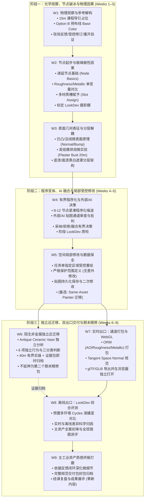
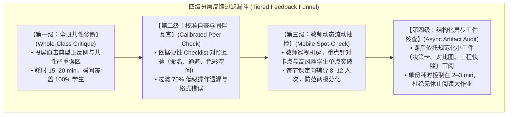
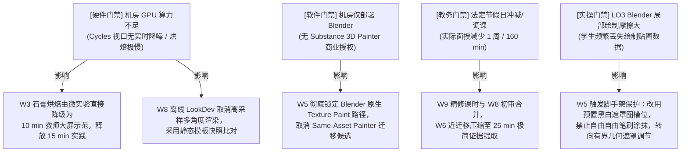

# Week 1–9 条件性排课草案 v0.3 (Week 1–9 Conditional Planning Draft v0.3)

> **文档性质**：基于 Week 1 可执行教学实施包验收实证（Issue #11/#14/#17）与历史教学资产清查证据（Legacy Preflight），对前期 v0.2 条件草案进行系统性重基准化（Rebaseline），确立具备教学容量可行性、严格因果逻辑与防灾容错机制的 9 周本科课程蓝图。  
> **前沿状态**：`WEEK_1_9_CONDITIONAL_PLANNING_DRAFT_V0_3_DRAFT`（**CONDITIONAL / NOT FROZEN**）。  
> **制定日期**：2026-10-01。  
> **核心纪律**：  
> 1. **继承验收基线**：无缝继承已获 Teacher Accepted 的 Week 1 教学实施包（160 分钟、含 15 分钟课程导引占位、Option B 预连线着色器、反馈修订闭环、保存重开持久化、Recovery A/B/C、节点基础递延而非删除）；  
> 2. **粗粒度 160 分钟预算守恒**：每周设立必须严格相加等于 160 分钟的粗粒度规划预算（Concept/Demo, Guided/Independent Practice, Feedback/Revision, Save/Delivery/Recovery, Explicit Buffer），杜绝伪精确分钟与未经验证的膨胀；  
> 3. **单师 52 人（35 人大班 / 17 人小班）真实容量约束**：建立课内不排队、四级漏斗过滤的反馈机制，课外异步核查采用标准化 Checklist，严禁无限外包教师批阅精力；  
> 4. **制度未决项严格阻断**：因校方考查课平时/期末成绩比例尚无下达文件，保持为独立依赖项，严禁擅自编造或冻结评分百分比；  
> 5. **资产与工件防灾**：汲取历史教学中“UV 乱导致贴图崩塌（流沙建筑）”与“学生被复杂节点参数吓退（两极分化）”的实证教训，全程由教师预置规范 UV 与干净拓扑，节点复杂度设死 8–12 节点上限。

---

## 目录

1. [状态说明与实证依据 (Status & Evidence Basis)](#1-状态说明与实证依据)
2. [相对 v0.2 的核心变更与决策理据 (Delta from v0.2 & Rationale)](#2-相对-v02-的核心变更与决策理据)
3. [历史教学资料筛选与能力缺口审计 (Legacy Preflight Audit)](#3-历史教学资料筛选与能力缺口审计)
4. [修订后 Week 1–9 教学序列拓扑 (Revised Week 1–9 Topology)](#4-修订后-week-19-教学序列拓扑)
5. [Week 1–9 粗粒度 160 分钟规划总表 (Coarse Planning Table)](#5-week-19-粗粒度-160-分钟规划总表)
6. [分层反馈、证据形态与师资容量分析 (Feedback, Evidence & Teacher Capacity)](#6-分层反馈证据形态与师资容量分析)
7. [保护核心与超载首裁梯队 (Protected Core vs. First Cuts)](#7-保护核心与超载首裁梯队)
8. [跨周联动门禁影响图 (Cross-Week Gate Impact Map)](#8-跨周联动门禁影响图)
9. [课外最低工作量假设 (Minimum Outside-Class Workload Assumptions)](#9-课外最低工作量假设)
10. [面向 Week 1 课程导引回填的架构支持 (Orientation Backfill Support)](#10-面向-week-1-课程导引回填的架构支持)
11. [待决假设与后续唯一推荐工单 (Unresolved Hypotheses & Next Recommended WU)](#11-待决假设与后续唯一推荐工单)

---

## 1. 状态说明与实证依据

本草案是一份**处于条件性演化状态的设计蓝图 (CONDITIONAL / NOT FROZEN)**。其合法性与约束边界直接建立在以下五项已被实证验证的坚实基座之上：

1. **真实教务排课事实 (Verified Schedule Reality)**：
   - 2026–2027 学年第 1 学期，第 10–18 周，共 9 周；
   - 36 学时（40 分钟/学时），每周 4 节连排，单班单周面授 **160 分钟**，单班总面授 **24.0 实际小时**；
   - 双班分流：GR2102-1 班（35 人，G111 机房）与 GR2102-3 班（17 人，SII-306 机房），单教师独立主讲；
   - 考核类型：考查。
2. **Week 1 可执行教学实施包验收决议 (Teacher Review Gate #14 Exit)**：
   - PR #17 已合并入 `main @ e02908ed8dfc74667825a5aaec64b117c136f277`，Issue #14 已关闭；
   - Week 1 的 160 分钟节奏、Option B 预布线着色器、单变量 Base Color 决策与现场反馈修订闭环、保存-退出-重开持久化验证、Recovery A/B/C 机制及 15 分钟 Course Orientation 占位段已获教师完全确认，成为全课基石。
3. **真实数字资产核查与试制就绪 (Teaching Asset Provenance & Feasibility)**：
   - 主工业资产：Poly Haven CC0 `Vintage Flashlight` 经 runtime 探针验证，拓扑与 UV 规范；
   - 迁移载体：Poly Haven CC0 `Antique Ceramic Vase 01` 具备优质釉面与露胎电介质分层，候选就绪；
   - 教师自有高低模烘焙套件：Bundle 1 古典石膏胸像（高模 80k + 低模 1.3k + 规范 UV + `bake_normal.md`）物理完备且法律权属清晰；
   - 标定 LookDev 环境：Poly Haven CC0 `studio_small_09_1k.exr` 演播室 HDR 完备就绪。
4. **历史教学档案与考核分析实证 (Legacy Preflight & Exam Quality Analysis)**：
   - 历史大纲（2025-2026-1《三维动画基础-数字建模》）与 4 班、5 班期末质量分析表揭示了深层痛点：学生模型外观尚可但“底层规范缺失/UV 乱导致贴图崩塌”以及“面对复杂节点与海量参数产生严重技术断层（填色游戏 vs PBR 两极分化）”。
5. **权威决策边界纪律 (Decision Authority Boundary)**：
   - Course Owner 拥有大纲拓扑、期末考核模式与最终学时冻结的裁决权；Agent 负责严密因果推演与结构化设计，不得擅自编造未决的评分百分比。

---

## 2. 相对 v0.2 的核心变更与决策理据

从 v0.2 到 v0.3 的演化并非格式重排，而是由 W1 落地实证与历史资产清查所驱动的实质性重基准化：

| 维度 | v0.2 状态 | v0.3 演化决定 | 驱动理据与事实支持 |
| :--- | :--- | :--- | :--- |
| **W1 状态** | 假设性概念解构与材质赋予 (LOW) | **冻结为可执行基线 (Teacher Accepted Baseline)** | PR #17 已合并，15 min 导引占位、Option B 预布线、单变量闭环与容灾机制已在实机验证。 |
| **节点基础定位** | 隐含在 W1–W2 杂糅推进 | **显式作为 W2 起步核心 (DEFER, NOT OMIT)** | W1 剥离了节点连线以防初学者认知超载；W2 必须显式补齐“节点输入/输出、数据类型（黄色色彩 vs 灰色数值 vs 紫色向量）与 Principled BSDF 骨架”。 |
| **Normal Bake 定位** | 假设 W2 进行 45 min 全员烘焙 | **重定位为 W3 有界支持型微实验 (15–20 min) / 教师演示** | 历史石膏高低模套件权属完备，但 4 班教训表明让初学者从头折腾烘焙易引发灾难；改由教师预置 starter，学生仅执行烘焙检验映射原理，防范 GPU 阻塞。 |
| **Material Slot 归属** | W1 提及快速赋予 | **定位在 W2 后半段有界引入** | W1 锁死在单个部件（`vintage_flashlight_body`）；W2 引入多部件多材质槽（Slot Assign），使学生理解材质与几何网格的绑定边界，但不扩张为建模。 |
| **参数因果演化** | W2 宽泛提及光学因果 | **W2 聚焦 Roughness 与 Metallic 的极性因果对比** | 彻底贯彻单变量对照：Metallic 0 vs 1 的黑白绝缘/导电断界；Roughness 0.05 到 0.85 的光泽演变；严禁触碰各向异性等杂项。 |
| **LookDev 介入时点** | W8 首次集中评审 | **提前为 W2 起步、W4 阶段检验、W8 集中评审的多轮贯穿习惯** | 避免质感评估在期末才“猝死”暴露；W2 即使用中性摄影棚建立科学光影直觉，W4 检验分层，W8 做多环境差异归因。 |
| **AI/外部素材动作** | 仅被动对比与缺陷找茬 | **引入明确的“采纳/拒绝/局部融合”决策动作** | 避免纯批判视角；要求学生对外部/AI 贴图进行通道审查后，至少执行一次“提取其微细节法线/脏污并融合入自主分层”的因果决策。 |
| **W6 近迁移规模** | 占满全周的大型制作 | **压缩为 40 min 有界独立表现任务 + 即时归档** | 迁移是检验独立判断而非造第二个复杂资产；完成 6 项独立行为与三分类因果表后直接结课归档，绝不在 W8–W9 增加精修负担。 |
| **Substance Painter** | 仅作为 Gate 01 条件触发项 | **作为有界 Transfer Lab 假说评估 (非强制冻结)** | 评估 Same-Asset Painter 迁移实验；保留在 W5/W6 候选视窗中，视机房软件环境与教师决策再定。 |
| **规划预算形式** | 粗糙的 LOW/MED/HIGH 标签 | **严格守恒的 160 分钟规划预算表 (Coarse Budget)** | Concept/Demo, Practice, Feedback, Delivery, Buffer 明确切分，确保教学容量真实可守。 |

---

## 3. 历史教学资料筛选与能力缺口审计

### 3.1 关键旧资料对当前课程的制度与认知约束
1. **《三维动画基础-数字建模》教学大纲 (2025-2026-1)**：
   - 证明设计学院传统课时为 60 学时（考查课，平时 30% + 期末 70%）；本课程压缩为 36 学时（9 周/单周 160 分钟/24 面授小时），**课时密度与单位时间认知负荷提升了 60%**。必须坚决实行“零无关知识扩张”，剔除传统大纲中大量的手工建模、拓扑、展 UV、打光设色，使精力 100% 聚焦于 PBR 材质原理与贴图创作。
2. **2023 级专升本 4 班考试质量分析表（林昕）**：
   - **痛点曝光**：“隐蔽的技术断层——外观漂亮但打开源文件 UV 全是乱的，导致贴图得分暴跌至 75%，纹理绘制成了流沙上的建筑。”
   - **刚性约束**：本课程严禁要求学生自行从头拆分或重排 UV！必须由教师提供 UV 严格合规、接缝合乎工业标准的优质资产（如 Flashlight、Vase）。同时在教学中设立底层规范检查点（贴图拉伸、接缝溢出与色彩空间），防范“流沙陷阱”。
3. **2023 级专升本 5 班考试质量分析表（林昕）**：
   - **痛点曝光**：“创意有余落地不足——贴图阶段极度分化（标准差 4.41），大量学生被复杂节点和海量参数吓退，沦为填色游戏。”
   - **刚性约束**：节点系统绝不能复杂化！Principled BSDF 的参数必须按需逐一解锁，程序化节点链严格限制在 8–12 个基础数学/噪波算子以内。提供清晰的脚手架（Scaffolding）让基础薄弱学生能够“聪明地借助规范预设达成及格”，保护其学习信心。
4. **2022 级专升本 1 班考试质量分析表（林昕）**：
   - **痛点曝光**：“重皮毛、轻逻辑——提案赏心悦目但实际工程逻辑断裂，存在严重视觉欺骗性。”
   - **刚性约束**：期末考核杜绝“只交一张离线渲染漂亮大图”，必须考核全链路资产源文件、实时 WebGL 跨平台打开验证、LookDev 科学归因表与数据持久化重开记录。

### 3.2 历史案例与素材分类处理矩阵

| 素材 / 案例 | 原始来源与状态 | 处理决定 | 具体处置与教学定位 |
| :--- | :--- | :---: | :--- |
| **石膏胸像法线烘焙套件** | Bundle 1 (教师自有扫描抽化 80k OBJ + 教师手绘拓扑 1.3k OBJ + 烘焙 normal.jpg) | **`ADAPT`** | 组装为 W3 有界支持型微实验 Starter。学生不自行建模拓扑，仅在已对齐工程中体验 Selected-to-Active 烘焙与法线插槽验证。 |
| **法线通道正反例对照组** | Bundle 2 (`nor_Raw` vs `nor_sRGB` 对照贴图 + `bake_normal.md` 排错指引) | **`REUSE`** | 直用于 W2 通道语义与色彩空间教学。双视窗对比消除“贴图黑边/光照撕裂”盲区。 |
| **中性摄影棚 HDRI** | Bundle 3 (`studio_small_09_1k.exr`, Poly Haven CC0) | **`REUSE`** | 贯穿全课的标准 LookDev 标定环境，杜绝极端环境光干扰材质物理判断。 |
| **实时 glTF 地砖资产** | Bundle 4 (`bathroom_floor_ gltf`, CC-BY 4.0) | **`ADAPT`** | 打包为单文件 `.glb` 作为 W7 实时通道合流（ORM 贴图打包）的排错与参照样本。 |
| **1960s 办公室道具套件** | Bundle 5 (打字机等 30 余道具，无 PBR 通道贴图) | **`DROP`** | 材质依赖手绘低面图集，无 PBR 分离通道，重做代价极大，全面放弃核心教学使用。 |
| **CG Cookie 望远镜文件** | Bundle 6 (实存文件残缺，仅视频且协议禁止分发) | **`DROP`** | 本地工程缺失且有法律版权风险，彻底排除。 |
| **文博古典 STL 原始扫描** | Bundle 7 (Pseudo-Seneca 等无 UV/无拓扑超高面) | **`REFERENCE_ONLY`** | 仅用于教师备课或形态观察，不作为学生操作资产。 |
| **Vintage Flashlight** | Poly Haven CC0 工业手电筒 (~11k 面，完备 PBR) | **`ADOPT_WITH_PREP`** | **主工业练习资产**（贯穿 W1–W5, W7–W9），W1 已成功跑通。 |
| **Antique Ceramic Vase 01**| Poly Haven CC0 开片青花瓷瓶 (~9k 面，带分层遮罩)| **`ADOPT_WITH_PREP`** | **W6 陌生非金属近迁移专用载体**，自带釉面与露胎多重分层。 |

### 3.3 从 Painter-centric 转向 Blender-first 的能力缺口与弥补方案
从历史依赖 Substance 3D Painter 转向以 Blender 5.2 LTS 为主制作环境后，学生能力链条出现三处实质性缺口：
1. **直观图层栈思维缺失 (Loss of Intuitive Layer Stacking)**：
   - *缺口*：Painter 天然基于类似 Photoshop 的图层/遮罩结构（底材 $\to$ 脏污 $\to$ 掉漆），极易理解；Blender Shader Editor 必须用 Mix Color / Mix Float 节点进行数学混合，初学者易迷失在连线网络中。
   - *弥补*：在 W3 专门引入“分层解耦架构”，用颜色框架（Frame）将节点划分为清晰的“底材层”、“涂层”与“遮罩调制层”，在节点视窗中重塑图层栈逻辑。
2. **空间局部绘制的数据脆弱性 (Fragility of In-Viewport Texture Painting)**：
   - *缺口*：Painter 拥有非破坏性工程文件，画笔绘制实时保全；Blender 的 Texture Paint 若忘记在 Image Editor 执行“Save Image”，退出即丢失，极易引发严重教学挫败感。
   - *弥补*：在 W1 建立的“保存-退出-重开”机制基础上，W5 设立严格的“Image Unsaved 警示红线”与双版本工程快照提交制度。
3. **自动化通道打包与预设输出便利性丧失 (Loss of Automated Channel Packing)**：
   - *缺口*：Painter 可一键导出针对 Unreal/Unity/glTF 的 ORM 复合贴图；Blender 原生必须手动分离 RGBA 通道或利用复杂烘焙。
   - *弥补*：W7 引入教师预置的“通道打包与烘焙脚手架节点组”，学生只需理解 R=AO、G=Roughness、B=Metallic 的通道映射逻辑，无需手写繁琐的图形管线脚本。

### 3.4 专项评估：Same-Asset Painter Transfer Lab 候选方案
- **方案构想**：学生使用在 Blender 中已完全理解并完成分层的主工业资产（Vintage Flashlight），在 W5 或 W6 安排一次 30–40 分钟的有界 Painter 实操——体验 Layer / Fill / Mask、局部笔刷绘制、一键 ORM 贴图导出，并将导出的贴图带回 Blender 视口验证一致性。
- **可行性与代价评估**：
  - *教学收益*：无需理解新模型，100% 精力聚焦于“节点网络 vs 图层栈”的工具范式互通，直观体验工业标准贴图软件的核心优势，打通两种工作流壁垒；
  - *现实代价*：强依赖学校机房安装 Substance 3D Painter 商业授权；双软件环境增加学生认知与排错摩擦；
  - *裁决建议*：**作为 W5 的高阶备选方案 (Option B) 纳入架构储备，但在当前硬件与机房授权未获教务确认前，不作为必修强制路径冻结**。

---

## 4. 修订后 Week 1–9 教学序列拓扑

课程划分为清晰的三大递进阶段，形成严密的螺旋式认知架构：

---

## 5. Week 1–9 粗粒度 160 分钟规划总表

> **时间守恒铁律**：每单周排定面授接触时间为 160 分钟，表中 5 个核心模块预算总和严格等于 160 分钟：  
> $\text{Concept/Demo} + \text{Practice} + \text{Feedback/Revision} + \text{Delivery/Recovery} + \text{Buffer} = \mathbf{160\text{ min}}$。

| 周次 | 核心教学目标与关键概念 | 粗粒度 160 分钟规划预算 (PLAN BUDGET) | 学生输出证据与检核形式 | 35 人 / 17 人反馈机制与师资负载 | 保护核心 / 超载首裁项 |
| :---: | :--- | :--- | :--- | :--- | :--- |
| **W1** | **物理观察、固有色解构与环境适应** • 15m 课程全局导引 • 观察事实与猜测分离 • Option B 预布线调色 | • 导引+概念示范: **35 min** (15+20) • 引导实践: **35 min** • 现场反馈+受控修订: **35 min** • 保存退出重开+容灾: **25 min** • 弹性机动缓冲: **30 min** | • 观察解构卡（事实 vs 猜测） • 修订前后视口截图 • 退出重开验证快照 | • 35 人：投屏共性错题 + 重点巡查 8–10 人 • 17 人：全员快速扫视 + 深度纠偏 • 师资负荷：中（现场消化，无课外堆积） | **保护核心**：15m 导引、修订闭环、保存重开持久化。 **首裁项**：扩展参考图对比。 |
| **W2** | **节点起步、极性对比与多材质槽** • 递延节点基础 (Yellow/Gray/Purple) • Roughness (0.05-0.85) 光泽变化 • Metallic 0 vs 1 极性断界 • 几何多材质槽分配 (Slot Assign) | • 节点基础+因果示范: **30 min** • 极性对比实操: **45 min** • 材质槽指定练习: **30 min** • 自查排错+讲评: **35 min** • 交付归档+缓冲: **20 min** | • 极端参数对比矩阵图表 • 多槽分配正确的主手电筒 `.blend` • 单变量预测说明卡 | • 35 人：依据 Checklist 同行互查 + 教师抽查 • 17 人：教师逐个确认材质槽分配 • 师资负荷：中低（规则明确，互查效率高） | **保护核心**：节点三大数据类型、Roughness/Metallic 因果、材质槽分配。 **首裁项**：复杂微表面原理讲解。 |
| **W3** | **表面几何表征与分层解耦架构** • 法线贴图向量机制与色彩空间 • 教师高低模烘焙微实验 (20 min) • 底材/涂层/遮罩分层解耦 | • 法线原理+烘焙示范: **30 min** • 石膏胸像烘焙微实验: **25 min** • 主资产分层遮罩实操: **45 min** • 现场反馈+接缝修正: **35 min** • 保存重开+缓冲: **25 min** | • 烘焙产生的法线贴图及插槽对比图 • 分层清晰的着色器框架快照 • 贴图色彩空间 Non-Color 检核表 | • 35 人：投屏讲评烘焙黑边/Non-Color 常见错 • 17 人：协助排查烘焙射线穿插 • 师资负荷：高（烘焙易报错，需强脚手架） | **保护核心**：法线 Non-Color 规范、分层解耦概念。 **首裁项**：烘焙边缘抗锯齿与复杂笼子调整（改用预设）。 |
| **W4** | **紧凑程序化噪波与外部/AI 决策** • 8–12 节点紧凑程序化磨损 • 外部/AI 贴图通道缺陷审查 • 有界“采纳/拒绝/局部融合”决策 | • 节点噪波+AI 审查示范: **30 min** • 程序噪波调制实操: **40 min** • 外部贴图融合决策: **35 min** • 阶段 LookDev 互评: **35 min** • 交付整理+缓冲: **20 min** | • 8–12 节点程序化着色网络截图 • 外部素材审查决策表 (接受/替换理由) • 阶段 LookDev 渲染对比图 | • 35 人：小组内两两交叉互评决策理由 • 17 人：全班圆桌快速展示与点评 • 师资负荷：中（工件结构化，审阅极快） | **保护核心**：节点链因果解释、外部素材批判性取舍。 **首裁项**：复杂 Voronoi 噪波堆叠，改用单噪波。 |
| **W5** | **空间局部受控修改与数据保全** • 响应任务单指定区域受控修改 • 严格保护范围定义 (保全无污染) • 贴图保存、重开与二次追加修改 | • 任务下达+防错示范: **25 min** • 局部受控绘制实操: **50 min** • 进程重启+二次修改: **30 min** • 保护范围交叉比对: **35 min** • 快照提交+缓冲: **20 min** | • 修改前/后双版本工程与差量截图 • 保护区域未受篡改声明证据 • [可选: Painter 导出贴图比对表] | • 35 人：双人互验保护区域一致性 • 17 人：教师逐个检验重开工程数据持久化 • 师资负荷：中高（关乎数据保全，重点监控） | **保护核心**：指定区域修改、保护范围零污染、重开持久化。 **首裁项**：笔刷边缘羽化与精细纹理细节。 |
| **W6** | **陌生非金属载体独立近迁移** • 换用陶瓷花瓶 (Antique Vase) • 独立执行 6 项行为与三分类判断 • 证据包即时封包归档 (非精修) | • 迁移任务释疑与规则: **20 min** • 独立分析与制作 (限时): **45 min** • 填写三分类因果判断表: **30 min** • 现场抽检+讲评纠偏: **40 min** • 证据包封包归档: **25 min** | • 《近迁移 6 项因果判断分析表》 • 带有釉面/素烧粗陶的 Vase 工程 • 近迁移最低表现证据包 (入库归档) | • 35 人：教师随机抽查 10 人现场答辩 • 17 人：半数以上学生简述分类理由 • 师资负荷：中（该载体结课归档，后续无负担） | **保护核心**：三分类因果判断、独立纠偏能力。 **首裁项**：花瓶表面次级彩绘绘制（仅考核釉面与露胎）。 |
| **W7** | **实时出口：通道打包与 WebGL** • ORM 通道合流 (R=AO, G=Rough, B=Metal) • OpenGL 切线法线标准与朝向 • glTF/GLB 导出与独立浏览器核验 | • 打包原理+导出示范: **30 min** • 通道打包与贴图烘焙: **45 min** • 外部浏览器 WebGL 核验: **35 min** • 通道映射排错互查: **30 min** • 实时交付包封包: **20 min** | • 打包完成的 ORM 贴图文件 • 单文件 `.glb` 交付工件 • Chrome/WebGL 运行与光影响应截图 | • 35 人：机房同桌互相在浏览器中加载对方模型 • 17 人：全员在投影演示大屏轮流验证加载 • 师资负荷：中（依托标准脚手架，排错标准化） | **保护核心**：ORM 通道语义、跨进程独立打开核验。 **首裁项**：手写通道合流，改用预设复合节点组。 |
| **W8** | **离线出口：LookDev 评测与初审** • 预置多环境 Cycles 摄影棚比对 • 实时 vs 离线渲染差异科学归因 • 主工业资产初版全案提交与评审 | • LookDev 质检哲学示范: **25 min** • 多光源视角评测与归因: **45 min** • 全班典型错题集中讲评: **40 min** • 初版评审与修改单下达: **30 min** • 交付整理+缓冲: **20 min** | • 离线 vs 实时对比评测报告卡 • 主工业资产初版全套交付包 • 针对初版反馈的针对性修订计划 | • 35 人：集中投影讲评 + 结构化 Rubric 初评 • 17 人：针对性面批，指出 2–3 处核心提升点 • 师资负荷：高（集中审阅期，需结构化表格） | **保护核心**：两端差异物理归因、获取明确修改意见。 **首裁项**：复杂的离线景深与摄影机特效渲染。 |
| **W9** | **主资产终极精修打磨与成果归档** • 针对 W8 反馈闭环深化微表面 • 资产规范封装与完整文档归档 • 全程知识复盘与成果展评 (零新课) | • 结课标准与规范宣讲: **20 min** • 针对性重点精修打磨: **50 min** • 终审材料打包与校验: **35 min** • 课程复盘与作品展评: **35 min** • 最终归档收尾: **20 min** | • 主工业资产终期高质量交付包 • W6 迁移证据包 + W8 归因卡总归档 • 修订轨迹闭环记录表 | • 35 人：电子化集中提交 + 现场抽查验收 • 17 人：全员作品现场结课展示 • 师资负荷：高（终审打分，需明确维度 Rubric） | **保护核心**：终期质感打磨、修订闭环、资产工程规整。 **首裁项**：大型展板制作与复杂视频剪辑（仅交工件包）。 |

---

## 6. 分层反馈、证据形态与师资容量分析

针对 1 名教师独立承担 52 人（35 人大班 + 17 人小班）教学的现实约束，本草案确立严格的**四级反馈漏斗 (Four-Tier Feedback Funnel)**，坚决取缔课内排队等待，确保师资容量可持续：

### 6.1 双班制实施自适应调整机制
- **GR2102-1 班 (35 人大班)**：
  - 以第一级（共性讲评）与第二级（同伴互查）为主要防线；
  - 互查结果由同桌签字或在协作文档打勾确认，前置过滤“未保存贴图”、“贴图连错插槽”等初级故障；
  - 教师流动巡视重点关注后 30% 跟随吃力的学生，确保其达成最低及格线。
- **GR2102-3 班 (17 人小班)**：
  - 维持完全相同的教学标准与作业要求；
  - 缩短第二级互查时间，提升第三级教师现场面批与个别指导频次，覆盖率可达 60%–80%；
  - 鼓励小班在课堂后半段开展更加开放的技术探讨与质感发散。

---

## 7. 保护核心与超载首裁梯队

面对机房设备波动、突发故障或学生进度滞后，设立全课刚性执行的二元层级：

### 7.1 坚决保护的核心 (Protected Core — 任何情况下严禁剥夺)
1. **反馈 $\to$ 修订 $\to$ 复核的实践闭环**：绝不搞“交了就完、不改就过”的单向灌输；
2. **底层规范与数据持久化**：贴图色彩空间（Non-Color vs sRGB）规范、工程“保存-退出-重开”完整性验证；
3. **Roughness 与 Metallic 物理因果理解**：彻底消除与材质常理相悖的随意参数设置；
4. **指定区域局部修改的受控性 (LO3)**：在保护范围无污染的前提下完成修改；
5. **陌生非金属载体独立近迁移证据**：必须保留一次脱离教程的独立物理分析与决策过程；
6. **实时出口外部独立打开核验 (LO6)**：必须在 Chrome/WebGL 环境下独立验证交付结果。

### 7.2 超载优先裁剪梯队 (First Cuts — 出现学时赤字时依次顺位裁剪)
1. **第一顺位：资产模型复杂度与构件数量**（仅保留主手电筒筒身核心段，剥离挂绳、多重旋钮等次要构件）；
2. **第二顺位：微观装饰性细节与多重杂波**（剔除细微灰尘、复杂油渍、多层锈蚀噪波，仅保留单层划痕与磨损）；
3. **第三顺位：高阶程序化算子手写搭建**（放弃让学生从头连接复杂数学噪波，改由教师直接提供封装好的“基础磨损节点组”）；
4. **第四顺位：手动贴图通道烘焙与合成调试**（直接下发验证过的自动化烘焙预设或标准打包插件）；
5. **第五顺位：口头汇报与长篇展示 PPT**（取消课堂汇报，精炼为单一界面截图与结构化决策表格）。

---

## 8. 跨周联动门禁影响图

打破“周次相互孤立”的片面假设，明确记录外部现实条件变化对课程拓扑的系统性冲击：

---

## 9. 课外最低工作量假设

本课程严格遵循**以校内 160 分钟面授为主战场**的教学伦理，杜绝将课内讲不完的内容无限外包给学生宿舍夜战。设定最低课外负荷边界：

1. **每周必需课外负荷 (Mandatory Workload)**：
   - **平均每周 1.0–1.5 实际小时**（严禁超过 2.0 小时）；
   - **核心内容**：课前浏览教师提供的 5 分钟操作防坑短视频/Handout 步骤清单；课后将课内已调通的工程文件规范命名并按结构整理至交付文件夹，完成云盘/本地双备份。
2. **特殊周次负荷分布**：
   - **W1–W4**：每周约 1.0 小时，主要是复习节点快捷键与整理参考图；
   - **W5（受控修改）与 W7（实时交付）**：允许适度上浮至 1.5–2.0 小时，用于在个人电脑环境重开工程验证持久化与排查 WebGL 导出路径；
   - **W8–W9（终期精修）**：约 2.0 小时，专用于消化教师面批意见，对主工业资产进行质感细节打磨与最终交付归档。
3. **自愿拓展边界 (Optional Enrichment)**：
   - 针对 5 班优秀拔尖学生，提供可选的“高阶微多边形置换”、“多重复杂贴图集烘焙”进阶拓展阅读材料，明确声明**不纳入必修考核基准，不作为及格或良好评分的前提**。

---

## 10. 面向 Week 1 课程导引回填的架构支持

本 v0.3 草案直接为未来回填 Week 1 第一模块（15 分钟 Course Orientation）提供了权威、完整的全景教学信息输入。未来回填教师讲稿与课件时，可直接摘录以下五个维度的标准化表述：

1. **九周课程大路线 (9-Week Trajectory)**：
   - “从看见本质到掌控质感”：W1–W3 建立真实物理观察直觉与光学因果认知，W4–W5 掌握程序化微表面与受控修改工程规范，W6 检验独立非金属近迁移判断力，W7–W9 跑通现代实时（游戏引擎/WebGL）与离线（影视渲染）双交付出口，并打磨一件工业级材质全案。
2. **后八周分别干什么 (Weekly Blueprint for Students)**：
   - W2 学习着色节点语言，对比金属与绝缘体光泽极性，学会给不同零件分配材质；
   - W3 揭秘法线贴图的几何欺骗性，搭建底漆-面漆分层露底材质；
   - W4 编写紧凑程序噪波生成随机磨损，学会批判性审视与融合外部/AI 素材；
   - W5 面对修改单精准修改局部区域，确保未修改区域完好无损且数据安全保存；
   - W6 在完全没讲过的陶瓷花瓶上独立实操，证明自己掌握了材质通用规律；
   - W7 将材质打包为标准游戏贴图并在网页端独立打开，检验跨软件一致性；
   - W8 在摄影棚级专业灯光下综合质检，获取教师一对一修改建议；
   - W9 吸收反馈精修主资产，交付可直接放入求职作品集的高规格资产包。
3. **作业与练习结构 (Practice Architecture)**：
   - **课堂实践为主**：核心制作与修改均在每周 160 分钟课堂内完成并当堂记录证据；
   - **单一核心工业作品贯穿**：以一件规范的工业手电筒为主线精雕细琢，不频繁更换练习模型；
   - **轻量近迁移单点突破**：仅在 W6 进行一次 40 分钟独立非金属测试并即时归档，不增加期末负担。
4. **期末最终项目预期 (Final Capstone Expectations)**：
   - 提交一件具有高度物理可信性、分层因果清晰、工程规范完备的工业复合材质资产包；
   - 资产能够经受住中性摄影棚多角度打光审视，并在外部实时 WebGL 视口中准确呈现；
   - 附带一份记录修改与物理决策历程的工程说明卡。
5. **考核与评价框架原则 (Assessment Principles)**：
   - 课程属于考查课，采用“过程性质量控制检查点（出勤、Checklist 自查互查、受控修改与迁移证据）＋ 终期主资产全案质量评审”的综合考核机制；
   - **明确声明**：具体平时与期末百分比权重目前处于教务审批流程中，一旦校方正式文件下达即刻向全班公布，评分标准将严格遵循公开、透明、以能力达成为导向的统一 Rubric。

---

## 11. 待决假设与后续唯一推荐工单

### 11.1 待决假设清单 (Unresolved Hypotheses)
1. **[H-1: LO3 真实界面摩擦假设]**：假设初学者在 Blender 5.2 原生界面下能够顺畅完成图像“保存-退出-重开”而不发生大面积数据丢失。若后续实机测试显示摩擦不可接受，则需评估是否启动 Same-Asset Painter 备选路径。
2. **[H-2: 烘焙算力稳定性假设]**：假设 SII-306 与 G111 机房 PC 显卡能够在 60 秒内稳定完成 1024 贴图的 Cycles 法线烘焙而不崩溃。
3. **[H-3: 成绩百分比制度确定性]**：等待教务处下达考查课平时/期末成绩比例硬性文件。

### 11.2 后续唯一推荐工作单元 (Single Next Recommended Work Unit)
依据严谨的依赖图谱推演，**下一个工作单元绝不应当是跳跃制作 Week 2 教案或大范围开工二进制资产**，而是：

> **推荐唯一后续 Work Unit**：  
> **WU4: Week 2 Minimum Teachable Slice Specification & Starter Prep (Node Basics & Metallic-Roughness Polarity)**  
> 
> **理据**：Week 2 承担着承接 Week 1 递延内容（Node Basics 首次引入、Principled BSDF 三大色彩数据类型、Roughness/Metallic 极性对比、Material Slot Assign）的核心承重任务。它是全课后续所有分层与程序化网络（W3–W9）的技术基石。必须先针对 Week 2 确立其极简教学切片规范（规格、预置 Starter 结构、Checklist 形式与单变量对比模板），才能确保该教学节点在单师 35/17 人容量下安全着陆。

---
*草案编制节点：完成基于 Week 1 可执行验收事实与历史资产清查证据的系统性重基准化，归档于 `docs/research/week1-9-conditional-planning-draft-v0.3.md`。*
