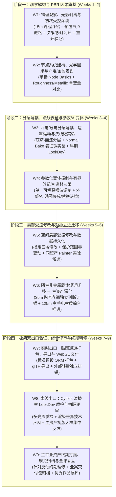
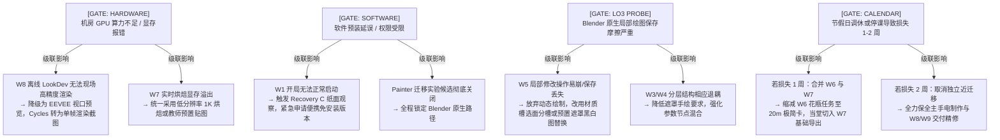

# Week 1–9 条件性排课草案 v0.3 (Week 1–9 Conditional Planning Draft v0.3)

> **文档定位**：基于 GitHub Issue #13 契约、Issue #14 已正式验收的 Week 1 可执行教学证据（`TEACHER ACCEPTED WITH DELTAS`）、以及历史教务素材预检结论，对前期草案（v0.2）进行有界的全局重校准。  
> **前沿状态**：`WEEK_1_9_CONDITIONAL_PLANNING_DRAFT_V0_3`（**CONDITIONAL / NOT FROZEN**）。  
> **制定日期**：2026-10-01。  
> **核心纪律**：  
> 1. 继承已获教师验收的 Week 1 完整基线（160 分钟课时、15 分钟课程介绍占位、Option B 预置 Shader Editor、三字段反馈修订闭环、退出重开持久化及 Recovery A/B/C）；  
> 2. 严守真实教务接触时间：9 周、单班每周 160 分钟面授接触、总计 36 学时 / 24 实际小时、35 人大班与 17 人小班单教师配置；  
> 3. 每周提供粗颗粒度的 160 分钟计划预算（Coarse PLAN BUDGET，精确求和 160 分钟），包含显式缓冲与超时裁剪规则；  
> 4. 明确将 Normal Bake 降级为表征认知微实验，压缩 W6 近迁移为短独立证据，前移 LookDev 视觉评价习惯至 W3；  
> 5. 显式支撑未来回填 Week 1 课程介绍所需的 5 大要素，且绝不提前编造或冻结未经学校批准的平时/期末评分比例。

---

## 1. 状态与证据基础 (Status & Evidence Basis)

本 v0.3 草案的重校准建立在以下权威实证与历史教务输入之上：

1. **Week 1 可执行教学包验收事实 (`TEACHER ACCEPTED WITH DELTAS`)**：
   - 2026-10-01 Course Owner 正式验收 Week 1（PR #17 合入 `main @ e02908ed8dfc74667825a5aaec64b117c136f277`，Issue #14 CLOSED）；
   - Week 1 预算分配：Block 1 = 20 min（15 min 课程介绍占位 + 5 min 入学摸底），Block 2 = 15 min，Block 10 = 5 min，其余保护模块不变，总时长严格为 160 min；
   - 确立“检视预置链路 $\to$ 单一可见材质决策 $\to$ 现场共性反馈 $\to$ 同一决策受控修订 $\to$ 退出重开持久化”的受保护核心循环；
   - 确立 **Node Construction Basics = DEFER, NOT OMIT** 纪律，延后项必须在后续周次全局统筹落地。
2. **教务大纲与学情历史预检 (Legacy Preflight Findings)**：
   - 历史前置课程《三维动画基础-数字建模》为 Maya 平台、60 学时，主要教授几何建模与基础灯光，学生具备多边形与界面概念，但系统的 PBR 微表面物理、节点着色网络与现代贴图管线为完全零基础；
   - 历史考查课评价结构多为“平时 30% + 期末 70%”，但因本学期新课程考核指导意见尚未下发，本草案维持评分比例 `UNKNOWN`，过程检查定位于形成性质量控制检查点（Formative Checkpoints）；
   - 教师自研古典石膏胸像高低模对（Bundle 1，高模 80k / 低模 1.3k）确认可用，重构为法线着色表征理解的演示与微实验。

### 1.1 历史教务资料预检与素材处置结论 (Legacy Preflight & Asset Disposition)

为避免无序调阅 184 个历史文件，本次预检依据现行教务权威文档与关键素材，聚焦解决三项核心问题：

1. **现行有效教务约束**：
   - **学情起点锚定**：学生已修读 Maya 60 学时建模，掌握拓扑与基础空间变换，但材质与节点网络认知为零。因此第一周诊断必须维持 `UNKNOWN`，课内严禁安排学生现做模型，完全聚焦材质动作；
   - **考查课属性与课时红线**：单班每周 160 分钟面授（共 36 学时 / 24 实际接触小时），必须在课内闭环核心合格要求，课外负荷严格控制在 2–3 小时/周；
   - **考核权重未定**：历史大纲多用 30/70 分布，但新版规范未冻结前，严禁在教案中硬编码评分比例。
2. **历史教学素材处置 (4 态分类)**：
   - `REUSE` (直接复用)：**手电筒/金属工业资产** —— 作为 W1–W5、W7–W9 贯穿始终的主资产载体，避免频繁更换资产分散认知；
   - `ADAPT` (降级改造)：**古典石膏胸像高低模对 (Bundle 1)** —— 从 45 分钟烘焙大实验降级为 W3 教师演示与 25 分钟表征微实验；
   - `ADAPT` (降级改造)：**陶瓷花瓶近迁移资产** —— 从独占 W6 整周 (160m) 压缩为 35 分钟短独立证据任务；
   - `REFERENCE_ONLY` (仅作参考)：**历史 Maya 课件与教学大纲** —— 仅作前置学情与技能边界参考，不作为本课直接讲授内容；
   - `REFERENCE_ONLY` (仅作参考)：**历史 Substance Painter `.spp` 案例工程** —— 作为 W5/W7 迁移假说的对照依据，不作必修依赖；
   - `DROP` (果断剔除)：**高精扫描未拓扑素材与未经筛选的 184 历史杂项** —— 彻底剔除，避免学生陷入拓扑修复与大文件加载陷阱。
3. **Painter 主导转向 Blender-first 后的真实能力缺口与对策**：
   - **缺口 A：图层栈/遮罩心智** —— Painter 依托直观的图层/填充层/黑白遮罩，Blender 节点连线抽象度更高。*对策*：W2 建立 Principled 端口因果，W4 以单一可解释噪波引导节点混合；
   - **缺口 B：生成器自动化边缘磨损** —— Painter 依赖烘焙曲率/AO 自动生成残破，Blender 手动连线繁琐。*对策*：W4 聚焦基础几何因子，W5/W7 评估同资产横向迁移假说；
   - **缺口 C：多通道标准贴图导出直觉** —— 从软件导出到引擎验证链路易断裂。*对策*：W8/W9 设置严格导出预检与实时视口验证门禁。

3. **单教师 52 人双班容量极限**：
   - GR2102-1 班（35 人）与 GR2102-3 班（17 人）共 52 人。杜绝课内排队验收，依托四级反馈漏斗（全班讲评、自查自校、流动抽检、工件异步核验）保障周转。

---

## 2. 相较 v0.2 的核心变化与依据 (Key Changes from v0.2)

| 维度 | v0.2 历史状态 | v0.3 重校准状态 | 重校准依据与动因 |
| :--- | :--- | :--- | :--- |
| **课时预算颗粒度** | 仅标注 `LOW / MEDIUM / HIGH` 容量定性标签 | 每周给出 5 桶粗颗粒度的 **160 分钟 PLAN BUDGET**，精确求和 160 | 消除无数字掩盖的超载风险，使超时裁剪与缓冲具备可执行基准。 |
| **Week 1 基线** | 粗排概念与解构，未落实分钟预算 | 严格锁定已验收的 160 分钟、11 模块可执行教案，含 15 分钟 Orientation 占位 | 继承 Issue #14 / PR #17 权威合入事实，W1 成为坚实基座。 |
| **节点基础承接 (Node Basics)** | 散见于各周，未规划新建节点入口 | **明确在 Week 2 承接** Week 1 延后项（新建节点、端口数据流、Principled 结构） | 落实“B = DEFER, NOT OMIT”，在学生动手调节粗糙度/金属度前建立节点心智模型。 |
| **法线烘焙 (Normal Bake)** | 悬空未排，或在 Pass C 中被偷渡为 W2 45 分钟实操 | **定位于 Week 3，重构为 25 分钟教师演示 ＋ 学生对比微实验** | 避免石膏扫描素材喧宾夺主；聚焦“法线改变着色微表面而非恢复剪影轮廓”的表征认知。 |
| **早期视觉评价 (LookDev)** | 直到 Week 8 离线出口才首次引入综合评价 | **前移至 Week 3 开始作为常规观察习惯，W8 承担整合总评** | 避免主资产到第 8 周才发现视觉方向灾难性偏差，建立多视角检验直觉。 |
| **近迁移载体 (Near-Transfer)** | 独占 Week 6 整整一周 (160 分钟) | **压缩为 Week 6 课内 35 分钟短独立证据任务**，释放余下 125 分钟回流主资产 | 迁移的核心是独立判断证据而非新开一门陶瓷课，释放课堂时间打磨主工业资产。 |
| **程序化与 AI 参与形式** | W4 节点公式抽象，AI 仅限于批判挑错坏图 | 节点聚焦单一可解释控制；**AI 要求学生执行一次“接受/拒绝/替换”决策闭环** | 避免节点数量通胀；避免 AI 教学沦为空洞批评，形成真实的选材与集成能力。 |
| **Painter 连续性方案** | 仅作为 LO3 探针失败后的被动备选 | **评估为“同资产 Painter 迁移实验”候选假说**，保持条件性，不提前冻结 | 允许学生用手电筒资产在合适节点横向体验工业级图层栈与遮罩，但 Blender-first 默认不变。 |
| **课外工作量假设** | 未作界定，默认依赖课外无限制作 | **显式界定最低课外负荷（2–3 小时/周）**，保障合格路径可在课内完成 | 严禁以“最终质量优先”为名将 24 小时课程的教学摩擦无限转嫁给家庭作业。 |

---

## 3. 修订后的 Week 1–9 教学拓扑与阶段划分 (Revised Topology)

全课程 9 周划分为严密的四个递进阶段，主工业资产（老式手电筒）作为贯穿脊梁，辅以短迁移与双出口验证：

---

## 4. Week 1–9 粗排课预算总表 (Coarse 160-Minute Plan Budget)

> [!IMPORTANT]
> **预算属性声明**：每周围绕 5 个标准化粗时间桶进行规划分配，**总时长严格等于 160 分钟**。本表为指导课堂教学节奏的计划预算（PLAN BUDGET），不代表学生实测时间。

| 周次 | 阶段定位与核心主题 | 160 分钟粗排预算 (PLAN BUDGET) | 核心实践活动 (Activities) | 阶段产出与达成证据 | 超时首裁优先项 (First Cut if Overrun) |
| :---: | :--- | :--- | :--- | :--- | :--- |
| **W1** | **观察解构与初次决策** *(已验收基线)* | • 介绍/摸底: **20m** (15+5) • 概念示范: **15m** • 观察填表/诊断: **35m** (20+15) • 动手/示范: **40m** (15+25) • 反馈/修订: **25m** (10+15) • 保存/交付/缓冲: **25m** (10+5+10) | 打开预置手电筒 Starter；观察剥离假光影；检视预置链路调节外壳军绿涂装；接受教师广播反馈并完成微调；保存退出重启核验。 | **LO1 核心证据**：观察解构填空卡。 **LO2 雏形**：三字段记录卡（初次决策 $\to$ 反馈 $\to$ 修订）。 **持久化证据**：重开工程 100% 完好。 | 按 W1 可执行教学包 4.2 节执行：首裁缓冲 10m $\to$ 次裁展示 3m $\to$ 试色超时强制下发 Recovery B。 |
| **W2** | **节点建构与介电/金属因果** *(承接 Node Basics)* | • 概念与节点示范: **35m** • 引导/自主建构: **45m** • 现场抽检/共性反馈: **25m** • 参数对比与修订: **35m** • 保存/交付与缓冲: **20m** | 学习从零添加节点与端口连线（`Shift+A`，数据流）；在测试场景中为手电不同部件分别设定纯净介电质漆面与导电金属底材；对比 Roughness 单变量影响。 | **Node Basics 证据**：独立连接贴图到 Base Color/Roughness。 **LO2 核心证据**：单变量参数预测对比卡（预测参数 $\to$ 渲染验证）。 | 裁剪高阶参数解释（绝不引入各向异性/清漆层/薄膜干涉）；提供半连线节点备份。 |
| **W3** | **分层解耦与法线表征** *(Normal Bake 微实验)* | • 概念与分层示范: **35m** • 独立分层实操: **40m** • 法线表征微实验: **25m** • 早期 LookDev/反馈: **40m** • 保存/交付与缓冲: **20m** | 搭建底漆-面漆分层着色器（Mix Shader 结合黑白遮罩）；**法线微实验**：观看石膏胸像烘焙演示，旋转灯光比对 low/high/normal 着色差异；首次将手电放入演播室环境观察。 | **LO3 阶段证据**：底漆面漆双层解耦网络。 **法线表征证据**：正确指出法线贴图对微表面着色的改变及对轮廓线的局限。 **早期 LookDev 习惯**：记录两视角外观。 | 缩减手绘遮罩精细度（改用基础渐变或预置脏迹图）；法线微实验取消学生独立操作，仅作演示与诊断。 |
| **W4** | **参数化变体与外部/AI集成** *(可解释噪波 + AI 决策)* | • 程序噪波与AI示范: **30m** • 参数变体制作: **40m** • 外部/AI 决策实操: **35m** • 现场反馈与修订: **35m** • 保存/交付与缓冲: **20m** | 引入单一可解释 Noise 节点调制磨损遮罩边缘，调节 scale/roughness 生成两款变体；审查教师给定的外部/AI 涂装贴图，执行一次“接受/拒绝/替换”决策并说明物理理由。 | **LO4 最低证据**：独立解释一段噪波控制关系并导出参数变体。 **LO5 决策证据**：完成《外部/AI 贴图审查决策单》（通道语义核查与取舍理由）。 | 严禁自建多层复合数学公式；若 AI 贴图解析耗时，优先保证程序变体制作，AI 决策转为课后分析。 |
| **W5** | **空间局部受控修改** *(LO3 核心门禁 + Painter 候选)* | • 任务下发与示范: **30m** • 局部修改动手实操: **55m** • 同行互查与反馈: **25m** • 保存重开/二次修改: **30m** • 交付与缓冲: **20m** | 接收修改单（在手电筒指定区域添加编号或磨损，严格保护非目标区域）；执行局部修改；保存贴图并退出 Blender；重新打开后追加二次修改并留存证据。*(可选同资产 Painter 体验)*。 | **LO3 终极达成证据**：修改前后对比图表，证明保护范围内零污染；提供重开工程，证明二次修改数据完整保全。 | 降低手绘笔触艺术要求，重点考核保护区保全与保存重开流程；若卡顿超 10 分钟直接使用预置图层模板。 |
| **W6** | **短独立近迁移与主资产深化** *(35m 迁移 + 125m 主线)* | • 迁移任务独立完成: **35m** • 迁移共性讲评: **15m** • 主资产深化实操: **60m** • 现场个别点拨与修订: **30m** • 保存与缓冲: **20m** | **前 35m**：分发陶瓷花瓶，无示范独立执行三分类判断与非金属质感设定；**后 125m**：回归手电筒主资产，针对前五周遗留问题进行全材质贯通与细节深化。 | **NEAR-TRANSFER 证据**：完成花瓶非金属反射率与粗糙度设定，提交三分类迁移判断卡（已归档，后续不精修）。 **主资产阶段大样**：主体材质基本成型。 | 严禁花瓶任务超时拖占主线；35 分钟到点立即收卷归档，掉队者课外补正，全班准时切入主资产打磨。 |
| **W7** | **下游实时出口交付** *(ORM 打包 + WebGL 验证)* | • 通道打包与导出示范: **35m** • 烘焙与 glTF 导出实操: **45m** • WebGL 独立核验/排错: **35m** • 跨应用差异诊断与修订: **25m** • 保存/交付与缓冲: **20m** | 将手电材质通过标准预设打包为 ORM 贴图，导出为 glTF (`.glb`) 文件；在外部 Chrome WebGL 查看器中打开；旋转光源核验通道映射与法线凹凸一致性。 | **LO6-Realtime 证据**：独立提交外部运行截图与 `.glb` 文件，完成跨应用技术差异核对表。 | 严禁手动繁琐配置烘焙射线；统一使用教师验证过的自动化打包预设或标准节点模板。 |
| **W8** | **离线出口质检与综合评审** *(Cycles 演播室 + 初版大审)* | • 演播室布光与质检示范: **30m** • Cycles 离线渲染与比对: **40m** • 主资产初版全案评审: **45m** • 教师集中讲评与修订规划: **25m** • 保存与缓冲: **20m** | 将手电置于 Cycles 演播室场景；切换多角度多光照评测质感表现；归因离线与实时效果的技术差异；提交**主资产初版完整成果**，接受全班共性讲评与教师重点抽检。 | **LO6-LookDev 证据**：演播室渲染图与实时对比归因报告。 **期末大作业初版工件**：完整源工程与材质大样（供第 9 周定向打磨）。 | 取消复杂的自定义打光调试，全员统一套用经典三点光棚拍模板；综合评审聚焦核心因果缺陷。 |
| **W9** | **主资产终期精修打磨与归档** *(期末质量终极闭环)* | • 终期修改要点串讲: **20m** • 主资产针对性精修: **70m** • 最终交付物整理与提交: **30m** • 全班优秀作品展评/复盘: **25m** • 课后归档缓冲: **15m** | 根据 W8 评审意见，专门对**手电筒主资产**进行最终微表面与质感精修打磨；按标准化目录归档源文件、导出件与效果图；全班进行结课复盘。（花瓶不再精修）。 | **LO1–LO6 整合达成证据 (期末大作业)**： 1. 手电筒终态源工程及视口截图； 2. 标准 glTF 交付包； 3. 贯穿性决策与修订记录全案。 | 压缩优秀展评时间；若个别学生调试受阻，强制按 W8 稳定检查点提交保底工程，严禁延误结课归档。 |
| **总计** | **9 周全课总时长** | **1440 min** | **9 周总计 24.0 实际接触小时** | **覆盖 6 大成效，形成完整期末高质量主资产与独立迁移证据** | **每周均具备明确且一致的超载首裁路径** |

---

## 5. 证据交付、分层反馈与修订时效机制 (Evidence, Feedback & Revision Mechanics)

针对单教师面对 52 人（35 人大班 + 17 人小班）的客观现实，设计**轻量提交、快速反馈、当堂或次周修订**的运行机制：

### 5.1 证据工件形态与异步批阅负荷控制

| 周次 | 提交工件形式 | 批阅形式与反馈返还时点 | 预计单生耗时 | 52 人总负荷控制 |
| :---: | :--- | :--- | :---: | :--- |
| **W1** | 纸面/在线决策卡 ＋ 1 张视口截图 | 课内共性讲评 ＋ 课后图库视图扫视（次日前返还） | 15 秒/人 | 约 15 分钟（课外） |
| **W2** | 单变量对比卡（填空）＋ 节点截图 | 课内抽查 5 份广播讲评 ＋ 课后关键参数核对 | 30 秒/人 | 约 25 分钟（课外） |
| **W3** | 双层材质视口截图 ＋ 法线问答填空 | 课内互查初筛 ＋ 课外抽检 20% | 20 秒/人 | 约 18 分钟（课外） |
| **W4** | 变体图 ＋ AI 贴图审查决策单（表格） | 课内共性讲评 ＋ 异步扫视决策单结论 | 30 秒/人 | 约 25 分钟（课外） |
| **W5** | 修改前后对比图（红圈标出保护区） | 课外异步核查对比图（发现异常才调阅源工程） | 45 秒/人 | 约 40 分钟（课外） |
| **W6** | 陶瓷花瓶决策表（1 页）＋ 主资产进度图 | 花瓶结课即归档，评定“达标/待补”；主资产课内巡视 | 1 分钟/人 | 约 50 分钟（课外） |
| **W7** | glTF 外部打开截图 ＋ 排错简报 | 课内现场检查是否打得开 ＋ 平台查看截图 | 20 秒/人 | 约 18 分钟（课外） |
| **W8** | **主资产初版大样包**（多角度渲染图＋工程） | **关键评审节点**：给每生提供针对性打磨要点（W9 前必须返还） | 2 分钟/人 | 约 100 分钟（约 1.7 小时，核心批阅投入） |
| **W9** | **期末终审全案包**（主手电全案 ＋ 归档花瓶） | 终期考核成绩评定与 Rubric 打分（结课后集中批阅） | 3–5 分钟/人 | 约 3–4 小时（结课期末考核专属时间） |

### 5.2 反馈与修订时效闭环铁律
- **原则一：先反馈后修订**。任何要求学生“修订”的任务，教师必须在此前提供清晰的讲评或结构化 Checklist，严禁让学生在无反馈的情况下盲目返工；
- **原则二：W8 评审绝不拖延**。W8 初版大样提交后，教师必须在 W9 开课前完成全员批阅并下发针对性修改清单，确保第 9 周课堂的 70 分钟精修时间能够精准落地；
- **原则三：大班小班差异化现场机制**：
  - **1 班 (35 人)**：以全班广播共性点评为主，严格依托标准化 Checklist 由学生同行互查过滤格式错误，教师巡回走动专抓后 20% 掉队学生；
  - **3 班 (17 人)**：在保持相同考核 Rubric 下，教师单生面谈辅导频次加倍，可针对中高阶质感微调给予更多启发式点拨。

---

## 6. 每周坚决保护核心与超时裁剪一致性 (Protected Core vs. First Cuts)

为确保 160 分钟教学不产生结构性延误，建立全课统一的裁剪与保护层级：

1. **全课坚决保护的核心 (Strictly Protected Across All 9 Weeks)**：
   - 课内必须经历“操作 $\to$ 反馈 $\to$ 修订”闭环；
   - 必须执行源工程与贴图的数据保存与重开持久化验证；
   - W5 保护范围数据零污染的核心原则绝不放水；
   - W6 近迁移必须由学生独立完成因果判断；
   - W7 必须在外部独立运行时中完成交付打开；
   - W9 必须保留完整的课堂精修打磨时间给主工业资产。
2. **通用的超时第一裁剪优先序列 (Universal First-Cut Priority)**：
   - **第 1 裁**：压缩各周 10–20 分钟的显式缓冲时间（Explicit Buffer）；
   - **第 2 裁**：取消学生心得交流与大屏优秀作品展示（Showcase），直接执行扫码交卷与本地工程归档；
   - **第 3 裁**：降低纯手绘与装饰性细节复杂度（如复杂刮痕、多重微污垢、手绘磨损过渡）；
   - **第 4 裁**：下发教师预置好的阶段性检查点（Recovery Checkpoint），强制掉队学生跳关参与后续环节；
   - **第 5 裁**：严禁将“退出重开验证”、“反馈修订”和“主资产最终精修”作为超时裁剪对象。

---

## 7. 跨周门禁影响映射 (Cross-Week Gate Impact Map)

打破“门禁互不影响”的理想假设，真实记录硬件、软件、探针与日历门禁如果受阻，将具体级联改变哪些周次：

---

## 8. 课外最低工作负荷假设 (Minimum Outside-Class Workload Assumptions)

为防止“最终作品质量优先”演变为对学生家庭作业的无限索取，明确课外负荷边界：

1. **基本达标底线 (Passing Baseline in Class)**：
   - 课程的核心教学法假设是：**一名出勤良好、认真跟随课堂节奏的学生，在 160 分钟课内即可完成当周的最低达成证据（Pass Criteria）**；
   - 基础合格并不强制依赖课外拥有高性能电脑。
2. **最低课外投入预期 (Expected Outside-Class Workload)**：
   - 计划预期学生每周课外投入 **2–3 小时**：
     - 0.5 小时：课前预习与回顾上周讲评意见；
     - 1.0–1.5 小时：根据教师下发的修改清单，对已完成的材质参数进行微调；
     - 1.0 小时：搜集下一周所需的真实参考照片或设计灵感。
3. **优秀作品与精修投入 (Optional Polish for High Distinction)**：
   - 期望获得优秀（85 分以上）的学生，在第 7–9 周需额外投入课外时间对主工业外壳的高频细节、微表面粗糙度分布与演播室渲染构图进行个性化打磨；
   - 机房需在课外提供固定的开放上机时段（自由机时），保障无个人电脑学生的精修权利。

---

## 9. 支撑 Week 1 课程介绍回填的 5 大全课要素设计 (Orientation Backfill Specifications)

本 v0.3 的全局架构设计，直接为 Week 1 开局 15 分钟的《课程整体介绍 (Course Orientation)》提供结构化回填内容：

### 9.1 W1–W9 完整演进轨迹 (Trajectory)
- **从表象到因果**：W1–W2 破除“贴图就是画画”的误区，建立 PBR 物理反射与光影剥离心智；
- **从单一到复合**：W3–W5 攻克介电/导电分层、法线微表面表征与局部受控修改，形成工业复合材质的核心创作能力；
- **从模仿到独立**：W6 离开主资产扶手，在全新陶瓷载体上检验独立分析与纠错能力；
- **从创作到交付**：W7–W9 贯通实时游戏（WebGL）与影视 LookDev 双出口，以专业标准精修打磨出最终代表作。

### 9.2 后八周教学结构明细 (Following-Eight-Week Structure)
- **Week 2**：从零上手着色器编辑器（连线与端口），掌握粗糙度与金属度两大因果滑块；
- **Week 3**：做旧必备——底漆与面漆的分层混合，兼学法线贴图神奇的“凹凸欺骗”；
- **Week 4**：加入程序化噪波实现变体，学会对外部及 AI 生成材质进行专业挑剔与筛选；
- **Week 5**：实战攻坚——在指定区域精准涂装与做旧，保证其他区域绝对不受污染，验证重启保全；
- **Week 6**：独立闯关——35 分钟陌生材质三分类大考，随后集中巩固主资产；
- **Week 7**：进入游戏引擎的前哨站——贴图通道打包与网页端 3D 实时验货；
- **Week 8**：进入演播室——Cycles 顶级灯光检视主资产质感，全班集体大会诊；
- **Week 9**：终极冲刺——消化全部修改意见，精修打磨，提交最具含金量的作品集全案。

### 9.3 作业与练习体系 (Assignment & Practice Structure)
- **课内形成性检查点 (Formative Checkpoints)**：每周均有极轻量的决策卡、单变量填空或对比截图，作为当堂实操的达标证据，帮助教师即时发现误区；
- **单一期末精修主线**：全课程只有 1 个期末精修载体（老式手电筒），严禁分散精力多头开花；
- **归档即闭环任务**：Week 6 陶瓷花瓶作为近迁移能力的专项证据，完成当周提交并评定后即刻归档，不作为期末大作业再次精修。

### 9.4 期末最终项目预期 (Final-Project Expectation)
- **标准定义**：提交一份符合现代 PBR 工业标准的《老式手电筒材质全案交付包》；
- **三大质量基准**：
  1. **物理可信**：微表面反射、高光形状与分层磨损完全符合材料真实物理规律；
  2. **双端一致**：在实时 WebGL 视口与离线 Cycles 演播室中均呈现层次丰富、质感扎实的表现；
  3. **工程规整**：贴图语义命名规范、色彩空间正确、源文件层级清晰可追溯。

### 9.5 考核评价框架依赖声明 (Assessment Framework Dependency — 评分比例未冻结)
- **当前制度依赖**：学校考查课官方成绩比例文件目前仍处于 `UNKNOWN` 状态；
- **宣讲口径纪律**：在 Week 1 课程介绍中，教师**仅向学生阐述评价原则**（平时过程控制保障底线、期末作品质量决定上限；缺勤 1/3 或欠交 1/3 丧失考核资格），**严禁向学生许诺或公布具体的百分比数字**（如 30/70、40/60、50/50），直至教务正式文件下达。

---

## 10. 未决假设与下一阶段工作单元推荐 (Next Work Units)

### 10.1 依然保留的未决假设 (Open Hypotheses)
1. **`[HYPO 1]` 真实学生操作耗时**：W2 节点搭建与 W5 局部绘制的真实学生耗时仍待课堂第一现场检验；
2. **`[HYPO 2]` 机房 Windows 批量环境**：学生机在没有独立显卡或驱动老旧时的 WebGL 与 Cycles 稳定性有待实测；
3. **`[HYPO 3]` Painter 迁移实验的可行性**：机房是否预装 Substance 3D Painter 及其许可证是否齐备。

### 10.2 推荐的下一阶段工作单元 (Next Recommended Move)
- **停止广域排课修改**：v0.3 已完成全局 9 周拓扑与 160 分钟预算校准，排课宏观设计收敛；
- **推进 Week 2 教学工程准备**：
  - 基于本草案，制作 Week 2 的最小可教切片（Node Basics 引导工程 ＋ 介电/金属单变量预测卡）；
  - 维持 `CONDITIONAL / NOT FROZEN`，直至教务正式日历与成绩比例门禁销号。
