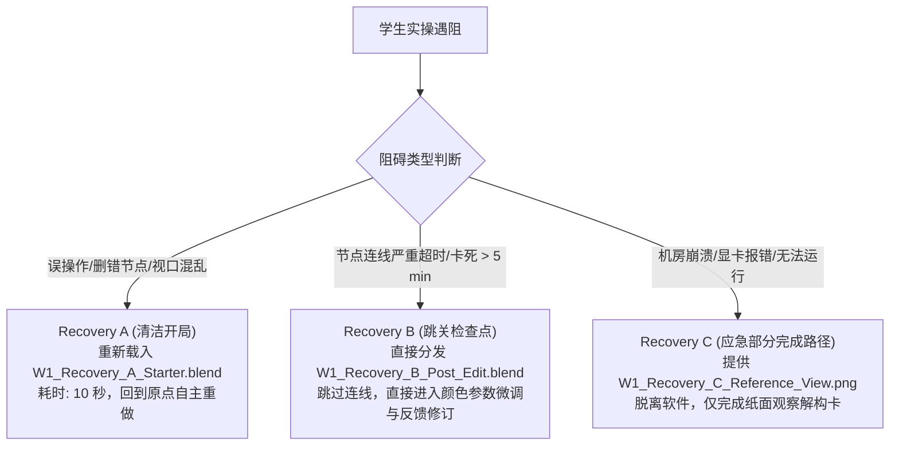

# Week 1 可执行 160 分钟教学包 (Week 1 Executable Teaching Package v0.1)

> **执行工单**：GitHub Issue #11 — WU2: Week 1 Executable 160-Minute Teaching Package  
> **上游依据**：GitHub Issue #9 (WU1 运行时切片验证通过，`PASS — TEACHING SLICE VIABLE`)  
> **交付物定位**：供单名教师面向 35 人/17 人大班真实执教的 Week 1 完整教学实施方案、本地资产清单、160 分钟排课预算、教师标准答案与恢复兜底规范  
> **测试运行时**：Blender 5.2.2 LTS (macOS Darwin 24.6.0 Apple Silicon)  
> **判定结论 (Verdict)**：**PASS WITH CONDITION — EXECUTABLE, LAB/STUDENT TIMING PENDING**

---

## 1. 教学定位与预期可观察成效 (Purpose & Observable Outcomes)

### 1.1 教学定位
Week 1 是《三维数字材质制作》的第一堂实践课。本周不追求复杂的材质制作，而聚焦于**破除初学者将“三维材质”误解为“二维手绘贴图”的固有心智模型**。课程通过实物观察解构、数字观察环境定位，以及在预置资产上完成一次小而可见的材质决策与反馈修订，确立 PBR 材质创作的基本因果律与工程纪律。

### 1.2 预期可观察成效集合 (Observable Outcomes)
学完 Week 1 课程后，学生应能独立展现以下四项行为成效：
1. **[LO1 观察解构] 区分事实与假设**：能审视工业资产参考图，独立填写决策卡，将视觉现象（高光斑、暗角、划痕）解构为物理材质属性（Base Color, Roughness, Metallic），并严格剥离外部光照（如高光光斑）与附着脏污；
2. **[LO2 材质决策与修订闭环] 单一可见动作与即时改进**：在主资产预置材质槽中，插入调色节点完成一次外壳涂装变体（Base Color Tint）；在课堂反馈后，完成对同一决定的针对性修订，并记录“初次决策 / 接收反馈 / 修订动作”三字段闭环证据；
3. **[工程/LO3 预备性证据] 局部保护与数据持久化**：在完成外壳修改的同时，确保受保护部件（玻璃镜片、反光碗、机械螺栓）零污染；在课堂内完成工程保存、完全退出 Blender 进程并重新打开，验证修改 100% 完整持久化；
4. **[轻量化证据交付]**：独立提交 1 份结构化决策卡（含观察表与修订三字段）与 1 张标准机位视口截图，源工程本地保留以备抽查。

### 1.3 教师专用标准参考答案 (Teacher Answer Key — 严禁下发给学生)
学生端任务单（`docs/research/week1-student-handout-v0.1.md`）已转为纯净填空卡，以下参考答案仅供教师投屏讲评与批阅参照：

| 观察部位 | 视觉现象 (SEE) | 物理/材质推断 (IS) | 初步对应通道 | 属性判断标准 | 批阅与讲评要点 |
| :--- | :--- | :--- | :--- | :--- | :--- |
| **手电筒主体外壳** | 暗绿微哑光涂层，有细微颗粒感 | 工业喷漆涂层（介电质覆盖层） | Base Color (墨绿) + Roughness | **固有属性** | 必须指出外壳本身具有固定吸收与反射率。 |
| **外壳高光光斑** | 亮白色反光斑点，随视角移动 | 外部光源在曲面上的镜面反射 | **环境光照** (非贴图) | **外部光影 (非固有)** | **核心错题点**：严禁学生将其画入 Base Color！ |
| **灯头透明镜片** | 透明高透光、能透视内部灯泡 | 介电质玻璃材质 | Alpha / Transmission | **固有属性** | 认识到这是独立材质；不要求掌握折射率细节。 |
| **灯杯反光碗** | 极强镜面反射、银白锃亮金属感 | 抛光电镀金属层 | Metallic + 低 Roughness | **固有属性** | 辨识出强反射金属；精确金属因果留待 W2。 |
| **外壳接缝处暗痕** | 缝隙边缘有暗褐色线纹与积灰 | 物理环境遮挡 (AO) 或微观缝隙污垢 | Base Color 污渍 / 几何 AO | **混合属性** | 区分几何凹陷自然阴影与外来附着污垢。 |

> [!IMPORTANT]
> **Week 1 PBR 规范表述原则 (有界表述)**：  
> **Base Color 绝对不能包含由外部光照引起的假高光与假阴影。它在金属与非金属材质中的精确物理语义将在 Week 2 展开。**  
> 不在 Week 1 强求学生掌握玻璃、高折射介电质或金属导电体微观公式等属于后续周次的高阶知识。

---

## 2. 起始状态、观察环境与本地资产清单 (Starting State & Asset Manifest)

### 2.1 资产溯源与版权合规 (Asset Provenance)
- **资产名称**：Vintage Flashlight (老式军工手电筒)
- **创作者**：Omar M. El-Safy (Poly Haven)
- **许可协议**：CC0 1.0 Universal Public Domain Dedication (可无限制用于教学与分发)
- **确定性重建源**：官方原版 `vintage_flashlight_1k.blend` ＋ 官方 1K 贴图（diffuse, rough, metal, nor_gl, alpha）

### 2.2 教学接缝划分与 Starter 决策 (Teaching Seam)
- **接缝划分**：将主体外壳（Main Body Shell，由 812 面下底壳与 650 面顶盖组成，共 **1,462 面**）预置为独立材质槽 **Slot 2 (`vintage_flashlight_body`)**；
- **为什么不让学生在 W1 自己做选面与 Slot Assign**：初学者在第 1 周尚不熟悉 Blender 复杂的编辑模式网格选择（需用 L 键选连通岛屿、排查微观重叠面并 Assign 材质）。若强求在 W1 动手选面，将耗费 30–45 分钟甚至引发大面积选面泄露，直接挤占核心的“观察解构与材质决策”时间。因此，W1 采取“**教师预置接缝、学生检视确认**”的策略，将选面与材质槽分配延后到后续适当时机讲解。

### 2.3 唯一规范观察环境 (Canonical Observation Setup)
- **固定观察机位**：场景预置 `Cam_Obs`（焦距 75mm，锁定透视观察角）；
- **光照基准与视觉来源**：
  - **规范基准**：3D 视口统一采用 **Material Preview (材质预览模式)**。该模式依托 Blender 内置的中性 Studio 棚拍环境（Forest/Studio HDRI），提供 360 度柔和中性的漫反射与微弱环境反光，杜绝初学者因误删灯光导致视口全黑；
  - **参考图与 Recovery C 严格一致**：`reference_render.png` 与 `W1_Recovery_C_Reference_View.png` 均在相同 Material Preview 环境下烘托生成，确保光照基准 100% 统一；
  - **场景 Sun 光源定位**：场景中内置的 `Light_Obs` 仅作为未来/备用资产保留，**不作为 W1 规范观察基准的一部分**（视口默认不开启 Scene Lights）。

### 2.4 本地教学包清单与重构规范 (Local Teaching Package Manifest)
所有教学资产存放在本地开发工作区 `.scratch/teaching_package_w1/`（已配置于 `.git/info/exclude`，不污染公共提交树）：

| 目录 / 角色 | 文件名 | 规格与状态 | 来源与构建方式 |
| :--- | :--- | :--- | :--- |
| **`starter/` (学生开局)** | `W1_Starter_Vintage_Flashlight.blend` | 326 KB，3 槽完备，预设 Material Preview 视口，默认激活 Slot 2 | 由官方资产经确定性 Python 脚本切分 Slot 2 并重构相对路径生成 |
| **`recovery/` (恢复 A)** | `W1_Recovery_A_Starter.blend` | 326 KB，纯净开局备份 | 同 Starter，供操作彻底做崩的学生 10 秒复位 |
| **`recovery/` (恢复 B)** | `W1_Recovery_B_Post_Edit.blend` | 327 KB，已连好 Base Color Tint 节点 | 在 Slot 2 中串联好 `ShaderNodeMix` (Multiply 0.85, 军绿) |
| **`recovery/` (恢复 C)** | `W1_Recovery_C_Reference_View.png` | 2.2 MB，标准机位渲染图 | 教师参考效果图，**应急部分完成路径**（仅供完成纸面解构） |
| **`reference/` (教师参考)** | `W1_Reference_Result.blend` | 327 KB，包含反馈修订后的终态参数 | Factor=0.80，颜色纯度与明度经微调优化后的最终工程 |
| **`textures/` (共享贴图)** | `vintage_flashlight_*.{jpg,exr,png}` | 5 张 1K 贴图，共约 1.9 MB | 官方 Poly Haven 原生贴图，所有 blend 以 `//../textures/` 相对路径引用 |

> **重构指令 (How to Reconstruct)**：在 Blender 5.2.2 环境下，运行 `.scratch/teaching_package_w1/rebuild_from_official.py`，即可在 15 秒内全自动无损重构出上述全部资产与截图。

---

## 3. 真实 160 分钟规划预算 (160-Minute Planning Budget)

> [!IMPORTANT]
> **预算属性声明**：以下 160 分钟分配为**教学设计计划预算 (PLAN BUDGET)**，非实测学生时间。各项时间经过教师干跑与认知负荷推断加权，包含显式缓冲与逐块超时裁剪规则。

| 模块序号 | 教学环节与活动 (Block / Activity) | 计划预算 (Plan Budget) | 教师动作 (Teacher Actions) | 学生动作 (Student Actions) | 阶段产出与达成证据 | 超时裁剪规则 (Overrun / Cut Rule) |
| :---: | :--- | :---: | :--- | :--- | :--- | :--- |
| **Block 1** | **导入、定向与基线摸底**<br>(Entry & Baseline Diagnostic) | **10 min** | 明确课程总目标与纪律；发布 3 问极简基线测试（视口导航经验、贴图先验概念）。 | 登录机房工作站，打开任务单；手机或纸面快速响应 3 项基线问题。 | 摸排班级三维软件与认知基线，建立纪律意识。 | 若开机缓慢，基线诊断由问答缩减为 1 分钟举手摸底，压缩至 5 分钟内切入。 |
| **Block 2** | **概念讲解与物理-视觉解构示范**<br>(Concept & Decomposition Demo) | **20 min** | 投屏实物参考图，剖析四大通道；示范“如何区分材质固有属性 vs 环境光影/表面污渍”。 | 聆听并记录核心概念；对照投屏辨识手电筒表面的高光与固有色。 | 建立光影剥离意识（LO1 雏形）。 | 若互动过长，裁剪次要细节解释，仅聚焦 Base Color 与光源光斑的剥离，严格在 20 分钟内结束。 |
| **Block 3** | **学生动手：参考观察与解构填表**<br>(Student Observation & Decomposition) | **20 min** | 巡视指导，观察学生在任务单上的填表情况；重点抽查易混淆项。 | 审视参考图与手电筒部件，独立填写任务单中的《观察与物理解构决策卡》。 | **LO1 核心证据**：完成纯净填空卡（区分 5 项视觉现象的物理因果归属）。 | 若观察拖沓，教师倒计时提示“优先完成主外壳与玻璃两栏”，其余三栏课后补齐，准时进入全班诊断。 |
| **Block 4** | **全班共性诊断与清单核对**<br>(Whole-class Common Diagnosis) | **15 min** | 收集并投屏 2 份具有代表性偏差的观察卡，开展全班公开诊断；讲解自查标准。 | 对照教师投屏与标准自查清单，订正自己的决策卡。 | 纠偏错误认知，固化“光影/脏污剥离”概念。 | 若诊断展开过深，只点评 1 个最典型高光混淆案例，控制在 10 分钟内切入软件实操。 |
| **Block 5** | **教师示范：首个有界材质动作**<br>(Material-action Teacher Demo) | **15 min** | 投屏演示打开 Starter，核验 Slot 2，插入 `ShaderNodeMix` 演示外壳军绿色调配与保护区核查。 | 观看教师演示，记录节点添加路径（`Shift+A -> Color -> Mix Color`）与端口连线规则。 | 掌握在受保护框架下实施单一材质调配的操作链路。 | 严禁扩充额外节点知识；仅演示 Mix Multiply 单一连线，坚决在 15 分钟内结束。 |
| **Block 6** | **学生实操：首个可见材质决策**<br>(Student Practice: First Material Action) | **25 min** | 教室巡回走动，重点关注学生是否误选 Slot 0 或连线断裂；分发 Recovery B 给掉队者。 | 打开 Starter，定位到 Slot 2，添加 Mix 节点调制外壳涂装色，填写字段 1。 | **LO2 阶段证据**：外壳呈现可见颜色变体，并记录初次决策参数。 | **超时即截断**：20 分钟未调出满意色彩者，强制以当前颜色锁定；连线混乱超 5 分钟者直接下发 Recovery B。 |
| **Block 7** | **现场分层巡视反馈与抽检**<br>(Roaming Feedback & Mid-point Check) | **10 min** | 快速巡视全班屏幕；抓取 2 个常见错误（色彩荧光过饱和、改错材质槽）进行 3 分钟全班口头广播点拨。 | 停手听取反馈，在决策卡记录所听到的共性反馈要点（填写字段 2）。 | 获取课内即时反馈，识别修改方向。 | 取消个别细致答疑，改为 3 分钟统一广播指导，确保留出完整的学生修订时间。 |
| **Block 8** | **学生受控修订：优化同个材质决策**<br>(Student Revision on the SAME Decision) | **15 min** | 提示学生聚焦修订当前决策：微调 Factor（如 0.85 $\to$ 0.80）与色彩明度；记录修订动作（字段 3）。 | 针对教师反馈，微调 Mix 节点参数或颜色纯度，完成修订并在决策卡填写字段 3。 | **LO2 终极闭环**：形成初次决策 $\to$ 接收反馈 $\to$ 修订动作完整闭环。 | 若前序超时，本环节缩减为 10 分钟，只要求微调滑块，不推倒重来。 |
| **Block 9** | **工程保存、退出重启持久化验证**<br>(Save, Quit & Reopen Verification) | **10 min** | 指导学生规范命名保存工程；**监督全班必须执行“完全退出软件并重开”**的持久化核验。 | 执行 `File -> Save As`；完全退出 Blender 进程；重新双击打开，确认节点与参数未丢失。 | **工程/LO3 预备性证据**：保全数据与验证重开完整性。 | **坚决不裁剪此环节**；若时间受压，优先压缩 Block 10 展示/反思与 Block 11 缓冲。 |
| **Block 10** | **轻量交付、总结与反思**<br>(Submission, Audit & Reflection) | **10 min** | 发布作业上传通道；投屏展示 2 位代表性变体作品；总结 PBR 核心纪律。 | 提交决策卡 ＋ 1 张视口截图；将 `.blend` 保存在本机目录备查。 | 完成全员证据归档，建立课后审计备查源。 | 若时间不足，完全取消作品展示与心得反思，直接进行文件提交。 |
| **Block 11** | **显式缓冲与极端恢复容量**<br>(Explicit Buffer & Recovery Capacity) | **10 min** | 协助个别机器故障或严重卡顿学生恢复工程；处理机房技术突发状况。 | 顺利完成者可微调材质观察角度；掉队者在教师协助下完成基础截图。 | **兜底容灾**：吸收课堂偶发性时间膨胀，保障全班达标率。 | **完全弹性**：若前序零延误，用作优秀作业展评与 W2 预告；若有延误，完全被前序吸收。 |
| **总计** | **全课 11 模块总时长** | **160 min** | **严格等于 160 分钟** | **严格等于 160 分钟** | **涵盖 LO1/LO2/LO3 全部最低可观察成效** | **每环节具备明确保护核心与降级路径** |

---

## 4. 保护核心与超时裁剪一致性规则 (Protected Core & Cut Consistency)

### 4.1 坚决保护的核心 (Protected Core — 严禁裁剪)
1. **区分物理属性与环境光影/污渍的观察解构动作**（LO1 核心）；
2. **在受保护资产上实施一次可见材质决定的体验**（LO2 核心）；
3. **针对教师反馈完成对同一决定的修订闭环**（反馈闭环核心：填写三字段卡）；
4. **课堂工程保存、完全退出 Blender 进程并重开持久化验证**（工程/LO3 预备性证据，**坚决不裁剪**）。

### 4.2 超时裁剪优先序列 (Cut-if-Overrun Priority)
为维护上述保护核心的一致性，**严禁将“退出重开持久化验证”作为超时裁剪对象**。出现延误时，严格按以下顺序从外向内削减非核心环节：
1. **首裁 1 (削减 Block 11)**：完全压缩 10 分钟显式缓冲时间；
2. **首裁 2 (削减 Block 10)**：完全取消优秀作品大屏展示 (Showcase) 与学生心得反思 (Reflection)，将 Block 10 压缩为纯粹的 2 分钟扫码交卷；
3. **首裁 3 (削减 Block 6 试色)**：自由试色延误超 20 分钟者，直接由教师统一下发军绿标准色参数完成达标；
4. **首裁 4 (下发 Recovery B)**：连线受阻超 5 分钟者，强制调用 Recovery B 跳关进入微调；
5. **首裁 5 (缩短互评)**：取消学生之间的同桌互查，改为教师集中 3 分钟广播讲评。

---

## 5. 最低证据设计与单教师可行性 (Evidence & Feasible Submission)

### 5.1 证明“反馈驱动修订”的全员轻量证据模型
针对单教师面对 35/17 人大班的批阅边界，全员证据必须极轻，同时又能闭环证明观察、初次决策、反馈以及修订动作：

```
[全员必交证据 (100%)] 极轻双联提交
  ├── 1. 结构化决策卡 (包含任务 A 填空表 ＋ 任务 B-3 修订三字段)
  │       ├── 字段 1: 初次决策 (选定的色彩倾向与初始 Factor)
  │       ├── 字段 2: 接收反馈 (教师广播或自查发现的问题)
  │       └── 字段 3: 修订动作 (具体微调参数与改进理由)
  └── 2. 标准机位视口截图 (W1_Flashlight_[学号].png) -> 证明最终视觉达成
          │
          ▼ 教师课内极速批阅 (100% 覆盖，平铺画廊视图快速浏览，35 人约 5-8 分钟)
[抽样与异常深入审计 (10%-15%)]
  ├── 随机抽取 5 份本地工程 (.blend)
  └── 出现“截图明显异常 / 反光罩变色 / 节点错误求助”的学生工程
          │
          ▼ 现场或课后打开源工程核查 Slot 2 节点拓扑与面指派
[源工程本地留存]
  └── 学生本地保留 W1_Flashlight_[学号].blend，作为后续周次审计与复查源
```

### 5.2 证据核验对照表
| 证据类型 | 提交形态 | 教师核验方式 | 预期批阅负荷 | 达标判定标准 (Pass Criteria) |
| :--- | :--- | :--- | :--- | :--- |
| **观察与修订决策卡** | 任务单纸面填写 / 在线问卷 | 课内抽查 2 份共性讲评，其余课后批量扫视 | 5 分钟 (课内) + 10 分钟 (课外) | 表 A 能区分光斑非固有色；三字段完整体现“发现问题 $\to$ 参数微调”的过程。 |
| **标准机位视口截图** | 单张 PNG 图像 (标准命名) | 教学平台缩略图平铺视图 (Gallery View) 快速浏览 | 5–8 分钟 (35 人全览) | 主筒身呈现明显色彩变体；反光碗仍为金属，玻璃透明，无洋红报错。 |
| **工程源文件 (`.blend`)** | 学生机房本地留存 | **不作课堂全员打开**；仅抽检 15% 或针对疑问截图调阅 | 抽检每份 1 分钟 | 打开后 Slot 2 包含完整的 Mix 节点，Slot 0 与 Slot 1 面数与节点无篡改。 |

---

## 6. 恢复阶梯规范与局部完成属性 (Recovery Ladder)

为防止学生在课堂中脱节，设立完备的三级恢复阶梯：



- **Recovery A (清洁起点)**：`W1_Recovery_A_Starter.blend`。适用于手滑删除了相机、误改了受保护材质的学生，10 秒内恢复纯净初始态；
- **Recovery B (检查点跳关)**：`W1_Recovery_B_Post_Edit.blend`。内置已连好的 Mix Color 节点。专门拯救在连线环节卡死超 5 分钟的学生，使其跳过机械连线，跟上大部队参与色彩微调、三字段记录与反馈修订；
- **Recovery C (应急部分完成路径)**：`W1_Recovery_C_Reference_View.png`。
  > [!WARNING]
  > **Recovery C 属性严正声明**：  
  > Recovery C 仅为极端硬件崩溃时的**应急部分完成路径 (Emergency Partial-Completion Path)**。使用该通道的学生仅完成了 LO1 观察证据，**后续仍欠实操动手与工程持久化动作**。教师必须要求其在课后借用备用机或机房空闲时段补做实操并补交截图，**严禁将 Recovery C 直接折算为 Week 1 全额达标**。

---

## 7. 教师现场 GUI 点检记录与实机干跑证据 (Manual UI Spot-check & Dry-run)

### 7.1 Blender 5.2.2 LTS 手工 GUI 现场点检 (Manual UI Spot-check)
在真实 macOS 视窗环境下对 Blender 5.2.2 LTS 进行了 3–5 分钟的手工 GUI 操作点检，确认学生任务单中的指令与真实软件界面 100% 吻合：

| 点检环节 | 界面实际表现与验证事实 | 与 Handout 匹配状态 | 教师注意事项 |
| :--- | :--- | :---: | :--- |
| **1. 打开 Starter 文件** | 双击打开，3D 视口默认激活 **Material Preview (材质预览)**，机位自动锁定在 `Cam_Obs`。材质面板默认选中 Slot 2 (`vintage_flashlight_body`)。 | `[VERIFIED]` 吻合 | 学生开箱立即可见材质，无需手动寻找切换着色球。 |
| **2. 添加 Mix Color 节点** | 在 Shader Editor 中按快捷键 `Shift + A`，弹出菜单中有 `Color -> Mix Color` 节点。添加后默认名称为 `Mix`。 | `[VERIFIED]` 吻合 | 节点默认数据类型为 `Float`，需手动在顶部下拉菜单中选择 `Color`。 |
| **3. 混合算法与连线** | 下拉菜单中包含 `Multiply` 算法。端口包含 `A` (Color)、`B` (Color)、`Factor` 与 `Result`。连入 Principled BSDF 的 `Base Color` 立即见效。 | `[VERIFIED]` 吻合 | 视口中外壳颜色瞬间转为军绿，螺丝与玻璃完全未受影响。 |
| **4. 保存与退出重开** | 执行 `File -> Save As` 保存；彻底 `Cmd + Q` 关闭 Blender 进程并重新双击打开，视口、相机机位、材质节点与调色参数 100% 持久化。 | `[VERIFIED]` 吻合 | 重开持久化流程顺畅，用时约 15 秒。 |
| **5. 打开 Recovery B** | 双击打开 `W1_Recovery_B_Post_Edit.blend`，视口直接呈现调好的军绿色，Shader Editor 中 Mix Color 节点已就位，可直接调节 Factor。 | `[VERIFIED]` 吻合 | 跳关检查点完备有效。 |

### 7.2 运行时自动化断言核查 (Automated Runtime Assertions)
通过独立脚本对本地教学包进行了 7 项核心任务断言测试：
- **断言 1**：Starter 包含 3 槽，预置 `Cam_Obs` 与 `Light_Obs`，默认激活 Slot 2 (`PASS`)；
- **断言 2**：Slot 2 插入 `ShaderNodeMix` (Multiply 0.85 军绿) 成功 (`PASS`)；
- **断言 3**：受保护区 Slot 0 (3,765 面) 与 Slot 1 (56 面) 节点与面分配严格零变动 (`PASS`)；
- **断言 4**：反馈修订 Factor 0.80 与加深对比生效 (`PASS`)；
- **断言 5**：工程保存至独立学生文件成功 (`PASS`)；
- **断言 6**：内存完全重置后重新载入，节点参数持久化保持 100% (`PASS`)；
- **断言 7**：Recovery 阶梯 A/B/C 加载断言无误 (`PASS`)。  
*自动化断言总耗时 0.47 秒，全绿通过。*

---

## 8. 假设与尚未实测事项声明 (Assumptions & Unverified Facts)

1. **`[VERIFIED]` 资产、界面与任务物理成立**：资产拓扑、材质分槽、GUI 菜单路径、持久化在 Blender 5.2.2 LTS 中经实机实跑与手工点检 100% 成立；
2. **`[NOT YET TESTED]` 学生实际操作耗时**：各项时间为教学法合理推断，尚未在真实零基础学生群体中进行大规模带秒表可用性测试；
3. **`[NOT YET TESTED]` 跨平台高校机房部署**：尚未在高校机房典型的 Windows 11 + NVIDIA GPU 纯净还原环境下进行批量打开测试；
4. **`[NOT YET TESTED]` 双班排课日历冲突**：1 班与 3 班的具体授课周历与法定节假日调休情况尚待教务系统确定（对应原 Gate 1）。

---

## 9. 对后续周次的影响与 WU3 记录 (Follow-up for WU3)

1. **Material Slot Assign 移期**：W1 预置了接缝，选面与分槽技能点移至 W2/W3 适当位置补齐；
2. **Roughness 节点调整独立化**：W1 裁剪了 Roughness 连线，建议在 W2 金属/介电质粗糙度规律中作为核心实操；
3. **确立全员轻量决策卡（含修订三字段）+ 视口截图的标准批阅范式**；
4. **glTF/GLB 外部交付核验坚决保留在 W7**，不向前渗透。

---

## 10. 最终判定结论 (Final Verdict)

根据 Issue #11 判定词表（Verdict Vocabulary）：

### **PASS WITH CONDITION — EXECUTABLE, LAB/STUDENT TIMING PENDING**

**判定理由**：
1. **教学包完全可执行 (Executable)**：教学定位单一明确，Starter/Recovery/Reference 资产由官方原版资产直接确定性重构，在 Blender 5.2.2 LTS 中经过完整实机干跑与 GUI 手工点检，断言全数通过；
2. **时间与负荷严谨闭环**：160 分钟规划预算严格加总且包含 10 分钟显式缓冲，每模块均有超时裁剪规则，受保护核心逻辑严密自洽；
3. **证据与反馈轻量可行**：设计了面向 35/17 人单教师的轻量化双联决策卡与截图机制，低成本证明了反馈驱动的修订闭环；
4. **条件性保留 (Condition)**：因尚未在真实 Windows 机房环境中由真实零基础学生进行带秒表的可用性测试，依事实标签纪律判定为**条件通过**，完全具备开展试点试教（Pilot）的充分条件。
