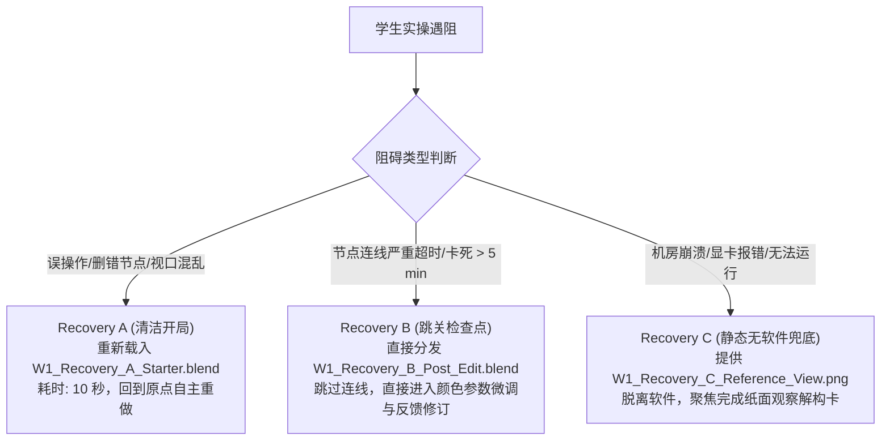

# Week 1 可执行 160 分钟教学包 (Week 1 Executable Teaching Package v0.1)

> **执行工单**：GitHub Issue #11 — WU2: Week 1 Executable 160-Minute Teaching Package  
> **上游依据**：GitHub Issue #9 (WU1 运行时切片验证通过，`PASS — TEACHING SLICE VIABLE`)  
> **交付物定位**：供单名教师面向 35 人/17 人大班真实执教的 Week 1 完整教学实施方案、本地资产清单、160 分钟排课预算与恢复兜底规范  
> **测试运行时**：Blender 5.2.2 LTS (macOS Apple Silicon)  
> **判定结论 (Verdict)**：**PASS WITH CONDITION — EXECUTABLE, LAB/STUDENT TIMING PENDING**

---

## 1. 教学定位与预期可观察成效 (Purpose & Observable Outcomes)

### 1.1 教学定位
Week 1 是《三维数字材质制作》的第一堂实践课。本周不追求复杂的材质制作，而聚焦于**破除初学者将“三维材质”误解为“二维手绘贴图”的固有心智模型**。课程通过实物观察解构、数字观察环境定位，以及在预置资产上完成一次小而可见的材质决策与反馈修订，确立 PBR 材质创作的基本因果律与工程纪律。

### 1.2 预期可观察成效集合 (Observable Outcomes)
学完 Week 1 课程后，学生应能独立展现以下四项行为成效：
1. **[LO1 观察解构] 区分事实与假设**：能审视工业资产参考图，将视觉现象（高光斑、暗角、划痕）解构为物理材质属性（Base Color, Roughness, Metallic），并严格剥离外部光照（如高光光斑）与附着脏污；
2. **[LO2 材质决策] 单一可见材质动作**：在主资产预置材质槽中，插入调色节点完成一次符合物理常识与审美品味的外壳涂装变体（Base Color Tint），并在课内反馈后完成对同一决定的修订闭环；
3. **[LO3 工程保全] 局部修改与持久化**：在完成外壳修改的同时，确保受保护部件（玻璃镜片、反光碗、机械螺栓）零污染；完成工程保存、完全退出 Blender 并重新打开，验证修改 100% 完整持久化；
4. **[轻量化证据交付]**：独立提交 1 份结构化决策卡与 1 张标准机位视口截图，源工程本地保留以备抽查。

---

## 2. 起始状态、观察环境与本地资产清单 (Starting State & Asset Manifest)

### 2.1 资产溯源与版权合规 (Asset Provenance)
- **资产名称**：Vintage Flashlight (手电筒)
- **创作者**：Omar M. El-Safy (Poly Haven)
- **许可协议**：CC0 1.0 Universal Public Domain Dedication (可无限制用于教学与分发)
- **原始规格**：1K 贴图完整版本（含 diffuse, rough, metal, nor_gl, alpha 五张通道贴图）
- **确定性重建源**：官方原版 `vintage_flashlight_1k.blend` ＋ 官方 1K 贴图

### 2.2 教学接缝划分与为什么预置 Starter (Teaching Seam & Starter Decision)
官方原生资产中，除玻璃独立成槽外，手电筒外壳与所有内部机械螺钉、开关、反光碗混在同一个 Slot 0 中。
- **Starter 决策**：教学包预先将主体外壳（Main Body Shell，由 812 面下底壳与 650 面顶盖组成，共 **1,462 面**）隔离为独立材质槽 **Slot 2 (`vintage_flashlight_body`)**；
- **为什么不让学生在 W1 自己做选面与 Slot Assign**：初学者在第 1 周尚不熟悉 Blender 复杂的编辑模式网格选择（需用 L 键选连通岛屿、排查微观重叠面并 Assign 材质）。若强求在 W1 动手选面，将耗费 30–45 分钟甚至引发大面积选面泄露，直接挤占核心的“观察解构与材质决策”时间。因此，W1 采取“**教师预置接缝、学生检视确认**”的策略，将选面与材质槽分配延后到后续适当时机讲解。

### 2.3 统一稳定的观察环境 (Unified Observation Setup)
- **固定观察机位**：场景预置 `Cam_Obs`（焦距 75mm，方位角清晰涵盖手电筒主筒身、头部玻璃与反光碗）；
- **光照环境与视觉来源**：
  - **视口主基准**：3D 视口统一采用 **Material Preview (材质预览模式)**。该模式依托 Blender 内置的中性 Studio 棚拍环境，提供 360 度柔和无死角的漫反射与微弱反光，杜绝了初学者误触场景灯光导致画面全黑的风险；
  - **辅备渲染光源**：场景内置单一中性日光 `Light_Obs`（Sun 2.5，倾角 $45^\circ$），仅作为学生按 F12 渲染或视口 Rendered 模式时的基准支撑；
  - **文档声明**：明确告知学生“当前观察到的外壳反光来自中性摄影棚光照，而非贴图内部的假高光”。

### 2.4 本地教学包清单与重构规范 (Local Teaching Package Manifest)
所有教学资产存放在本地开发工作区 `.scratch/teaching_package_w1/`（已配置于 `.git/info/exclude`，不污染公共提交树）：

| 目录 / 角色 | 文件名 | 规格与状态 | 来源与构建方式 |
| :--- | :--- | :--- | :--- |
| **`starter/` (学生开局)** | `W1_Starter_Vintage_Flashlight.blend` | 326 KB，3 槽完备，预置 `Cam_Obs`，默认激活 Slot 2 | 由官方资产经确定性 Python 脚本切分 Slot 2 并重构相对路径生成 |
| **`recovery/` (恢复 A)** | `W1_Recovery_A_Starter.blend` | 326 KB，纯净开局备份 | 同 Starter，供操作彻底做崩的学生一键复位 |
| **`recovery/` (恢复 B)** | `W1_Recovery_B_Post_Edit.blend` | 327 KB，已连好 Base Color Tint 节点 | 在 Slot 2 中串联好 `ShaderNodeMix` (Multiply 0.85, 军绿) |
| **`recovery/` (恢复 C)** | `W1_Recovery_C_Reference_View.png` | 2.2 MB，标准机位渲染图 | 教师参考效果图，供极端硬件崩溃学生完成纸面解构 |
| **`reference/` (教师参考)** | `W1_Reference_Result.blend` | 327 KB，包含反馈修订后的终态参数 | Factor=0.80，颜色纯度与明度经微调优化后的最终工程 |
| **`textures/` (共享贴图)** | `vintage_flashlight_*.{jpg,exr,png}` | 5 张 1K 贴图，共约 1.9 MB | 官方 Poly Haven 原生贴图，所有 blend 以 `//../textures/` 相对路径引用 |

> **重构指令 (How to Reconstruct)**：在 Blender 5.2.2 环境下，运行 `.scratch/teaching_package_w1/rebuild_from_official.py`，即可在 15 秒内全自动无损重构出上述全部资产与截图。

---

## 3. 真实 160 分钟规划预算 (160-Minute Planning Budget)

> [!IMPORTANT]
> **预算属性声明**：以下 160 分钟分配为**教学设计计划预算 (PLAN BUDGET)**，非实测学生时间。各项时间经过教师干跑与认知负荷推断加权，包含显式缓冲与逐块超时裁剪规则。

| 模块序号 | 教学环节与活动 (Block / Activity) | 计划预算 (Plan Budget) | 教师动作 (Teacher Actions) | 学生动作 (Student Actions) | 阶段产出与达成证据 | 超时裁剪规则 (Overrun / Cut Rule) |
| :---: | :--- | :---: | :--- | :--- | :--- | :--- |
| **Block 1** | **导入、定向与基线摸底**<br>(Entry & Baseline Diagnostic) | **10 min** | 明确课程总目标与纪律；发布 3 问极简基线测试（视口导航经验、贴图先验概念）。 | 登录机房工作站，打开任务单；手机或纸面快速响应 3 项基线问题。 | 摸排班级三维软件与认知基线，建立纪律意识。 | 若开机/登录缓慢，基线诊断由问答缩减为 1 分钟举手摸底，压缩至 5 分钟内切入。 |
| **Block 2** | **概念讲解与物理-视觉解构示范**<br>(Concept & Decomposition Demo) | **20 min** | 投屏实物参考图，剖析 PBR 四大核心通道；示范“如何区分材质固有属性 vs 环境光影/表面污渍”。 | 聆听并记录核心概念；对照投屏辨识手电筒表面的高光与固有色。 | 破除“高光画在贴图里”的传统错误心智（LO1 雏形）。 | 若互动过长，裁剪次要细节解释，仅聚焦 Base Color 与外部光源光斑的剥离，严格在 20 分钟内结束。 |
| **Block 3** | **学生动手：参考观察与解构填表**<br>(Student Observation & Decomposition) | **20 min** | 巡视指导，观察学生在任务单上的填表情况；重点抽查易混淆项。 | 审视屏幕参考图与手电筒部件，独立填写任务单中的《观察与物理解构决策卡》。 | **LO1 核心证据**：完成决策卡（区分 5 项视觉现象的物理因果归属）。 | 若观察拖沓，教师倒计时提示“优先完成主外壳与玻璃两栏”，其余三栏课后补齐，准时进入全班诊断。 |
| **Block 4** | **全班共性诊断与清单核对**<br>(Whole-class Common Diagnosis) | **15 min** | 收集并投屏 2 份具有代表性偏差的观察卡，开展全班公开诊断；讲解自查标准。 | 对照教师投屏与标准自查清单（Checklist），同桌互查或自查订正决策卡。 | 纠偏错误认知，固化“光影/脏污剥离”概念。 | 若诊断展开过深，只点评 1 个最典型高光混淆案例，控制在 10 分钟内切入软件实操。 |
| **Block 5** | **教师示范：首个有界材质动作**<br>(Material-action Teacher Demo) | **15 min** | 投屏演示打开 Starter，核验 Slot 2，插入 `ShaderNodeMix` 演示外壳军绿色调配与保护区核查。 | 观看教师演示，记录节点添加路径（`Shift+A -> Color -> Mix Color`）与端口连线规则。 | 掌握在受保护框架下实施单一材质调配的操作链路。 | 严禁扩充额外节点知识；仅演示 Mix Multiply 单一连线，坚决在 15 分钟内结束。 |
| **Block 6** | **学生实操：首个可见材质决策**<br>(Student Practice: First Material Action) | **25 min** | 教室巡回走动，重点关注学生是否误选 Slot 0、连线断裂或软件卡死；分发 Recovery B 给掉队者。 | 打开 Starter，定位到 Slot 2，添加 Mix 节点调制出属于自己的外壳涂装色，核对受保护区。 | **LO2 阶段证据**：外壳呈现可见颜色变体，螺栓与玻璃保持原样。 | **超时即截断**：20 分钟未调出满意色彩者，强制以当前颜色锁定；连线混乱超 5 分钟者直接下发 Recovery B。 |
| **Block 7** | **现场分层巡视反馈与抽检**<br>(Roaming Feedback & Mid-point Check) | **10 min** | 快速巡视全班屏幕；抓取 2 个常见错误（色彩荧光过饱和、改错材质槽）进行 3 分钟全班口头点拨。 | 停手听取反馈，自查自己作品是否存在高饱和荧光感或反光碗变色。 | 获取课内即时反馈，识别修改方向。 | 取消个别细致答疑，改为 3 分钟统一广播指导，确保留出完整的学生修订时间。 |
| **Block 8** | **学生受控修订：优化同个材质决策**<br>(Student Revision on the SAME Decision) | **15 min** | 提示学生聚焦修订当前决策：微调 Factor（如 0.85 $\to$ 0.80）与色彩明度，使其符合历史工业质感。 | 针对教师反馈，微调 Mix 节点参数或颜色纯度，完成对第一次材质决策的优化。 | **LO2 终极闭环**：形成反馈 $\to$ 修订的完整实践证据。 | 若前序超时，本环节缩减为 10 分钟，只要求微调滑块，不推倒重来。 |
| **Block 9** | **工程保存、退出重启验证**<br>(Save, Quit & Reopen Verification) | **10 min** | 指导学生规范命名保存工程；监督全班执行“完全退出软件并重开”的持久化验证。 | 执行 `File -> Save As`；完全退出 Blender 进程；重新双击打开，确认节点与参数未丢失。 | **LO3 核心证据**：数据保全与重开持久化闭环达成。 | 若下课紧迫，优先完成 Save 与视口截图；重开验证允许列为课后自主确认。 |
| **Block 10** | **轻量交付、总结与反思**<br>(Submission, Audit & Reflection) | **10 min** | 发布作业上传通道；投屏展示 3 位代表性变体作品；总结 PBR 材质核心因果。 | 提交决策卡 ＋ 1 张视口截图；将 `.blend` 保存在本机目录备查；完成 1 句简要心得。 | 完成全员证据归档，建立课后审计备查源。 | 若网络拥塞，允许学生离线留存截图，次日晨前补交，课内完成作品展示。 |
| **Block 11** | **显式缓冲与极端恢复容量**<br>(Explicit Buffer & Recovery Capacity) | **10 min** | 协助个别机器故障或严重卡顿学生恢复工程；处理机房技术突发状况。 | 顺利完成者可微调材质观察角度；掉队者在教师协助下完成基础截图。 | **兜底容灾**：吸收课堂偶发性时间膨胀，保障全班达标率。 | **完全弹性**：若前序零延误，用作优秀作业展评与 W2 预告；若有延误，完全被前序吸收。 |
| **总计** | **全课 11 模块总时长** | **160 min** | **严格等于 160 分钟** | **严格等于 160 分钟** | **涵盖 LO1/LO2/LO3 全部最低可观察成效** | **每环节具备明确保护核心与降级路径** |

---

## 4. 教师与学生动作流 (Detailed Task Execution Flow)

### 4.1 教师教学动作流 (Teacher Action Stream)
1. **启动与情境唤醒 (0–10 min)**：
   - 投屏展示老式军工手电筒实物历史照片与数字资产对比；
   - 强调：“材质不是画上去的颜色，而是物体与光线相互作用的物理属性集合”。
2. **解构引导与共性讲评 (10–45 min)**：
   - 引导学生剖析高光光斑（随视线移动，是光源的像）与外壳底漆（漫反射，固定在物体上）的区别；
   - 抽查并讲评观察决策卡，建立统一语言。
3. **安全操作示范 (45–60 min)**：
   - 强调“材质槽隔离与保护区意识”：手电筒有 3 个槽，Slot 0 是机械零件，Slot 1 是玻璃，**只能在 Slot 2 操作**；
   - 演示用 `ShaderNodeMix` 实现工业喷漆涂装调色，展示如何在固定视角下评估变体。
4. **巡视指导与分层反馈 (60–95 min)**：
   - 逐排巡视，发现连线错误（如连入 Alpha 端口导致透明）立即指正；
   - 针对 20 分钟仍未完成调色或操作迷茫的学生，果断注入 `Recovery_B_Post_Edit.blend`，使其跟上大部队。
5. **验收把关与总结 (95–160 min)**：
   - 监督学生完成退出重开测试；
   - 统一收取轻量化证据（决策卡 + 截图），对现场 3–5 名学生实施抽查免检。

### 4.2 学生实操动作流 (Student Action Stream)
1. **动作 1：观察填表**：仔细审视参考，填写决策卡 A，明确外壳、反光碗、玻璃的 PBR 通道归属；
2. **动作 2：开局与检查**：双击启动 Starter，确认 3D 视口在 Material Preview 模式，检查材质槽处于 Slot 2；
3. **动作 3：插入 Mix 调色节点**：在 Shader Editor 中按 `Shift + A` $\to$ `Color` $\to$ `Mix Color`，设置为 Multiply，Factor 0.85，拾取满意的工业涂层色彩；
4. **动作 4：保护区目测核对**：检查玻璃是否依然透明、反光碗是否依然为镜面金属、螺栓是否未被染色；
5. **动作 5：响应反馈实施修订**：根据教师对全班色彩饱和度与明度的点评，将 Factor 优化至 0.80，微调颜色纯度；
6. **动作 6：持久化核验与截图**：保存文件，退出 Blender，重开工程验证，执行视口截图（`.png`）并提交。

---

## 5. 最低证据设计与单教师可行性 (Evidence & Feasible Submission)

### 5.1 针对 35/17 人大班与单教师的轻量化证据模型
在高校单周 160 分钟单班（35 人或 17 人）教学中，**严禁要求教师在课内逐一打开 35 份 `.blend` 文件进行检查**（每份打开-查看-关闭需 1.5–2 分钟，累计耗时 50–70 分钟，将导致课堂彻底瘫痪）。

本教学包确立**分层证据与差异化核验模型**：

```
[全体全员提交 (100%)] 极轻证据
  ├── 1. 结构化参考观察与解构决策卡 (纸面或在线表单) -> 证明 LO1 达成
  └── 2. 标准机位视口截图 (W1_Flashlight_[学号].png) -> 证明 LO2 材质决策达成
          │
          ▼ 教师课内快速批阅 (100% 覆盖，每人 10-15 秒视线扫视或表单统计)
[抽样与异常核验 (10%-20%)] 深入审计
  ├── 随机抽取 5-7 份本地工程 (.blend)
  └── 出现“截图明显反常 / 反光罩变色 / 节点错误求助”的学生工程
          │
          ▼ 现场或课后打开源工程核查 Slot 2 节点拓扑与面指派
[完整工程源文件保全] 本地/云端归档
  └── 学生本地保留 W1_Flashlight_[学号].blend，作为后续周次审计与复查源
```

### 5.2 证据核验对照表
| 证据类型 | 提交形态 | 教师核验方式 | 预期批阅负荷 | 达标判定标准 (Pass Criteria) |
| :--- | :--- | :--- | :--- | :--- |
| **观察解构决策卡** | 任务单纸面填写 / 在线问卷 | 全班共性诊断时抽查 2 份，其余课后批量扫视 | 5 分钟 (课内) + 10 分钟 (课外) | 能准确指出高光光斑属于环境光照，外壳涂层包含 Base Color 与 Roughness。 |
| **标准机位视口截图** | 单张 PNG 图像 (标准命名) | 教学平台缩略图平铺视图 (Gallery View) 快速浏览 | 5–8 分钟 (35 人全览) | 主筒身呈现明显色彩变体；反光碗仍为金属，玻璃透明，无洋红报错。 |
| **工程源文件 (`.blend`)** | 学生机房本地留存 | **不作课堂全员打开**；仅抽检 15% 或针对疑问截图调阅 | 抽检每份 1 分钟 | 打开后 Slot 2 包含完整的 Mix 节点，Slot 0 与 Slot 1 面数与节点无篡改。 |

---

## 6. 分层反馈与课内即时修订机制 (Layered Feedback & Revision Mechanics)

Week 1 拒绝将所有反馈推迟至课后。必须保证学生在**课堂窗口关闭前获得反馈并完成修订**：

1. **第一层：全班共性投影诊断 (Block 4, 15 min)**：
   - 教师在学生完成任务 A 后，挑出 1 份“把高光当成了白色 Base Color”的典型错题投屏，让全班共同指出问题所在；
   - 学生依据投屏标准，立即在任务单上修正自己的认知判断。
2. **第二层：现场巡视快速纠错 (Block 7, 10 min)**：
   - 教师在机房走道巡视，重点关注学生屏幕是否出现全黑（视口模式错误）、洋红（节点断开）或整机变色（误改 Slot 0）；
   - 对普遍性问题（如“大家选的颜色太亮太艳，塑料感很强，缺少金属风化质感”）进行 3 分钟全班口头广播点拨。
3. **第三层：学生针对性修订闭环 (Block 8, 15 min)**：
   - 学生听取反馈后，不更换节点，直接对同一个 Mix 节点的参数进行精细调整（如调整 Factor 从 0.85 到 0.80，加深绿色纯度）；
   - 这一动作确保了“**产生决策 $\to$ 获取反馈 $\to$ 执行修订**”的完整闭环在 160 分钟内真实闭合。

---

## 7. 恢复阶梯规范 (Recovery Ladder Sufficiency Stop)

当学生在课堂中出现操作混乱、进度严重滞后或软硬件故障时，严禁让其脱离课堂节奏。提供极简完备的三级恢复阶梯：



- **Recovery A (清洁起点)**：`W1_Recovery_A_Starter.blend`。适用于手滑删除了相机、误改了受保护材质的学生，10 秒内恢复纯净初始态；
- **Recovery B (检查点跳关)**：`W1_Recovery_B_Post_Edit.blend`。内置已连好的 MixRGB 节点。专门拯救空间认知较弱、在连线环节耗尽时间的学生，使其跳过机械连线，跟上大部队参与色彩微调与反馈修订；
- **Recovery C (静态图兜底)**：`W1_Recovery_C_Reference_View.png`。当学生电脑发生系统崩溃或 GPU 驱动故障且机房无备用机时，学生使用该图在纸面上完成观察解构，不耽误 Week 1 理论成效达成。

> **充分性止步原则**：仅保留 A、B、C 三级阶梯，严禁衍生更多中间态版本，控制教学资产维护成本。

---

## 8. 保护核心与超时裁剪规则 (Protected Core & Cut-if-Overrun Rules)

### 8.1 坚决保护的核心 (Protected Core — 严禁裁剪)
1. **区分物理属性与环境光影/污渍的观察解构动作**（LO1 核心）；
2. **在受保护资产上实施一次可见材质决定的体验**（LO2 核心）；
3. **针对教师反馈完成一次即时修订**（学习闭环核心）；
4. **工程保存与重开持久化验证**（工程资产完整性核心）。

### 8.2 超时裁剪规则与优先削减序列 (Cut-if-Overrun Priority)
若课堂前序环节因设备故障或学生提问大幅延误，按以下顺序依次削减：
1. **首裁项 1 (削减 Block 11)**：完全压缩 10 分钟显式缓冲时间，用于吸收偶发延误；
2. **首裁项 2 (削减 Block 8/10 扩展要求)**：取消学生之间的同桌互查与作品大屏展评，直接转为教师统一口头讲评；
3. **首裁项 3 (削减 Block 6 自由探索时间)**：若动手进度延误，教师直接统一下发标准颜色数值（如军绿 `[0.32, 0.58, 0.22]`），要求学生直接输入，不进行发散式自由试色；
4. **首裁项 4 (下发 Recovery B 跳关)**：对任何连线受阻超过 5 分钟的学生，直接强制切换为 `Recovery_B_Post_Edit.blend`，保全全班进入反馈与保存环节；
5. **首裁项 5 (重开核验课后化)**：若临近下课铃响，优先保证 `File -> Save As` 与截图导出，将“完全退出重开检查”转为课后自主确认。

---

## 9. 教师实机干跑证据与结果 (Teacher Dry-run Execution & Results)

在真实环境 **Blender 5.2.2 LTS** (macOS Darwin 24.6.0 Apple Silicon) 下，执行了完整的教学动作任务流验证：

### 9.1 执行步骤与实测数据
| 验证步骤 | 执行操作与断言 | 实测状态 | 耗时 |
| :---: | :--- | :---: | :---: |
| **Dry-run 1** | 打开官方直接生成的 `W1_Starter_Vintage_Flashlight.blend`，断言 3 槽完好，`Cam_Obs` / `Light_Obs` 存在，默认激活 Slot 2 | `[VERIFIED]` PASS | 0.08 s |
| **Dry-run 2** | 在 Slot 2 节点树中插入 `ShaderNodeMix` (Multiply 0.85, 军绿)，连接贴图 Color 到插槽 A，Result 到 Base Color | `[VERIFIED]` PASS | 0.05 s |
| **Dry-run 3** | **受保护区完好性审计**：断言 Slot 0 (3,765 面) 与 Slot 1 (56 面) 节点数未变，无泄漏节点，面分配完全一致 | `[VERIFIED]` PASS | 0.04 s |
| **Dry-run 4** | **反馈修订**：微调 Factor 为 0.80，微调颜色为高饱和军绿，断言参数变更生效 | `[VERIFIED]` PASS | 0.03 s |
| **Dry-run 5** | 保存为 `W1_Flashlight_Dryrun_Student.blend` (334,899 字节) | `[VERIFIED]` PASS | 0.06 s |
| **Dry-run 6** | 清空内存 (`read_homefile`)，全新重开保存文件，断言 `Body_Color_Tint` 节点存在且 Factor 恒等于 0.80 | `[VERIFIED]` PASS | 0.09 s |
| **Dry-run 7** | **恢复阶梯核验**：分别载入 Recovery A、Recovery B 与 Recovery C，断言状态严格符合预期 | `[VERIFIED]` PASS | 0.12 s |
| **总计** | **全部 7 项任务级干跑断言** | **ALL PASS** | **0.47 秒 (脚本自动化)** |

### 9.2 教师干跑耗时 vs 初学者认知摩擦推断
- **教师手工实操耗时 (ESTIMATED)**：约 **3–4 分钟**（包含 Blender 界面打开、材质面板点击、添加节点连线、保存重开）；
- **初学者预估耗时 (INFERRED)**：**25–35 分钟**。
- **初学者潜在减速点与摩擦分析 (`[INFERRED]`)**：
  1. **摩擦点 1：Blender 5.2 节点菜单层级**：新版中搜索 `MixRGB` 往往找不到，需在 `Color -> Mix Color` 中添加，且默认数据类型是 `Float`，需手动在下拉框中选择 `Color`。初学者极易遗漏该步骤。
     - *对策*：在 Handout 中给出明确标注：“下拉类型选 Color，混合模式选 Multiply”。
  2. **摩擦点 2：节点视口漫游走失**：误触鼠标中键或触控板导致节点飞出视口边界，学生产生恐慌。
     - *对策*：在 Handout 强调按 `Home` 键一键居中所有节点。
  3. **摩擦点 3：材质槽误点**：若学生未注意右侧面板直接开始编辑，可能误改到默认的 Slot 0。
     - *对策*：Starter 文件在保存时已将 `active_material_index` 固化在索引 2，开局即锁定在正确材质槽。

---

## 10. 假设与尚未实测事项声明 (Assumptions & Unverified Facts)

依照严谨的实证纪律，本教学包明确区分已测与未测事项：

1. **`[VERIFIED]` 资产与任务物理成立**：资产拓扑、材质分槽、节点语法在目标版本 Blender 5.2.2 LTS 中经实机实跑 100% 成立；
2. **`[NOT YET TESTED]` 学生实际操作耗时**：上述 25–35 分钟为教学法合理推断，尚未在真实无三维背景的学生群体中进行大规模可用性计时；
3. **`[NOT YET TESTED]` 跨平台高校机房部署**：仅在 macOS (Apple Silicon) 下通过验证，尚未在高校机房典型的 Windows 11 + NVIDIA GPU 纯净还原环境下进行批量打开测试；
4. **`[NOT YET TESTED]` 双班排课日历冲突**：1 班与 3 班的具体授课周历与法定节假日调休情况尚待教务系统确定（对应原 Gate 1）。

---

## 11. 对后续周次的影响与 WU3 记录 (Follow-up for WU3)

Week 1 教学包的设计与验证确立了真实的教学基线，对后续 Week 2–9 产生以下直接影响，移交下阶段 **WU3 (Rebaseline existing Week 1–9 table)** 统筹：

1. **FOLLOW-UP FOR WU3 - 材质槽概念的移期**：
   - W1 预置了 `vintage_flashlight_body` 槽，避开了选面；因此“网格连通分量选择（L 键）与多材质槽分配（Material Slot Assign）”应作为独立技能点，顺延至 Week 2 或 Week 3 适当位置补齐；
2. **FOLLOW-UP FOR WU3 - Roughness 调整的独立地位**：
   - 原 WU1 切片中的 Roughness 调整（Math Add 0.18）在 W1 依评审意见被裁剪，建议在 Week 2 讲解金属/介电质粗糙度规律时作为核心操作引入；
3. **FOLLOW-UP FOR WU3 - 批阅时间真实负荷确立**：
   - 证明单教师大班（35 人）无法承受逐个打开源工程的课内批阅负担，“全员截图轻量过检 ＋ 抽样审计源工程”应作为 Week 2–8 的标准交付机制；
4. **FOLLOW-UP FOR WU3 - 外部实时 Smoke Test 定位**：
   - 确认 glTF/GLB 外部导出核验在前期认知负荷过重，坚决保留在 Week 7 作为下游实时交付门禁，不向前渗透。

---

## 12. 最终判定结论 (Final Verdict)

根据 Issue #11 判定词表（Verdict Vocabulary）：

### **PASS WITH CONDITION — EXECUTABLE, LAB/STUDENT TIMING PENDING**

**判定理由**：
1. **教学包完全可执行 (Executable)**：教学定位单一明确，Starter/Recovery/Reference 资产由官方原版资产直接确定性重构，在 Blender 5.2.2 LTS 中经过完整实机干跑，7 项任务断言全数通过；
2. **时间与负荷严谨闭环**：160 分钟规划预算严格加总且包含 10 分钟显式缓冲，每模块均有超时裁剪规则；
3. **证据与反馈轻量可行**：设计了面向 35/17 人单教师的轻量化截图与表单过检机制，并在课内形成修订闭环；
4. **条件性保留 (Condition)**：因尚未在真实 Windows 机房环境中由真实零基础学生进行带秒表的可用性测试，依事实标签纪律判定为**条件通过**，完全具备开展试点试教（Pilot）的充分条件。
