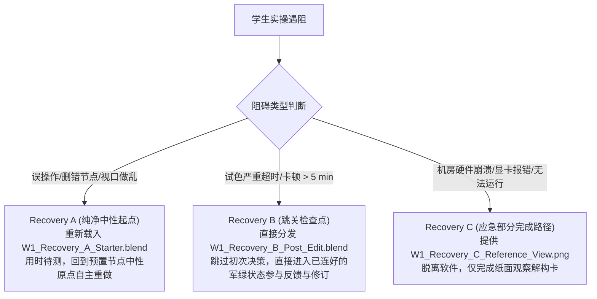

# Week 1 可执行 160 分钟教学包 (Week 1 Executable Teaching Package v0.1)

> **执行工单**：GitHub Issue #11 (WU2), GitHub Issue #15 (WU2B — Option B Teacher Delta), GitHub Issue #32 (WU — Week 1 Go-Live Correction), GitHub Issue #35 (Capacity Preflight), GitHub Issue #37 (Week 1 Front-Half Realignment & Native Geometry Warmup)  
> **上游依据**：GitHub Issue #9 (WU1 运行时切片通过), GitHub Issue #14 (Course Owner Review Gate), GitHub Issue #28 (`docs/research/week1-9-teaching-evidence-map.md` KU-W01-1..4), `course-design-ledger.md` (2026-10-09 Accepted Decision)  
> **交付物定位**：供单名教师面向 35 人/17 人大班真实执教的 Week 1 完整教学实施方案、本地资产清单、160 分钟排课预算、教师标准答案与恢复兜底规范  
> **测试运行时**：Blender 5.2.2 LTS (macOS Darwin 24.6.0 Apple Silicon)  
> **判定结论 (Status)**：**TEACHER-ACCEPTED BASELINE WITH OPEN VALIDATION — PPT PRODUCTION HOLD / CLASSROOM CAPACITY UNMEASURED**  
> **2026-10-09 / Issue #37 变更说明**：本版落实 Course Owner 2026-10-09 决策：确立“一条主线、两类素材职责”；在 B3 引入极简原生几何体热身（首次上机提前至约第 30 分钟），降低初学者门槛与视口手感障碍；分层讲解 UI（热身仅讲基础视口导航与材质入口，手电筒正式任务才引入 Shading 工作区与 Shader Editor）；概念导入先直观再应用；消减开场知识测验与观察重叠；严禁示范污染学生独立判断；坚决保护手电筒主线、Option B 预置节点与课内闭环核心。160 分钟总预算与各环节时间仍为 `PLAN BUDGET`（PROPOSED / RUNTIME REQUIRED）。

---

## 1. 教学定位与预期可观察成效 (Purpose & Observable Outcomes)

### 1.1 教学定位
Week 1 是《三维数字材质制作》的第一堂实践课。本周不追求复杂的材质网络构建，而聚焦于**破除初学者将“三维材质”误解为“二维手绘贴图”的固有心智模型**。课程通过实物观察解构、数字观察环境定位，以及在预置资产上完成一次小而可见的材质决策与反馈修订，确立 PBR 材质创作的基本因果律与工程纪律。

依据 Issue #14 / #15 / #32 及 **Issue #37 教师决策**，本方案确立以下结构原则：
1. **一条主线、两类素材职责**：低复杂度原生球体/立方体用于视觉原理的最小直观解释与 Blender 基本手感操作热身；Poly Haven **Vintage Flashlight** 严格保留为第一周正式材质观察/改色案例及 W1–W6 有界混合拓扑连续性载体；W7–W9 独立期末资产边界保持不变；
2. **更早进入 Blender**：学生在约第 30 分钟亲手添加、选中、移动/缩放少量原生几何体，认识 3D Viewport、Outliner、基础对象属性/材料入口、视口导航与 Material Preview；教师提供最小预设环境与基础材质。热身**不单独评分、不提交、不要求精确复刻老师场景**；
3. **分层讲解 UI**：几何体热身只讲位置和基本手感；正式手电筒任务才引入 Shading 工作区、Shader Editor、材质槽及预连 `Body_Color_Tint`。保持 **Option B (Scaffolded Shader Editor / 预连节点支架式入口)**：W1 不要求学生创建/接线节点（B = DEFER, NOT OMIT），将延后能力路由到 #13；
4. **单教师大班与保护核心**：坚决保护材料观察和独立判断、学生一次可见手电筒材质决策、反馈 $\to$ 针对性修订、保存 $\to$ 完全退出 $\to$ 重开持久化、轻量提交仍可在课堂内完成；不得通过隐藏课后债务吸收超时。

### 1.2 预期可观察成效集合 (Observable Outcomes)
学完 Week 1 课程后，学生应能独立展现以下四项行为成效：
1. **[LO1 观察解构] 区分固有属性与光影表象**：能审视工业资产参考图与三维视口，理解视觉表象是由材质微表面、几何形态、环境光照与观察视角耦合产生；独立填写决策卡，将表象解构为物理材质属性（Base Color, Roughness, Metallic），并严格剥离外部光源光斑与外部投影（核心记忆锚点：“高光会跑，别把它画死在 Base Color 里”）；
2. **[LO2 材质决策与修订闭环] 判别式理解与单一可见动作**：
   - 掌握有界色彩叠加调节（Bounded Color Adjustment）的数学与色彩原理，通过一个 **`Predict → Operate → Explain`** 判别式检查（理解纯白为 Multiply 中性元、染色保留底层纹理的因果机制）；
   - 在预置材质槽中检视预置链路（`Body_Color_Tint`），调节混合强度 Factor 与目标色 Color B 完成一次外壳涂装变体；
   - 在课堂反馈后，完成对同一决定的针对性修订，并记录“初次决策 / 接收反馈 / 修订动作”三字段闭环证据；
3. **[工程/LO3 预备性证据] 局部保护与数据持久化**：在完成外壳修改的同时，确保受保护部件（玻璃镜片、反光碗、机械螺栓）零污染；在课堂内完成工程保存、完全退出 Blender 进程并重新打开，验证修改 100% 完整持久化；
4. **[轻量化证据交付]**：独立提交 1 份结构化决策卡（含观察表、判别式检查与修订三字段）与 1 张标准机位视口截图，源工程本地保留以备抽查。原生几何体热身不产生额外提交工件。

### 1.3 教师专用标准参考答案 (Teacher Answer Key — 严禁下发给学生)
学生端任务单（`docs/research/week1-student-handout-v0.1.md`）为纯净填空卡，以下参考答案仅供教师投屏讲评与批阅参照。  
**核心教学纪律**：现实与 CG 外观由**材质微表面、几何形态、环境光照与观察视角**四者耦合共同产生，讲评时应引导学生理解多重物理因素的因果贡献，**严禁将外观强行归结为单一虚假确定性，严禁将历史审美偏好伪装成物理规律错误**。

| 观察部位 | 视觉现象 (SEE) | 物理/材质推断 (IS) — 多因素耦合分析 | 初步对应通道/属性 | 属性判断标准 | 批阅与讲评要点 |
| :--- | :--- | :--- | :--- | :--- | :--- |
| **手电筒主体外壳** *(核心必答)* | 暗绿微哑光涂层，表面有细微颗粒感与微弱漫反光 | 基底涂层的选择性波长吸收与漫散射（体现为色调）＋ 表面中度粗糙微表面（导致反射光漫散）共同呈现 | Base Color (墨绿固有色) ＋ 中高 Roughness (表面微观粗糙) | **固有表面属性** | 必须指出外壳本身具有固定的吸收与漫反射特性；微表面粗糙度决定了光线在表面是漫散还是镜面汇聚。 |
| **外壳高光光斑** *(核心必答)* | 亮白色反光斑点，亮度高，随视角移动而移动 | 外部光源射入、微表面法线分布（集中程度）与观察视线方向共同形成的镜面反射锥（Specular Reflection） | **环境光照 ＋ Specular / Roughness ＋ 观察视角** | **外部光影与视角耦合 (非固有色)** | **全课核心错题点**：严禁学生将其画入 Base Color！必须强调：高光斑随光源和视点移动，不是物体表面的固有印记。 |
| **灯头透明镜片** *(引导讨论)* | 清澈透明、高透光、能看清内部灯泡与结构 | 介电质透光介质，入射光线穿透表面并在介质内部传播（屈光折射与透射） | **Transmission (透射)** ＋ 低 Roughness ＋ IOR (折射率) | **固有光学属性** | **关键概念厘清**：透射（Transmission）≠ 表面透明遮罩（Alpha）！玻璃属于光线穿透介质的屈光折射；贴图 Alpha 控制表面不透明度与透明遮罩（surface transparency / opacity masking），二者物理机制与通道完全不同。 |
| **灯杯反光碗** *(引导讨论)* | 极强镜面反射、银白锃亮金属光泽、镜像倒影清晰 | 自由电子对光线的全频段强反射（无内部漫反射透射）＋ 极低微表面粗糙度（微表面法线高度一致） | **Metallic (金属度=1.0)** ＋ 极低 Roughness | **固有表面属性** | 辨识出抛光导体的高反射特性；金属的 Base Color 即为其镜面反射色（精确物理推导留待 W2 展开）。 |
| **外壳接缝处暗痕** *(引导讨论)* | 缝隙边缘有暗褐色线纹、凹陷内部明显变暗 | 几何凹陷自遮挡导致环境光线难以射入（环境光遮蔽 AO 效应）＋ 长期服役微观凹槽积存的真实污垢/油脂残留 | **几何 AO (自阴影) ＋ 接触污垢 (Base Color 脏污)** | **混合属性 (几何阴影 ＋ 物理污垢)** | **避免虚假单一确定性**：暗痕既有几何形态造成的遮光阴影（随环境光照存在），也有真实外来杂质残留（材质固有附着），两者叠加形成深色边缘。 |

> [!IMPORTANT]
> **Week 1 PBR 规范表述原则 (有界表述)**：  
> 1. **Base Color 绝对不能包含由外部光照引起的假高光与假阴影。它在金属与非金属材质中的精确物理语义将在 Week 2 展开。**  
> 2. **透射（Transmission）与 Alpha（不透明度遮罩）严格区分**：玻璃镜片的通透外观由 Transmission BSDF / 物理折射实现；贴图中的 Alpha 通道用于控制表面透明度与不透明度遮罩（surface transparency / opacity masking），严禁混为一谈。  
> 3. 不在 Week 1 强求学生推导能量守恒微观公式或微表面 GGX 分布，保护初学者认知阶梯。

---

## 2. 起始状态、观察环境与本地资产清单 (Starting State & Asset Manifest)

### 2.1 资产溯源与版权合规 (Asset Provenance)
- **资产名称**：Vintage Flashlight (老式军工手电筒)
- **创作者**：Omar M. El-Safy (Poly Haven)
- **许可协议**：CC0 1.0 Universal Public Domain Dedication (可无限制用于教学与分发)
- **确定性重建源**：官方原版 `vintage_flashlight_1k.blend` ＋ 官方 1K 贴图（diffuse, rough, metal, nor_gl, alpha）

### 2.2 教学接缝划分与 Starter 决策 (Teaching Seam)
- **几何与材质接缝划分**：将主体外壳（Main Body Shell，由 812 面下底壳与 650 面顶盖组成，共 **1,462 面**）预置为独立材质槽 **Slot 2 (`vintage_flashlight_body`)**；
- **Option B 预置节点接缝与有界色彩调节 (Bounded Color Adjustment)**：
  - 在 Slot 2 中预先串联好 **`Body_Color_Tint`** 节点（`ShaderNodeMix`，数据类型 `RGBA`，模式 `Multiply`，初始 `Factor=0.0`，插槽 `B` 颜色为纯白色 `(1.0, 1.0, 1.0, 1.0)`）；
  - **技术语义精准纠偏**：
    - Blender Mix Color 节点的 Multiply 模式数学公式为：$Result = (1 - Factor) \times A + Factor \times (A \times B)$；
    - 当 Factor=0.0 时，无论 B 为何色，输出均严格等于原贴图 A；
    - 当 Factor>0.0 时，原贴图 A 与颜色 B 逐通道相乘，实现原图基础上的**有界色彩叠加调节 (Bounded Color Adjustment)**；
    - **严正纠偏**：Multiply 与 Factor 属于着色器中的数学色彩叠加手段，**绝对不是物理世界中的“涂层厚度”或“喷漆覆盖率”**！真实物理涂层属于多层 BRDF（如 Clearcoat 或带 Mask 的层级材质混合），在 W1 必须准确讲授为“基于现有纹理的有界调色”，杜绝错误心智模型；
  - **实机测定视觉中性保障**：在 Blender 5.2.2 LTS 实机测定，Factor=0.0 结合 Multiply 与纯白色，与官方原版资产像素差严格为 0.0（Max pixel diff = 0.0000），确保学生开局处于预期的无调色中性原版状态；
- **为什么不让学生在 W1 自己做选面或建节点连线 (B = DEFER, NOT OMIT)**：
  - 避免初学者陷入快捷键盲区、数据类型报错与端口错连调试，保护核心的“观察解构与材质因果决策”时间。

### 2.3 唯一规范观察环境 (Canonical Observation Setup)
- **固定观察机位**：场景预置 `Cam_Obs`（焦距 75mm，锁定透视观察角）；全屏幕（Layout 与 Shading 工作区）默认锁定在 `Cam_Obs` 机位；
- **光照基准与视觉来源**：
  - **规范基准**：3D 视口统一采用 **Material Preview (材质预览模式)**。该模式基于 Blender EEVEE 引擎配合内置 HDRI 环境贴图提供中性预览光照。本项目 Starter 预置并固定了中性棚拍 HDRI 视口预设（Forest/Studio HDRI），作为受控教学资产基准（Project preset / runtime evidence），杜绝初学者因误删场景灯光导致视口全黑；
  - **参考图与 Recovery C 视觉基准**：学生的规范观察环境是固定的 Material Preview 设置。Recovery C / 教师参考图像采用项目相同的选定环境光照源（Forest/Studio HDRI）提供视觉一致的降级/参考效果；
  - **场景 Sun 光源定位**：场景中内置的 `Light_Obs` 仅作为未来/备用资产保留，**不作为 W1 规范观察基准的一部分**（视口默认不开启 Scene Lights）。

### 2.4 本地教学包清单与重构规范 (Local Teaching Package Manifest)
所有教学资产存放在本地开发工作区 `.scratch/teaching_package_w1/`（已配置于 `.git/info/exclude`，不污染公共提交树）：

| 目录 / 角色 | 文件名 | 规格与状态 | 来源与构建方式 |
| :--- | :--- | :--- | :--- |
| **`warmup/` (热身工程，新增)** | `W1_Warmup_Geometry_Starter.blend` | ~150 KB，内置原生 UV Sphere 与 Cube，默认 Material Preview (中性 HDRI)，基础 Material 槽与默认 Principled BSDF | 由确定性脚本自动生成，供第 30 分钟视口导航与材质初探，不评分、不提交 |
| **`starter/` (学生开局)** | `W1_Starter_Vintage_Flashlight.blend` | 2.1 MB，3 槽完备，预连中性 `Body_Color_Tint` 节点，全屏幕预设 Material Preview 与 `Cam_Obs`，贴图全内置打包 (Pack All) | 由官方资产经确定性 Python 脚本切分 Slot 2、预接调色节点、打包贴图并校准各屏幕视口生成 |
| **`recovery/` (恢复 A)** | `W1_Recovery_A_Starter.blend` | 2.1 MB，纯净预连中性开局备份 | 同 Starter，供操作彻底做崩的学生回到原始起点（实际恢复用时待测） |
| **`recovery/` (恢复 B)** | `W1_Recovery_B_Post_Edit.blend` | 2.1 MB，已完成首次材质决策检查点 | 内置已调好的 `Body_Color_Tint` (Multiply 0.85, 军绿)，供掉队者跳关进入反馈与修订（如实标注借用起点） |
| **`recovery/` (恢复 C)** | `W1_Recovery_C_Reference_View.png` | 2.2 MB，标准机位渲染图 (1920x1080) | 教师参考效果图，**极端设备故障时的应急部分完成路径** |
| **`reference/` (教师参考)** | `W1_Reference_Result.blend` | 2.1 MB，包含反馈修订后的终态参数 | Factor=0.80，颜色纯度与明度经微调优化后的最终工程 |
| **`textures/` (共享贴图)** | `vintage_flashlight_*.{jpg,exr,png}` | 5 张 1K 贴图，共约 1.9 MB | 官方 Poly Haven 原生贴图，作为外部独立文件同步保存备查 |

> **确定性重构指令 (Deterministic Rebuild)**：在目标 Blender 5.2 LTS 环境下，运行仓库持久化脚本 [`tools/teaching/build_week1_teaching_package.py`](file:///Users/yamlam/Documents/GitHub/corso-pbr-materials/tools/teaching/build_week1_teaching_package.py) 与 [`tools/teaching/scaffold_week1_geometry_warmup.py`](file:///Users/yamlam/Documents/GitHub/corso-pbr-materials/tools/teaching/scaffold_week1_geometry_warmup.py)：
> ```bash
> "/Applications/Blender 5.2.2 LTS.app/Contents/MacOS/Blender" -b --python tools/teaching/scaffold_week1_geometry_warmup.py
> "/Applications/Blender 5.2.2 LTS.app/Contents/MacOS/Blender" -b --python tools/teaching/build_week1_teaching_package.py
> ```
> **生命周期与运行时验证指令 (Lifecycle & Runtime Verification)**：
> ```bash
> "/Applications/Blender 5.2.2 LTS.app/Contents/MacOS/Blender" -b --python tools/teaching/verify_week1_lifecycle.py -- .scratch/teaching_package_w1
> ```

---

## 3. 真实 160 分钟规划预算 (160-Minute Planning Budget)

> [!IMPORTANT]
> **预算属性与 Issue #37 变更声明**：  
> 以下 160 分钟分配为**教学设计计划预算 (PLAN BUDGET)**，各 Block 分钟数与上机节点属于 **`PROPOSED / RUNTIME REQUIRED`**，非实测学生时间。现有自动化前飞、历史 GUI 点检不能替代真人走课或学生计时。  
> **核心结构调整（Issue #37 accepted delta）**：  
> 1. **首次上机提前**：由原第 85 分钟大幅提前至约第 30 分钟（Block 3 极简几何体热身），破除初学者开场枯坐，快速建立视口导航手感与光影直观认知；  
> 2. **开场去测验**：消减原 5 分钟开场知识摸底，避免与后段观察重叠；保留全景导学（15 分钟），压缩冗余讲解；  
> 3. **分层 UI 教学**：Block 3 仅讲 3D 视口、Outliner、对象变换与基础材质入口（Material Preview）；Block 5 引入手电筒时才正式切入 Shading 工作区、Shader Editor 与 `Body_Color_Tint` 节点；  
> 4. **示范防污染**：教师示范采用独立物体/参考图，不直接剧透手电筒观察答案或同题判别式结论；  
> 5. **坚决落实 No-hidden-homework 原则**：超时裁剪优先移除 optional/次要讨论，不切核心学习，不将课堂超时转化为课后债务。

| 模块序号 | 教学环节与活动 (Block / Activity) | 计划预算 (Plan Budget) | 教师动作 (Teacher Actions) | 学生动作 (Student Actions) | 阶段产出与达成证据 | 超时裁剪规则 (Overrun / Cut Rule) |
| :---: | :--- | :---: | :--- | :--- | :--- | :--- |
| **Block 1** | **课程导学与全局图景**<br>(Course Orientation & Big Picture) | **15 min**<br>(PROPOSED) | 进行《三维数字材质制作》全景介绍（导学五要素）：<br>1) 演进轨迹 (W1 固有色 $\to$ W2 节点与材质分类 $\to$ W3 法线 $\to$ W4 程序化噪波 $\to$ W5 UV贴图绘制 $\to$ W6 清漆与微案例 $\to$ W7–W9 独立期末大作业)；<br>2) 案例主线 (手电筒为主道具，雕像/花瓶为微案例)；<br>3) 练习体系 (课内轻量决策卡+视口截图闭环，零课后债务)；<br>4) 期末期望 (解耦手电筒，独立材质 LookDev)；<br>5) 考核原则 (物理因果与工程规范优先，非主观审美)。<br>强调保护核心与机房纪律，不组织独立开场测验。 | 聆听课程全局定位与考核框架原则，建立 9 周学习预期；登录机房工作站，就位准备。 | 建立全课宏观框架认知；消除考核焦虑与课后作业负担预期。 | 若开机慢，精炼压缩案例展开，紧扣里程碑与零课外作业原则，12 分钟内收拢。 |
| **Block 2** | **PBR 直观概念导入与视觉原理**<br>(Intuitive PBR Concepts & Visual Principles) | **15 min**<br>(PROPOSED) | 1) 游戏/影视 PBR 用途与简短视觉悬念；<br>2) 4 个标准术语及大白话：Base Color (固有色)、Roughness (粗糙度/反光散不散)、Metallic (金属度/非黑即白)、Normal (法线/假装有凹凸)；<br>3) 识别光照/视角 vs 材质：核心记忆锚点“**高光会跑，别把它画死在 Base Color 里**”；<br>4) 直观辨析 Transmission (透光折射，如玻璃) vs Alpha (表面遮罩/镂空)。<br>**示范防污染纪律**：教师使用非手电筒参考图（如木球、光滑瓷片）示范，**绝不直接示范手电筒外壳部件**，保护学生独立判断空间。 | 聆听并记录 4 大英文术语大白话；理解光照/视角与材质的区别；领会“高光会跑”核心因果。 | 建立 PBR 基础因果心智模型（区分光照与固有属性）。 | 若互动提问较多，仅强调 Base Color 剥离高光与 4 术语，12 分钟内结束。 |
| **Block 3** | **极简原生几何体热身与视口初探**<br>(Native Geometry Warmup & Viewport Hands-on) | **20 min**<br>(PROPOSED) | **学生首次接触 Blender（约第 30 分钟）**：<br>1) 指导学生打开极简预设工程 `W1_Warmup_Geometry_Starter.blend`；<br>2) 认识 3D Viewport (视口导航：旋转/平移/缩放)、Outliner (大纲视图对象树)、基础变换 (G/R/S)；<br>3) 认识 Material 属性面板入口，切换到 Material Preview (解释内置环境 HDRI)；<br>4) **灯光行为明确**：Material Preview 默认不启用 Scene Lights，明确告知学生无需调场景灯，避免误区；<br>5) 亲手转动视口，观察球体上的高光随着视角旋转而滑动（实证验证“高光会跑”）；尝试微调 Principled BSDF 的 Base Color 与 Roughness。<br>**纪律声明**：热身不评分、不提交、不强制复刻教师布局。 | 亲手在 3D Viewport 中添加/选中球体与立方体，练习视口导航三键客；在 Material 面板改动基础颜色与粗糙度；旋转视口亲眼观察高光移动。 | **首次操作掌控感**：消除对 Blender 界面的陌生感，直观实机验证“高光会跑”。 | 若添加物体遇阻，教师提示“只看默认预置球体即可”，跳过额外快捷键，15 分钟内切出。 |
| **Block 4** | **手电筒主案例观察与物理因果解构**<br>(Flashlight Observation & Causal Decomposition) | **20 min**<br>(PROPOSED) | 投屏手电筒多视角参考图，引导学生转入正式案例；<br>巡视指导学生独立填写《任务单 任务 A：观察与物理解构决策卡》；<br>重点保障：主体外壳 (固有色) 与外壳高光光斑 (光照与视角耦合) 两项核心必答；<br>对灯头透镜、反光碗做 2 分钟全班提点收拢（吸收原 B4 共性诊断，不单列 15 分钟冗长诊断）。 | 审视手电筒实物参考图，独立填写任务单中的决策卡；辨识主体外壳墨绿固有色与高光斑的光影归属。 | **LO1 核心证据**：完成任务 A 决策卡（区分固有属性与光照表象）。 | **No-hidden-homework 规则**：优先闭环前两项核心必答，后三项由教师口头提点，坚决不留课外债务。 |
| **Block 5** | **正式手电筒任务导入与分层 UI**<br>(Flashlight Task Introduction & Layered UI) | **15 min**<br>(PROPOSED) | **正式手电筒任务分层导入**：<br>1) 指导学生打开 `W1_Starter_Vintage_Flashlight.blend`；<br>2) **引入 Shading 工作区与 Shader Editor**：指认材质槽 Slot 2 (`vintage_flashlight_body`)；<br>3) 指认预连的 `Body_Color_Tint` 节点（Multiply 模式）；<br>4) 讲解有界调色数学原理（相乘正片叠底，强调不是真实喷漆厚度）；<br>5) 演示一次 Factor 与 Color B 调节控件，**严禁回答同题判别式检查的最终结论**；演示后复位为初始中性态交接给学生。 | 打开手电筒工程，确认处于 Shading 工作区与 Cam_Obs；定位 Slot 2 与 `Body_Color_Tint` 节点，理解数据流向。 | 掌握在 Option B 预置框架下定位材质槽与检视节点的操作路径。 | 严禁扩充节点搭建；仅聚焦预连节点控件，严格在 15 分钟内结束。 |
| **Block 6** | **手电筒首次材质决策与判别式改色**<br>(Student Practice: Predict & Material Action) | **25 min**<br>(PROPOSED) | 巡回指导，监督学生独立完成 `Predict → Operate → Explain` 判别式检查（纯白乘法不变，纯黑乘法变黑）；<br>**交接纪律**：提示学生完成白/黑测试后，将节点恢复为中性基准态，再开始军工风格改色；<br>引导学生将 Factor 调至 0.85 并在 Color B 选定目标色，填写字段 1；<br>对试色严重纠结或卡顿超 5 分钟者下发 Recovery B 跳关。 | 独立完成判别式预测、实操与因果解释；将节点恢复基准后调节 Factor 与 Color B，完成首次涂装决策并在决策卡填写字段 1。 | **LO2 核心证据**：完成判别式解释，外壳呈现可见颜色变体，受保护区完好，记录初次决策参数。 | **超时即截断**：20 分钟未调出满意色彩者强制锁定当前色；误操作或卡顿超 5 分钟者直接下发 Recovery B 跳关。 |
| **Block 7** | **现场分层巡视反馈与抽检**<br>(Roaming Feedback & Mid-point Check) | **10 min**<br>(PROPOSED) | 快速巡视全班屏幕；抓取常见风格偏离（如色彩荧光过饱和像现代塑料玩具、改错材质槽）进行 3 分钟全班口头广播点拨；引导历史风格参考对齐（不误称为物理违规）。 | 停手听取反馈，在决策卡记录所听到的共性反馈要点（填写字段 2）。 | 获取课内即时反馈，识别修改方向。 | 取消个别细致答疑，改为 3 分钟统一广播指导，确保留出完整的学生修订时间。 |
| **Block 8** | **学生受控修订：优化同个材质决策**<br>(Student Revision on the SAME Decision) | **15 min**<br>(PROPOSED) | 提示学生聚焦修订当前决策：在拾色器中降低饱和度、微调明度与 Factor（如 0.85 $\to$ 0.80）；记录修订动作与改进理由（字段 3）。 | 针对教师反馈，微调 Mix 节点参数或颜色纯度，完成修订并在决策卡填写字段 3。 | **LO2 终极闭环**：形成初次决策 $\to$ 接收反馈 $\to$ 修订动作完整闭环。 | 若前序超时，本环节缩减为 10 分钟，只要求微调滑块，不推倒重来。 |
| **Block 9** | **工程保存、退出重启持久化验证**<br>(Save, Quit & Reopen Verification) | **10 min**<br>(PROPOSED) | 指导学生规范命名保存工程；**监督全班必须执行“完全退出软件并重开”**的持久化核验。 | 执行 `File -> Save As`；完全退出 Blender 进程；重新双击打开，确认节点、参数与贴图完整。 | **工程/LO3 预备性证据**：保全数据与验证重开完整性。 | **坚决不裁剪此环节**；若时间受压，优先压缩 Block 10 收尾与 Block 11 缓冲。 |
| **Block 10** | **轻量交付与全课收尾**<br>(Submission & Wrap-up) | **5 min**<br>(PROPOSED) | 发布作业上传通道；快速强调 PBR 核心因果与下周预告；指导学生提交决策卡与截图。明确教师批阅与收件通道不混占时间。 | 提交决策卡 ＋ 1 张视口截图；将 `.blend` 保存在本机目录备查。 | 完成全员证据归档，建立课后审计备查源。 | 取消任何作品展示与反思，直接进行扫码交卷与本地工程保存确认，控制在 5 分钟内完成。 |
| **Block 11** | **显式缓冲与极端恢复容量**<br>(Explicit Buffer & Recovery Capacity) | **10 min**<br>(PROPOSED) | 协助个别机器故障或严重卡顿学生恢复工程；处理机房技术突发状况。 | 顺利完成者可微调材质观察角度；掉队者在教师协助下完成基础截图。 | **兜底容灾**：吸收课堂偶发性时间膨胀，保障全班达标率。 | **完全弹性**：若前序零延误，用作优秀作业展评与 W2 预告；若有延误，完全被前序吸收。 |
| **总计** | **全课 11 模块总时长** | **160 min** | **严格等于 160 分钟 (PLAN BUDGET)** | **严格等于 160 分钟 (PLAN BUDGET)** | **涵盖 LO1/LO2/LO3 全部最低可观察成效** | **每环节具备明确保护核心与降级路径** |

---

### 3.4 教学 Block 极轻 PPT 投影与 Presenter Notes 记忆锚点 (Lightweight PPT Projection)

在活动设计阶段，每个教学 Block 仅关联极轻 PPT 投影（候选页数非冻结、单页单一 takeaway、教师一句记忆锚点、Notes 意图），后续平滑进入单线 Markdown Slide Draft：

| 模块序号 | 教学环节 | 候选页数 (非冻结) | 页面单一 Takeaway / 学生可见核心 | 教师一句记忆锚点 (Memory Anchor) | Presenter Notes 核心意图 (解释/误区/转场) |
| :---: | :--- | :---: | :--- | :--- | :--- |
| **Block 1** | 课程导学与全局图景 | 2 页 | P1: 9周材质演进轨迹与手电筒主干<br>P2: 课内闭环交付与零课外作业承诺 | “课内闭环改色与保存，不留课后无解作业。” | 解释 9 周里程碑；澄清考核以物理因果和工程规范为准，消除初学者焦虑。 |
| **Block 2** | PBR 直观概念导入 | 3 页 | P3: PBR 为什么真实与 4 个术语大白话<br>P4: 旋转视角看光影：高光会跑<br>P5: 透光折射 (Transmission) vs 表面透明遮罩 (Alpha) | “高光会跑，别把它画死在 Base Color 里。” | 直观悬念导入；强调高光斑是光源与视角耦合产物；示范用独立道具，不泄露手电筒答案。 |
| **Block 3** | 原生几何体热身 | 2 页 | P6: 视口手感三键客与 Material Preview<br>P7: 几何体小实验：亲眼看高光移动 | “几何体练手感，不打分不提交，转动视口看高光。” | 降低 Blender 门槛；澄清 Material Preview 默认不启用场景灯，无需调灯；实测验证高光滑动。 |
| **Block 4** | 手电筒观察与解构 | 2 页 | P8: 手电筒实物解构：外壳颜色是哪来的？<br>P9: 因果解构自查清单 (外壳 vs 高光) | “两项核心课内闭环，教师示范不剧透答案。” | 引导独立填表；重点抓主体外壳固有色与高光斑光影归属；后三项提点收拢，零课后债务。 |
| **Block 5** | 正式手电筒任务导入 | 2 页 | P10: 分层进入 Shading 工作区与 Slot 2<br>P11: `Body_Color_Tint` 节点两处调节靶点 | “分层进 Shading，节点已预接好，只动预设调色器。” | 解释 Option B 预置支架；讲解 Multiply 数学相乘不是物理漆层；控件示范不泄露判别式答案。 |
| **Block 6** | 手电筒判别式改色 | 2 页 | P12: 判别式挑战：Multiply 乘纯白/乘纯黑<br>P13: 你的第一个材质决策：外壳选色 | “预测-操作-解释，改色前先复位基准，记录真实决策。” | 监督独立判别式思考；强调做完白/黑测试后复位基准态再选色；卡顿超 5 分钟下发 Recovery B。 |
| **Block 7** | 巡视反馈与抽检 | 1 页 | P14: 巡视共性点拨：军工质感与饱和度控制 | “广播反馈抓共性，不占学生修订时间。” | 针对荧光塑料感做 3 分钟集中点拨；引导历史风格对齐，不把审美偏好说成物理违规。 |
| **Block 8** | 受控修订 | 1 页 | P15: 针对性微调：同一决策的优化证据 | “围绕反馈做微调，三字段记录真实改进。” | 指导微调 Factor 与拾色器；完成“决策-反馈-修订”闭环；强调不推倒重来。 |
| **Block 9** | 保存退出重开 | 1 页 | P16: 数据安全生命线：完全退出并重启重开 | “保存之后真退出，重开确认贴图参数在。” | 强调工程规范；监督全员完全退出进程再重开，排除资产丢失隐患。 |
| **Block 10** | 轻量交付与收尾 | 1 页 | P17: 今日交付清单：决策卡 ＋ 标准截图 | “极轻双联提交，工程源文件本机存盘备查。” | 指导极简提交；下周预告；明确收件与教师批阅不混占课内时间。 |
| **Block 11** | 显式缓冲与恢复 | 1 页 | P18: 备用缓冲与三级容灾通道 | “全课共享十分钟，三级梯队保全员通关。” | 解释 Recovery A/B/C 用途；吸收全课偶发延误；保证单师大班课内闭环。 |

---

### 3.1 课堂节奏/容量验证法（Issue #35，嵌入既有教学契约）

以一次可观察的课堂事件为单位：讲解/看图、独立判断、软件操作、等待/切换、反馈、修订、保存/提交、恢复。只在本表记录需要改变决定的证据，不写逐字稿、不新增计时系统。方法属于 `PROJECT INFERENCE`，不构成外部教学研究结论。

- **两种时钟分开**：记录课堂事件起止及学生状态；另记教师实际忙于讲评、救援、收件的区间。学生同时操作不把每人用时相加；教师不能同时进行两项需本人注意力的工作。并行只能由观察证明。
- **最低记录字段**：日期、执行者身份/人数/经验、材料修订与实际文件、设备/Blender/通道；每事件的起止、净历时、等待原因、求助次数及教师用时、留下的作品/记录、完成/部分完成/阻断、恢复分支、已用 buffer。无数据填 `未测`，不填 0。
- **buffer 只算一次**：全课只有 Block 11 的 10 分钟共享余量。延误在发生处记录，剩余量 = 10 分钟减去累计已消耗量，不在每个 Block 或每名学生重新发放 10 分钟。超出窗口的探查另记为课外诊断时间，不能伪装成课内完成。
- **证据范围**：教师真人试讲支持讲述顺序、指令清晰度和恢复交接；教师/专家实际操作只支持该人的路径与用时。陌生执行者须说明是否接近学生起点。只有真实学生操作才能提供学生耗时样本；单人/小样本不代表 35 人或 17 人班级容量。

### 3.2 三类可观察判定标准

| 判定 | 足以触发的观察 | 不能据此判定 | 当前应用结果 |
| --- | --- | --- | --- |
| **内容不足信号** | 与学生起点接近的执行者在无答案泄露、无代做/跳关的条件下，完成受保护产出及解释、反馈修订、保存交付后，仍出现反复的无任务等待；记录剩余分钟与人数，且等待并非预留 buffer、设备故障或教师服务排队 | 教师提前讲完、页数少、熟手做得快、只复制参数、Recovery B 提前完成 | **未成立**：本轮没有真人完成/空等数据，不据此补知识或凑讲稿 |
| **过载信号** | 到达既定窗口，按现有 optional cut/恢复规则仍未完成受保护产出；或救援队列使反馈、修订、保存被挤掉，累计延误超过剩余 buffer。记录具体失败点、缺失产出与时间归属 | 单个软件报错、材料含矛盾、预计任务多、预算合计160；这些先记风险，不能直接宣称全班过载 | **存在局部风险，未实证过载**：状态交接、Recovery B证据身份、收件/浏览/救援争用尚未闭环 |
| **预算仍未实测** | 缺实际文件、真人执行者、事件计时或有效学习产出；仅有文档推演、脚本断言/预设用时、专家点检；或旧时间来自不同修订/环境 | 不能用“总和正确”或“脚本PASS”补足缺项 | **本轮正式判定**：160分钟及本轮片段容量均未实测 |

这些是诊断条件，不是必须三选一给出负面结论。真实试走若产出完整且落在窗口内，可记“本片段在该样本/环境内可容纳”；仍不自动证明全课或两班可行。首次小样本的不足/过载信号只触发局部修订和复验，不设未经验证的全班百分比门槛。

### 3.3 最小后续真人试走入口（未执行）

用当前真实 Starter、Handout、关键视觉与实际收件通道，优先走任务 B–C 的一条常规路径，再走一次 Recovery B 后的反馈/修订路径。建议先有 1 名接近学生起点的陌生执行者；这是找首个阻塞点的小样本，不是班级代表性证明。教师准备真实材料并记录求助，Agent不能扮演学生产生计时证据。

复用 Block 5–10 的原窗口：15/25/10/15/10/5 分钟，共80分钟；其中学生 Block 6–10 为65分钟。只抽走子片段时，仅记该事件实际时间，不把它与整块预算直接比较，也不按比例外推160分钟。沿用卡顿超过5分钟、试色到20分钟等已有触发点。记录正常路径与恢复路径各自起点，不把两遍试验时间合成一堂课。

出现材料矛盾或未知通道立即记首个阻塞点。任何临场补充指令都要记下，修正回源后只复走失败交接；不把专家口头补全后的通关记成原材料通过。收尾保留既有三字段、PNG、本地保存重开证据；额外现场计时由观察者承担，不增加学生必交作业。

---

## 4. 保护核心与超时裁剪一致性规则 (Protected Core & Cut Consistency)

### 4.1 坚决保护的核心 (Protected Core — 严禁裁剪)
1. **区分物理属性与环境光影/污渍的观察解构动作**（LO1 核心）；
2. **`Predict → Operate → Explain` 判别式理解**（杜绝无脑抄参数）；
3. **在受保护资产上实施一次可见材质决定的体验**（LO2 核心）；
4. **针对教师反馈完成对同一决定的修订闭环**（反馈闭环核心：填写三字段卡）；
5. **课堂工程保存、完全退出 Blender 进程并重开持久化验证**（工程/LO3 预备性证据，**坚决不裁剪**）。

### 4.2 超时裁剪优先序列与 No-hidden-homework 规则
为维护上述保护核心的一致性，出现延误时，严格按以下顺序从外向内削减非核心环节，**严禁将课内未完内容推迟为课后作业**：
1. **首裁 1 (削减 Block 11)**：完全压缩 10 分钟显式缓冲时间；
2. **首裁 2 (削减 Block 10)**：取消收尾讲评与交流，将 5 分钟的 Block 10 压缩为纯粹的 1–2 分钟扫码交卷与本地工程保存确认；
3. **首裁 3 (削减 Block 3 几何体热身非核心操作)**：若学生添加几何体或寻找面板卡顿，教师广播提示“直接使用预置好的默认球体”，跳过复杂的物体变换与参数微调，保护后续手电筒主线时间；
4. **首裁 4 (削减 Block 4 讨论)**：若观察耗时过长，仅要求学生完成主体外壳与高光斑两项核心必答，后三项由教师口头 1 分钟提点收拢，不作为课后必做任务；
5. **首裁 5 (削减 Block 6 试色)**：自由试色延误超 20 分钟者，直接由教师统一下发军绿标准色参数完成达标；
6. **首裁 6 (下发 Recovery B)**：试色严重卡顿或操作受阻超 5 分钟者，强制调用 Recovery B 跳关进入微调与反馈修订（如实标注借用起点）；
7. **首裁 7 (缩短互评)**：取消学生之间的同桌互查，改为教师集中 3 分钟广播讲评。

---

## 5. 最低证据设计与单教师可行性 (Evidence & Feasible Submission)

### 5.1 全员轻量证据模型
针对单教师面对 35/17 人大班的批阅边界，全员证据必须极轻，同时又能闭环证明观察、判别式思考、初次决策、反馈以及修订动作：

```
[全员必交证据 (100%)] 极轻双联提交
  ├── 1. 结构化决策卡 (包含任务 A 观察表 ＋ 任务 B-2 判别式检查 ＋ 任务 B-4 修订三字段)
  │       ├── 判别式检查: Predict (预测) → Operate (实操) → Explain (解释因果)
  │       ├── 字段 1: 初次决策 (选定的色彩倾向与初始 Factor)
  │       ├── 字段 2: 接收反馈 (教师广播或自查发现的问题)
  │       └── 字段 3: 修订动作 (具体微调参数与改进理由)
  └── 2. 标准机位视口截图 (W1_Flashlight_[学号].png) -> 证明最终视觉达成
          │
          ▼ 教师课内极速批阅 (100% 覆盖，平铺画廊视图快速浏览，35 人约 5-8 分钟)
[抽样与异常深入审计 (10%-15%)]
  ├── 随机抽取 5 份本地工程 (.blend)
  └── 出现“截图明显异常 / 反光罩变色 / 节点错误求助”的学生工程
          │
          ▼ 现场或课后打开源工程核查 Slot 2 节点拓扑与面指派
[源工程本地留存]
  └── 学生本地保留 W1_Flashlight_[学号].blend，作为后续周次审计与复查源
[热身工程无需提交]
  └── W1_Warmup_Geometry_Starter.blend 仅供课堂手感练习，不产生评分与交付工件
```

### 5.2 证据核验对照表

**容量边界（#35）**：下表“预期批阅负荷”仍为计划值。§5.1 的“课内35人画廊浏览5–8分钟”、抽检工程每份1分钟与 Block 10 的5分钟之间，尚无明确排程/并行证据；不得同时认领同一教师时段。收件与完整评阅不是同一动作。其课内/课后归属保持教师待决，本次不偷偷改为课后任务。

| 证据类型 | 提交形态 | 教师核验方式 | 预期批阅负荷 | 达标判定标准 (Pass Criteria) |
| :--- | :--- | :--- | :--- | :--- |
| **观察、判别式与修订决策卡** | 任务单纸面填写 / 在线问卷 | 课内抽查 2 份共性讲评，其余课后批量扫视 | 5 分钟 (课内) + 10 分钟 (课外) | 表 A 区分光斑非固有色；判别式解释理解纯白相乘不变因果；三字段体现微调过程。 |
| **标准机位视口截图** | 单张 PNG 图像 (标准命名) | 教学平台缩略图平铺视图 (Gallery View) 快速浏览 | 5–8 分钟 (35 人全览) | 主筒身呈现明显色彩变体；反光碗仍为金属，玻璃透明透光，无洋红报错。 |
| **工程源文件 (`.blend`)** | 学生机房本地留存 | **不作课堂全员打开**；仅抽检 15% 或针对疑问截图调阅 | 抽检每份 1 分钟 | 打开后 Slot 2 包含完整的 Mix 节点，贴图打包完整无丢失，Slot 0 与 Slot 1 面数与节点无篡改。 |

> [!NOTE]
> **真实分发与提交渠道状态声明**：  
> 课堂实际提交物严格定义为【结构化决策卡 ＋ 视口截图 PNG】；本地工程保存在机房备查并供抽检。实际机房网络下发渠道与机房作业提交平台通道在现场演练前明确保持 **`DELIVERY PATH REQUIRED`** 与 **`SUBMISSION PATH REQUIRED`**。

### 5.3 Week 1 有界术语锚定表 (W1 Bounded Terminology Anchors)
按照“`English canonical term + 中文大白话解释 + visible-effect cue`”规范，严格界定 W1 核心术语：

| English Canonical Term | 中文大白话解释 | Visible-effect Cue (视口可见线索) | 教学定位与纪律 |
| :--- | :--- | :--- | :--- |
| **Material Preview** | **材质预览模式**：Blender 视口使用 EEVEE 引擎配合内置 HDRI 环境贴图提供中性预览光照（默认不启用场景灯光） | 3D 视口呈现柔和均匀反射与光照，无需手动打光即可看清模型细节 | W1 规范观察基准，避免因误删场景灯导致全黑；明确无需调场景灯 |
| **Base Color** | **基础颜色 (固有色)**：物体材质表面本身的反射颜色，大白话“剥离所有光影后的原本颜色” | 表现为外壳墨绿漆面或金属底色，表面绝对不含任何光源光斑 | PBR 核心因果纪律，核心记忆锚点：“高光会跑，别把它画死在 Base Color 里” |
| **Roughness** | **粗糙度**：微观表面微起伏程度，大白话“表面糙不糙、反光散不散” | 数值低时高光锐利如镜面，数值高时反光模糊漫散为哑光感 | 决定微表面光线漫散程度，W1 直观滑块体验 |
| **Metallic** | **金属度**：材料导体属性，大白话“是不是金属（非黑即白）” | 金属度为 1 时呈现金属反光（无漫反射固有色），金属度为 0 时呈现绝缘体塑料/涂层质感 | 绝缘体 vs 导体界线，W1 直观认知，精确公式 W2 展开 |
| **Normal** | **法线**：表面微观朝向，大白话“不用加面数，假装表面有凹凸” | 视口中呈现螺纹、接缝等微观起伏细节，但物体轮廓边缘仍保持平滑 | W1 仅建立“假装有凹凸”概念，W3 深入烘焙与微扰动 |
| **Shader Editor** | **着色器编辑器**：屏幕下方组装与控制材质逻辑的蓝图窗口 | 展现为由彩色连线互相链接的功能方块网图 | W1 认识其为材质逻辑承载地，不做从零连线 |
| **Node** | **节点**：着色器中的独立功能块（如 `Body_Color_Tint`） | 一个个具有左侧输入与右侧输出的矩形控制盒 | W1 只需识别其为局部调色功能单元 |
| **Connection / Data Flow** | **连接与数据流 (概念性)**：节点间由连线承载的数据流动（从左往右输出流入输入） | 贴图颜色通过连线流向 Mix 节点，运算后注入着色器端口 | 仅作概念理解，严禁学生在 W1 动手排查连线或重定向 |
| **Multiply** | **相乘 (正片叠底)**：将两路颜色数值逐通道相乘的色彩混合模式 | 乘以纯白 $(1,1,1)$ 完全不变，乘以目标色在保留底层纹理的同时产生有界染色 | 数学叠加运算，非真实涂层厚度 |
| **Factor** | **混合因子 (影响程度)**：控制相乘混合影响强度的 0.0 到 1.0 滑块 | 拖动滑块时，外壳从“无染色原底色 (0.0)”平滑渐变到“完全相乘染色 (1.0)” | **有界色彩叠加调节 (Bounded Color Adjustment)**，严禁误导为真实物理涂层厚度 |
| **Transmission vs Alpha** | **透射 vs 表面透明遮罩**：透射为光线穿透折射介质（玻璃）；Alpha 控制表面不透明度与透明遮罩（打洞/镂空） | 玻璃呈现屈光折射与透明通透，Alpha 表现为表面局部镂空遮罩控制 | 严格区分光学透射与贴图遮罩通道，直观辨析公式不展开 |

---

## 6. 恢复阶梯规范与局部完成属性 (Recovery Ladder)

为防止学生在课堂中脱节，设立完备的三级恢复阶梯：


```mermaid
flowchart TD
    Start["学生实操遇阻"] --> Cond{"阻碍类型判断"}
    Cond -->|误操作/删错节点/视口做乱| RecA["Recovery A (纯净中性起点)<br>重新载入 W1_Recovery_A_Starter.blend<br>用时待测，回到预置节点中性原点自主重做"]
    Cond -->|试色严重超时/卡顿 > 5 min| RecB["Recovery B (跳关检查点)<br>直接分发 W1_Recovery_B_Post_Edit.blend<br>跳过初次决策，直接进入已连好的军绿状态参与反馈与修订"]
    Cond -->|机房硬件崩溃/显卡报错/无法运行| RecC["Recovery C (应急部分完成路径)<br>提供 W1_Recovery_C_Reference_View.png<br>脱离软件，仅完成纸面观察解构卡"]
```

- **Recovery A (纯净中性起点)**：`W1_Recovery_A_Starter.blend`。适用于手滑误删节点、乱动保护材质槽的学生，恢复预置节点的纯净中性初始态（实际用时待测）；
- **Recovery B (检查点跳关)**：`W1_Recovery_B_Post_Edit.blend`。内置已连好并完成初次涂装决策（Multiply 0.85 军绿）的检查点。专门拯救试色纠结超 5 分钟的学生，使其直接跳过初次决策，跟上大部队参与反馈点拨、三字段记录与 Block 8 修订。字段1如实写“Recovery B预置起点”，与本人操作区分；恢复文件到位不自动证明独立首次决定。其学习证据补足与判分口径仍由教师决定；
- **Recovery C (应急部分完成路径)**：`W1_Recovery_C_Reference_View.png`。
  > [!WARNING]
  > **Recovery C 属性与 No-hidden-homework 声明**：  
  > Recovery C 仅为极端硬件崩溃或无法运行 Blender 时的**应急部分完成路径 (Emergency Partial-Completion Path)**。使用该通道的学生完成了 LO1 观察证据，教师如实记录其已达成的部分学习成效。若学校机房无后续备用实验条件，**严禁要求学生必须在课外自行寻找设备补做，不得将学校硬件故障转嫁为学生课外债务**。

---

## 7. 教师现场 GUI 点检记录与实机干跑证据 (Manual UI Spot-check & Dry-run)

### 7.1 Blender 5.2.2 LTS 手工 GUI 现场点检 (Option B Manual UI Spot-check)
以下保留基线报告的历史 macOS GUI 点检，本轮未复跑。它支持已点检控件/资产行为，不能证明 Handout 全步骤顺序、学生理解或课堂容量；历史熟手约15秒重开也不是学生用时。新发现与局部失效范围见 §7.3。

| 点检环节 | 界面实际表现与验证事实 | 与 Handout 匹配状态 | 教师注意事项 |
| :--- | :--- | :---: | :--- |
| **1. 打开 Starter 文件** | 双击打开，3D 视口默认激活 **Material Preview (材质预览)**，全屏幕机位自动锁定在 `Cam_Obs`。材质面板默认选中 Slot 2 (`vintage_flashlight_body`)。 | `[VERIFIED]` 吻合 | 学生开箱立即可见材质与锁定视角，无需手动寻找切换着色球。 |
| **2. 检视预连节点链路** | 切换到顶部 `Shading` 工作区，下方 Shader Editor 中 `Body_Color_Tint` 节点处于高亮激活状态，清晰可见预置好的 `vintage_flashlight_diff` $\to$ `Body_Color_Tint` (Multiply, Factor=0.0, 纯白) $\to$ `Base Color`。 | `[VERIFIED]` 吻合 | 节点网络已预先接通且目标节点高亮选中，学生开箱无需新建节点或连线。 |
| **3. 判别式检查验证** | Color B 设为纯白时滑动 Factor 视口完全不变；设为纯黑且 Factor=1.0 时外壳变黑但高光光斑完好；因果解释准确。 | `[VERIFIED]` 吻合 | 历史控件行为可用；独立理解仍须区分是否已听过答案，见§7.3。 |
| **4. 调节参数与视口响应** | 将 `Body_Color_Tint` 节点的 `Factor` 滑块拖动至 0.85，并在插槽 `B` 颜色块选取军绿色，3D 视口中外壳瞬间呈现有界色彩叠加变体效果，反光碗与玻璃完全零变动。 | `[VERIFIED]` 吻合 | 视口实时响应，色彩决策明显，保护区完全不受影响。 |
| **5. 保存与隔离路径重开** | 执行 `File -> Save As` 保存；彻底退出 Blender 进程并在无外部依赖的隔离路径下重开（isolated-path / dependency-isolated reopen on verified macOS host），视口、相机机位、`Body_Color_Tint` 调节参数 100% 持久化，内置打包贴图完整加载。 | `[VERIFIED (macOS)]` 吻合 | 隔离重开持久化流程顺畅，用时约 15 秒。 |
| **6. 打开 Recovery B** | 双击打开 `W1_Recovery_B_Post_Edit.blend`，视口直接呈现调好的军绿色，`Body_Color_Tint` 已预置 Factor=0.85 与军绿色，可直接用于反馈讲评与微调。 | `[VERIFIED]` 吻合 | 跳关检查点完备有效。 |

### 7.2 运行时与全生命周期自动化断言 (Automated Runtime & Lifecycle Assertions)
通过端到端生命周期验证套件 [`tools/teaching/verify_week1_lifecycle.py`](file:///Users/yamlam/Documents/GitHub/corso-pbr-materials/tools/teaching/verify_week1_lifecycle.py) 与前飞模拟套件 [`tools/teaching/rehearse_week1_continuous.py`](file:///Users/yamlam/Documents/GitHub/corso-pbr-materials/tools/teaching/rehearse_week1_continuous.py) 完成了全量断言测试：
- **断言 1**：核心文件存在性核验（Starter / Recovery A/B/C / Reference 全部就绪） (`PASS`)；
- **断言 2**：Starter 材质槽面数分配严格精确（Slot 0=3765, Slot 1=56, Slot 2=1462） (`PASS`)；
- **断言 3**：全部工作区屏幕（包括 Layout 与 Shading）3D 视口均处于 Material Preview 且锁定 `Cam_Obs` 机位 (`PASS`)；
- **断言 4**：Slot 2 中 `Body_Color_Tint` (Multiply, Factor=0.0, 纯白) 连线完整、选中聚焦且处于 active 状态 (`PASS`)；
- **断言 5**：全部 5 张 1K 贴图均完成内嵌打包（Packed File True，分辨率 1024x1024） (`PASS`)；
- **断言 6**：Recovery B 跳关检查点包含已完成的初次决策（Factor=0.85 军绿） (`PASS`)；
- **断言 7**：全生命周期端到端对齐模拟（`receive -> modify -> save -> submit Card+PNG -> isolated-path reopen .blend & read pixels`）：学生实际交付物（决策卡与视口 PNG）完整无误，抽检源工程在隔离路径重开（isolated-path / dependency-isolated reopen on verified macOS host）节点参数 100% 持久化、贴图零丢失、像素完整可读、保护槽零污染 (`PASS`)；
- **断言 8**：自动化排练模拟与前飞检查（Automated Rehearsal Simulation / Pre-Flight）：推演 160 分钟 11 模块时序衔接，捕获并修复 5 项前飞摩擦点 (`AUTOMATED PRE-FLIGHT PASS`；明确真人教师走课保持 `REHEARSAL REQUIRED`)。

---

### 7.3 已执行的材料级 bounded trial（2026-10-08，W1-CAP-20261008-A）

**身份与范围**：Agent 按真实 P/H 文本逐事件追踪状态、产出和时间归属，另审读已有前飞/生命周期脚本。真人教师0名、学生0名，未运行 Blender，未做口播计时。教学基线固定为 `9c4d5c4ca457326497266afb9b2132e03d007e81`，P/H/E 内容与该 ref 的 blob 一致。教师权限边界取自 [#32 checklist](https://github.com/carllx/corso-pbr-materials/issues/32#issuecomment-6011141058) 及 [launch packet](https://github.com/carllx/corso-pbr-materials/issues/32#issuecomment-6012146523)；治理 PR #34 head `68a4e8e` 仍为草案。

**可用性检查**：该 ref 的仓库树没有 Starter/Recovery 二进制，P §2.4 将其列为 IDE 本地资产；本次已解析的文件及精确文件名检索没有提供这些资产，当前运行环境也未找到 Blender 命令。故真实文件开机、窗口切换、保存、截图和提交一律记 `未执行`，不以重建替身或脚本自己填写的卡片补证。

| 事件与原预算窗口 | 按当前材料走到的状态/必须留下的证据 | 本轮观察及首个缺口 | 真人起止/历时、等待、求助/教师用时、buffer | 局部处置与边界 |
| --- | --- | --- | --- | --- |
| B5 讲解/看真实界面，15分钟 | 教师演示后让学生进入任务B | H术语已给纯白结果，P B5又先演示同题；B6随后答对不足以证明独立理解 | 全部未测 | 记录已提示身份；“练习还是独立证据”仍OPEN |
| B6 开文件、定位、独立判断、操作/切换，合用25分钟 | H B1–2：Starter原始F=0/B白；做白/黑检查并留下预测与解释 | 合法的“先白后黑、黑色F=1”路径会以F=1/B黑结束；下步却声称“当前中性F=0/B白”。这是文档状态反例，不是软件实测失败 | 全部未测 | H去掉错误的当前态/从0起调断言，保持既有目标参数；是否增加显式复位步骤仍OPEN |
| B6 首次色彩决定，仍在同一25分钟内 | H B3及字段1：可见外壳改色、保护区不变、真实起点 | 改后的文字允许按当前状态设目标数值；文档状态反例消除，真实控件响应/所需时间未知 | 全部未测 | **文字层复验通过**，不升格GUI或学生通过 |
| B7 反馈，10分钟 | 现场选问题、切回投屏、广播、学生填字段2 | 原3分钟广播后名义只余7分钟供巡视/采集/切换；同一教师还要救援的重叠时间未测 | 全部未测 | 保留预算，记录服务队列与切换，不假定全员逐一反馈 |
| B8 修订，15分钟 | 针对实际反馈调整同一决定，填字段3 | 无真人作品可检查；示例0.85改0.80不能代替观察学生为什么修改 | 全部未测 | 参数例子不作为学习通过率或时间证据 |
| B9 保存/退出/重开，10分钟 | H C1–2：同一学号文件重开后参数/贴图完整 | 历史GUI与脚本同进程open_mainfile分开看；本轮无实际文件和新进程 | 全部未测 | 保留历史macOS范围；学生和目标Windows未测 |
| B10 截图/交付/收尾，5分钟 | H C3–4：实际卡片+PNG被接收、本地blend可定位 | 通道仍REQUIRED；若将5–8分钟画廊浏览再加5份×1分钟工程抽检都塞进本块，教师工作本身即10–13分钟，尚未含收件 | 全部未测 | 这是**条件性预算冲突**，不是实测超时；不得擅自迁移至课后 |
| Recovery B 分支，计入发生块/剩余buffer | 从预置F=0.85军绿进入反馈/修订，记录借用起点 | 原字段1问“你最初选择”，可能把预置结果当本人决定；A的“10秒”亦无本轮计时 | 全部未测 | P/H明确起点来源；补足何种学习证据仍OPEN，B不自动补回独立首次决定，C仍partial |
| Buffer，全课共享10分钟 | 吸收已发生的延误，显示余额 | 数值只有预算；未知是否已被前段用完，不能在Recovery再算一份10分钟 | 全部未测 | 本轮余额也记未测，不写“已使用0” |

**本轮可复核计算**：11块预算合计160；B1–4共70，B5–10共80，B11共享10。计算正确只证明加总。审读 `rehearse_week1_continuous.py` 发现原“用时8min”“10秒复位PASS”“缓冲容量完备”来自固定日志/状态断言而非计时；本批仅纠正这些输出的证据标签，不改变资产算法。`verify_week1_lifecycle.py` 的卡片由脚本生成、PNG由场景渲染、工程以同进程打开，排除为真人学习/收件/退出耗时证据；保留其工程检查用途。

**结果**：材料/状态检查已执行，定位了状态衔接、答案提示、恢复起点和教师时段归属四类问题。H文字澄清已局部复核；实机与真人验证仍阻断。没有观察到学生空等或超时，因此不能给出“内容不足”或“实际过载”结论，也不能关闭 Issue #35 的真实容量问题。

**教师待决仍保持OPEN**：判别题证据定位、是否增加复位教学步骤、Recovery B补足与判分口径、Transmission/Alpha讲授深度、收件/画廊/抽检时间归属。本批只修正失真事实和记录身份，不把这五项升格为 `TEACHER ACCEPTED`。

---

## 8. 假设、目标机房未知项与安全 Fallback 声明 (Assumptions & Lab Safe Fallback)

依据 `AGENTS.md` 证据纪律：**本地 macOS 验证只对本地已测环境生效，不得自动泛化为目标 PC 机房 VERIFIED。高校目标机房未验证事实明确标为 `RUNTIME REQUIRED`，真人排练与真实交付通道未通过前保持对应 REQUIRED 门禁**：

1. **`[VERIFIED (macOS Host)]` 本地切片与 dependency-isolated 重开物理成立**：资产拓扑、材质分槽、GUI 路径、贴图打包、在已验证 macOS 宿主上的隔离重开 100% 成立；
2. **`[RUNTIME REQUIRED]` 高校目标机房 Windows 11 + NVIDIA GPU 真实硬件与驱动环境**：
   - **未验证项**：目标机房老旧或还原卡环境中，显卡驱动对 Blender 5.2.2 LTS Material Preview (EEVEE Next 后端) 的着色器编译稳定性；
   - **安全 Fallback 方案**：
     - 若个别机位 Material Preview 发生粉屏或驱动崩溃，指导学生切换为视口 `Solid` 着色模式（Color 切换为 Texture），或切换为 Cycles CPU 视口预览；
     - 若整机硬件无法运行，立即启动 **Recovery C** 应急通道，脱离软件在纸面完成观察解构卡（按 Partial Completion 记录，不生成课后债务）；
3. **`[RUNTIME REQUIRED]` PC 键盘布局与快捷键差异**：
   - **未验证项**：高校机房部分紧凑型键盘缺少小键盘数字键（无法通过 Numpad 0 切相机）；
   - **安全 Fallback 方案**：资产已在全屏幕所有视口预置并锁定了 `Cam_Obs`，开箱即处于摄像机视角；学生若不慎滑出视角，提供顶部菜单点击 `View -> Cameras -> Active Camera` 的标准 GUI 恢复路径；
4. **`[RUNTIME REQUIRED]` 真实 35 人零基础大班认知负荷与操作耗时**：
   - **未验证项**：真实零基础艺术生在 160 分钟面授下的实际操作摩擦与提问聚集率；
   - **安全 Fallback 方案**：通过 Block 11 显式 10 分钟弹性缓冲、Recovery B 5 分钟超时跳关机制、以及 No-hidden-homework 超时裁剪规则多重吸收；
5. **`[DELIVERY PATH REQUIRED]` 真实机房网络教学资产分发渠道**：高校机房现场局域网/文件服务器下发路径尚未现场实测；
6. **`[SUBMISSION PATH REQUIRED]` 真实机房教学网作业提交通道**：学校实际作业提交平台网络上传与教师汇总路径尚未现场实测；
7. **`[REHEARSAL REQUIRED]` 教师真人现场连续 160 分钟走课排练**：自动化前飞推演已通过，教师真人实地连续走课仍待现场开展。

---

## 9. 对后续周次的影响与 #13 记录 (Follow-up for Issue #13)

### 9.1 DEFERRED CAPABILITY FOR #13 — Node Construction Basics
依据 Option B 核心原则（**B = DEFER, NOT OMIT**），Week 1 为保护观察解构与材质因果闭环而延后的技术能力在此正式登记，交由 **GitHub Issue #13** 统筹落地：
- **最低延后范围 (Minimum Deferred Scope)**：
  1. **Add Node (新建节点)**：如快捷键 `Shift + A` 呼出菜单与分类搜索；
  2. **Input / output / socket relationship (输入/输出/插槽关系)**：插槽数据类型匹配与端口对应；
  3. **Connect / disconnect (连接与断开)**：拖拽端口连线与断开重定向；
  4. **Basic node / data-flow mental model (基础节点数据流心智模型)**：从左至右数据管线；
  5. **Minimum Principled BSDF structure**：Principled BSDF 核心通道与多属性协同。
- **周次排期纪律**：
  - **严禁在本工单将上述能力永久冻结到 Week 2**；
  - 最终落地周次必须由 **Issue #13** 在全课程重基线中统筹排定，避免产生新的课时超载。

---

## 10. 最终状态声明 (Go-Live Gate Status)

根据 GitHub Issue #32 契约与 Browser Review 要求，本教学包门禁对齐状态如下：
1. **承重知识与一手文献审核**：`PASS`（Dinur 2026, PBR Guide 2018, Blender 5.2 Manual；Multiply/Factor 纠正为有界色彩调节，Transmission ≠ Alpha 精确界定，观察解构重构为多物理因果耦合分析，不把审美偏好伪装成物理违规）；
2. **学生指令与最终分发包**：`PARTIAL / LOCAL REVALIDATION REQUIRED`（历史控件点检保留；§7.3发现的连续状态交接及本批H澄清尚待真实文件试走）；
3. **Starter / Recovery 可用性**：`PASS`（macOS 宿主实测完备，已声明安全 fallback）；
4. **提交契约与生命周期完整性**：历史工程检查保留；真人按H保存/退出、获取实际截图、完成真实收件通道仍为 `SUBMISSION PATH REQUIRED`，脚本生成Card+PNG不能关闭该门禁；
5. **No-hidden-homework**：`PASS`（核心任务课内闭环，Recovery C 明确为 partial completion，不制造课后债务）；
6. **判别式学习检查**：练习已存在；先提示后答对的**独立理解证据有效性OPEN**，不以脚本PASS关闭 #32 的不可机械复制要求；
7. **Orientation Gate #11**：`PASS`（已写入实质性的五要素教师讲授内容，删除占位状态，不编造未冻结评分比例）；
8. **现场排练与交付门禁**：保持 `REHEARSAL REQUIRED`、`DELIVERY PATH REQUIRED`、`SUBMISSION PATH REQUIRED` 与 `TARGET-LAB WINDOWS RUNTIME REQUIRED`。

### **STATUS: PPT PRODUCTION HOLD / CLASSROOM CAPACITY UNMEASURED**
*(严格遵循纪律：真人排练与真实机房通道未现场验证前，不宣称 W1 GO-LIVE READY；严禁自行声明 FIELD VALIDATED)*

### 10.1 本轮结果传播与 PPT Production Gate (Issue #37 Realignment Propagation)

验证表/节奏规则只在本文件维护。H承接学生动作，E承接证据/缺口路由，Markdown Slide Draft属于单一PPT制作链；不新增长期节奏报告、Spine、独立Notes或第五份教学SSOT。

| 既有落点 | 本批回写/后续传播 (Issue #37) | 需要重验的最小链路 |
| --- | --- | --- |
| **Teaching Package** | §1/§2 确立双素材职责与分层UI，§3 重构 Block 1–6（首上机提至 B3，160min 保持 PLAN BUDGET），增设 §3.4 极轻 PPT 投影与 Notes 意图，§4.2 适配剪裁序列，§5.3 增补 4 术语与记忆锚点 | 几何体热身与手电筒工程交接、白/黑测试后状态复位、时段归属 |
| **Student Handout** | 增加原生几何体视口初探指导（免打分不提交），任务 A 保持两项核心观察，任务 B 细化分层 UI 与 B3 状态复位指导；如实标注 Recovery B 起点 | 真实学生热身 $\to$ 观察 $\to$ 判别式 $\to$ 改色 $\to$ 退出重开连续执行 |
| **Teaching Evidence Map** | KU-W01-1 映射至导学与 PBR 概念；KU-W01-2 增加几何体视口热身与手电筒观察双素材映射；KU-W01-3 映射 B5–B6 判别式与改色；KU-W01-4 映射 Block 9 持久化 | 指针/来源边界检查，保持与 Ledger/P/H 语义强一致 |
| **Markdown Slide Draft + Notes** | 依据 §3.4 维护 18 页极轻候选草案；B1–B3 页直观导入与热身，B4–B6 页手电筒观察与改色，B7–B11 页反馈修订与交付；严格遵守 `Visible / Visual / Notes / Trace` 与 `READY / TODO / LIVE` | Trace 映射 P/H/KU；Notes 仅记记忆锚点与转场意图，不造平行知识权威 |
| **脚本/资产消费者** | 新增 `tools/teaching/scaffold_week1_geometry_warmup.py`；更新 `rehearse_week1_continuous.py` 适应新 Block 1–11 结构与容量未测纪律 | 脚本语法、构建输出与静态属性核查；Blender 运行标明环境边界 |

| Production Gate条件 | 当前判定与依据 (Issue #37) |
| --- | --- |
| 保护核心、任务/证据结构无会改页的未决项 | **ADVANCED / PENDING VERIFICATION**：Issue #37 已锁定教学方向与 B1–B11 候选结构；防污染、分层 UI 与交接规则已确立 |
| 真实H+Starter+关键视觉走通代表性路径及恢复 | **PROTOTYPE RUN / HOLD**：新增几何体原型已构建；真实资产/机房连续试走仍待现场闭环 |
| 主要切换与时间归属可交接、假设明确 | **PARTIAL**：160 分钟仍为计划预算；B3 首次上机时间与各环节分钟数标明 PROPOSED / RUNTIME REQUIRED |
| P/H/E/关键视觉属于同一修订 | **PASS (This Revision)**：本批 P/H/E/Ledger 及原型脚本同批对齐，无语义漂移 |

**生产放行判定**：保持 **`PPT PRODUCTION HOLD`**，**授权开展基于 Markdown Slide Draft 的极轻原型与关键视觉探针**。严禁提前进入高成本美术精修或制作最终 PPT。真实机房 Windows 环境、真人学生计时与全员分发/提交网络通道仍保持对应 REQUIRED 门禁。
